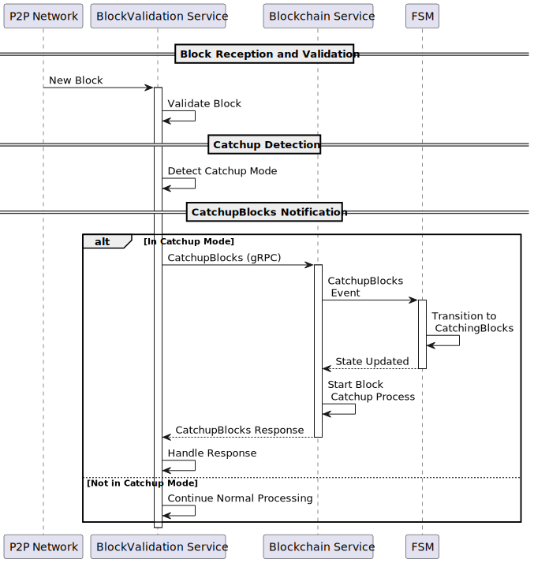

# 🗂️️ State Management in Teranode

Last Modified: 24-Octubre-2024

## Table of Contents
1. [Description](#1-description)

## 1. Introduction

A Finite State Machine is a model used in computer science that describes a system which can be in one of a finite number of states at any given time. The machine can transition between these predefined states based on inputs or conditions (an "event").

Finite State Machines:

- have a finite set of states.
- can only be in one state at a time.
- transition between states based on inputs or events.
- have a defined initial state.
- may have one or more final states.

## 2. State Machine in Teranode

The Teranode blockchain service uses a Finite State Machine (FSM) to manage the various states and transitions of the node. The FSM is responsible for controlling the node's behavior based on the current state and incoming events.

The FSM has the following **states**:

* **Stopped**
* **Running**
* **CatchingBlocks**
* **CatchingTxs**
* **Restoring**
* **LegacySyncing**
* **ResourceUnavailable** (defined but not used in the current implementation)

The FSM responds to the following **events**:

* **Run**
* **CatchupBlocks**
* **CatchupTxs**
* **Restore**
* **LegacySync**
* **Unavailable** (defined but not used in the current implementation)
* **Stop**

The diagram below represents the relationships between the states and events in the FSM (as defined in `services/blockchain/fsm.go`):

The FSM handles the following state **transitions**:

* **Run**: Transitions to _Running_ from _Stopped_, _Restoring_, _LegacySyncing_, _CatchingTxs_, or _CatchingBlocks_
* **LegacySync**: Transitions to _LegacySyncing_ _from_ Stopped
* **Restore**: Transitions to _Restoring_ from _Stopped_
* **CatchupBlocks**: Transitions to _CatchingBlocks_ from _Running_
* **CatchupTxs**: Transitions to _CatchingTxs_ from _Running_ or _CatchingBlocks_
* **Stop**: Transitions to _Stopped_ from _Running_, _CatchingTxs_, or _CatchingBlocks_

Teranode provides a visualizer tool to generate and visualize the state machine diagram. To run the visualizer, use the command `go run fsm_visualizer/main.go`. The generated `docs/state-machine.diagram.md` can be visualized using https://mermaid.live/.
fsm_visualizer main.go.

## 3. Functionality

### 3.1. State Machine Initialization

As part of its own initialization, the Blockchain service initializes the FSM in the **Stopped** state, before it transitions to a LegacySyncing, Restoring or Running state.

### 3.1. Accessing the State Machine over gRPC

The Blockchain service exposes the following gRPC methods to interact with the FSM:

* **GetFSMCurrentState** - Returns the current state of the FSM.
* **WaitForFSMtoTransitionToGivenState** - Waits for the FSM to transition to a specific state.
* **SendFSMEvent** - Sends an event to the FSM to trigger a state transition.

* **Run** - Transitions the FSM to the Running state (delegates on the SendFSMEvent method).
* **CatchUpBlocks** - Transitions the FSM to the CatchingBlocks state (delegates on the SendFSMEvent method).
* **CatchUpTransactions** - Transitions the FSM to the CatchingTxs state (delegates on the SendFSMEvent
* **Restore** - Transitions the FSM to the Restoring state (delegates on the SendFSMEvent method
* **LegacySync** - Transitions the FSM to the LegacySyncing state (delegates on the SendFSMEvent
* **Unavailable** - Transitions the FSM to the ResourceUnavailable state (delegates on the SendFSMEvent method

### 3.2. State Machine States

#### 3.2.1. FSM - Stopped State

The Blockchain service always starts in a `Stopped` state. The Stopped state is the initial state of the FSM and represents the node being offline or not actively participating in the network.

Upon node initialisation, all services will wait for the FSM to transition to the `Running` state (either directly or after going through a `Legacy Sync` or `Restore`) before starting their operations. As such, the node should see no activity until the FSM transitions to the Running state.

#### 3.2.3. FSM - Restoring State

When a node is starting up, and only if the `fsm_state_restore` setting is enabled, the blockchain will automatically transition into the `Restoring` state. The `Restoring` state represents the node awaiting a restoration process to be completed (such as a set of node initialization processes), before it can transition to a `Running` mode

While at the `Resstoring` state, all services will be idle and waiting on an Admin (manual) transition to the `Running` state.

Similarly to the Stopped status, all services will wait for the FSM to transition to the Running state before starting their operations.

#### 3.2.3. FSM - Legacy Syncing State

When a node is starting up, it may need to perform a legacy sync. This is a block download performed against legacy BSV nodes. `LegacySyncing` represents the state in which the node is syncing from legacy BSV nodes.

While in this state, the Block Assembler will not mine new blocks.

#### 3.2.4. FSM - Running State

The `Running` state represents the node actively participating in the network. In this state, the node is processing transactions, blocks, and other network activities.

If `fsm_state_restore` setting is enabled, and if the node was previously in the `Stopped` or `Restoring` state, all services will start their operations once the FSM transitions to the `Running` state.

If the node was previously in any other state, the Block Assembler would now start mining blocks. The Block Assembler will never mine blocks under any other node state.

#### 3.2.5. FSM - Catching Blocks State

The `CatchingBlocks` state represents the node catching up on blocks. This state is entered when the node is behind the network and needs to catch up on the latest blocks.

No mining takes place in BlockAssembler when the node is in the `CatchingBlocks` state.

#### 3.2.6. FSM - Catching Transactions State

The `CatchingTxs` state represents the node catching up on transactions. This state is entered when the node is behind the network and needs to catch up on the latest transactions.

No mining takes place in BlockAssembler in this state.
Likewise, the TX Validator component will stop validating transactions. The transactions will be queued up for processing once the FSM state reverts to anything other than `CatchingTxs`.

#### 3.2.7. FSM - Resource Unavailable State

The `ResourceUnavailable` state represents a situation where the node is unable to access the required resources to function properly, such as third party dependencies. This state is not currently used in the implementation.

### 3.3. State Machine Events

#### 3.3.1. FSM Event - Legacy Sync

The gRPC `LegacySync` method triggers the FSM to transition to the `LegacySyncing` state. This event is used to indicate that the node is syncing from legacy BSV nodes.

The P2P Legacy service triggers this event when the node is starting up and needs to perform a legacy sync.

#### 3.3.2. FSM Event - Restore

The gRPC `Restore` method triggers the FSM to transition to the `Restoring` state. This event is used to indicate that the node is awaiting a manual `Run` event before services can commence operations.

#### 3.3.3. FSM Event - Run

The gRPC `Run` method triggers the FSM to transition to the `Running` state. This event is used to indicate that the node is ready to start participating in the network and processing transactions and blocks.

#### 3.3.3. FSM Event - Catch up Blocks

The gRPC `CatchUpBlocks` method triggers the FSM to transition to the `CatchingBlocks` state. This event is used to indicate that the node is catching up on blocks and needs to process the latest blocks before resuming full operations.

#### 3.3.4. FSM Event - Catch up Transactions

The gRPC `CatchUpTransactions` method triggers the FSM to transition to the `CatchingTxs` state. This event is used to indicate that the node is catching up on transactions and needs to process the latest transactions before resuming full operations.

This method is intended to be manually triggered.

#### 3.3.5. FSM Event - Unavailable

The gRPC `Unavailable` method triggers the FSM to transition to the `ResourceUnavailable` state. This event is used to indicate that the node is unable to access the required resources to function properly.

This method is not currently used.

#### 3.3.6. FSM Event - Stop

The gRPC `Stop` method triggers the FSM to transition to the `Stopped` state. This event is used to stop the node from participating in the network and halt all operations.

This method is not currently used.

### 3.4. Waiting on State Machine Transitions

Through the Blockchain gRPC method `WaitForFSMtoTransitionToGivenState`, services can wait for the FSM to transition to a specific state before proceeding with their operations. This method is used by various services to ensure that the node is in the correct state before starting their activities.

The method blocks until the FSM transitions to the specified state or until a timeout occurs. This ensures that services are synchronized with the node's state changes and can respond accordingly.

This method is widely used by all Teranode services to await for the blockchain to signal a transition to the `Running` state, after which all services can resume normal operations.

Specifically, and subject to the `fsm_state_restore` setting being enabled, the following services wait for the FSM to transition to the `Running` state before starting their operations:

- Asset Server
- Block Assembly Service
- Block Persister
- Block Validation
- Coinbase
- Legacy P2P Gateway
- P2P
- Propagation
- Subtree Validation
- UTXO Persister
- Validator
