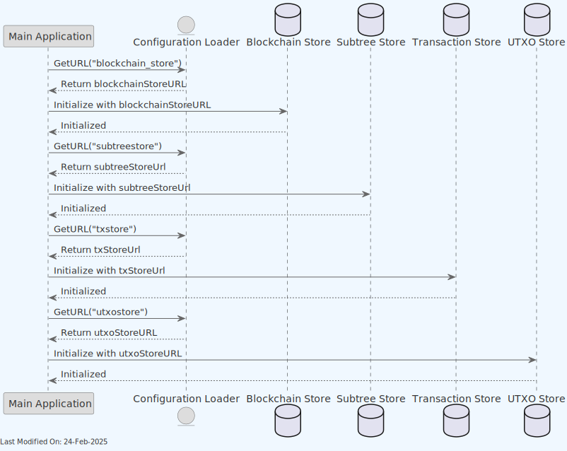
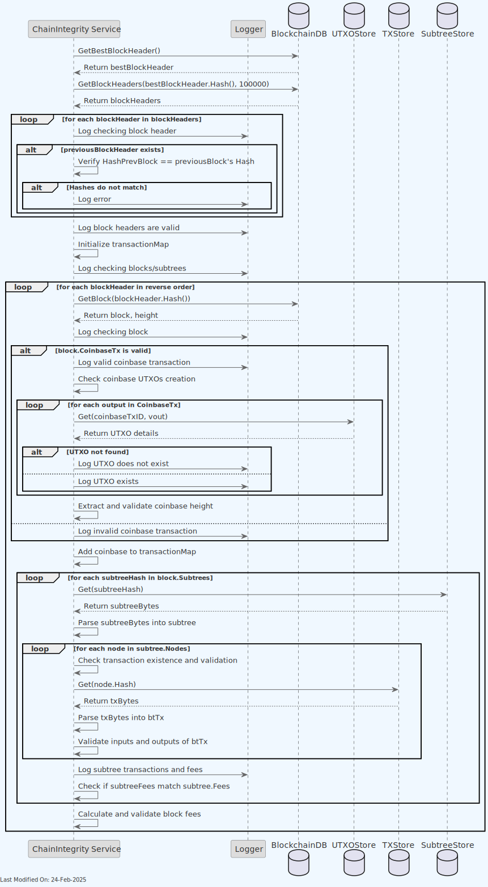

#  🔎 Chain Integrity

## Index

1. [Introduction](#1-introduction)
2. [Architecture](#2-architecture)
3. [Functionality](#3-functionality)
4. [Technology](#4-technology)
5. [How to run](#6-how-to-run)

## 1. Introduction

The `ChainIntegrity` utility is a tool designed to verify the integrity and consistency of the Teranode BSV blockchain within a node or across a network of nodes. It performs in-depth checks on block headers, transactions, UTXOs (Unspent Transaction Outputs), and various stores (like transaction metadata and blob storage) to ensure data integrity and adherence to blockchain rules.

The ChainIntegrity utility is particularly useful for validation of large performance test data (such as the one produced by the TX Blaster utility) and for ensuring that the blockchain data is correctly stored and processed.

**Primary Objective**: To validate the integrity of the blockchain data, including blocks, transactions, and UTXOs, against the node's storage and configuration.
**Key Operations**: Checks block header sequences, validates coinbase transactions, verifies transaction existence in stores, and ensures UTXOs are correctly stored and spent.

## 2. Architecture


The Chain Integrity utility connects to various data stores (blockchain, subtree, transaction, UTXO stores) to validate the integrity of the blockchain data.

## 3. Functionality

### 3.1. Chain Integrity Initialization and Configuration

The utility first action is to load configuration URLs for various data stores (blockchain, subtree, transaction, UTXO stores) and initialize them.




### 3.2. Chain Integrity Verification




- **Best Block Header and All Block Headers Retrieval**: Starts by fetching the best block header to identify the current chain tip and then retrieves all block headers up to a specified limit to analyze the blockchain's structure and integrity.

- **Block Header Validation**: Each block header is checked to ensure the chain's continuity; specifically, each block's previous hash is verified against the hash of its preceding block.

- **Coinbase Transaction and UTXO Validation**: For each block, the coinbase transaction is validated for its existence and correctness. It also checks if all coinbase UTXOs were created properly and exist within the UTXO store.

- **Subtree Analysis**: For blocks that organize transactions into subtrees (a structure for optimizing transaction verification and storage), each subtree is examined. Transactions within each subtree are validated for their existence in the transaction store and proper inclusion within the blockchain structure.

- **Transaction Map Building and Validation**: A map is constructed to track transactions' presence across blocks and subtrees, aiding in identifying missing or duplicate transactions.

- **Fee Calculation and Validation**: For each block, the total fees collected from transactions (excluding coinbase transaction fees) are calculated and validated against the block's expected value, considering the coinbase transaction and block subsidy.


## 4. Technology

Key Components and Libraries:

- **`github.com/bitcoin-sv/ubsv/*`**: Libraries and modules specific to the Bitcoin SV ecosystem, used for interacting with blockchain data and UTXO stores.
- **`github.com/libsv/go-bt/v2`**: A library for constructing, parsing, and manipulating Bitcoin transactions.
- **`github.com/libsv/go-bt/v2/chainhash`**: Provides utilities for hashing used within Bitcoin, enabling block and transaction hash computations.
- **`github.com/ordishs/gocore`**: A utility library providing core functionality, such as configuration management.
- **`github.com/prometheus/client_golang/prometheus`**: Used for monitoring and metrics collection, allowing `ChainIntegrity` to report on its operation metrics.


## 5. How to run

Please run it as follows:

```shell
# go to cmd/chainintegrity
cd cmd/chainintegrity

# run the integrity checker
go run .

# also possible to run in debug mode
go run . -debug=1
```
