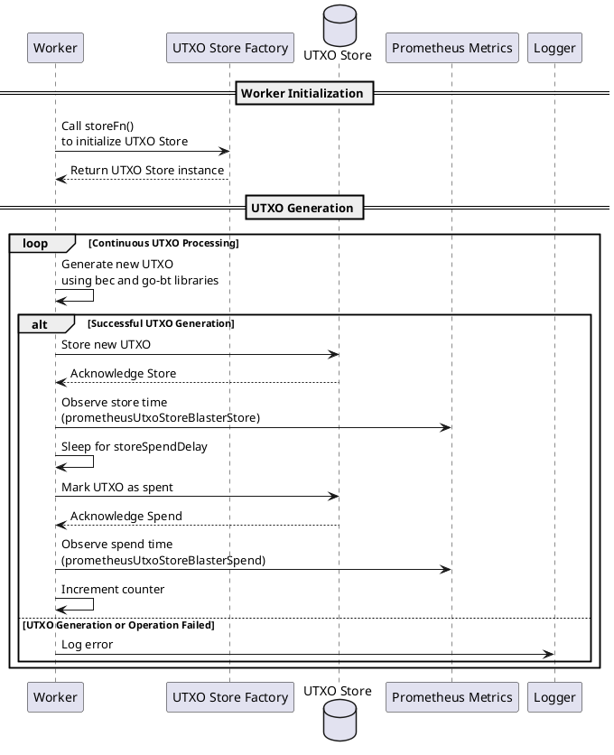

#  🔊 UTXO Blaster

## Index

1. [Introduction](#1-introduction)
2. [Architecture](#2-architecture)
3. [Functionality](#3-functionality)
- [3.1. UTXO Blaster Initialization and Configuration](#31-utxo-blaster-initialization-and-configuration)
- [3.2. Worker Operation](#32-worker-operation)
4. [Technology](#4-technology)
5. [Directory Structure and Main Files](#5-directory-structure-and-main-files)
6. [How to run](#6-how-to-run)

## 1. Introduction

The `UTXOBlaster` service is designed to simulate UTXO (Unspent Transaction Output) operations against various types of UTXO stores, such as in-memory, Aerospike, Redis, and others. It is a comprehensive tool for benchmarking and testing the performance and scalability of these UTXO stores under load. The service can save, and spend UTXOs, measuring the time taken for these operations and reporting metrics via Prometheus.


- **Key Features**:
    - Multiple store support (memory, Aerospike, Redis, etc.).
    - Concurrent worker-based architecture.
    - Metrics collection and exposure for monitoring.

## 2. Architecture


The service is designed to start multiple concurrent workers, each simulating UTXO operations against the selected store. Each worker is responsible for the continuous generation of UTXOs, simulating store and spend operations, and measures the time taken for each operation, contributing to the service's metrics.


## 3. Functionality

### 3.1. UTXO Blaster Initialization and Configuration


1. **Initialization**: The service starts by loading configuration values such as the profiler address and Prometheus endpoint. It initializes Prometheus metrics specific to UTXO store operations and sets up an HTTP server for serving the profiler and a basic health check endpoint.

2. **Start**: The service parses command-line flags to determine the number of worker routines to start, the type of UTXO store to use, and the delay between store and spend operations. It logs the selected configuration, initializes the UTXO store based on the chosen type (e.g., memory, Aerospike, Redis), and starts the specified number of worker routines.

3. **Worker Routines**: Each worker enters a continuous loop where it generates new UTXOs, stores them, optionally waits for a specified delay, and then spends them. The time taken for storing and spending UTXOs is recorded and reported via Prometheus metrics.

4. **HTTP Server**: Runs in parallel, serving profiler and health check endpoints for monitoring and diagnostics purposes.


### 3.2. Worker Operation


To illustrate the detailed workflow of a worker in the `UTXOBlaster` service using PlantUML, we'll focus on the sequence of operations each worker performs, including generating new UTXOs, storing them in the selected UTXO store, optionally delaying, and then marking them as spent. This sequence also captures error handling and metrics recording.




1. **Worker Initialization**: Each worker begins by initializing its UTXO store instance through a factory function (`storeFn()`), which abstracts the creation of specific UTXO store types like memory, Aerospike, or Redis.

2. **UTXO Generation**: In a continuous loop, the worker generates a new UTXO. This involves creating a new private key, generating a wallet address using Bitcoin SV libraries (`bec` for Bitcoin elliptic curve operations and `go-bt` for transaction construction), and constructing a new Bitcoin transaction that pays to the generated address.

3. **Storing UTXOs**: The new UTXO is stored in the UTXO store. The time taken to store the UTXO is measured and recorded using Prometheus metrics.

4. **Optional Delay**: The worker optionally sleeps for a specified delay (`storeSpendDelay`), simulating a realistic scenario where there's a gap between when a UTXO is stored and when it is spent.

5. **Spending UTXOs**: After the delay, the worker marks the UTXO as spent in the UTXO store. Similar to the store operation, the time taken to spend the UTXO is observed and recorded in Prometheus metrics.

6. **Error Handling**: If any step in the UTXO generation or operation process fails, the error is logged using the service's logging infrastructure.

7. **Counter Increment**: Upon successfully completing a store and spend cycle, the worker increments a counter to track the number of operations performed.


## 4. Technology

- **Go (Golang)**: The service is implemented in Go, known for its efficiency, ease of concurrency, and strong standard library, making it suitable for building high-performance and scalable applications.

- **Prometheus**: Used for monitoring and performance metrics, Prometheus allows `UTXOBlaster` to collect, store, and query operational metrics like store and spend times, enabling detailed performance analysis.

- **Bitcoin SV (BSV) Libraries**:
  - **`libsv/go-bt`**: A Go library for constructing, serializing, and deserializing Bitcoin transactions, crucial for the UTXO generation part of the service.
  - **`libsv/go-bk/bec`**: Provides implementations of Bitcoin's elliptic curve cryptographic functions, used for generating private keys and addresses.

- **HTTP Server and Profiling**:
  - **Built-in Go HTTP Server**: Serves Prometheus metrics and health check endpoints, and offers built-in Go profiler (`pprof`) support for runtime profiling.

- **Command-line Flags**: Allows dynamic configuration of the worker count, store type, and operational delay, offering flexibility to adjust the benchmarking setup according to specific needs.


`UTXOBlaster` supports multiple types of UTXO stores:

- **Memory Store (`memory`)**:
  - An in-memory store provided by the `memory` package, suitable for fast, transient storage without persistence. Ideal for development, testing, or benchmarking in controlled environments.

- **Aerospike Store (`aerospike`)**:
  - Utilizes the Aerospike NoSQL database, known for its high performance, scalability, and reliability in production environments. The `aerospike` package integrates `UTXOBlaster` with an Aerospike cluster for persistent UTXO storage.

- **Redis Store (`redis`)**:
  - Leverages the Redis in-memory data structure store, which can be used as a database, cache, and message broker. The `redis` package allows storing UTXOs in a Redis database, benefiting from its performance and simplicity.

- **Null Store (`null`)**:
  - A no-operation store implemented by the `nullstore` package, which simulates UTXO store operations without actually performing any storage. This can be useful for isolating the performance impact of other parts of the system.

- **Redis Cluster Store (`redis-cluster`)**:
  - A variation of the Redis store configured to work with Redis Cluster, providing automatic partitioning across multiple Redis nodes for increased capacity and throughput.

- **Redis Ring Store (`redis-ring`)**:
  - Another variation of the Redis store, this time using the Redis Ring setup to distribute data across multiple Redis instances, offering a balance between scalability and management complexity.


## 5. Directory Structure and Main Files

```
cmd/utxostore_blaster/
├── main.go               # Main entry point for the UTXOBlaster service; initializes and starts the HTTP server for metrics and profiling.
└── utxostore_blaster
    └── Start.go          # Contains the core logic for starting the UTXOBlaster service, including parsing command-line arguments, initializing the selected UTXO store, and launching worker routines.
```


## 6. How to run

To run the UTXO Blaster service locally, you can execute the following command:

```shell
cd cmd/utxostore_blaster
SETTINGS_CONTEXT=dev.[YOUR_USERNAME] go run -store=redis -workers=10 -storeSpendDelay=0s
```

where store is a value in:
* memory
* aerospike
* redis
* redis-cluster
* redis-ring
* null
