# How to Install Teranode with Kubernetes Helm

Last modified: 29-October-2025

## Index

- [Introduction](#introduction)
- [Prerequisites](#prerequisites)
- [Deployment with Minikube](#deployment-with-minikube)
    - [Start Minikube](#start-minikube)
    - [Deploy Dependencies](#deploy-dependencies)
    - [Create Persistent Volume Provider](#create-persistent-volume-provider)
    - [Load Teranode Images](#load-teranode-images)
    - [Deploy Teranode](#deploy-teranode)
- [Verifying the Deployment](#verifying-the-deployment)
- [Production Considerations](#production-considerations)
- [Other Resources](#other-resources)

## Introduction

This guide provides instructions for deploying Teranode in a Kubernetes environment. While this guide shows the steps to deploy on a single server cluster using Minikube, these configurations can be adapted for production use with appropriate modifications.



## Prerequisites

Before you begin, ensure you have the following tools installed and configured:

- [Docker](https://docs.docker.com/get-docker/)
- [Minikube](https://minikube.sigs.k8s.io/docs/start/)
- [kubectl](https://kubernetes.io/docs/tasks/tools/)
- [Helm](https://helm.sh/docs/intro/install/)

Additionally, ensure you have a storage provider capable of providing ReadWriteMany (RWX) storage. As an example, this guide includes setting up an NFS server via Docker for this purpose.



## Download the Teranode source code 

```bash
cd $YOUR_WORKING_DIR
git clone git@github.com:bsv-blockchain/teranode.git
cd teranode
```

## Deployment with Minikube

Minikube creates a local Kubernetes cluster on your machine. For running Teranode, we recommend the following process:


### Start Minikube

Start minikube with recommended resources and verify its status:

```bash
# Start minikube with recommended resources
minikube start --cpus=4 --memory=8192 --disk-size=20gb

# Verify minikube status
minikube status
```

### Deploy Dependencies

Teranode requires several backing services. While these services should be deployed separately in production, for local development we'll deploy them within the same cluster.

#### Create Namespace

Create a namespace for the deployment:

```bash
kubectl create namespace teranode-operator
```

#### Deploy Backing Services

Deploy all dependencies in the teranode namespace:

```bash
kubectl apply -f deploy/kubernetes/aerospike/ -n teranode-operator
kubectl apply -f deploy/kubernetes/postgres/ -n teranode-operator
kubectl apply -f deploy/kubernetes/kafka/ -n teranode-operator
```

To know more, please refer to the [Third Party Reference Documentation](../../../references/thirdPartySoftwareRequirements.md)

### Create Persistent Volume Provider

For this example, we will create a local folder and expose it to Minikube via a docker based NFS server.

#### Standard x86/x64 Systems

```bash
docker volume create nfs-volume

docker run -d \
    --name nfs-server \
    -e NFS_EXPORT_0='/minikube-storage *(rw,no_subtree_check,fsid=0,no_root_squash)' \
    -v nfs-volume:/minikube-storage \
    --cap-add SYS_ADMIN \
    -p 2049:2049 \
  erichough/nfs-server

# connect the nfs-server to the minikube network
docker network connect minikube nfs-server

# create the PersistentVolume
kubectl apply -f deploy/kubernetes/nfs/
```

#### ARM-based Systems

For arm based systems, you can use this variant:

```bash
docker volume create nfs-volume

docker run -d --name nfs-server --privileged \
    -v nfs-volume:/minikube-storage \
    alpine:latest \
    sh -c "apk add --no-cache nfs-utils && \
        mkdir -p /minikube-storage && \
        chmod 777 /minikube-storage && \
        echo '/minikube-storage *(rw,sync,no_subtree_check,no_root_squash,insecure,fsid=0)' > /etc/exports && \
        exportfs -r && \
        rpcbind && \
        rpc.statd && \
        rpc.nfsd 8 && \
        rpc.mountd && \
        tail -f /dev/null"

# connect the nfs-server to the minikube network
docker network connect minikube nfs-server

# create the PersistentVolume
kubectl apply -f deploy/kubernetes/nfs/
```

### Load Teranode Images

Pull and load the required Teranode images into Minikube:

#### Identify Available Versions

You can find the latest available version published on GitHub Container Registry:

- <https://github.com/bsv-blockchain/teranode/pkgs/container/teranode>
- <https://github.com/bsv-blockchain/teranode-operator/pkgs/container/teranode-operator>

#### Set Image Versions

```bash
# Set image versions (please derive the right TERANODE_VERSION from the results of the previous command)
export OPERATOR_VERSION=v0.1.2 # Or use 'latest'
export TERANODE_VERSION=v0.12.0 # Or use 'latest'
export GHCR_REGISTRY=ghcr.io/bsv-blockchain
```

#### Load Images into Minikube

```bash
# Load Teranode Operator
docker pull $GHCR_REGISTRY/teranode-operator:$OPERATOR_VERSION
minikube image load $GHCR_REGISTRY/teranode-operator:$OPERATOR_VERSION

# Load Teranode Public
docker pull $GHCR_REGISTRY/teranode:$TERANODE_VERSION
minikube image load $GHCR_REGISTRY/teranode:$TERANODE_VERSION
```

### Deploy Teranode

The Teranode Operator manages the lifecycle of Teranode instances:

#### Install Teranode Operator

```bash
# Install CRDs first
kubectl apply --server-side -f https://raw.githubusercontent.com/bsv-blockchain/teranode-operator/$OPERATOR_VERSION/deploy/crds.yaml
# Install operator
helm upgrade --install teranode-operator oci://ghcr.io/bsv-blockchain/helm/teranode-operator \
    -n teranode-operator \
    -f deploy/kubernetes/teranode/teranode-operator.yaml
```

#### Apply Teranode Configuration

Apply the Teranode configuration and custom resources:

```bash
kubectl apply -f deploy/kubernetes/teranode/teranode-configmap.yaml -n teranode-operator
kubectl apply -f deploy/kubernetes/teranode/teranode-cr.yaml -n teranode-operator
```

#### Start Syncing Process

A fresh Teranode starts up in IDLE state by default. To start syncing from the legacy network, you can run:

```bash
kubectl exec -it $(kubectl get pods -n teranode-operator -l app=blockchain -o jsonpath='{.items[0].metadata.name}') -n teranode-operator -- teranode-cli setfsmstate -fsmstate legacysyncing
```

To know more about the syncing process, please refer to the [Teranode Sync Guide](minersHowToSyncTheNode.md)

## Verifying the Deployment


To verify your deployment:

```bash
# Check all pods are running
kubectl get pods -n teranode-operator | grep -E 'aerospike|postgres|kafka|teranode-operator'

# Check Teranode services are ready
kubectl wait --for=condition=ready pod -l app=blockchain -n teranode-operator --timeout=300s

# View Teranode logs
kubectl logs -n teranode-operator -l app=blockchain -f
```

## Production Considerations

For production deployments, consider:

- Deploying dependencies (Aerospike, PostgreSQL, Kafka) in separate clusters or using managed services
- Implementing proper security measures (network policies, RBAC, etc.)
- Setting up monitoring and alerting
- Configuring appropriate resource requests and limits
- Setting up proper backup and disaster recovery procedures

An example CR for a mainnet deployment is available in [kubernetes/teranode/teranode-cr-mainnet.yaml](https://github.com/bsv-blockchain/teranode/blob/main/deploy/kubernetes/teranode/teranode-cr-mainnet.yaml).

## Resetting Teranode

If you need to reset your Teranode deployment, see the [How to Reset Teranode](minersHowToResetTeranode.md) guide for complete instructions on cleaning up Aerospike, PostgreSQL, and persistent volumes.

## Other Resources

- [Third Party Reference Documentation](../../../references/thirdPartySoftwareRequirements.md)
- [Teranode Sync Guide](minersHowToSyncTheNode.md)
- [How to Reset Teranode](minersHowToResetTeranode.md)
- [How-To Configure the Node](minersHowToConfigureTheNode.md)
