# How to Update Teranode with Kubernetes Helm

Last modified: 6-March-2025

## Introduction

This guide provides instructions for updating Teranode in a Kubernetes environment using Helm.

## Prerequisites

Ensure you have:

- Access to the ECR registry
- AWS CLI configured
- Helm installed
- Existing Teranode deployment

## Update Process



### 1. Set Version Variables

```bash
# Set new versions
export OPERATOR_VERSION=<new-version>
export TERANODE_VERSION=<new-version>
export ECR_REGISTRY=ghcr.io/bsv-blockchain/teranode
```

### 2. Update Images

```bash
# Pull new images
docker pull $ECR_REGISTRY/teranode-operator:$OPERATOR_VERSION
docker pull $ECR_REGISTRY/teranode-public:$TERANODE_VERSION

# Load into Minikube
minikube image load $ECR_REGISTRY/teranode-operator:$OPERATOR_VERSION
minikube image load $ECR_REGISTRY/teranode-public:$TERANODE_VERSION
```

### 3. Update Operator

```bash
# Update operator
helm upgrade teranode-operator oci://ghcr.io/bsv-blockchain/teranode-operator \
    -n teranode-operator \
    -f kubernetes/teranode/teranode-operator.yaml
```

### 4. Verify Update

```bash
# Check all pods are running
kubectl get pods -n teranode-operator | grep -E 'aerospike|postgres|kafka|teranode-operator'

# Check Teranode services are ready
kubectl wait --for=condition=ready pod -l app=blockchain -n teranode-operator --timeout=300s

# View Teranode logs
kubectl logs -n teranode-operator -l app=blockchain -f
```

## Production Considerations

For production deployments:

- Create backups before updating
- Review release notes for breaking changes
- Test updates in a staging environment first
- Monitor system during and after update
- Have a rollback plan prepared

## Other Resources

- [How to Install Teranode](minersHowToInstallation.md)
- [Third Party Reference Documentation](../../../references/thirdPartySoftwareRequirements.md)
- [Teranode Sync Guide](../../../howto/miners/minersHowToSyncTheNode.md)
