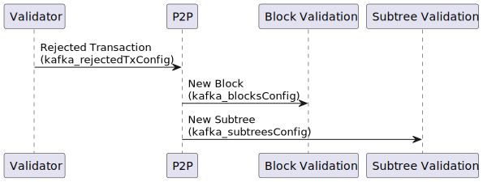

# 🐘️ Kafka in Teranode

## Table of Contents

1. [Description](#1-description)
2. [Use Cases](#2-use-cases)
- [Propagation Service](#propagation-service)
- [Validator Component](#validator-component)
- [P2P Service](#p2p-service)
- [Blockchain](#blockchain)
3. [Reliability and Recoverability](#3-reliability-and-recoverability)
4. [Settings](#4-settings)
- [General Kafka Settings](#general-kafka-settings)
- [Service-Specific Settings](#service-specific-settings)
   - [Block Assembly](#block-assembly)
   - [Block Validation](#block-validation)
   - [Subtree Validation](#subtree-validation)
   - [Validator](#validator)
5. [Other Resources](#5-other-resources)

## 1. Description

Kafka is a high-throughput, distributed messaging system designed to store and process large volumes of data. Its key features include scalability, fault-tolerance, and high availability, making it an ideal choice for real-time data processing and analytics in complex systems like Teranode.

In the Teranode ecosystem, Kafka plays a crucial role in facilitating communication between various components, such as the Validator, BlockValidation, and Blockchain. It enables these components to exchange messages, notifications, and data reliably and efficiently, ensuring smooth operation of the entire system.

It's important to note that Kafka is a third-party dependency in Teranode. As such, there is no specific installation or configuration process provided within the Teranode framework. Users are expected to have a properly configured Kafka setup running before initiating the Teranode services. This approach allows for flexibility in Kafka configuration based on specific deployment needs and existing infrastructure.

## 2. Use Cases

### Propagation Service

After initial sanity check tests, the propagation service endorses transactions to the validator. This is done by sending transaction notifications to the validator via the `kafka_validatortxsConfig` topic.

- **kafka_validatortxsConfig**: This Kafka topic is used to transmit new transaction notifications from the Propagation component to the Validator.

### Validator Component

This diagram illustrates the central role of the Validator in processing new transactions, and how it uses Kafka:

1. The Validator receives new transactions from the Propagation component via the `kafka_validatortxsConfig` topic.

2. Valid transactions are forwarded to the Block Assembly component using the `kafka_txsConfig` topic for inclusion in new blocks.

3. The Validator sends new UTXO (Unspent Transaction Output) metadata to the Subtree Validation component through the `kafka_txmetaConfig` topic for inclusion in new subtrees.

4. If a transaction is rejected, the Validator notifies the P2P component via the `kafka_rejectedTxConfig` topic, allowing the network (other peers) to be informed about invalid transactions.

### P2P Service

The P2P (Peer-to-Peer) service is responsible from peer-to-peer communication, receiving and sending data to other nodes in the network. Here's how it interacts with other components using Kafka:

1. It receives notifications about rejected transactions from the Validator through the `kafka_rejectedTxConfig` topic, allowing it to inform other nodes in the network.

2. The P2P component propagates new blocks (as received from other peers in the network) to the Block Validation component via the `kafka_blocksConfig` topic, initiating the block validation process.

3. New subtrees (as received from other peers in the network) are sent from the P2P component to the Subtree Validation component using the `kafka_subtreesConfig` topic, enabling efficient validation of large transaction sets.

### Blockchain

This diagram shows the final stage of block processing:

- The Blockchain component sends newly finalized blocks to the Blockpersister component using the `kafka_blocksFinalConfig` topic. This ensures that validated and accepted blocks are permanently stored in the blockchain.

## 3. Reliability and Recoverability

Kafka's role as a critical component in the Teranode system cannot be overstated. Its central position in facilitating the communication of new transactions, remote subtrees, and blocks makes it indispensable for the node's operation.

To maintain system integrity, Teranode is designed to pause operations when Kafka is in an unreliable state. This means:

1. The system will not process new transactions, blocks, or subtrees until Kafka is available and functioning correctly.
2. During Kafka downtime or unreliability, the node enters a safe state, preventing potential data inconsistencies or processing errors.
3. Once Kafka is reported as healthy again, the node automatically resumes normal operation without manual intervention.

## 4. Settings

# Kafka Configuration Summary

## General Kafka Settings
- `kafka_txsConfig`: Kafka URL - Used in Block Assembly and Validator services
- `kafka_validatortxsConfig`: Kafka URL - Used in Propagation and Validator services
- `kafka_txmetaConfig`: Kafka URL - Used in Subtree Validation and Validator services
- `kafka_rejectedTxConfig`: Kafka URL - Used in P2P and Validator services
- `kafka_blocksConfig`: Kafka URL - Used in Block Validation and P2P services
- `kafka_subtreesConfig`: Kafka URL - Used in Subtree Validation and P2P services
- `kafka_blocksFinalConfig`: Kafka URL - Used in Blockchain and Blockpersister services

## Service-Specific Settings

### Block Assembly
- `blockassembly_kafkaWorkers`: Number of Kafka workers (default: 100)

### Block Validation
- `blockvalidation_kafkaBlockConcurrency`: Concurrency for block validation (default: max(4, runtime.NumCPU()-16))

### Subtree Validation
- `subtreevalidation_kafkaSubtreeConcurrency`: Concurrency for subtree validation (default: max(4, runtime.NumCPU()-16))

### Validator
- `validator_kafkaWorkers`: Number of Kafka workers for validator (default: 100)
- `validator_kafkaPartitions`: Number of Kafka partitions (mentioned in a comment)

## 5. Other Resources

- [Block Data Model](../topics/datamodel/block_data_model.md): Contain lists of subtree identifiers.
- [Subtree Data Model](../topics/datamodel/subtree_data_model.md): Contain lists of transaction IDs and their Merkle root.
- [Extended Transaction Data Model](../topics/datamodel/transaction_data_model.md): Includes additional metadata to facilitate processing.
