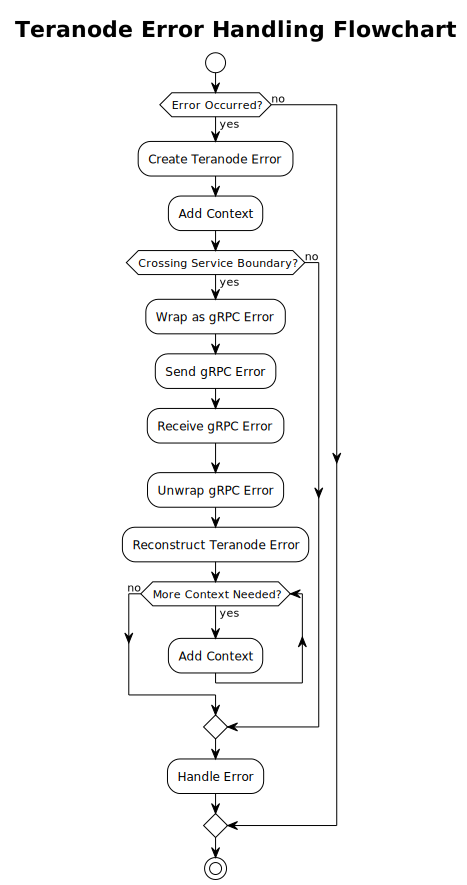

# Error Handling

## Index

1. [Introduction](#1-introduction)
    - [1.1. Go Errors](#11-go-errors)
    - [1.2. Go Errors: Best Practices](#12-go-errors-best-practices)
    - [1.3. Sentinel Errors](#13-sentinel-errors)
    - [1.4 Wrapping Errors](#14-wrapping-errors)
2. [Error Handling in Teranode](#2-error-handling-in-teranode)
    - [2.1. Error Handling Strategy](#21-error-handling-strategy)
    - [2.2. Sentinel Errors in Teranode](#22-sentinel-errors-in-teranode)
    - [2.3. Error Wrapping in Teranode](#23-error-wrapping-in-teranode)
        - [Error Creation and Wrapping](#error-creation-and-wrapping)
        - [Unwrapping Errors](#unwrapping-errors)
        - [Best Practices for Error Wrapping](#best-practices-for-error-wrapping)
    - [2.4. gRPC Error Wrapping in Teranode](#24-grpc-error-wrapping-in-teranode)
        - [Converting Teranode Errors to gRPC Errors](#converting-teranode-errors-to-grpc-errors)
        - [Converting gRPC Errors back to Teranode Errors](#converting-grpc-errors-back-to-teranode-errors)
        - [Practical Example](#practical-example)
        - [gRPC Error Wrapping Best Practices](#grpc-error-wrapping-best-practices)
    - [2.5. Extra Data in Error Handling](#25-extra-data-in-error-handling)
        - [Error Structure](#error-structure)
        - [Purpose and Usage](#purpose-and-usage)
        - [Example Implementation](#example-implementation)
        - [Type Assertions with Extra Data](#type-assertions-with-extra-data)
        - [Usage Example](#usage-example)
        - [Extra Data Best Practices](#extra-data-best-practices)
    - [2.6. Error Protobuf](#26-error-protobuf)
        - [Error Protocol Definition](#error-protocol-definition)
        - [Key Components](#key-components)
        - [Purpose and Benefits](#purpose-and-benefits)
        - [Integration with Teranode's Error Handling](#integration-with-teranodes-error-handling)
        - [Error Protobuf Best Practices](#error-protobuf-best-practices)
    - [2.7. Error Utility Functions](#27-error-utility-functions)
    - [2.8. Stack Traces and Formatting](#28-stack-traces-and-formatting)
    - [2.9. Unit Tests](#29-unit-tests)

## 1. Introduction

### 1.1. Go Errors

In Go (Golang), error handling is managed through an interface called `error`. This interface is defined in the built-in `errors` package.

The `error` interface in Go is defined as follows:

```go
type error interface {
    Error() string
}
```

Any type that implements this `Error() string` method satisfies the `error` interface. This "convention over configuration" approach encourages Go programs to handle errors explicitly by checking whether an error is nil before proceeding with normal operations.

Custom error types can be created by defining types that implement the `error` interface. This is useful for conveying error context or state beyond just a text message. Here’s a simple example:

```go
type MyError struct {
    Msg string
    File string
    Line int
}

func (e *MyError) Error() string {
    return fmt.Sprintf("%s:%d: %s", e.File, e.Line, e.Msg)
}
```

Functions that can result in an error typically return an error object as their last return value. The calling function should always check this error before proceeding.

```go
result, err := someFunction()
if err != nil {
    // handle error
    log.Fatal(err)
}
// proceed with using result
```

This pattern encourages handling errors at the place they occur, rather than propagating them up the stack implicitly via exceptions.

### 1.2. Go Errors: Best Practices

- Always check for errors where they might occur. Do not ignore returned error values or propagate them up.
- Consider defining your custom error types for complex systems, which can add clarity and control in error handling.
- Use standard `errors.Is` (to check for a specific errors) and `errors.As` (to check for type compatibility and type assertion).
- Parsing the text of an error message to determine the type or cause of an error is considered an anti-pattern. Instead, use custom error types or error wrapping to provide context.

### 1.3. Sentinel Errors

Sentinel errors in Go are predefined error variables that represent specific error conditions. These are declared at the package level and used consistently throughout the code to signify particular states or outcomes. This pattern is useful for comparing returned errors to known values, providing a consistent method for error checking.

Since sentinel errors are variables, they can easily be compared using `errors.Is()` to check if a particular error has occurred.
Using sentinel errors keeps error handling simple and explicit, requiring only basic checks against predefined values.

Here's a basic example of defining and using sentinel errors in a Go program:

```go
package main

import (
    "errors"
    "fmt"
)

// Define sentinel errors
var (
    ErrNotFound = errors.New("not found")
    ErrPermissionDenied = errors.New("permission denied")
)

func findItem(id string) error {
    // Simulated condition: item not found
    if id != "expected_id" {
        return ErrNotFound
    }
    return nil
}

func main() {
    err := findItem("unknown_id")
    if errors.Is(err, ErrNotFound) {
        fmt.Println("Item not found!")
    } else if errors.Is(err, ErrPermissionDenied) {
        fmt.Println("Access denied.")
    } else if err != nil {
        fmt.Println("An unexpected error occurred:", err)
    } else {
        fmt.Println("Item found.")
    }
}
```

While useful, sentinel errors have limitations, especially as applications scale. Code that uses sentinel errors is tightly coupled to these errors, making changes to error definitions potentially disruptive.

### 1.4 Wrapping Errors

In Go, error wrapping is a technique used to add additional context to an error while preserving the original error itself. This approach helps maintain a "chain" of errors, which can be useful for debugging and error handling in complex microservices.

Example of wrapping an error:

```go
package main

import (
    "errors"
    "fmt"
)

func operation1() error {
    return errors.New("base error")
}

func operation2() error {
    err := operation1()
    if err != nil {
        // Wrap the error with additional context
        return fmt.Errorf("operation2 failed: %w", err)
    }
    return nil
}

func main() {
    err := operation2()
    if err != nil {
        fmt.Println("An error occurred:", err)
    }
}
```

On the other hand, unwrapping is the process of retrieving the original error from a wrapped error. You can unwrap errors manually using the `Unwrap` method provided by the `errors` package, or you can use higher-level utilities like `errors.Is` and `errors.As` to check for specific errors or extract errors of specific types.

In this context, `errors.Is` and `errors.As` are used to check errors in an error chain without needing to manually call `Unwrap` repeatedly

- `errors.Is`: checks whether any error in the chain matches a specific error.
- `errors.As`: finds the first error in the chain that matches a specific type and provides access to it.

Benefits of Wrapping Errors:

1. Wrapping errors helps in preserving the context where an error occurred, without losing information about the original error.
2. Maintaining an error chain aids in diagnosing issues by providing a traceable path of what went wrong and where.
3. Allows developers to decide how much error information to expose to different parts of the application or to the end user, enhancing security and usability.

## 2. Error Handling in Teranode

### 2.1. Error Handling Strategy

Teranode follows a structured error handling strategy that combines the use of predefined error types, error wrapping, and consistent error creation patterns. This approach ensures clear, consistent, and traceable error handling throughout the application.



The `errors/errors.go` file contains the core error type definition and functions for creating, wrapping, and unwrapping errors. The `errors/Error_types.go` file defines specific error types and provides functions for creating these errors. Additional functionality is provided in `errors/error_utils.go` and `errors/Error_data.go`.

An error in Teranode is defined as a struct with unexported fields to encapsulate error details, including stack trace information:

```go
type Error struct {
    code       ERR       // Error code from the ERR enum
    message    string    // Human-readable error message
    file       string    // Source file where error was created
    line       int       // Line number where error was created
    function   string    // Function name where error was created
    wrappedErr error     // Optional wrapped error for error chains
    data       ErrDataI  // Optional structured error data
}
```

The `ERR` type is an enum defined in the `error.proto` file, providing a standardized set of error codes across the system. The unexported fields ensure that errors are created through the provided constructor functions, and the file/line/function fields enable detailed stack trace information for debugging.

Teranode emphasizes the use of specific error creation functions for different error types. These functions are defined in `Error_types.go` and follow a naming convention of `New<ErrorType>Error`. For example:

```go
func NewStorageError(message string, params ...interface{}) error {
    return New(ERR_STORAGE_ERROR, message, params...)
}
```

These functions automatically handle error wrapping when an existing error is passed as the last parameter. They also support sprintf-style formatting for the error message. For instance:

```go
err := errors.NewStorageError("failed to store block: %s", blockHash, existingErr)
```

This approach allows for consistent error creation, automatic error wrapping, and formatted error messages, enhancing the overall error handling strategy in Teranode.

### 2.2. Sentinel Errors in Teranode

Sentinel errors are predefined errors that serve as fixed references for common error conditions. They provide a standard and efficient way to recognize and manage common specific error scenarios.

**Code Example:**

The sentinel errors are defined in the `errors/Error_types.go` file, along with corresponding functions to create these errors:

```go
package errors

var (
    ErrUnknown             = New(ERR_UNKNOWN, "unknown error")
    ErrInvalidArgument     = New(ERR_INVALID_ARGUMENT, "invalid argument")
    ErrThresholdExceeded   = New(ERR_THRESHOLD_EXCEEDED, "threshold exceeded")
    ErrNotFound            = New(ERR_NOT_FOUND, "not found")
    // Other sentinel errors follow...
)

func NewUnknownError(message string, params ...interface{}) error {
    return New(ERR_UNKNOWN, message, params...)
}

func NewInvalidArgumentError(message string, params ...interface{}) error {
    return New(ERR_INVALID_ARGUMENT, message, params...)
}

func NewThresholdExceededError(message string, params ...interface{}) error {
    return New(ERR_THRESHOLD_EXCEEDED, message, params...)
}

func NewNotFoundError(message string, params ...interface{}) error {
    return New(ERR_NOT_FOUND, message, params...)
}

// Other error creation functions follow...
```

Each sentinel error is created using the `New` function, ensuring that each error has a unique code and a succinct message. The new error creation functions allow for more flexible error creation with custom messages and automatic error wrapping.

The sentinel errors are useful for error comparisons and decision-making in the Teranode business logic. By comparing returned errors to these predefined values, functions can determine the next steps without ambiguity.

**How to Use Example:**

When a function encounters an error, it can use the new error creation functions. Here's an example of how a function might use these errors:

```go
package main

import (
    "fmt"

    "github.com/bsv-blockchain/teranode/errors" // Import Teranode's custom errors package
)

// Data represents a simple data structure
type Data struct {
    ID string
}

// fetchData simulates fetching data and returning different types of errors
func fetchData(id string) (*Data, error) {
    if id == "" {
        return nil, errors.NewInvalidArgumentError("empty ID provided")
    }
    if id == "notfound" {
        return nil, errors.NewNotFoundError("data not found for ID: %s", id)
    }
    // Simulate a wrapped error
    if id == "dberror" {
        dbErr := fmt.Errorf("database connection failed")
        return nil, errors.NewStorageError("failed to fetch data", dbErr)
    }
    return &Data{ID: id}, nil
}

func main() {
    // Example usage
    ids := []string{"", "notfound", "dberror", "validid"}

    for _, id := range ids {
        data, err := fetchData(id)
        if err != nil {
            // Use errors.Is to check for specific error types
            if errors.Is(err, errors.ErrInvalidArgument) {
                fmt.Printf("Invalid argument error: %v\n", err)
            } else if errors.Is(err, errors.ErrNotFound) {
                fmt.Printf("Not found error: %v\n", err)
            } else if errors.Is(err, errors.ErrStorageError) {
                fmt.Printf("Storage error: %v\n", err)

                // Use errors.As to get more details about the error
                var storageErr *errors.Error
                if errors.As(err, &storageErr) {
                    fmt.Printf("Storage error details - Code: %v, Message: %s\n",
                        storageErr.Code, storageErr.Message)
                    if storageErr.WrappedErr != nil {
                        fmt.Printf("Wrapped error: %v\n", storageErr.WrappedErr)
                    }
                }
            } else {
                fmt.Printf("Unknown error: %v\n", err)
            }
        } else {
            fmt.Printf("Data fetched successfully: %v\n", data)
        }
        fmt.Println()
    }
}
```

### 2.3. Error Wrapping in Teranode

Error wrapping in Teranode enables the creation of nested errors and their propagation through different layers of the application. This mechanism allows an error to carry its history along with new context, effectively creating a chain of errors that leads back to the original issue.

By maintaining a trail of errors, developers can trace back through the execution flow to understand what led to the error. Additionally, different layers of the application can decide how to handle errors based on their type and origin.

#### Error Creation and Wrapping

The `New` function in Teranode's error package creates and returns a pointer to an `Error` struct, which includes fields for the error code, a message, file/line/function information, and an optional wrapped error.

```go
func New(code ERR, message string, params ...interface{}) *Error {
    var wErr *Error

    // Extract the wrapped error, if present
    if len(params) > 0 {
        lastParam := params[len(params)-1]

        switch err := lastParam.(type) {
        case *Error:
            // Wrap Teranode error directly
            wErr = err
            params = params[:len(params)-1]
        case error:
            // Convert any error to Teranode error
            wErr = &Error{message: err.Error()}
            params = params[:len(params)-1]
        }
    }

    // Format the message with the remaining parameters
    if len(params) > 0 {
        err := fmt.Errorf(message, params...)
        message = err.Error()
    }

    // Capture stack trace information
    pc, file, line, _ := runtime.Caller(2)
    fn := runtime.FuncForPC(pc)
    parts := strings.Split(fn.Name(), "/")

    // Check if the code exists in the ERR enum
    if _, ok := ERR_name[int32(code)]; !ok {
        returnErr := &Error{
            code:     code,
            message:  "invalid error code",
            file:     file,
            line:     line,
            function: parts[len(parts)-1],
        }
        if wErr != nil && wErr != returnErr && !wErr.contains(returnErr) {
            returnErr.wrappedErr = wErr
        }
        return returnErr
    }

    returnErr := &Error{
        code:     code,
        message:  message,
        file:     file,
        line:     line,
        function: parts[len(parts)-1],
    }

    // Only wrap if wErr exists and won't create a cycle
    if wErr != nil && wErr != returnErr && !wErr.contains(returnErr) {
        returnErr.wrappedErr = wErr
    }

    return returnErr
}
```

The `New` function operates as follows:

1. It takes an error code, a message, and a variadic `params` slice which may include formatting parameters and optionally one error to be wrapped.
2. If the last parameter in `params` is an error of ANY type, it's treated as the error to be wrapped:

    - If it's a `*Error` (Teranode error), it's wrapped directly
    - If it's any other `error` type, it's converted to a Teranode error first
3. Any additional parameters are used to format the message string using `fmt.Errorf`, allowing for dynamic message content based on runtime values.
4. Stack trace information (file, line, function) is automatically captured using `runtime.Caller`.
5. The function includes circular reference prevention using the `contains()` method to avoid infinite error chains.

Here's a practical example of using the `New` function to create and wrap errors:

```go
func someOperation() error {
    err := doSomethingThatMightFail()
    if err != nil {
        // Wrap the error with additional context
        // Note: Use the error CODE (ERR_INVALID_ARGUMENT), not the sentinel error
        return New(ERR_INVALID_ARGUMENT, "operation failed: %s", err.Error(), err)
    }
    return nil
}

func anotherOperation() error {
    // You can also use the type-specific constructor functions
    dbErr := someDatabase Query()
    if dbErr != nil {
        // This automatically handles error wrapping
        return NewStorageError("failed to query database", dbErr)
    }
    return nil
}
```

In these scenarios, the functions wrap errors returned by other functions with additional context. The `New` function can wrap both Teranode errors and standard Go errors, automatically converting standard errors to Teranode's error type.

#### Unwrapping Errors

The `Unwrap` method in the `Error` structure returns the error that was wrapped within the current error, if any:

```go
func (e *Error) Unwrap() error {
    return e.WrappedErr
}
```

This method allows the use of Go's built-in `errors.Unwrap` function to continue unwrapping through multiple layers of nested wrapped errors.

To effectively utilize the unwrapping functionality, developers can use a loop or a conditional check to explore the chain of errors. Here's an example that demonstrates how to use the `Unwrap` method to trace back through wrapped errors:

```go
// Assuming `someOperation` returns an error that may be wrapped multiple times
err := someOperation()
for err != nil {
    fmt.Printf("Error encountered: %v\n", err)
    // Attempt to unwrap the error
    if unwrappedErr := errors.Unwrap(err); unwrappedErr != nil {
        err = unwrappedErr
    } else {
        break
    }
}
```

In this example, `errors.Unwrap` is used in a loop to keep unwrapping the error until no more wrapped errors are found, effectively reaching the original error. This approach is particularly useful when diagnosing an issue and understanding the sequence of errors that led to the final state.

#### Circular Error Prevention

Teranode's error system includes automatic circular reference detection to prevent infinite error chains. The `contains()` method checks if adding an error would create a cycle before wrapping:

```go
func (e *Error) contains(target *Error) bool {
    // Builds a set of all errors in e's chain
    // Checks if any error in target's chain exists in e's chain
    // Returns true if a cycle would be created
}
```

This is automatically invoked by:

- `New()` when wrapping errors during error creation
- `SetWrappedErr()` when manually setting wrapped errors
- `Join()` when combining multiple errors

**What this prevents**:

```go
err1 := NewError("error 1")
err2 := NewStorageError("error 2", err1)
err3 := NewNetworkError("error 3", err2)

// This would create a cycle if not prevented:
err1.SetWrappedErr(err3)  // Silently ignored - cycle detected
```

The circular detection traverses both error chains and prevents wrapping if:

1. The error would wrap itself
2. The wrapped error already contains the current error
3. Adding the error would create any cycle in the chain

This ensures error chains remain acyclic and can be safely traversed without infinite loops.

#### Best Practices for Error Wrapping

1. Unwrap errors only when necessary. For example, when handling specific error types differently, unwrap errors until finding the type you're looking for.
2. Always log or monitor the full error chain before unwrapping in production environments to preserve the context and details of what went wrong.
3. Use error wrapping to add context at each layer of the application, making it easier to trace the flow of execution that led to an error.
4. When wrapping errors, include relevant information that might help in debugging, but be cautious not to include sensitive data.
5. Let the automatic circular reference detection handle cycle prevention - don't try to manually check for cycles.
6. Prefer wrapping errors at layer boundaries (e.g., when transitioning from storage to service layer) rather than wrapping at every function call.

### 2.4. gRPC Error Wrapping in Teranode

As a distributed system utilizing gRPC, Teranode implements a robust mechanism for wrapping and unwrapping errors to ensure consistent error handling practices when errors cross service boundaries.

#### Converting Teranode Errors to gRPC Errors

The `WrapGRPC` function in `errors.go` is responsible for converting Teranode's custom error types into gRPC-compatible errors. This function serializes the **entire error chain** with all wrapped errors, data, and stack trace information.

**Key Implementation Details**:

```go
func WrapGRPC(err error) error {
    if err == nil {
        return nil
    }

    var castedErr *Error
    if errors.As(err, &castedErr) {
        // Check if already wrapped - avoid double wrapping
        if castedErr.wrappedErr != nil {
            if _, ok := status.FromError(castedErr.wrappedErr); ok {
                return err // Already wrapped, skip further wrapping
            }
        }

        var wrappedErrDetails []protoadapt.MessageV1

        // Serialize the main error with data and stack trace
        var details protoadapt.MessageV1
        if castedErr.data != nil {
            details, _ = anypb.New(&TError{
                Code:     castedErr.code,
                Message:  castedErr.message,
                Data:     castedErr.data.EncodeErrorData(),  // Include error data
                File:     castedErr.file,     // Stack trace info
                Line:     int32(castedErr.line),
                Function: castedErr.function,
            })
        } else {
            details, _ = anypb.New(&TError{
                Code:     castedErr.code,
                Message:  castedErr.message,
                File:     castedErr.file,
                Line:     int32(castedErr.line),
                Function: castedErr.function,
            })
        }
        wrappedErrDetails = append(wrappedErrDetails, details)

        // Iterate through ALL wrapped errors in the chain
        if castedErr.wrappedErr != nil {
            currWrappedErr := castedErr.wrappedErr
            for currWrappedErr != nil {
                var err *Error
                if errors.As(currWrappedErr, &err) {
                    // Serialize each wrapped error with its data and stack trace
                    details, _ := anypb.New(&TError{
                        Code:     err.code,
                        Message:  err.message,
                        Data:     err.data.EncodeErrorData(), // if data exists
                        File:     err.file,
                        Line:     int32(err.line),
                        Function: err.function,
                    })
                    wrappedErrDetails = append(wrappedErrDetails, details)
                    currWrappedErr = err.wrappedErr
                }
            }
        }

        // Create gRPC status with ALL details
        st := status.New(ErrorCodeToGRPCCode(castedErr.code), castedErr.message)
        st, _ = st.WithDetails(wrappedErrDetails...)
        return st.Err()
    }

    // For non-Teranode errors, wrap as unknown
    return status.New(codes.Internal, err.Error()).Err()
}
```

**The `WrapGRPC` function**:

1. **Checks for nil** and returns early if no error
2. **Prevents double-wrapping** by checking if the wrapped error is already a gRPC status
3. **Serializes the main error** including code, message, data (if present), and stack trace info (file/line/function)
4. **Iterates through the entire wrapped error chain**, serializing each error with its full context
5. **Attaches all error details** to a single gRPC status message
6. **Maps error codes** using `ErrorCodeToGRPCCode()` for the top-level gRPC status code
7. **Handles non-Teranode errors** by wrapping them with `codes.Internal`

This comprehensive serialization ensures that when an error crosses a gRPC boundary, all contextual information—including the complete error chain, typed error data, and stack traces—is preserved and transmitted to the receiving service.

#### Converting gRPC Errors back to Teranode Errors

When a Teranode service receives a gRPC error, it needs to convert it back into an internal error format. The `UnwrapGRPC` function in `errors.go` reconstructs the **complete error chain** including all wrapped errors, data, and stack trace information.

**Key Implementation Details**:

```go
func UnwrapGRPC(err error) *Error {
    if err == nil {
        return nil
    }

    // Check if it's a gRPC status error
    st, ok := status.FromError(err)
    if !ok {
        return &Error{
            code:    ERR_ERROR,
            message: "error unwrapping gRPC details",
            wrappedErr: err,
        }
    }

    if len(st.Details()) == 0 {
        return &Error{
            code:    ERR_ERROR,
            message: err.Error(),
        }
    }

    var prevErr, currErr *Error

    // Iterate through details in REVERSE order to reconstruct chain
    for i := len(st.Details()) - 1; i >= 0; i-- {
        detail := st.Details()[i]
        detailAny, ok := detail.(*anypb.Any)
        if !ok {
            continue // Skip if not the expected type
        }

        var customDetails TError
        if err = anypb.UnmarshalTo(detailAny, &customDetails, proto.UnmarshalOptions{}); err == nil {
            // Create error with code and message
            currErr = New(customDetails.Code, customDetails.Message)

            // Restore error data if present
            if customDetails.Data != nil {
                data, errorGettingData := GetErrorData(customDetails.Code, customDetails.Data)
                if errorGettingData != nil {
                    currErr.data = nil  // Could not deserialize data
                } else {
                    currErr.data = data
                }
            }

            // Restore stack trace information
            currErr.file = customDetails.File
            currErr.line = int(customDetails.Line)
            currErr.function = customDetails.Function

            // Link to previously reconstructed error (builds chain from bottom up)
            if prevErr != nil {
                currErr.wrappedErr = prevErr
            }

            prevErr = currErr
        }
    }

    return currErr  // Returns the top-level error with full chain
}
```

**The `UnwrapGRPC` function**:

1. **Validates the error** is a gRPC status error
2. **Extracts all error details** from the gRPC status
3. **Iterates in reverse order** (bottom-up) to properly reconstruct the error chain
4. **For each detail**:

    - Unmarshals the `TError` protobuf message
    - Creates a new `Error` with the code and message
    - Deserializes error data using `GetErrorData()` if present
    - Restores stack trace info (file, line, function)
    - Links to the previous error to rebuild the wrapped error chain
5. **Returns the top-level error** with the complete reconstructed chain

This process allows Teranode to fully reconstruct its internal error types from gRPC errors, preserving:

- All error codes and messages
- The complete error chain (all wrapped errors)
- Typed error data (e.g., `UtxoSpentErrData`)
- Stack trace information for each error in the chain

The reverse iteration ensures that wrapped errors are properly linked, maintaining the same error hierarchy that existed before gRPC transmission.

#### Practical Example

Here's an end-to-end example of how gRPC error wrapping and unwrapping works in Teranode:

1. In the Blockchain Server, when processing a `GetBlock` request:

```go
blockHash, err := chainhash.NewHash(request.Hash)
if err != nil {
    return nil, errors.WrapGRPC(errors.New(errors.ERR_BLOCK_NOT_FOUND, "[Blockchain] request's hash is not valid", err))
}
```

1. In the Blockchain Client, when handling the response:

```go
resp, err := c.client.GetBlock(ctx, &blockchain_api.GetBlockRequest{
   Hash: blockHash[:],
})
if err != nil {
   return nil, errors.UnwrapGRPC(err)
}
```

In this example, if an error occurs in the server, it's wrapped as a gRPC error before being sent to the client. The client then unwraps the gRPC error, allowing it to handle the error as a standard Teranode error.

#### gRPC Error Wrapping Best Practices

1. Maintain a clear mapping between Teranode error codes and gRPC status codes to ensure error meanings are preserved across service boundaries.
2. Always wrap errors before sending them across gRPC boundaries, and unwrap them when receiving.
3. Include relevant error details when wrapping, but be cautious about including sensitive information.
4. Handle unwrapping errors gracefully, accounting for the possibility that the received error might not be a properly wrapped Teranode error.

### 2.5. Extra Data in Error Handling

Teranode's error handling system includes a feature for attaching additional contextual information to errors. This is implemented through the `data` field in the `Error` struct.

#### Error Structure

The `data` field in the Error struct is of type `ErrDataI`, which is an interface defined in `Error_data.go`:

```go
// ErrDataI is an interface for error data that can be set, retrieved, and encoded.
type ErrDataI interface {
    EncodeErrorData() []byte    // Encode data for transmission over gRPC
    Error() string              // String representation of the data
    GetData(key string) interface{}      // Retrieve value by key
    SetData(key string, value interface{}) // Set value by key
}
```

Teranode provides a generic implementation using a map:

```go
// ErrData is a generic error data structure that implements the ErrDataI interface.
type ErrData map[string]interface{}
```

This design provides two approaches for error data:

1. **Generic Key-Value Data**: Use the built-in `ErrData` map type for simple key-value pairs
2. **Custom Typed Data**: Implement `ErrDataI` for domain-specific structured error data (e.g., `UtxoSpentErrData`)

The `EncodeErrorData()` method serializes the data to JSON bytes for transmission over gRPC, while `GetData`/`SetData` provide a convenient API for accessing the data programmatically.

#### Purpose and Usage

The `data` field serves two main purposes:

1. It allows attaching additional structured contextual information or payload to the error
2. It enables type assertions for more specific error handling

**Wrapped Errors vs Error Data**:

Understanding when to use wrapped errors versus error data is important for clear error handling:

**Use Wrapped Errors when**:

- You want to preserve the **causal chain** of what went wrong (error A caused error B)
- You're adding context at different layers of the application (network → service → storage)
- You want to maintain the full error history for debugging
- You need to check if a specific error type occurred anywhere in the chain using `errors.Is()`

Example:

```go
dbErr := database.Query()  // Original error from database
if dbErr != nil {
    // Wrap to show this happened during user retrieval
    return NewStorageError("failed to retrieve user", dbErr)
}
```

**Use Error Data when**:

- You need to attach **domain-specific structured information** to an error
- The information is metadata **about** the error, not a cause of it
- You want to include specific identifiers, timestamps, or state information
- You need typed access to error details for programmatic handling

Example:

```go
// UTXO spent error needs specific transaction hashes and timing
err := NewUtxoSpentErr(utxoHash, spendingTxHash, spentTime, nil)
// Now error.data contains UtxoSpentErrData with typed fields

// Later, extract and use the data:
var spentData *UtxoSpentErrData
if errors.AsData(err, &spentData) {
    log.Info("UTXO already spent",
        "utxo", spentData.Hash,
        "by_tx", spentData.SpendingTxHash,
        "at", spentData.Time)
}
```

**You can use both together**:

```go
// Wrap a database error AND attach domain-specific data
dbErr := database.Query()
err := NewUtxoSpentErr(utxoHash, spendingTxHash, time.Now(), dbErr)
// Now err.wrappedErr = dbErr AND err.data = UtxoSpentErrData
```

This is distinct from wrapped errors, which are used for error chaining and preserving the error stack.

#### Example Implementation

Here's an example of how to use the `Data` field:

```go
type UtxoSpentErrData struct {
    Hash           chainhash.Hash
    SpendingTxHash chainhash.Hash
    Time           time.Time
}

func (e *UtxoSpentErrData) Error() string {
    return fmt.Sprintf("utxo %s already spent by %s at %s", e.Hash, e.SpendingTxHash, e.Time)
}

func NewUtxoSpentErr(txID chainhash.Hash, spendingTxID chainhash.Hash, t time.Time, err error) *Error {
    // Create a new error
    e := New(ERR_TX_ALREADY_EXISTS, "utxoSpentErrStruct.Error()", err)

    // Create the extra data
    utxoSpentErrStruct := &UtxoSpentErrData{
        Hash:           txID,
        SpendingTxHash: spendingTxID,
        Time:           t,
    }

    // Attach the data to the error
    e.Data = utxoSpentErrStruct

    return e
}
```

In this example:

1. `UtxoSpentErrData` is a custom struct that implements the `ErrData` interface.
2. `NewUtxoSpentErr` creates a new `Error` with a sentinel code `ERR_TX_ALREADY_EXISTS`.
3. It then creates a `UtxoSpentErrData` struct with specific transaction details.
4. Finally, it attaches this struct to the `Data` field of the error.

#### Type Assertions with Extra Data

The `Data` field is also used in the `errors.As` method for error type assertions:

```go
func (e *Error) As(target interface{}) bool {
    // ...

    // check if Data matches the target type
    if e.Data != nil {
        if data, ok := e.Data.(error); ok {
            return errors.As(data, target)
        }
    }

    // ...
}
```

This implementation allows for type assertions on the `Data` field, enabling more specific error handling based on the extra data attached to the error.

#### Usage Example

Here's how you might use this in practice:

```go
baseErr := New(ERR_ERROR, "invalid tx error")
utxoSpentError := NewUtxoSpentErr(chainhash.Hash{}, chainhash.Hash{}, time.Now(), baseErr)

var spentErr *UtxoSpentErrData
if errors.As(utxoSpentError, &spentErr) {
    // Handle the specific UTXO spent error
    fmt.Printf("UTXO %s was spent by %s at %s\n", spentErr.Hash, spentErr.SpendingTxHash, spentErr.Time)
} else {
    // Handle other types of errors
    fmt.Println("An error occurred:", utxoSpentError)
}
```

In this example, `errors.As` is used to check if the error contains `UtxoSpentErrData`. If it does, you can access the specific details of the UTXO spent error.

#### Extra Data Best Practices

1. Use the `data` field to attach structured, relevant information to errors when additional context is needed beyond the error message.
2. Implement the `ErrDataI` interface for custom error data structures to ensure compatibility with Teranode's error system and gRPC serialization.
3. Utilize `errors.As` or `errors.AsData` for type assertions when handling errors, to access specific error data when available.
4. For simple key-value data, use the generic `ErrData` map type rather than creating custom implementations.
5. When creating custom error data types, ensure the `EncodeErrorData()` method properly serializes all necessary fields to JSON.

### 2.6. Error Protobuf

Teranode uses Protocol Buffers (protobuf) to define a standardized structure for error messages. This approach ensures consistency in error handling across different services within the Teranode ecosystem.

#### Error Protocol Definition

The `error.proto` file defines the structure of error messages using the Protocol Buffers language. Here is the actual definition:

```protobuf
syntax = "proto3";

option go_package = "github.com/bsv-blockchain/teranode/errors";

package errors;

// TError represents a Teranode error with full context
message TError {
  ERR code = 1;              // Error code from the ERR enum
  string message = 2;        // Human-readable error message
  bytes data = 3;            // Optional structured error data (JSON-encoded)
  TError wrappedError = 4;   // Nested wrapped error (recursive structure)
  string file = 5;           // Source file where error was created
  int32 line = 6;            // Line number where error was created
  string function = 7;       // Function name where error was created
}

// ERR enumerates all possible error codes in Teranode
// Error codes are grouped by category in ranges of 10
enum ERR {
  // General errors 0-9
  UNKNOWN = 0;
  INVALID_ARGUMENT = 1;
  THRESHOLD_EXCEEDED = 2;
  NOT_FOUND = 3;
  PROCESSING = 4;
  CONFIGURATION = 5;
  CONTEXT = 6;
  CONTEXT_CANCELED = 7;
  EXTERNAL = 8;
  ERROR = 9;

  // Block errors 10-19
  BLOCK_NOT_FOUND = 10;
  BLOCK_INVALID = 11;
  BLOCK_EXISTS = 12;
  // ... (additional error codes organized by category)

  // Transaction errors 30-49
  // Service errors 50-59
  // Storage errors 60-69
  // UTXO errors 70-79
  // Kafka errors 80-89
  // Blob errors 90-99
  // State errors 100-109
  // Network errors 110-119
}
```

#### Key Components

1. **TError Message**: This defines the structure of a Teranode error with seven fields:

    - `code`: An error code from the ERR enum indicating the error type
    - `message`: A string describing the error in human-readable format
    - `data`: Optional binary data (JSON-encoded) containing structured error context
    - `wrappedError`: A nested TError message representing the wrapped error (supports recursive error chains)
    - `file`: Source file path where the error was created (for stack traces)
    - `line`: Line number where the error was created
    - `function`: Function name where the error was created

    The recursive `wrappedError` field allows for complete error chain serialization across gRPC boundaries, preserving the entire error stack with full context at each level.

2. **ERR Enum**: This enumerates all possible error codes in Teranode. Error codes are organized into logical ranges of 10 by category (e.g., 10-19 for block errors, 30-49 for transaction errors), making the error categorization immediately apparent from the code value. Each error type is assigned a unique integer value, enabling standardized error handling across different services and programming languages.

#### Purpose and Benefits

1. **Standardization**: By defining error structures in protobuf, Teranode ensures that all services use a consistent error format.

2. **Language Agnostic**: Protobuf definitions can be compiled into multiple programming languages, allowing services written in different languages to communicate using the same error structure.

3. **Versioning**: Protobuf supports versioning, making it easier to evolve the error structure over time without breaking backward compatibility.

4. **Efficiency**: Protobuf messages are serialized into a compact binary format, which is more efficient for network transmission compared to text-based formats like JSON.

#### Integration with Teranode's Error Handling

The generated Go code is integrated with Teranode's error handling system. For example, in the `WrapGRPC` function:

```go
func WrapGRPC(err error) error {
    // ...
    details, _ := anypb.New(&TError{
        Code:    uErr.Code,
        Message: uErr.Message,
    })
    // ...
}
```

Here, `TError` is the generated struct from the protobuf definition, used to create a gRPC error with standardized details.

#### Error Protobuf Best Practices

1. Keep the `error.proto` file updated as new error types are introduced or existing ones are modified.
2. Ensure that all services use the latest version of the compiled protobuf definitions.
3. When adding new fields to the `TError` message, use new field numbers to maintain backward compatibility.
4. Document the meaning and appropriate use of each error code in the `ERR` enum.
5. Follow the error code range conventions (10s for blocks, 30s-40s for transactions, etc.) when adding new error codes.

### 2.7. Error Utility Functions

Teranode provides several utility functions in `error_utils.go` for categorizing and handling errors based on their characteristics.

#### Error Classification Functions

##### IsRetryableError(err error) bool

Determines if an error represents a transient condition that may succeed if retried:

```go
if errors.IsRetryableError(err) {
    // Retry the operation with exponential backoff
    time.Sleep(backoffDuration)
    return retry(operation)
}
```

Retryable errors include:

- `ERR_NETWORK_TIMEOUT`
- `ERR_NETWORK_ERROR`
- `ERR_SERVICE_UNAVAILABLE`
- `ERR_STORAGE_UNAVAILABLE`
- `ERR_NETWORK_CONNECTION_REFUSED`

Note: Context cancellation and deadline exceeded errors are NOT retryable.

##### IsNetworkError(err error) bool

Identifies network-related errors by checking error codes and common network error patterns:

```go
if errors.IsNetworkError(err) {
    log.Warn("Network error encountered", "error", err)
    metrics.IncrementNetworkErrors()
}
```

##### IsMaliciousResponseError(err error) bool

Detects errors that indicate potentially malicious peer behavior:

```go
if errors.IsMaliciousResponseError(err) {
    peerManager.BanPeer(peerID, "Malicious behavior detected")
    return errors.NewNetworkPeerMaliciousError("peer sent invalid data", err)
}
```

##### IsTemporaryError(err error) bool

Checks if an error implements the `Temporary()` interface or has error codes indicating temporary conditions:

```go
if errors.IsTemporaryError(err) {
    // Wait and retry, or use alternative service instance
}
```

##### IsContextError(err error) bool

Identifies context cancellation or deadline exceeded errors:

```go
if errors.IsContextError(err) {
    // Don't retry - context was cancelled deliberately
    return nil
}
```

#### Error Categorization

##### GetErrorCategory(err error) string

Returns a category string based on error code ranges, useful for logging and metrics:

```go
category := errors.GetErrorCategory(err)
metrics.IncrementErrorsByCategory(category)

// Returns one of: "context", "malicious", "network", "temporary",
// "block", "subtree", "transaction", "service", "storage", "utxo",
// "kafka", "blob", "state", or "unknown"
```

Error categories are determined by error code ranges:

- 0-9: General errors
- 10-19: Block errors
- 20-29: Subtree errors
- 30-49: Transaction errors
- 50-59: Service errors
- 60-69: Storage errors
- 70-79: UTXO errors
- 80-89: Kafka errors
- 90-99: Blob errors
- 100-109: State errors
- 110-119: Network errors

#### Additional Utility Functions

##### Join(errs ...error) error

Combines multiple errors into a single error. If the first error is a Teranode `*Error`, subsequent errors are chained as wrapped errors:

```go
err1 := doOperation1()
err2 := doOperation2()
err3 := doOperation3()

if err1 != nil || err2 != nil || err3 != nil {
    return errors.Join(err1, err2, err3)
}
```

##### AsData(err error, target interface{}) bool

Attempts to extract error data from an error or its wrapped errors:

```go
var utxoData *UtxoSpentErrData
if errors.AsData(err, &utxoData) {
    log.Info("UTXO was spent", "tx", utxoData.SpendingTxHash, "time", utxoData.Time)
}
```

##### RemoveInvalidUTF8(s string) string

Sanitizes error messages by removing invalid UTF-8 characters before transmission:

```go
sanitized := errors.RemoveInvalidUTF8(errorMessage)
// Use sanitized string for gRPC transmission
```

This function is automatically used internally when wrapping errors for gRPC transmission.

#### ErrorCodeToGRPCCode Mapping

The `ErrorCodeToGRPCCode` function maps Teranode error codes to gRPC status codes:

```go
func ErrorCodeToGRPCCode(code ERR) codes.Code {
    switch code {
    case ERR_UNKNOWN:
        return codes.Unknown
    case ERR_INVALID_ARGUMENT:
        return codes.InvalidArgument
    case ERR_THRESHOLD_EXCEEDED:
        return codes.ResourceExhausted
    default:
        return codes.Internal
    }
}
```

**Note**: Most error codes currently map to `codes.Internal`. This mapping can be extended as needed for more specific gRPC status code requirements.

### 2.8. Stack Traces and Formatting

Teranode's error system automatically captures stack trace information when errors are created, enabling detailed debugging without manual stack trace management.

#### Automatic Stack Trace Capture

When an error is created using `New()` or any `New*Error()` function, the following information is automatically captured:

```go
pc, file, line, _ := runtime.Caller(2)  // Skip 2 frames to get actual caller
fn := runtime.FuncForPC(pc)
```

This populates the `file`, `line`, and `function` fields of the Error struct, providing context about where the error originated.

#### Format Method

The `Format()` method implements `fmt.Formatter`, allowing custom formatting of errors based on the format verb used:

**Basic formatting (default)**:

```go
fmt.Printf("%v", err)  // ERR_STORAGE_ERROR (69): failed to store block -> ERR_NETWORK_TIMEOUT (113): connection timeout
```

**Detailed formatting with stack trace**:

```go
fmt.Printf("%+v", err)  // Shows error message plus full stack trace
// Output:
// ERR_STORAGE_ERROR (69): failed to store block -> ERR_NETWORK_TIMEOUT (113): connection timeout
// - github.com/bsv-blockchain/teranode/stores/storage/storeBlock() /path/to/storage.go:142 [69] failed to store block
// - github.com/bsv-blockchain/teranode/network/sendRequest() /path/to/network.go:88 [113] connection timeout
```

**Go-syntax representation**:

```go
fmt.Printf("%#v", err)  // Same as %+v, shows detailed stack trace
```

Example usage in logging:

```go
if err != nil {
    log.Error("Operation failed", "error", fmt.Sprintf("%+v", err))
    // Logs the full error chain with stack trace information
}
```

#### Stack Trace Structure

The stack trace shows the error chain in reverse order (most recent first), with each level showing:

- Function name (full package path)
- File path
- Line number
- Error code
- Error message

This provides a complete execution path that led to the error without requiring additional debugging tools.

#### Best Practices for Stack Traces

1. Use `%+v` or `%#v` format when logging errors to get full context
2. Use `%v` for user-facing error messages (hides implementation details)
3. Stack traces are automatically included in gRPC error transmission
4. Each wrapped error in the chain maintains its own stack frame
5. Circular error detection prevents infinite loops in stack trace generation

### 2.9. Unit Tests

Extensive unit tests are available under the `errors` package, including:

- `errors_test.go`: Tests for core Error type and methods
- `error_types_test.go`: Tests for sentinel errors and constructor functions
- `error_data_test.go`: Tests for ErrDataI interface and implementations
- `error_utils_test.go`: Tests for utility functions
- `error_data_utxo_spent_test.go`: Tests for specific error data types

Should you add any new functionality or scenario, it is recommended to update the unit tests to ensure that the error handling logic remains consistent and reliable.
