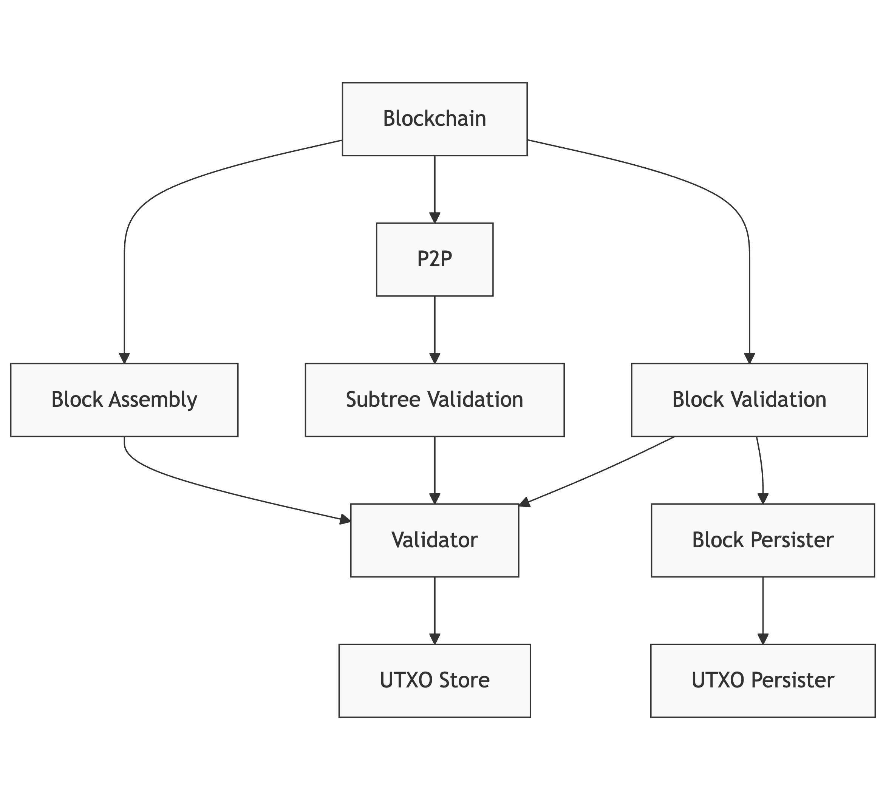

# Daemon Reference

The `daemon` package provides core functionality for initializing and managing Teranode services. It handles service lifecycle management, configuration, and coordination between different components of the system.

## Overview

The daemon is responsible for:

- Starting and stopping Teranode services
- Managing service dependencies and initialization order
- Handling configuration and settings
- Coordinating between different components
- Managing stores (UTXO, transaction, block, etc.)
- Health check endpoints

Besides being used for starting the Teranode services in our main application, the daemon package can also be used in tests to run Teranode instances with different configurations.

## Core Components

### Daemon Structure

```go
type Daemon struct {
    Ctx                context.Context
    ServiceManager     *servicemanager.ServiceManager
    doneCh             chan struct{}
    // ... additional fields for internal state management
}
```

The Daemon struct contains key fields for lifecycle management:

- `Ctx`: Context for the daemon instance
- `ServiceManager`: Manages all running services
- `doneCh`: Channel for shutdown coordination
- Additional unexported fields manage internal state, stores, and synchronization

### Main Functions

#### New(opts ...Option)

Creates a new Daemon instance with optional configuration:

```go
func New(opts ...Option) *Daemon
```

Functional options can be used to configure the daemon during initialization (e.g., custom logger factory, external services). See `daemon_options.go` for available options.

#### Start(logger, args, appSettings, readyChannel...)

Starts the daemon and initializes services based on configuration:

```go
func (d *Daemon) Start(logger ulogger.Logger, args []string, appSettings *settings.Settings, readyChannel ...chan struct{})
```

Parameters:

- `logger`: Logger instance for output
- `args`: Command line arguments for service selection (e.g., `"-all=0"`, `"-blockchain=1"`)
- `appSettings`: Configuration settings object
- `readyChannel`: Optional variadic channel to signal when initialization is complete

#### Stop(skipTracerShutdown...)

Gracefully shuts down the daemon and all running services:

```go
func (d *Daemon) Stop(skipTracerShutdown ...bool) error
```

Parameters:

- `skipTracerShutdown`: Optional boolean to skip tracer shutdown (defaults to false)

#### AddExternalService(name, initFunc)

Registers an external service to be initialized and managed by the daemon:

```go
func (d *Daemon) AddExternalService(name string, initFunc func() (servicemanager.Service, error))
```

Parameters:

- `name`: Name of the service for identification
- `initFunc`: Function that initializes and returns the service instance

This method allows external packages to register their services with the daemon before calling `Start()`. The external services will be initialized and managed alongside built-in services.

## Service Management

### Service Initialization

Services are initialized based on command-line flags or configuration settings. Each service can be enabled/disabled using:

- Command line: `-servicename=1` or `-servicename=0`
- Global disable: `-all=0` disables all services unless explicitly enabled

### Available Services

- Alert
- Asset
- Blockchain
- BlockAssembly
- BlockPersister
- BlockValidation
- Legacy
- P2P
- Propagation
- RPC
- SubtreeValidation
- UTXOPersister
- Validator

### Health Checks

The daemon provides HTTP endpoints for health monitoring:

- `/health/readiness`: Readiness check
- `/health/liveness`: Liveness check
- `/health`: Legacy endpoint (deprecated, redirects to readiness)
- Address configurable via `HealthCheckHTTPListenAddress` setting (defaults to port 8000)

## Service Initialization Flow

### Startup Sequence

When the daemon starts, it initializes services in the following specific order:

1. **Blockchain** - Core blockchain state management (FSM)
2. **P2P** - Peer-to-peer networking
3. **Asset** - HTTP/WebSocket API server
4. **RPC** - JSON-RPC server
5. **Alert** - Network alert system
6. **BlockPersister** - Block persistence
7. **UTXOPersister** - UTXO persistence
8. **BlockAssembly** - Block assembly for mining
9. **SubtreeValidation** - UTXO subtree validation
10. **BlockValidation** - Block validation
11. **Validator** - Transaction validation (if running as separate service)
12. **Propagation** - Transaction propagation
13. **Legacy** - Legacy Bitcoin protocol support
14. **External Services** - Any services registered via `AddExternalService()`

This order ensures dependencies are available when each service initializes.

### Service Dependencies and Deployment Models

Many services have dependencies on other services. For example, the Propagation service depends on the Validator service.

#### Service Dependency Overview



Note: This diagram shows logical dependencies. The actual implementation may use different communication methods (direct calls, gRPC, or Kafka) depending on configuration.

#### Validator Service Deployment

The Validator can be deployed in two distinct ways, controlled by the `Validator.UseLocalValidator` setting:

1. **Local Validator** (recommended for production):

   ```go
   // When Validator.UseLocalValidator=true
   mainValidatorClient, err = validator.New(ctx,
       logger,
       tSettings,
       utxoStore,
       txMetaKafkaProducerClient,
       rejectedTxKafkaProducerClient,
   )
   ```

2. **Remote Validator Service**:

   ```go
   // When Validator.UseLocalValidator=false
   mainValidatorClient, err = validator.NewClient(ctx, logger, tSettings)
   ```

The Propagation service and other services can use either deployment model:

```go
validatorClient, err := GetValidatorClient(ctx, logger, tSettings)
if err != nil {
    return err
}

// Initialize propagation with validator dependency
sm.AddService("PropagationServer", propagation.New(
    logger.New("prop"),
    tSettings,
    txStore,
    validatorClient,
    blockchainClient,
    validatorKafkaProducerClient,
));
```

### Service Communication Patterns

Teranode services communicate using several methods:

1. **Direct method calls** - When using local services (e.g., local validator)
2. **gRPC** - For remote service communication with bi-directional streaming support
3. **Kafka** - For asynchronous messaging and event-driven communication

#### Key Communication Flows

- **Tx Validator to Subtree Validation**: Uses Kafka for transaction metadata
- **P2P to Subtree Validation**: Uses Kafka for notifications (not gRPC)
- **Block Validation to Validator**: For validating transactions in blocks
- **Propagation to Validator**: Uses either direct calls (local validator) or gRPC (remote validator)

> **Note**: The SubtreeFound gRPC method was removed from the project. All references to this method were removed from documentation. The P2P service now only notifies the subtree validation service via Kafka, not through gRPC.

### Singleton Patterns

Many services and stores use singleton patterns to ensure only one instance exists. Key examples include:

```go
// Validator client singleton
if mainValidatorClient != nil {
    return mainValidatorClient, nil
}

// UTXO store singleton
if utxoStoreInstance != nil {
    return utxoStoreInstance, nil
}
```

This pattern ensures consistent state across all services using these components.

## Store Management

### Stores Structure

The daemon uses an internal `Stores` struct to manage singleton instances of stores and clients:

```go
type Stores struct {
    mainBlockPersisterStore     blob.Store
    mainBlockStore              blob.Store
    mainBlockValidationClient   blockvalidation.Interface
    mainSubtreeStore            blob.Store
    mainSubtreeValidationClient subtreevalidation.Interface
    mainTempStore               blob.Store
    mainTxStore                 blob.Store
    mainUtxoStore               utxostore.Store
    mainValidatorClient         validator.Interface
}
```

This struct maintains singleton instances to ensure only one instance of each store/client exists per daemon instance. All store getter methods check if an instance already exists before creating a new one.

### Store Methods

The daemon's internal `Stores` struct provides methods to access different types of stores:

#### GetTxStore

```go
func (d *Stores) GetTxStore(logger ulogger.Logger, appSettings *settings.Settings) (blob.Store, error)
```

Returns the transaction store instance, creating it if it doesn't exist.

#### GetUtxoStore

```go
func (d *Stores) GetUtxoStore(ctx context.Context, logger ulogger.Logger, appSettings *settings.Settings) (utxostore.Store, error)
```

Returns the UTXO store instance, creating it if it doesn't exist.

#### GetBlockStore

```go
func (d *Stores) GetBlockStore(ctx context.Context, logger ulogger.Logger, appSettings *settings.Settings) (blob.Store, error)
```

Returns the block store instance, creating it if it doesn't exist.

#### GetSubtreeStore

```go
func (d *Stores) GetSubtreeStore(ctx context.Context, logger ulogger.Logger, appSettings *settings.Settings) (blob.Store, error)
```

Returns the subtree store instance, creating it if it doesn't exist.

#### GetBlockPersisterStore

```go
func (d *Stores) GetBlockPersisterStore(ctx context.Context, logger ulogger.Logger, appSettings *settings.Settings) (blob.Store, error)
```

Returns the block persister store instance, creating it if it doesn't exist.

#### GetTempStore

```go
func (d *Stores) GetTempStore(ctx context.Context, logger ulogger.Logger, appSettings *settings.Settings) (blob.Store, error)
```

Returns the temporary store instance, creating it if it doesn't exist. Used by the Legacy service.

#### GetBlockchainClient

```go
func (d *Stores) GetBlockchainClient(ctx context.Context, logger ulogger.Logger, appSettings *settings.Settings, source string) (blockchain.ClientI, error)
```

Creates and returns a new blockchain client instance. Unlike other getters, this always creates a new client to maintain source information.

#### GetValidatorClient

```go
func (d *Stores) GetValidatorClient(ctx context.Context, logger ulogger.Logger, appSettings *settings.Settings) (validator.Interface, error)
```

Returns the validator client instance. Creates either a local validator or remote client based on `Validator.UseLocalValidator` setting.

#### Cleanup

```go
func (d *Stores) Cleanup()
```

Resets all singleton stores. This is particularly important for tests where stores may persist between test runs.

## Profiler and Metrics

The daemon automatically initializes profiling and metrics endpoints when configured:

### Profiler Endpoints

When `ProfilerAddr` is set, the daemon exposes pprof endpoints for profiling:

- `/debug/pprof/` - Profile index
- `/debug/pprof/cmdline` - Command line arguments
- `/debug/pprof/profile` - CPU profile
- `/debug/pprof/symbol` - Symbol lookup
- `/debug/pprof/trace` - Execution trace
- `/debug/fgprof` - Full goroutine profiler (fgprof)

### Metrics Endpoints

The daemon supports multiple metrics systems:

- **Stats Server**: When `StatsPrefix` is set, exposes stats at `http://<ProfilerAddr>/<StatsPrefix>/stats`
- **Prometheus**: When `PrometheusEndpoint` is set, exposes Prometheus metrics at the configured endpoint (e.g., `/metrics`)

All metrics are exposed on the same address as the profiler (`ProfilerAddr`).

### Tracing

When `TracingEnabled` is set to true, the daemon initializes distributed tracing support using the configured tracing backend.

## Configuration Options

The daemon uses a variety of configuration options to control service behavior and deployment models. Here are the key settings that affect daemon initialization and service configuration:

### Service Deployment Settings

| Setting | Description | Default | Impact |
|---------|-------------|---------|--------|
| `Validator.UseLocalValidator` | Controls whether the validator runs as a local component (true) or as a separate service (false) | `true` | Significant performance impact; local validator is recommended for production |
| `Validator.GRPCListenAddress` | gRPC listen address for validator service (when running as separate service) | - | Required when UseLocalValidator is false |
| `BlockValidation.GRPCListenAddress` | gRPC listen address for block validation service | - | If empty, block validation service won't start |
| `BlockAssembly.GRPCListenAddress` | gRPC listen address for block assembly service | - | If empty, block assembly service won't start |
| `Propagation.GRPCListenAddress` | gRPC listen address for propagation service | - | If empty, propagation service won't start |
| `HealthCheckHTTPListenAddress` | HTTP listen address for health check endpoints | `:8000` | Exposed on `/health/readiness` and `/health/liveness` |
| `Context` | Environment context (e.g., "dev", "test", "docker", "operator") | - | Affects port prefixes and service configuration |

### Store Configuration

| Setting | Description | Default | Impact |
|---------|-------------|---------|--------|
| `UtxoStore.UtxoStore` | URL to UTXO store (e.g., "sqlite:///path", "memory:///", "aerospike://...") | - | Required for UTXO operations; affects performance significantly |
| `BlockChain.StoreURL` | URL to blockchain store (PostgreSQL or SQLite) | - | Required; stores block headers and chain state |
| `SubtreeValidation.SubtreeStore` | URL to subtree store | - | Required; controls where merkle subtrees are stored |
| `Block.TxStore` | URL to transaction store | - | Required; stores transaction data |
| `Block.BlockStore` | URL to block store | - | Required; stores full blocks |
| `Block.PersisterStore` | URL to block persister store | - | Used by block persister service |
| `Legacy.TempStore` | URL to temporary store | `file://./tmp` | Used by legacy service for temporary data |

### Communication Settings

| Setting | Description | Default | Impact |
|---------|-------------|---------|--------|
| `Kafka.Brokers` | Kafka broker addresses | - | Required for inter-service communication |
| `Kafka.ValidatorTxsConfig` | Kafka topic configuration for validator transactions | - | Affects how transaction data flows between services |
| `Validator.KafkaWorkers` | Number of Kafka workers for validator service | `100` | Affects throughput of Kafka message processing |
| `ClientName` | Client identifier for Kafka consumer groups | - | Ensures unique consumer group names per instance |

### PostgreSQL Settings

| Setting | Description | Default | Impact |
|---------|-------------|---------|--------|
| `PostgresCheckAddress` | PostgreSQL server address to check before starting | - | Used with `-wait_for_postgres=1` flag |

### Profiling and Monitoring Settings

| Setting | Description | Default | Impact |
|---------|-------------|---------|--------|
| `ProfilerAddr` | Address for profiler and metrics endpoints | - | If set, enables pprof and stats endpoints |
| `StatsPrefix` | URL prefix for stats endpoint | - | If set, enables stats server at `/<prefix>/stats` |
| `PrometheusEndpoint` | Endpoint path for Prometheus metrics | - | If set, exposes Prometheus metrics (e.g., `/metrics`) |
| `TracingEnabled` | Enable distributed tracing | `false` | Initializes tracing backend when true |
| `UseDatadogProfiler` | Enable Datadog profiler | `false` | Starts Datadog profiling when true |
| `LogLevel` | Logging level for all services | `info` | Controls verbosity of logs |

### Advanced Settings

| Setting | Description | Default | Impact |
|---------|-------------|---------|--------|
| `LocalTestStartFromState` | Starting state for local testing blockchain FSM | - | Can be set via `-localTestStartFromState` flag |
| `ChainCfgParams` | Bitcoin network parameters (mainnet, testnet, regtest) | mainnet | Determines consensus rules and network magic |

Consult the individual service documentation for service-specific configuration options. The settings listed here are particularly important for daemon initialization and service communication.

## Testing Support

The daemon package is designed to support comprehensive testing scenarios:

- Can be initialized with different store implementations (SQLite, in-memory, etc.)
- Supports running complete Teranode instances in tests
- Allows step-by-step debugging of services
- Facilitates testing complex scenarios like double-spend detection

Example test initialization:

```go

func NewDoubleSpendTester(t *testing.T) *DoubleSpendTester {
    ctx, cancel := context.WithCancel(context.Background())

    logger := ulogger.NewErrorTestLogger(t, cancel)

    // Delete the sqlite db at the beginning of the test
    _ = os.RemoveAll("data")

    persistentStore, err := url.Parse("sqlite:///test")
    require.NoError(t, err)

    memoryStore, err := url.Parse("memory:///")
    require.NoError(t, err)

    if !isKafkaRunning() {
        kafkaContainer, err := testkafka.RunTestContainer(ctx)
        require.NoError(t, err)

        t.Cleanup(func() {
            _ = kafkaContainer.CleanUp()
        })

        gocore.Config().Set("KAFKA_PORT", strconv.Itoa(kafkaContainer.KafkaPort))
    }

    tSettings := settings.NewSettings() // This reads gocore.Config and applies sensible defaults

    // Override with test settings...
    tSettings.SubtreeValidation.SubtreeStore = memoryStore
    tSettings.BlockChain.StoreURL = persistentStore
    tSettings.UtxoStore.UtxoStore = persistentStore
    tSettings.ChainCfgParams = &chaincfg.RegressionNetParams
    tSettings.Asset.CentrifugeDisable = true

    readyCh := make(chan struct{})

    d := daemon.New()

    go d.Start(logger, []string{
        "-all=0",
        "-blockchain=1",
        "-subtreevalidation=1",
        "-blockvalidation=1",
        "-blockassembly=1",
        "-asset=1",
        "-propagation=1",
    }, tSettings, readyCh)

    <-readyCh

    bcClient, err := blockchain.NewClient(ctx, logger, tSettings, "test")
    require.NoError(t, err)

    baClient, err := blockassembly.NewClient(ctx, logger, tSettings)
    require.NoError(t, err)

    propagationClient, err := propagation.NewClient(ctx, logger, tSettings)
    require.NoError(t, err)

    blockValidationClient, err := blockvalidation.NewClient(ctx, logger, tSettings, "test")
    require.NoError(t, err)

    w, err := wif.DecodeWIF(tSettings.BlockAssembly.MinerWalletPrivateKeys[0])
    require.NoError(t, err)

    privKey := w.PrivKey

    subtreeStore, err := daemon.GetSubtreeStore(logger, tSettings)
    require.NoError(t, err)

    utxoStore, err := daemon.GetUtxoStore(ctx, logger, tSettings)
    require.NoError(t, err)

    return &DoubleSpendTester{
        ctx:                   ctx,
        logger:                logger,
        d:                     d,
        blockchainClient:      bcClient,
        blockAssemblyClient:   baClient,
        propagationClient:     propagationClient,
        blockValidationClient: blockValidationClient,
        privKey:               privKey,
        subtreeStore:          subtreeStore,
        utxoStore:             utxoStore,
    }
}
```

Additionally, using the following function:

```go
tSettings := settings.NewSettings() // This reads gocore.Config and applies sensible defaults
```

will initialise settings with generic defaults, ideal for tests.

## Configuration Priority

The daemon uses configuration from multiple sources in this priority order (highest to lowest):

1. Command line arguments (e.g., `-blockchain=1`, `-all=0`)
2. Environment variables (when using `gocore.Config()`)
3. Configuration files (`settings.conf`, `settings_local.conf`)
4. Default settings (hardcoded in `settings/settings.go`)
