# 🗂️ Asset Server

## Index


1. [Description](#1-description)
2. [Architecture](#2-architecture)
3. [Data Model](#3-data-model)
- [3.1. Blocks](#31-blocks)
- [3.2. Block Headers](#32-block-headers)
- [3.3. Subtrees](#33-subtrees)
- [3.4. Txs](#34-txs)
- [3.5. UTXOs](#35-utxos)
4. [Use Cases](#4-use-cases)
- [4.1. gRPC](#41-grpc)
- [4.1.1. getBlock(), getBestBlockHeader(), getBlockHeaders()](#411-getblock-getbestblockheader-getblockheaders)
- [4.1.2. Subtree Get()](#412-subtree-get)
- [4.1.3. Subtree Set() and SetTTL()](#413-subtree-set-and-setttl)
- [4.1.5. Subscribe to notifications](#415-subscribe-to-notifications)
- [4.2. HTTP and Websockets](#42-http-and-websockets)
- [4.2.1. getTransaction() and getTransactions()](#421-gettransaction-and-gettransactions)
- [4.2.2. GetTransactionMeta()](#422-gettransactionmeta)
- [4.2.3. GetSubtree()](#423-getsubtree)
- [4.2.4. GetBlockHeaders(), GetBlockHeader() and GetBestBlockHeader()](#424-getblockheaders-getblockheader-and-getbestblockheader)
- [4.2.5. GetBlock() and GetLastNBlocks()](#425-getblock-and-getlastnblocks)
- [4.2.6. GetUTXO() and GetUTXOsByTXID()](#426-getutxo-and-getutxosbytxid)
- [4.2.7. Websocket Subscriptions](#427-websocket-subscriptions)
5. [gRPC Protobuf Definitions](#5-grpc-protobuf-definitions)
6. [Technology](#6-technology)
7. [Directory Structure and Main Files](#7-directory-structure-and-main-files)
8. [How to run](#8-how-to-run)
- [8.1. How to run](#81-how-to-run)
- [8.2  Configuration options (settings flags)](#82--configuration-options-settings-flags)

## 1. Description

The Asset Service acts as an interface ("Front" or "Facade") to various data stores. It deals with several key data elements:

- **Transactions (TX)**.


- **SubTrees**.


- **Blocks and Block Headers**.


- **Unspent Transaction Outputs (UTXO)**.


The server uses both HTTP and gRPC as communication protocols:

- **HTTP**: A ubiquitous protocol that allows the server to be accessible from the web, enabling other nodes or clients to interact with the server using standard web requests.


- **gRPC**: Allowing for efficient communication between nodes, particularly suited for microservices communication in the Teranode distributed network.

The server being externally accessible implies that it is designed to communicate with other nodes and external clients across the network, to share blockchain data or synchronize states.

The various micro-services typically write directly to the data stores, but the asset service fronts them as a common interface.

Finally, the Asset Service also offers a WebSocket interface, allowing clients to receive real-time notifications when new subtrees and blocks are added to the blockchain.

## 2. Architecture


The Asset Server provides data to other Teranode components over gRPC. It also provides data to external clients over HTTP / Websockets, such as the Teranode UI Dashboard.

All data is retrieved from other Teranode services / stores.

Here we can see the Asset Server's relationship with other Teranode components in more detail:


The Asset Server is composed of the following components:


* **UTXO Store**: Provides UTXO data to the Asset Server.
* **Blob Store**: Provides Subtree and Extended TX data to the Asset Server, referred here as Subtree Store and TX Store.
* **Blockchain Server**: Provides blockchain data (blocks and block headers) to the Asset Server.


Finally, note that the Asset Server benefits of the use of Lustre Fs (filesystem). Lustre is a type of parallel distributed file system, primarily used for large-scale cluster computing. This filesystem is designed to support high-performance, large-scale data storage and workloads.
Specifically for Teranode, these volumes are meant to be temporary holding locations for short-lived file-based data that needs to be shared quickly between various services
Teranode microservices make use of the Lustre file system in order to share subtree and tx data, eliminating the need for redundant propagation of subtrees over grpc or message queues. The services sharing Subtree data through this system can be seen here:

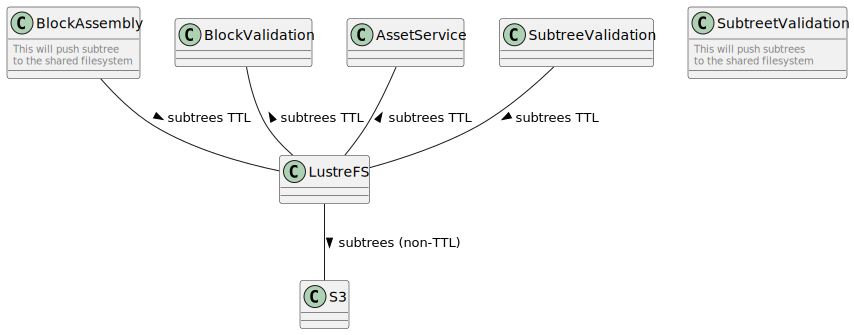


## 3. Data Model

The following data types are provided by the Asset Server:

### 3.1. Blocks

Each block is an abstraction which is a container of a group of subtrees. A block contains a variable number of subtrees, a coinbase transaction, and a header, called a block header, which includes the block ID of the previous block, effectively creating a chain.

| Field       | Type                  | Description                                                 |
|-------------|-----------------------|-------------------------------------------------------------|
| Header      | *BlockHeader          | The Block Header                                            |
| CoinbaseTx  | *bt.Tx                | The coinbase transaction.                                   |
| Subtrees    | []*chainhash.Hash     | An array of hashes, representing the subtrees of the block. |

This table provides an overview of each field in the `Block` struct, including the data type and a brief description of its purpose or contents.

More information on the block structure and purpose can be found in the [Architecture Documentation](docs/architecture/architecture.md).

### 3.2. Block Headers


The block header is a data structure that contains metadata about a block. It is used to connect blocks together in a blockchain. The block header is a structure that is hashed as part of the proof-of-work algorithm for mining. It contains the following fields:

| Field           | Type               | Description                                                                                                                            |
|-----------------|--------------------|----------------------------------------------------------------------------------------------------------------------------------------|
| Version         | uint32             | Version of the block, different from the protocol version. Represented as 4 bytes in little endian when built into block header bytes.
| HashPrevBlock   | *chainhash.Hash    | Reference to the hash of the previous block header in the blockchain.                                                                  |
| HashMerkleRoot  | *chainhash.Hash    | Reference to the Merkle tree hash of all subtrees in the block.                                                                        |
| Timestamp       | uint32             | The time when the block was created, in Unix time. Represented as 4 bytes in little endian when built into block header bytes.         |
| Bits            | NBit               | Difficulty target for the block. Represented as a target threshold in little endian, the format used in a Bitcoin block.               |
| Nonce           | uint32             | Nonce used in generating the block. Represented as 4 bytes in little endian when built into block header bytes.                        |


### 3.3. Subtrees

A subtree acts as an intermediate data structure to hold batches of transaction IDs (including metadata) and their corresponding Merkle root. Blocks are then built from a collection of subtrees.

More information on the subtree structure and purpose can be found in the [Architecture Documentation](docs/architecture/architecture.md).

Here's a table documenting the structure of the `Subtree` type:

| Field            | Type                  | Description                                                                     |
|------------------|-----------------------|---------------------------------------------------------------------------------|
| Height           | int                   | The height of the subtree within the blockchain.                                |
| Fees             | uint64                | Total fees associated with the transactions in the subtree.                     |
| SizeInBytes      | uint64                | The size of the subtree in bytes.                                               |
| FeeHash          | chainhash.Hash        | Hash representing the combined fees of the subtree.                             |
| Nodes            | []SubtreeNode         | An array of `SubtreeNode` objects, representing individual "nodes" within the subtree. |
| ConflictingNodes | []chainhash.Hash      | List of hashes representing nodes that conflict, requiring checks during block assembly. |

Here, a `SubtreeNode is a data structure representing a transaction hash, a fee, and the size in bytes of said TX.

### 3.4. Txs

This refers to the extended transaction format, as seen below:

| Field           | Description                                                                                            | Size                                              |
|-----------------|--------------------------------------------------------------------------------------------------------|---------------------------------------------------|
| Version no      | currently 2                                                                                            | 4 bytes                                           |
| **EF marker**   | **marker for extended format**                                                                         | **0000000000EF**                                  |
| In-counter      | positive integer VI = [[VarInt]]                                                                       | 1 - 9 bytes                                       |
| list of inputs  | **Extended Format** transaction Input Structure                                                        | <in-counter> qty with variable length per input   |
| Out-counter     | positive integer VI = [[VarInt]]                                                                       | 1 - 9 bytes                                       |
| list of outputs | Transaction Output Structure                                                                           | <out-counter> qty with variable length per output |
| nLocktime       | if non-zero and sequence numbers are < 0xFFFFFFFF: block height or timestamp when transaction is final | 4 bytes                                           |

More information on the extended tx structure and purpose can be found in the [Architecture Documentation](docs/architecture/architecture.md).


### 3.5. UTXOs

The UTXO are kept with the following structure.

| Field     | Description                                                   |
|-----------|---------------------------------------------------------------|
| hash      | The hash of the UTXO for identification purposes              |
| lock_time | The block number or timestamp at which this UTXO can be spent |
| tx_id     | The transaction ID where this UTXO was spent                  |


Additionally, in some scenarios, the Asset Server can be used to retrieve the UTXO meta data. The UTXO Meta data model is defined in `stores/utxo/meta/data.go`:

| Field Name    | Description                                                     | Data Type                         |
|---------------|-----------------------------------------------------------------|-----------------------------------|
| Tx            | The raw transaction data.                                       | *bt.Tx Object                     |
| Hash          | Unique identifier for the transaction.                          | String/Hexadecimal                |
| Fee           | The fee associated with the transaction.                        | Decimal                           |
| Size in Bytes | The size of the transaction in bytes.                           | Integer                           |
| Parents       | List of hashes representing the parent transactions.            | Array of Strings/Hexadecimals     |
| Blocks        | List of IDs of the blocks that include this transaction.        | Array of Integers                 |
| LockTime      | The earliest time or block number that this transaction can be included in the blockchain. | Integer/Timestamp or Block Number |
| IsCoinbase    | Indicates whether the transaction is a coinbase transaction.    | Boolean                           |

Note:

- **Parent Transactions**: 1 or more parent transaction hashes. For each input that our transaction has, we can have a different parent transaction. I.e. a TX can be spending UTXOs from multiple transactions.


- **Blocks**: 1 or more block hashes. Each block represents a block that mined the transaction.
   - Typically, a tx should only belong to one block. i.e. a) a tx is created (and its meta is stored in the UTXO store) and b) the tx is mined, and the mined block hash is tracked in the UTXO store for the given transaction.
   - However, in the case of a fork, a tx can be mined in multiple blocks by different nodes. In this case, the UTXO store will track multiple block hashes for the given transaction, until such time that the fork is resolved and only one block is considered valid.


More information on the UTXO structure and purpose can be found in the [Architecture Documentation](docs/architecture/architecture.md) and the [UTXO Store Documentation](../stores/utxo.md).


## 4. Use Cases

### 4.1. gRPC

The Asset Service exposes the following gRPC methods:

### 4.1.1. getBlock(), getBestBlockHeader(), getBlockHeaders()

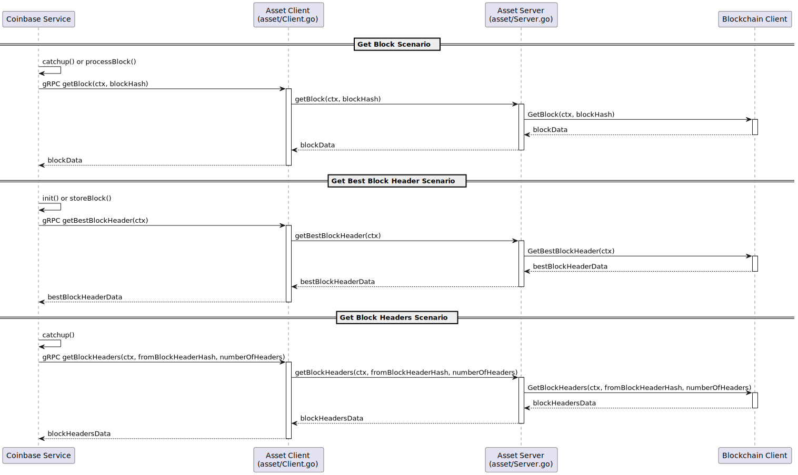

### 4.1.2. Subtree Get()

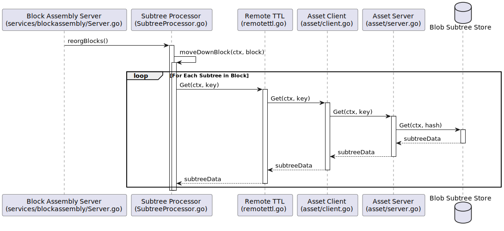

### 4.1.3. Subtree Set() and SetTTL()

The Asset Server also permits to store subtrees and to update their retention TTL in the Subtree (Blob) Store.

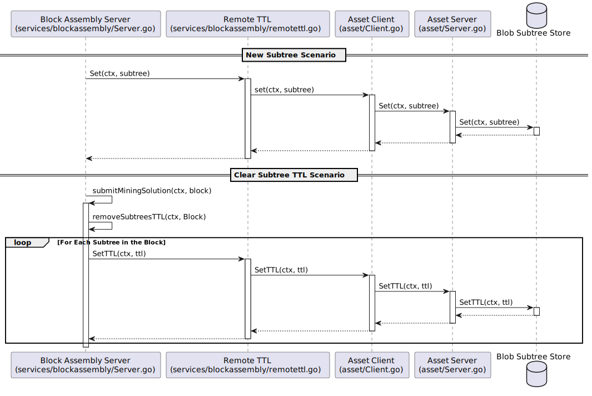

- The **New Subtree Scenario** shows the process of setting a new subtree in the Blob Subtree Store via the Block Assembly Server, Remote TTL, Asset Client, and Asset Server.

- The **Clear Subtree TTL Scenario** illustrates the sequence of operations involved in submitting a mining solution, which includes removing the TTL (Time To Live) for subtrees associated with a block. This process involves iterating over each subtree in the block and setting the TTL through the Remote TTL, Asset Client, Asset Server, and the Blob Subtree Store.

### 4.1.5. Subscribe to notifications

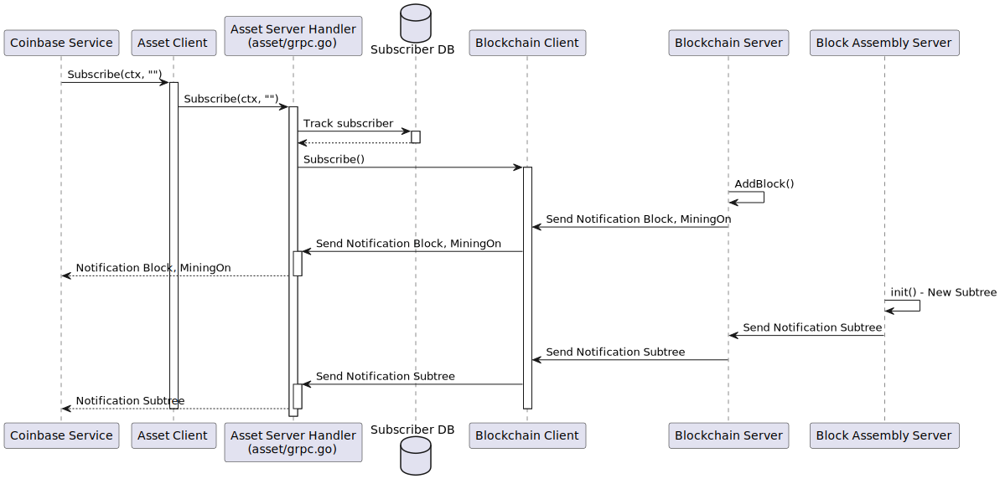

1. The Coinbase service initiates a subscription through the Asset Client. We expect to receive **Block, MiningOn, and Subtree** notifications.
   * In all cases, a (block or subtree) hash is sent out. The Coinbase service can then request the full block or subtree from the Asset Server.
   * In the current implementation, there is no difference between Block and MiningOn messages, as they are both hashed blocks.
2. The Asset Server tracks the subscriber in the Subscriber Database.
3. The Asset Server subscribes to the Blockchain Client, which sends back notifications for Block, MiningOn, and Subtree messages.
4. Independently, the Blockchain Server adds a block and sends notifications (Block and MiningOn) to the Asset Server, which then forwards these to the Coinbase service.
5. Concurrently, the Block Assembly Server, upon initialization and adding a new subtree, sends a Subtree notification to the Asset Server (via the Blockchain subscription), which again forwards it to the Coinbase service.


### 4.2. HTTP and Websockets

The Asset Service exposes the following HTTP and Websocket methods:

### 4.2.1. getTransaction() and getTransactions()

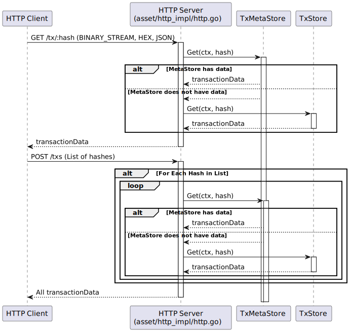

### 4.2.2. GetTransactionMeta()

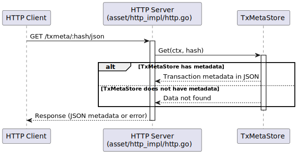

### 4.2.3. GetSubtree()

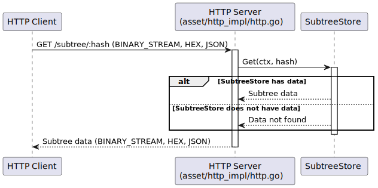

### 4.2.4. GetBlockHeaders(), GetBlockHeader() and GetBestBlockHeader()

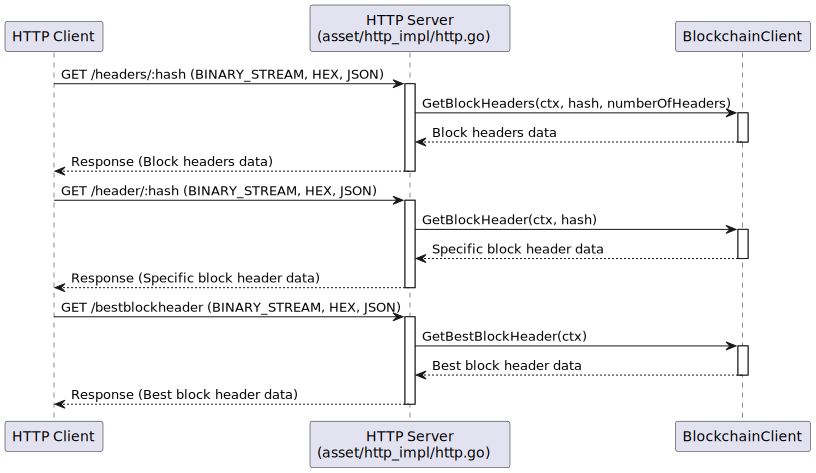

### 4.2.5. GetBlock() and GetLastNBlocks()

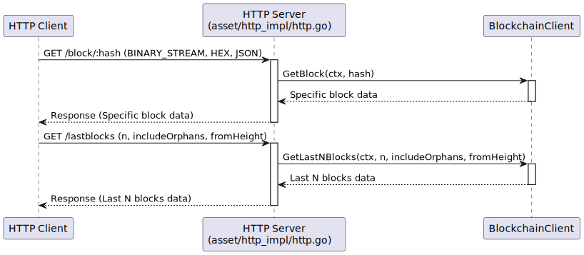

### 4.2.6. GetUTXO() and GetUTXOsByTXID()

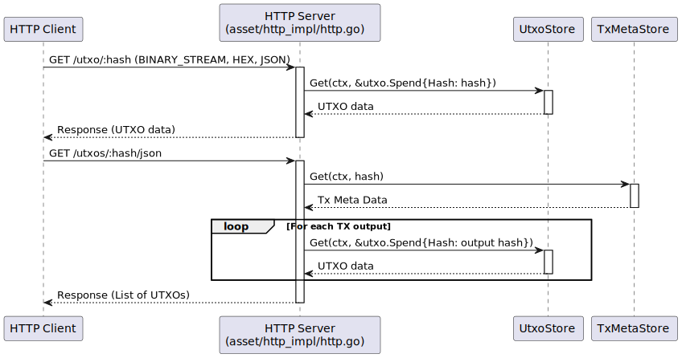

* For specific UTXO by hash requests (/utxo/:hash), the HTTP Server requests UTXO data from the UtxoStore using a hash.


* For getting UTXOs by a transaction ID (/utxos/:hash/json), the HTTP Server requests transaction meta data from the UTXO Store using a transaction hash. Then for each output in the transaction, it queries the UtxoStore to get UTXO data for the corresponding output hash.

### 4.2.7. Websocket Subscriptions

The `HandleWebSocket(c)` (`services/asset/http_impl/HandleWebsocket.go`) function sets up a WebSocket server for handling real-time notifications. It involves managing client connections, broadcasting messages (including periodic pings), and handling client disconnections.

1. **Initialization**: The function initializes three channels: `newClientCh` for new client connections, `deadClientCh` for client disconnections, and `notificationCh` for receiving notifications.

2. **WebSocket Connection Handling**:
    - When a new WebSocket client connects, it's added to the `clientChannels` map for message broadcasting.
    - When a client disconnects, it is removed from the `clientChannels` map.

3. **Notification Broadcasting**:
    - The function listens for incoming notifications and pings on separate goroutines. Notice the noti
    - When a new notification is received, it is marshaled into JSON and sent to all connected WebSocket clients.
    - A ping message is sent to all clients every 30 seconds to maintain the WebSocket connection.

4. **WebSocket Data Transmission**:
    - The WebSocket server sends data to connected clients via the `clientChannels`.
    - If an error occurs during message sending (e.g., if a client disconnects), the client is marked as dead and removed from active client channels.

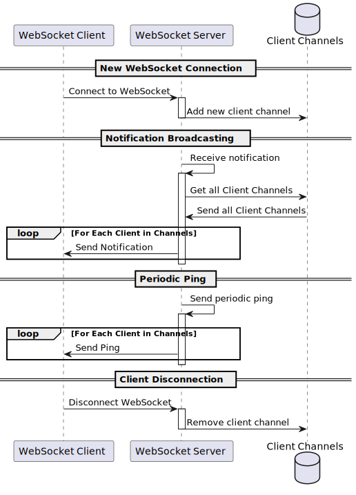

Notice that the notifications are the same notifications sent by the gRPC subscriber (see [Subscribe to notifications](#415-subscribe-to-notifications-)) - i.e. `Subtree`, `Block`, `MiningOn`.

## 5. gRPC Protobuf Definitions

The Asset Service uses gRPC for communication between nodes. The  protobuf definitions used for defining the service methods and message formats can be seen [here](protobuf_docs/assetProto.md).

## 6. Technology

Key technologies involved:

1. **Go Programming Language (Golang)**:
    - A statically typed, compiled language known for its simplicity and efficiency, especially in concurrent operations and networked services.
    - The primary language used for implementing the service's logic.

2. **gRPC (Google Remote Procedure Call)**:
    - A high-performance, open-source framework developed by Google.
    - Used for inter-service communication, enabling the server to efficiently communicate with connected clients or nodes.
    - Supports features like streaming requests and responses and robust error handling.

3. **Protobuf (Protocol Buffers)**:
    - A language-neutral, platform-neutral, extensible mechanism for serializing structured data, developed by Google.
    - Used in conjunction with gRPC for defining service methods and message formats.

4. **HTTP/HTTPS Protocols**:
    - HTTP for transferring data over the web. HTTPS adds a layer of security with SSL/TLS encryption.
    - Used for communication between clients and the server, and for serving web pages or APIs.

5. **Echo Web Framework**:
    - A high-performance, extensible, minimalist Go web framework.
    - Used for handling HTTP requests and routing, including upgrading HTTP connections to WebSocket connections.
    - Library: github.com/labstack/echo

6. **WebSocket Protocol**:
    - A TCP-based protocol that provides full-duplex communication channels over a single connection.
    - Used for real-time data transfer between clients and the server, particularly useful for continuously updating the state of the network to connected clients.
    - Library: github.com/gorilla/websocket

8. **JSON (JavaScript Object Notation)**:
    - A lightweight data-interchange format, easy for humans to read and write, and easy for machines to parse and generate.
    - Used for structuring data sent to and from clients, especially in contexts where WebSocket or HTTP is used.


## 7. Directory Structure and Main Files

```
./services/asset
├── Client.go                  # gRPC Client functions for the Asset Service.
├── Interface.go               # Defines the interface for an asset peer.
├── Peer.go                    # Defines a Peer and manages peer-related functionalities.
├── Server.go                  # Server logic for the Asset Service.
├── asset_api                  # API definitions and generated files.
├── grpc_impl                  # Implementation of the service using gRPC, used by the Server.go.
├── http_impl                  # Implementation of the service using HTTP.
│   ├── GetBestBlockHeader.go  # Logic to retrieve the best block header.
│   ├── GetBlock.go            # Logic to retrieve a specific block.
│   ├── GetBlockHeader.go      # Logic to retrieve a block header.
│   ├── GetBlockHeaders.go     # Logic to retrieve multiple block headers.
│   ├── GetLastNBlocks.go      # Logic to retrieve the last N blocks.
│   ├── GetSubtree.go          # Logic to retrieve a subtree.
│   ├── GetTransaction.go      # Logic to retrieve a specific transaction.
│   ├── GetTransactionMeta.go  # Logic to retrieve transaction metadata.
│   ├── GetTransactions.go     # Logic to retrieve multiple transactions.
│   ├── GetUTXO.go             # Logic to retrieve UTXO data.
│   ├── GetUTXOsByTXID.go      # Logic to retrieve UTXOs by a transaction ID.
│   ├── HandleWebsocket.go     # Manages WebSocket connections.
│   ├── Readmode.go            # Manages read-only mode settings.
│   ├── blockHeaderResponse.go # Formats block header responses.
│   ├── http.go                # Core HTTP implementation.
│   ├── metrics.go             # HTTP-specific metrics.
│   └── sendError.go           # Utility for sending error responses.
└── repository                 # Repository layer managing data interactions.
    └── repository.go          # Core repository implementation.
```


## 8. How to run

### 8.1. How to run

To run the Asset Server locally, you can execute the following command:

```shell
SETTINGS_CONTEXT=dev.[YOUR_USERNAME] go run -Asset=1
```

Please refer to the [Locally Running Services Documentation](../locallyRunningServices.md) document for more information on running the Asset Server locally.


### 8.2  Configuration options (settings flags)

1. **General Configuration**
    - `asset_maxRetries`: The maximum number of retry attempts for connecting to the Asset Service.
        - Example: `asset_maxRetries=3`
    - `asset_retrySleep`: The sleep duration (in milliseconds) between retry attempts for connecting to the Asset Service.
        - Example: `asset_retrySleep=1000`
    - `use_open_tracing`: Enables or disables OpenTracing for the service.
        - Example: `use_open_tracing=true`
    - `use_prometheus_grpc_metrics`: Enables or disables Prometheus metrics for gRPC calls.
        - Example: `use_prometheus_grpc_metrics=true`

2. **gRPC and HTTP Server Configuration**
    - `asset_grpcListenAddress`: Address for the Asset Service to listen for gRPC requests.
        - Example: `asset_grpcListenAddress=:8091`
    - `asset_httpListenAddress`: Address for the Asset Service to listen for HTTP requests.
        - Example: `asset_httpListenAddress=:8090`
    - `securityLevelHTTP`: Determines the security level for HTTP communication. `0` for HTTP, `1` for HTTPS.
        - Example: `securityLevelHTTP=1`
    - `server_certFile`: Path to the SSL certificate file for HTTPS.
        - Example: `server_certFile=/path/to/cert.pem`
    - `server_keyFile`: Path to the SSL key file for HTTPS.
        - Example: `server_keyFile=/path/to/key.pem`

3. **Service Discovery and Peer Configuration**
    - `feature_libP2P`: Enables or disables the libP2P feature for peer-to-peer network communication.
        - Example: `feature_libP2P=false`
    - `feature_bootstrap`: Enables or disables the bootstrap feature for discovering peers.
        - Example: `feature_bootstrap=true`
    - `clientName`: Specifies the client name for identification purposes.
        - Example: `clientName=AssetClient`

4. **Repository and Storage Configuration**
    - `txmeta_store_asset-service`: Connection string or configuration for the transaction metadata storage used by the Asset Service.
        - Example: `txmeta_store_asset-service=aerospike://localhost:3000`

5. **Miscellaneous Settings**
    - `asset_apiPrefix`: Specifies the API prefix for HTTP routes.
        - Example: `asset_apiPrefix=/api/v1`
    - `asset_centrifugeListenAddress`: Specifies the listen address for the Centrifuge service integration.
        - Example: `asset_centrifugeListenAddress=:8101`
