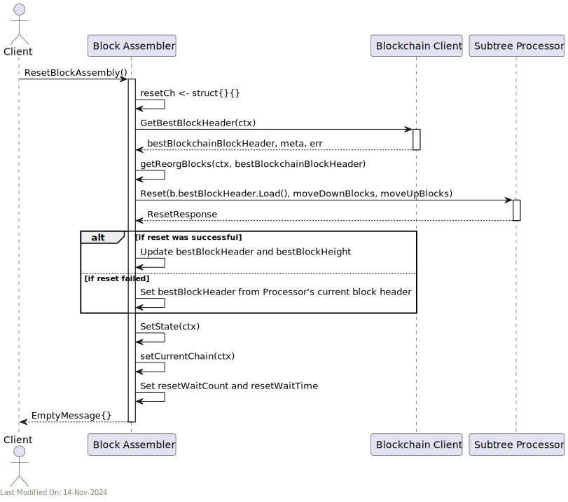

# 📦 Block Assembly Service

## Index


1. [Description](#1-description)
2. [Functionality](#2-functionality)
- [2.1. Starting the Block Assembly Service](#21-starting-the-block-assembly-service)
- [2.2. Receiving Transactions from the TX Validator Service](#22-receiving-transactions-from-the-tx-validator-service)
- [3.2. Grouping Transactions into Subtrees](#32-grouping-transactions-into-subtrees)
- [3.3. Creating Mining Candidates](#33-creating-mining-candidates)
- [3.4. Submit Mining Solution](#34-submit-mining-solution)
- [3.5. Processing Subtrees and Blocks from other Nodes and Handling Forks and Conflicts](#35-processing-subtrees-and-blocks-from-other-nodes-and-handling-forks-and-conflicts)
- [3.5.1. The block received is the same as the current chaintip (i.e. the block we have already seen).](#351-the-block-received-is-the-same-as-the-current-chaintip-ie-the-block-we-have-already-seen)
- [3.5.2. The block received is a new block, and it is the new chaintip.](#352-the-block-received-is-a-new-block-and-it-is-the-new-chaintip)
- [3.5.3. The block received is a new block, but it represents a fork.](#353-the-block-received-is-a-new-block-but-it-represents-a-fork)
- [3.6. Resetting the Block Assembly](#36-resetting-the-block-assembly)
3. [Data Model](#3-data-model)
- [3.1. Block Data Model](#31-block-data-model)
    - [3.2. Subtree Data Model](#32-subtree-data-model)
    - [3.3 TX Meta Data Model](#33-tx-meta-data-model)
4. [gRPC Protobuf Definitions](#4-grpc-protobuf-definitions)
5. [Technology](#5-technology)
6. [Directory Structure and Main Files](#6-directory-structure-and-main-files)
7. [How to run](#7-how-to-run)
8. [Configuration options (settings flags)](#8-configuration-options-settings-flags)
- [gRPC and fRPC Server Settings:](#grpc-and-frpc-server-settings)
- [Subtree and Cache Settings:](#subtree-and-cache-settings)
- [Kafka Integration:](#kafka-integration)
- [Blockchain and Mining Settings:](#blockchain-and-mining-settings)
- [General Operational Settings:](#general-operational-settings)


## 1. Description


The Block Assembly Service is responsible for assembling new blocks and adding them to the blockchain.  The block assembly process involves the following steps:

1. **Receiving Transactions from the TX Validator Service**:
    - The block assembly module receives new transactions from the transaction validator service.

2. **Grouping Transactions into Subtrees**:
    - The received transactions are grouped into subtrees.
    - Subtrees represent a hierarchical structure that organizes transactions for more efficient processing and inclusion in a block.

3. **Broadcasting Subtrees to Other Nodes**:
    - Once subtrees are formed, they are broadcasted to other nodes in the network. This is initiated by the block assembly service, which sends a notification to the P2P service (via the Blockchain Service).
    - This step is crucial for maintaining network synchronization and ensuring all nodes have the latest set of subtrees, prior to receiving a block with those subtrees in them. The nodes can validate the subtrees and ensure that they are valid before they are included in a block.

4. **Creating Mining Candidates**:
    - The block assembly continuously creates mining candidates.
    - A mining candidate is essentially a potential block that includes all the subtrees known up to that time.
    - This candidate block is then submitted to the mining module of the node.

5. **Mining Process**:
    - The mining module attempts to find a solution to the cryptographic challenge (proof of work) associated with the mining candidate.
    - If the miner successfully solves the puzzle before other nodes in the network, the block is considered valid and ready to be added to the blockchain.

6. **Adding the Block to the Blockchain**:
    - Once a mining solution is found, the new block is added to the blockchain.

7. **Notifying Other Nodes of the New Block**:
    - After successfully adding the block, other nodes in the network are notified of the new block.

8. **Handling Forks and Conflicts**:
    - The node also handles the resolution of forks in the blockchain and conflicting subtrees or blocks mined by other nodes.
    - This involves choosing between different versions of the blockchain (in case of forks) and resolving conflicts in transactions and subtrees included in other nodes' blocks.

A high level diagram:


Based on its settings, the Block Assembly receives TX notifications from the validator service via 3 different paths:
* A Kafka topic.
* A gRPC client.
* A fRPC client (experimental).

The Block Assembly service also subscribes to the Blockchain service, and receives notifications when a new subtree or block is received from another node.


Finally, note that the Block Assembly benefits of the use of Lustre Fs (filesystem). Lustre is a type of parallel distributed file system, primarily used for large-scale cluster computing. This filesystem is designed to support high-performance, large-scale data storage and workloads.
Specifically for Teranode, these volumes are meant to be temporary holding locations for short-lived file-based data that needs to be shared quickly between various services
Teranode microservices make use of the Lustre file system in order to share subtree and tx data, eliminating the need for redundant propagation of subtrees over grpc or message queues. The services sharing Subtree data through this system can be seen here:


## 2. Functionality

### 2.1. Starting the Block Assembly Service


The Block Assembly service initialisation involves setting up internal communication channels and external communication channels, and instantiating the Subtree Processor and Job Store.

The SubTree Processor is the component that groups transactions into subtrees.

The Job Store is a temporary in-memory map that tracks information about the candidate blocks that the miners are attempting to find a solution for.

### 2.2. Receiving Transactions from the TX Validator Service


- The TX Validator interacts with the Block Assembly Client. Based on configuration, we send either transactions in batches or individually. This communication can be done over gRPC, fRPC or through Kafka.


- The Block Assembly client then delegates to the Server, which adds the transactions to the Subtree Processor.


- At a later stage, the Subtree Processor will group the transactions into subtrees, which will be used to create mining candidates.


### 3.2. Grouping Transactions into Subtrees


- The Subtree Processor dequeues any transaction request (txReq) received in the previous section, and adds it to the latest (current) subtree.


- If the current subtree is complete (i.e. if it has reached the target length, say 1M transactions), it sends the subtree to the server through an internal Go channel (newSubtreeChan).


- The server then checks if the subtree already exists in the Subtree Store. Otherwise, the server persists the new subtree in the store with a specified (and settings-driven) TTL (Time-To-Live).


- Finally, the server sends a notification to the BlockchainClient to announce the new subtree. This will be propagated to other nodes via the P2P service.


### 3.3. Creating Mining Candidates


- The "Miner" initiates the process by requesting a mining candidate (a block to mine) from the Block Assembly.


- The "Block Assembler" sub-component interacts with the Subtree Processor to obtain completed subtrees that can be included in the mining candidate.


- The Block Assembler then calculates the coinbase value and merkle proof for the candidate block.


- The mining candidate, inclusive of the list of subtrees, a coinbase TX, a merkle proof, and associated fees, is returned back to the miner.


- The Block Assembly Server makes status announcements, using the Status Client, about the mining candidate's height and previous hash.


- Finally, the Server tracks the current candidate in the JobStore within a new "job" and its TTL. This information will be retrieved at a later stage, if and when the miner submits a solution to the mining challenge for this specific mining candidate.


### 3.4. Submit Mining Solution

Once a miner solves the mining challenge, it submits a solution to the Block Assembly Service. The solution includes the nonce required to solve the mining challenge.


- The "Mining" service submits a mining solution (based on a previously provided "mining candidate") to the Block Assembly Service.


- The Block Assembly server adds the submission to a channel (blockSubmissionCh) and processes the submission (submitMiningSolution).


- The job item details are retrieved from the JobStore, and a new block is created with the miner's proof of work.


- The block is validated, and if valid, the coinbase transaction is persisted in the Tx Store.
- Depending on the node's settings, the Block Assembly might be performing Subtree and Tx maintenance next.
  - Teranode has a `blockvalidation_localSetMined` setting. This setting signals whether the Block Validation service exclusively validates and processes other node's mined blocks (`blockvalidation_localSetMined=false`, default behaviour), or both locally and remotely mined blocks.
    - In the default `localSetMined = false` mode, Block Assembly marks all Subtrees' Txs as mined through the TX Meta Store, and sets the Subtrees TTL to 0 (so they are evicted from the Subtree store).
    - In the alternative `localSetMined = true` mode, the Block Assembly does not mark the Txs as mined, nor expires the Subtrees. This logic is left for the Block Validation service to handle.

- The block is added to the blockchain via the Blockchain Client. This will be propagated to other nodes via the P2P service.

- Subtree TTLs are removed, effectively setting the subtrees for removal from the Subtree Store.


- All jobs in the Job Store are deleted.


- In case of an error at any point in the process, the block is invalidated through the Blockchain Client.

¡

### 3.5. Processing Subtrees and Blocks from other Nodes and Handling Forks and Conflicts

The block assembly service subscribes to the Blockchain service, and receives notifications (`model.NotificationType_Block`) when a new block is received from another node. The logic for processing these blocks can be found in the `BlockAssembler.go` file, `startChannelListeners` function.

We have 3 scenarios to consider:

### 3.5.1. The block received is the same as the current chaintip (i.e. the block we have already seen).

In this case, the service does nothing.

### 3.5.2. The block received is a new block, and it is the new chaintip.

In this case, the services need to "move up" the block. By this, we mean the process to identify transactions included in the new block (so we do not include them in future blocks) and to process the coinbase UTXOs (so we can include them in future blocks).


1. **Checking for the Best Block Header**:
   - The `BlockAssembler` logs information indicating that the best block header (the header of the most recent block in the chain) is the same as the previous one. It then attempts to "move up" to this new block.

2. **Getting the Block from Blockchain Client**:
   - `b.blockchainClient.GetBlock(ctx, bestBlockchainBlockHeader.Hash())` fetches the block corresponding to the best blockchain block header.

3. **Processing the Block in SubtreeProcessor**:
   - `b.subtreeProcessor.MoveUpBlock(block)` is called, which initiates the process of updating the subtree processor with the new block.

4. **SubtreeProcessor Handling**:
   - In `MoveUpBlock`, a channel for error handling is set up and a `moveBlockRequest` is sent to `moveUpBlockChan`.
   - This triggers the `case moveUpReq := <-stp.moveUpBlockChan` in `SubtreeProcessor`, which handles the request to move up a block.
   - `stp.moveUpBlock(ctx, moveUpReq.block, false)` is called, which is where the main logic of handling the new block is executed.

5. **MoveUpBlock Functionality**:
   - This function cleans out transactions from the current subtrees that are also in the new block (to avoid duplication and maintain chain integrity).
   - When `moveUpBlock` is invoked, it receives a `block` object as a parameter. The function begins with basic validation checks to ensure that the provided block is valid and relevant for processing.
   - The function handles the coinbase transaction (the first transaction in a block, used to reward miners). It processes the unspent transaction outputs (UTXOs) associated with the coinbase transaction.
   - The function then compares the list of transactions that are pending to be mined, as maintained by the Block Assembly, with the transactions included in the newly received block. It identifies transactions from the pending list that were not included in the new block.
   - A list of these remaining transactions is then created. These are the transactions that still require mining.
   - The Subtree Processor assigns these remaining transactions to the current subtree. This subtree represents the first set of transactions that will be included in the next block to be assembled on top of the newly received block. This ensures that pending transactions are carried over for inclusion in future blocks mined by this node.


### 3.5.3. The block received is a new block, but it represents a fork.

In this scenario, the function needs to handle a reorganization. A blockchain reorganization occurs when a node discovers a longer or more difficult chain different from the current local chain. This can happen due to network delays or forks in the blockchain network.
It is the responsibility of the block assembly to always build on top of the longest chain of work. For clarity, it is not the Block Validation or Blockchain services's responsibility to resolve forks. The Block Assembly is notified of the ongoing chains of work, and it makes sure to build on the longest one. If the longest chain of work is different from the current local chain the block assembly was working on, a reorganization will take place.
The process typically involves reverting transactions in the current chain's blocks (starting from the fork point) and then processing the transactions from the newly discovered blocks.
In this context, `BlockAssembler` is tasked with ensuring that the local version of the blockchain reflects the most widely accepted version of the chain within the network.


**Handle Reorg**:
- `err = b.handleReorg(ctx, bestBlockchainBlockHeader)`:
   - Calls the `handleReorg` method, passing the current context (`ctx`) and the new best block header from the blockchain network.
   - The reorg process involves rolling back to the last common ancestor block and then adding the new blocks from the network to align the `BlockAssembler`'s blockchain state with the network's state.
   - **Getting Reorg Blocks**:
     - `moveDownBlocks, moveUpBlocks, err := b.getReorgBlocks(ctx, header)`:
        - Calls `getReorgBlocks` to determine the blocks to move down (to revert) and move up (to apply) for aligning with the network’s consensus chain.
        - `header` is the new block header that triggered the reorg.
        - This involves finding the common ancestor and getting the blocks from the current chain (move down) and the new chain (move up).
   - **Performing Reorg in Subtree Processor**:
     - `b.subtreeProcessor.Reorg(moveDownBlocks, moveUpBlocks)`:
        - Executes the actual reorg process in the `SubtreeProcessor`, responsible for managing the blockchain's data structure and state.
        - The function reverts the coinbase Txs associated to invalidated blocks (deleting their UTXOs).
        - It involves reconciling the status of transactions from reverted and new blocks, and coming to a curated new current subtree(s) to include in the next block to mine.


### 3.6. Resetting the Block Assembly


The Block Assembly service can be reset to the best block by calling the `ResetBlockAssembly` gRPC method.

1. **State Storage and Retrieval**:
    - `bestBlockchainBlockHeader, meta, err = b.blockchainClient.GetBestBlockHeader(ctx)`: Retrieves the best block header from the blockchain along with its metadata.

2. **Resetting Block Assembly**:
    - The block assembler resets to the new best block header with its height and details.
    - It then calculates which blocks need to be moved down or up to align with the new best block header (`getReorgBlocks`).

3. **Processing the Reorganization**:
    - It attempts to reset the `subtreeProcessor` with the new block headers. If there's an error during this reset, it logs the error, and the block header is re-set to match the `subtreeProcessor`'s current block header.

4. **Updating Assembly State**:
    - Updates internal state with the new best block header and adjusts the height of the best block based on how many blocks were moved up and down.
    - Attempts to set the new state and current blockchain chain.





## 3. Data Model


### 3.1. Block Data Model

Each block is an abstraction which is a container of a group of subtrees. A block contains a variable number of subtrees, a coinbase transaction, and a header, called a block header, which includes the block ID of the previous block, effectively creating a chain.

| Field       | Type                  | Description                                                 |
|-------------|-----------------------|-------------------------------------------------------------|
| Header      | *BlockHeader          | The Block Header                                            |
| CoinbaseTx  | *bt.Tx                | The coinbase transaction.                                   |
| Subtrees    | []*chainhash.Hash     | An array of hashes, representing the subtrees of the block. |

This table provides an overview of each field in the `Block` struct, including the data type and a brief description of its purpose or contents.

More information on the block structure and purpose can be found in the [Architecture Documentation](docs/architecture/architecture.md).


#### 3.2. Subtree Data Model

A subtree acts as an intermediate data structure to hold batches of transaction IDs (including metadata) and their corresponding Merkle root. Blocks are then built from a collection of subtrees.

More information on the subtree structure and purpose can be found in the [Architecture Documentation](docs/architecture/architecture.md).

Here's a table documenting the structure of the `Subtree` type:

| Field            | Type                  | Description                                                                     |
|------------------|-----------------------|---------------------------------------------------------------------------------|
| Height           | int                   | The height of the subtree within the blockchain.                                |
| Fees             | uint64                | Total fees associated with the transactions in the subtree.                     |
| SizeInBytes      | uint64                | The size of the subtree in bytes.                                               |
| FeeHash          | chainhash.Hash        | Hash representing the combined fees of the subtree.                             |
| Nodes            | []SubtreeNode         | An array of `SubtreeNode` objects, representing individual "nodes" within the subtree. |
| ConflictingNodes | []chainhash.Hash      | List of hashes representing nodes that conflict, requiring checks during block assembly. |

Here, a `SubtreeNode is a data structure representing a transaction hash, a fee, and the size in bytes of said TX.

#### 3.3 TX Meta Data Model

The TX Meta data model is defined in `stores/txmeta/data.go`:

| Field Name  | Description                                                     | Data Type             |
|-------------|-----------------------------------------------------------------|-----------------------|
| Hash        | Unique identifier for the transaction.                          | String/Hexadecimal    |
| Fee         | The fee associated with the transaction.                        | Decimal       |
| Size in Bytes | The size of the transaction in bytes.                        | Integer               |
| Parents     | List of hashes representing the parent transactions.            | Array of Strings/Hexadecimals |
| Blocks      | List of hashes of the blocks that include this transaction.     | Array of Strings/Hexadecimals |
| LockTime    | The earliest time or block number that this transaction can be included in the blockchain. | Integer/Timestamp or Block Number |

Note:

- **Parent Transactions**: 1 or more parent transaction hashes. For each input that our transaction has, we can have a different parent transaction. I.e. a TX can be spending UTXOs from multiple transactions.


- **Blocks**: 1 or more block hashes. Each block represents a block that mined the transaction.
    - Typically, a tx should only belong to one block. i.e. a) a tx is created (and its meta is stored in the tx meta store) and b) the tx is mined, and the mined block hash is tracked in the tx meta store for the given transaction.
    - However, in the case of a fork, a tx can be mined in multiple blocks by different nodes. In this case, the tx meta store will track multiple block hashes for the given transaction, until such time that the fork is resolved and only one block is considered valid.


## 4. gRPC Protobuf Definitions

The Block Assembly Service uses gRPC for communication between nodes. The protobuf definitions used for defining the service methods and message formats can be seen [here](protobuf_docs/blockAssemblyProto.md).


## 5. Technology

- **Go (Golang)**: The service is written in Go.

- **gRPC and fRPC**: For communication between different services, gRPC is commonly used. Experimental support for fRPC is also available.

- **Kafka**: Used for tx message queuing and streaming, Kafka can efficiently handle the high throughput of transaction data in a distributed manner.

- **Configuration Management (gocore)**: Uses `gocore` for configuration management, allowing dynamic configuration of service parameters.

- **Networking and Protocol Buffers**: Handles network communications and serializes structured data using Protocol Buffers, a language-neutral, platform-neutral, extensible mechanism for serializing structured data.

## 6. Directory Structure and Main Files

```
/services/blockassembly
├── BlockAssembler.go              - Main logic for assembling blocks.
├── BlockAssembler_test.go         - Tests for BlockAssembler.go.
├── Client.go                      - Client-side logic for block assembly.
├── Interface.go                   - Interface definitions for block assembly.
├── Server.go                      - Server-side logic for block assembly.
├── Server_test.go                 - Tests for Server.go.
├── auxiliarystore.go              - Implementation of an auxiliary store.
├── blockassembly_api              - Directory for block assembly API.
│   ├── blockassembly_api.frpc.go  - FRPC (Function Remote Procedure Call) implementation.
│   ├── blockassembly_api.pb.go    - Generated protobuf code.
│   ├── blockassembly_api.proto    - Protobuf definitions.
│   ├── blockassembly_api_grpc.pb.go - gRPC generated code.
│   └── frpc.go                    - Additional FRPC related code.
├── data.go                        - Data structures used in block assembly.
├── data_test.go                   - Tests for data.go.
├── frpc.go                        - FRPC specific implementation.
├── metrics.go                     - Metrics collection for block assembly.
├── remotettl.go                   - Management of remote TTL (Time To Live) values.
└── subtreeprocessor               - Directory for subtree processing.
├── SubtreeProcessor.go        - Main logic for processing subtrees.
├── SubtreeProcessor_test.go   - Tests for SubtreeProcessor.go.
├── metrics.go                 - Metrics specific to subtree processing.
├── options.go                 - Configuration options for subtree processing.
├── queue.go                   - Queue implementation for subtree processing.
├── queue_test.go              - Tests for queue.go.
└── txIDAndFee.go              - Handling transaction IDs and fees.
```

## 7. How to run

To run the Block Assembly Service locally, you can execute the following command:

```shell
SETTINGS_CONTEXT=dev.[YOUR_USERNAME] go run -BlockAssembly=1
```

Please refer to the [Locally Running Services Documentation](../locallyRunningServices.md) document for more information on running the Block Assembly Service locally.


## 8. Configuration options (settings flags)

### gRPC and fRPC Server Settings:
- **`blockassembly_grpcListenAddress`**: Specifies the listening address for the gRPC server dedicated to block assembly operations.
- **`blockassembly_frpcListenAddress`**: Defines the listening address for the fRPC server, a custom fast RPC mechanism utilized for block assembly processes.

### Subtree and Cache Settings:
- **`blockassembly_subtreeTTL`**: Time-to-live (in minutes) for subtrees stored in the cache, affecting how long they are retained before expiration.
- **`blockassembly_newSubtreeChanBuffer`**: The buffer size for the channel that handles new subtree processing, influencing concurrency and throughput.
- **`blockassembly_subtreeRetryChanBuffer`**: Buffer size for the channel dedicated to retrying subtree storage operations, impacting resilience and retry logic.
- **`blockassembly_remoteTTLStores`**: A boolean flag indicating the use of remote stores for managing TTL data of subtrees, enhancing storage scalability.
- **`blockassembly_auxiliarySubtreeStore`**: Path to an auxiliary store for subtrees, providing additional storage options and redundancy.

### Kafka Integration:
- **`blockassembly_kafkaBrokers`**: URL or connection string for Kafka brokers, enabling integration with Kafka for transaction ingestion.
- **`blockassembly_kafkaWorkers`**: Number of workers allocated for processing Kafka messages, affecting parallel processing capabilities.

### Blockchain and Mining Settings:
- **`blockassembly_maxBlockReorgRollback`**: Maximum number of blocks the service can roll back in the event of a blockchain reorganization, ensuring integrity and continuity.
- **`blockassembly_maxBlockReorgCatchup`**: Maximum number of blocks to catch up during a blockchain reorganization, critical for maintaining current state with the blockchain.
- **`mining_n_bits`**: Configures the "nBits" value for mining, dictating the difficulty level of the proof-of-work algorithm for new blocks.

### General Operational Settings:
- **`blockassembly_disabled`**: A toggle to enable or disable the block assembly functionality altogether, allowing for dynamic control of service operation.
