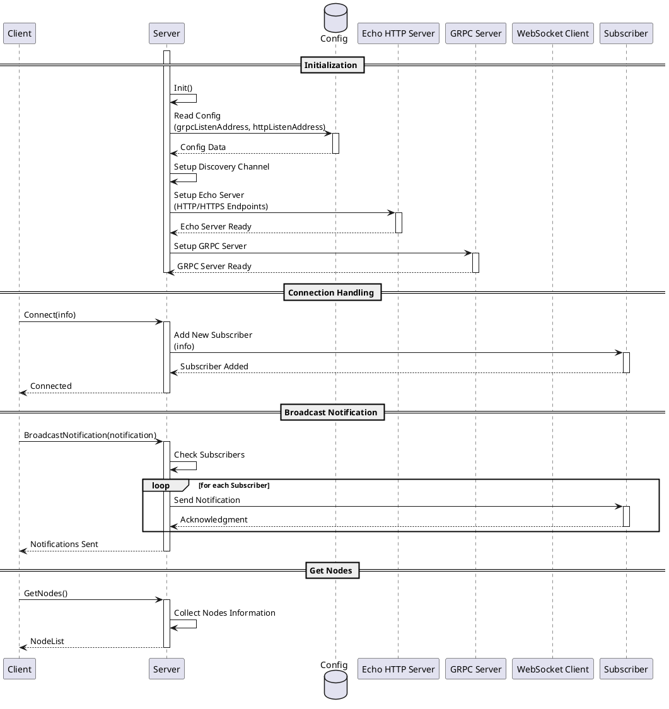
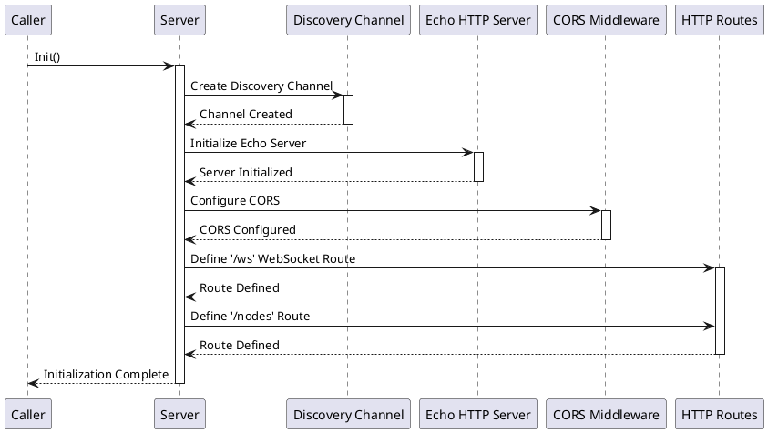
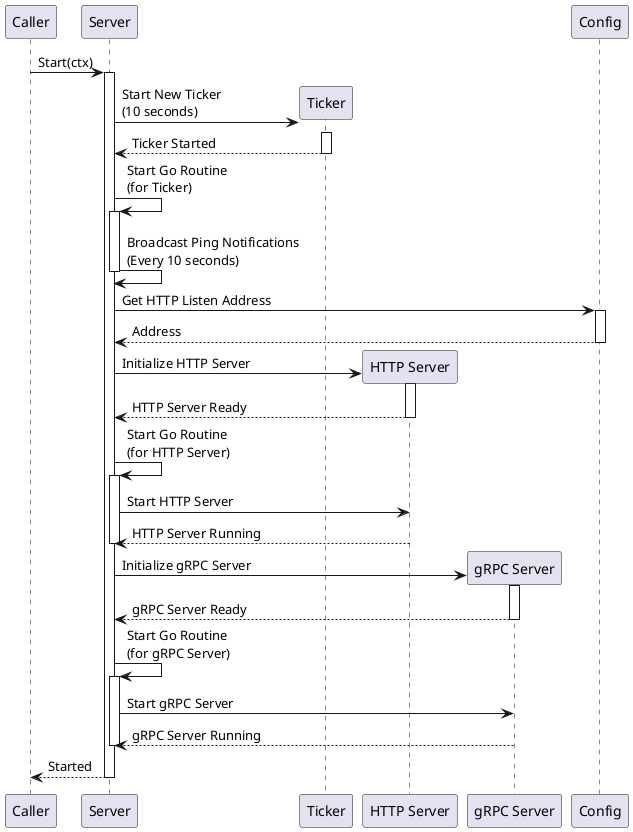
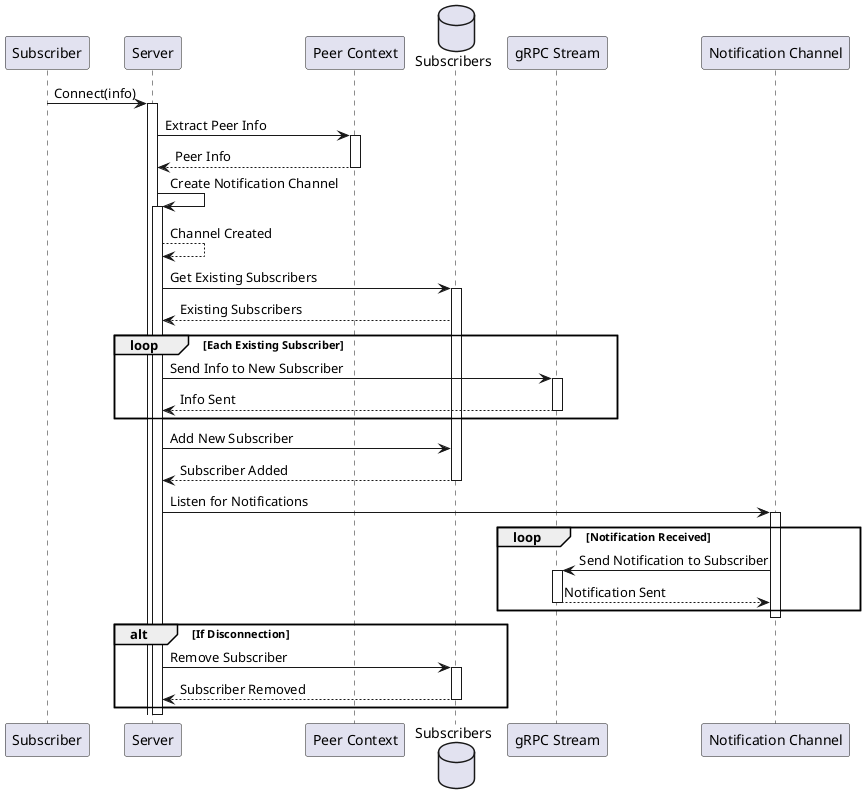
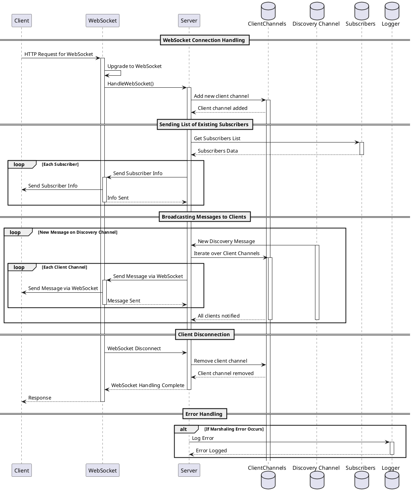
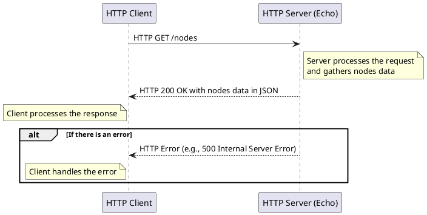
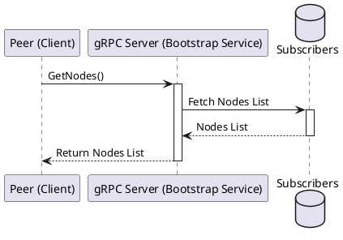
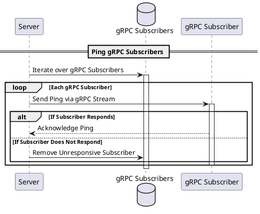
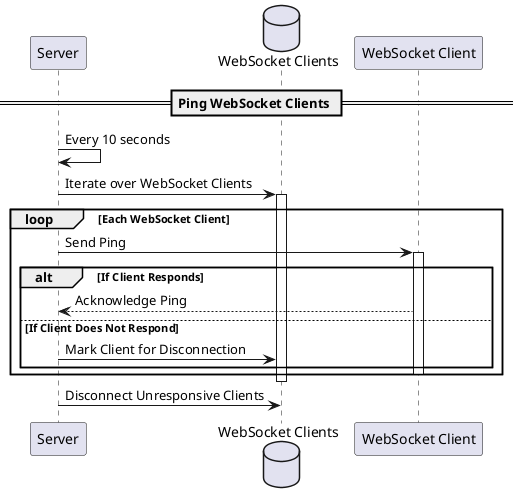

# 🌐 Bootstrap Service

## Index

1. [Description](#1-description)
2. [Functionality](#2-functionality)
- [2.1. Initialization](#21-initialization)
- [2.2. Starting the Service](#22-starting-the-service)
- [2.2. Connecting to the Bootstrap Service](#22-connecting-to-the-bootstrap-service)
    - [2.2.1. Connecting via gRPC](#221-connecting-via-grpc)
    - [2.2.2. Connecting via WebSocket](#222-connecting-via-websocket)
    - [2.3. Get Nodes](#23-get-nodes)
- [2.4. Broadcast Notifications ](#24-broadcast-notifications-)
- [2.5. Ping Notifications](#25-ping-notifications)
3. [Technology and specific Stores](#3-technology-and-specific-stores)
4. [Directory Structure and Main Files](#4-directory-structure-and-main-files)
5. [Running the Service Locally](#5-running-the-service-locally)
- [    How to run](#----how-to-run)


## 1. Description

The Bootstrap Service, helps microservices find peers within a UBSV network. It allows nodes to register themselves and be notified about other nodes' presence, serving as a discovery service.

The service manages a set of subscribers and broadcast notifications and keep-alives to them, to keep them updated about network participants.


---


---


---

## 2. Functionality

The high level process flow is as follows:



In summary:

1. **Initialization**: The server starts HTTP (GET and WebSocket) and gRPC servers. Clients can connect to gRPC (typically Go microservices) or the websocket (typically UI clients) to subscribe to notifications about network changes.
2. **Connection Handling**: When a client connects, it's added to the list of subscribers.
3. **Broadcast Notification**: When a peer is added or removed, a notification is sent to all subscribers.


Let's go through the different steps closely:


---


### 2.1. Initialization




The `Init` function of the `Server` struct in this `server.go` service is responsible for initializing the server, specifically setting up its internal mechanisms for discovery and communication.

1. **Create a Discovery Channel**:
    - `s.discoveryCh = make(chan *bootstrap_api.Notification, 10)`
    - The service creates a Go channel named `discoveryCh` within the server. This channel is used for sending and receiving notifications related to the bootstrap service. *** TODO - clarify what for ****
    - By default, the channel is buffered with a capacity of 10, meaning it can hold up to 10 notifications before blocking any senders.

2. **Set up the HTTP Server Using Echo Framework**:
    - The Echo framework is used for creating an HTTP server (`e := echo.New()`).
    - `e.HideBanner = true` and `e.HidePort = true` are configurations used to hide the default Echo start-up banner and port information in the log.
    - CORS (Cross-Origin Resource Sharing) middleware is configured to allow requests from all origins and to accept only GET methods. This is important for ensuring that the server can handle requests from different domains, a requirement in a blockchain distributed systems.

3. **Define HTTP Endpoints**:
    - Two HTTP routes are defined using Echo's routing methods:
        - `e.GET("/ws", s.HandleWebSocket())`: Sets up a route for WebSocket connections. ** TODO - Whatever for ?? **
        - `e.GET("/nodes", func(c echo.Context) error {...})`: Defines a route to retrieve a list of nodes (subscribers). This route gathers information about each node, sorts them by their connection time, and returns the sorted list as a JSON response.


---


### 2.2. Starting the Service

After the initialisation, the service operations are started:



The `Start` function in the `Server` struct is a method written in Go that initiates the server's operations.

1. **Starting a Ticker for Periodic Tasks**:
   - `ticker := time.NewTicker(10 * time.Second)` creates a new ticker that triggers every 10 seconds. This is used to periodically trigger ping notifications.

2. **Goroutine for Periodic Notifications and Cleanup**:
   - A goroutine (a lightweight thread) is started to listen for two types of events:
      - `ctx.Done()`: When the server's context is canceled or expires, the gRPC server and all subscriber channels are closed.
      - `ticker.C`: This case is triggered by the ticker every 10 seconds. The server broadcasts a "ping" notification to all subscribers. **TODO - how? Websocket? **

3. **Setting up and Running HTTP Server**:
   - A dedicated goroutine is initiated to start the HTTP server (created in the Initialisation phase) and manage its lifecycle. The server configuration settings are checked to determine whether it should run over HTTP or HTTPS.

4. **Starting gRPC Server**:
   - We initiate a gRPC server (`util.StartGRPCServer` and `bootstrap_api.RegisterBootstrapAPIServer(server, s)`).
   - The server will listen to gRPC notifications from other UBSV nodes, with the following types:
     - `Type_ADD` - new nodes join the network, and announce themselves to the server, for inclusion in the list of nodes.
     - `Type_REMOVE` - nodes notify they are leaving the network, and should be removed from the list of nodes.
     - `Type_PING` - nodes notify they are still alive, and should be kept in the list of nodes.


---


### 2.2. Connecting to the Bootstrap Service

Clients can either connect by either gRPC or the WebSocket interface. Notifications will be received by all clients, independently of how they connected.

#### 2.2.1. Connecting via gRPC

The `Connect` function in the `Server` struct handles subscriptions to the server's notification service.



1. **Extract Peer Information**:
   - `p, _ := peer.FromContext(stream.Context())`: Extracts peer information from the gRPC stream's context. This retrieves the IP address of the connecting peer.

2. **Create Notification Channel**:
   - `ch := make(chan *bootstrap_api.Notification)`: Creates a channel for sending notifications to this specific subscriber.

3. **Send Existing Subscribers to New Subscriber**:
   - The server iterates over all existing subscribers and sends their information to the new subscriber via the gRPC stream.

4. **Broadcast New Subscriber to Existing Subscribers**:
   - `s.BroadcastNotification(...)`: Notifies all existing subscribers about the new peer.

5. **Add New Subscriber**:
   - Adds the new subscriber's channel to the `subscribers` map, which tracks all active subscriptions.

6. **Cleanup on Disconnection**:
   - The `defer` block ensures that when the subscriber disconnects (when the gRPC stream context is done), the subscriber is removed from the `subscribers` map, and the notification channel is closed.
   - Additionally, it broadcasts a notification to all remaining subscribers that this subscriber has been removed.

7. **Listen for Notifications and Send Them to Subscriber**:
   - An infinite loop listens for two types of events:
      - The gRPC stream context being done, in which case the function returns.
      - Notifications received on the subscriber's channel (`ch`), which are then sent to the subscriber via the gRPC stream.

#### 2.2.2. Connecting via WebSocket

The `HandleWebSocket` function in the `Server` struct (see `HandleWebsocket.go`) handles WebSocket connections to the server.




The described Go code is part of the `HandleWebSocket` function in the `Server` struct. It handles WebSocket connections to the server.

- A **WebSocket** provides a full-duplex communication channel over a single long-lived TCP connection. It's commonly used in web applications to allow real-time, bidirectional communication between the client (usually a web browser or a mobile app) and the server.


- **Channels** are used for managing and broadcasting messages to connected WebSocket clients. Channels are a Go feature used for communication between goroutines (concurrent functions). They provide a way to send and receive values between goroutines, effectively allowing these separate execution threads to synchronize or pass data. The following channels are used by the Websocket component:
  - `newClientCh` is a channel for registering new WebSocket connections (clients).
  - `deadClientCh` is a channel for handling disconnected or inactive clients.
  - `clientChannels` is a map where each entry is a channel associated with a connected client. This channel is used to send data to the client over the WebSocket connection.

The following steps describe the WebSocket connection handling process:
1. **Client Connection**: When a client connects, the HTTP request is upgraded to a WebSocket connection. A new channel is created for this client and added to `clientChannels`.

2. **Broadcasting Messages**: A separate goroutine listens for new messages on `s.discoveryCh`. When a new message arrives, it's marshaled into JSON and sent to all client channels in `clientChannels`. Each client channel represents a WebSocket connection, and sending data to this channel results in the message being sent over the WebSocket connection to the client.

3. **Client Disconnection**: If a client disconnects or an error occurs while sending a message, the client’s channel is sent to `deadClientCh`. The main goroutine removes this client from `clientChannels`, stopping further message broadcasts to this client.

4. **Real-Time Updates**: The WebSocket connections allow the server to push updates to clients in real time, and the use of channels facilitates managing these multiple connections and the flow of data.


---


#### 2.3. Get Nodes

Peers and unregistered HTTP clients can proactively request the list of nodes from the Bootstrap Service. This is done by a) sending an HTTP GET request to the `/nodes` endpoint, or b) sending a gRPC request to the Go `Server` `GetNodes` method.

##### 2.3.1. HTTP GET Request

An HTTP client can fetch the list of nodes via the `/nodes` endpoint. This is intended for generic HTTP clients, such as web browsers or command-line tools like `curl`. Notice how peers typically use the gRPC interface instead, and native Teranode clients use the WebSocket interface.



1. **HTTP Client Sends the Request**:
    - The client (which could be a web browser, a command-line tool like `curl`, or any HTTP client library in a software application) prepares an HTTP GET request for the `/nodes` endpoint.
    - The URL for the request is `http://[server-address]:[server-port]/nodes`, where `[server-address]` is the domain name or IP address of the server hosting the `bootstrap` service.
    - The client sends the HTTP GET request to the server. This request is routed to the `/nodes` endpoint as defined in the server's routing setup (using the Echo framework).


2. **Server Handles the Request**:
    - The Echo server receives the request and returns the list of nodes (as maintained in the `subscribers` map in the `Server` struct)
    - The server constructs a list of nodes, each containing information such as node IP addresses, connection status, names, and other relevant metadata.
    - The server serializes this nodes list into a JSON format.


##### 2.3.2. gRPC Request




---


### 2.4. Broadcast Notifications

In this section, we will look at how the Bootstrap Service sends notifications to its subscribers.

The `BroadcastNotification` function in the `Server` struct is responsible for broadcasting notifications to all subscribers.

```go
func (s *Server) BroadcastNotification(notification *bootstrap_api.Notification) {
	prometheusBroadcastNotification.Inc()
	defer func() {
		_ = recover()
	}()

	s.mu.RLock()
	defer s.mu.RUnlock()

	// Send the notification to the discovery channel for websocket client
	s.discoveryCh <- notification

	// Send the notification to all GRPC subscribers
	for ch := range s.subscribers {
		select {
		case ch <- notification:
		default:
			// If the channel is full, skip sending to this subscriber
		}
	}
}
```


Function behaviour:

* The function takes a `notification` object of type `bootstrap_api.Notification`, which contains the details of the notification to be broadcast, and does not return any value.

* There are three types of notifications: PING, ADD, and REMOVE, as defined in the `Type` enum.
  - **PING (0)**: Used to check the liveliness or presence of subscribers.
  - **ADD (1)**: Indicates the addition of a new node or subscriber to the system.
  - **REMOVE (2)**: Signifies the removal of a node or subscriber from the system.

* The function acquires a read lock on the server's state using a mutex (`s.mu`), later released (`defer s.mu.RUnlock()`). This is crucial for thread-safe access to the `s.subscribers` map.

* **Sending to Discovery Channel**: `s.discoveryCh <- notification`: The notification is sent to the `discoveryCh` channel. This channel is used to schedule notifications to the WebSocket clients.

* **Broadcasting to All GRPC Subscribers**:
    - The function iterates over `s.subscribers`, a map of channels, each corresponding to a connected subscriber.
    - For each subscriber, the function attempts to send the notification through their respective channel.
    - The `select` statement with a `default` case is used for non-blocking send operation on the channel. If the subscriber's channel is full (unable to receive more messages), the function skips sending the notification to that particular subscriber. This prevents the server from getting blocked on a single subscriber's channel.


---


### 2.5. Ping Notifications

The Bootstrap Service sends ping notifications to all subscribers every 10 seconds. This is done by the `Start` function in the `Server` struct, which starts a goroutine to listen for a ticker event every 10 seconds.

Both Websocket and gRPC clients receive these pings.

There is no action expected from the client upon receiving a ping. This procedure is useful for the server to assess the client's liveliness. If the client is not reachable, the server will remove them from the subscriber list and inform the remaining subscribers about this removal.

GRPC subscribers:



Websocket subscribers:




----


## 3. Technology and specific Stores


Key technologies involved:

1. **Go Programming Language (Golang)**:
    - A statically typed, compiled language known for its simplicity and efficiency, especially in concurrent operations and networked services.
    - The primary language used for implementing the service's logic.

2. **github.com/bitcoin-sv/ubsv/services/bootstrap/bootstrap_api** for Bitcoin SV bootstrap-related API functionalities.

3. **gRPC (Google Remote Procedure Call)**:
    - A high-performance, open-source framework developed by Google.
    - Used for inter-service communication, enabling the server to efficiently communicate with connected clients or nodes.
    - Supports features like streaming requests and responses and robust error handling.

4. **Protobuf (Protocol Buffers)**:
    - A language-neutral, platform-neutral, extensible mechanism for serializing structured data, developed by Google.
    - Used in conjunction with gRPC for defining service methods and message formats.

5. **HTTP/HTTPS Protocols**:
    - HTTP for transferring data over the web. HTTPS adds a layer of security with SSL/TLS encryption.
    - Used for communication between clients and the server, and for serving web pages or APIs.

6. **Echo Web Framework**:
    - A high-performance, extensible, minimalist Go web framework.
    - Used for handling HTTP requests and routing, including upgrading HTTP connections to WebSocket connections.
    - Library: github.com/labstack/echo

7. **WebSocket Protocol**:
    - A TCP-based protocol that provides full-duplex communication channels over a single connection.
    - Used for real-time data transfer between clients and the server, particularly useful for continuously updating the state of the network to connected clients.
    - Library: github.com/gorilla/websocket

8. **JSON (JavaScript Object Notation)**:
    - A lightweight data-interchange format, easy for humans to read and write, and easy for machines to parse and generate.
    - Used for structuring data sent to and from clients, especially in contexts where WebSocket or HTTP is used.

9. **Prometheus Monitoring**:
    - An open-source monitoring and alerting toolkit.
    - Used for recording real-time metrics in a time series database, allowing for observability and operational insight into the service's performance.

---

## 4. Directory Structure and Main Files


```
Bootstrap Service Directory Structure
├── Client.go
├── HandleWebsocket.go
├── Server.go
├── bootstrap.md
├── bootstrap_api
│   ├── bootstrap_api.pb.go
│   ├── bootstrap_api.proto
│   └── bootstrap_api_grpc.pb.go
└── metrics.go
```

1. **Client.go**:
    - Contains the implementation of the client-side logic for interacting with the Bootstrap service.

2. **HandleWebsocket.go**:
    - This file is responsible for handling WebSocket connections.

3. **Server.go**:
    - Contains the main server-side logic for the Bootstrap service.

4. **bootstrap_api** (Directory):
    - Contains files related to the API definition and implementation for the Bootstrap service.

    - **bootstrap_api.pb.go**:
        - Auto-generated Go file based on the `.proto` file.
        - Contains the code for Protocol Buffers serialization and deserialization.

    - **bootstrap_api.proto**:
        - The Protocol Buffers (protobuf) definition file for the Bootstrap service's API.
        - Defines the structure of the API requests, responses, and data models.

    - **bootstrap_api_grpc.pb.go**:
        - Auto-generated Go file that contains gRPC specific code.
        - Includes the implementation of the gRPC server and client interfaces as defined in the `.proto` file.

5. **metrics.go**:
    - Deals with the collection and management of metrics for the Bootstrap service.
    - Includes functions for monitoring performance, tracking usage statistics, and integrating with monitoring tools like Prometheus.


## 5. Running the Service Locally


###     How to run

To run the Bootstrap Service locally, you can execute the following command:

```shell
SETTINGS_CONTEXT=dev.[YOUR_USERNAME] go run -Bootstrap=1
```

Please refer to the [Locally Running Services Documentation](../locallyRunningServices.md) document for more information on running the Bootstrap Service locally.


## TO CLARIFY


-- Questions for Simon -
-- So this is for microservices to find each other? No exchange of info other than IPs?
-- Why only BlobServer uses it?
