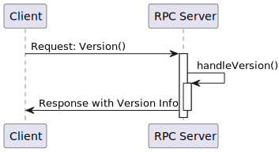
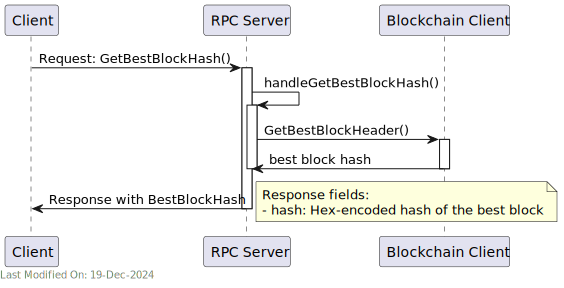
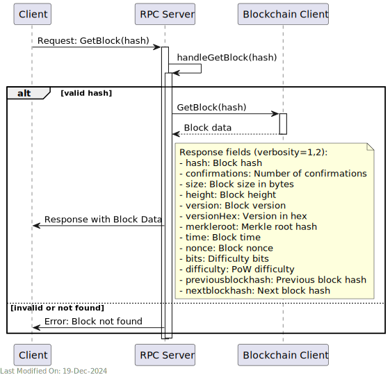
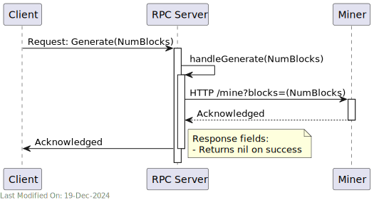
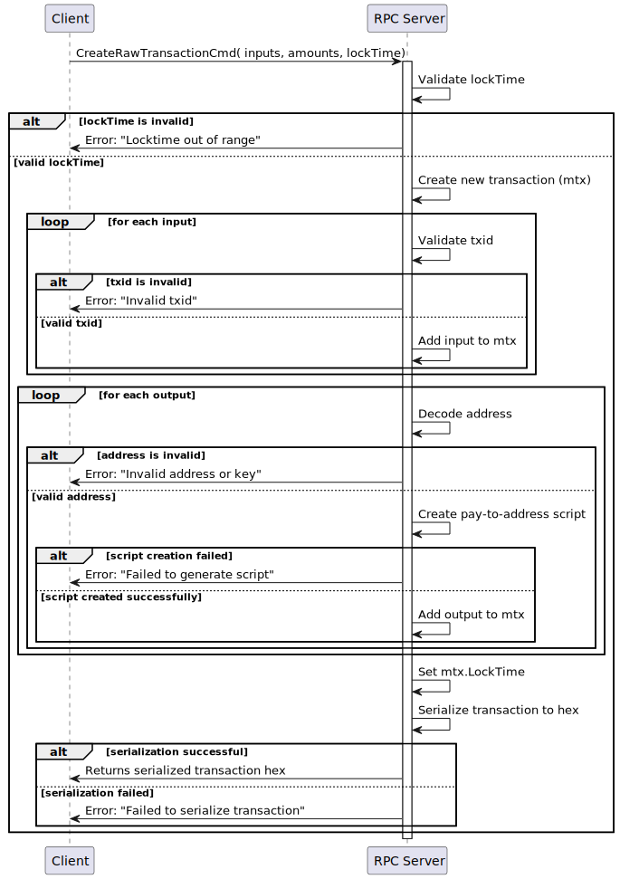
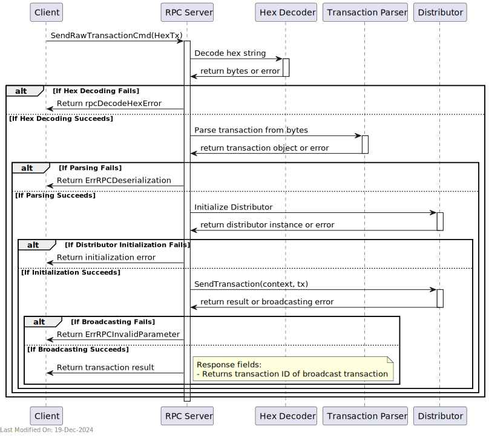

#  🌐 RPC Server

## Index

1. [Introduction](#1-introduction)
- [Supported RPC Commands](#supported-rpc-commands)
- [Unimplemented RPC Commands](#unimplemented-rpc-commands)
- [Command help](#command-help)
- [Authentication](#authentication)
2. [Architecture](#2-architecture)
3. [Functionality](#3-functionality)
- [3.1. RPC Server Initialization and Configuration](#31-rpc-server-initialization-and-configuration)
- [3.2. Command Request Version](#32-command---request-version)
- [3.3. Command Get Best Block Hash](#33-command---get-best-block-hash)
- [3.4. Command Get Block](#34-command---get-block)
- [3.5. Command Generate](#35-command---generate)
- [3.6. Command Create Raw Transaction](#36-command---create-raw-transaction)
  - [Input Parameters:](#input-parameters)
  - [Steps:](#steps)
  - [Outputs:](#outputs)
- [3.7. Command Send Raw Transaction](#37-command---send-raw-transaction)
  - [Function Overview](#function-overview)
  - [Process Flow](#process-flow)
4. [Technology](#4-technology)
5. [Directory Structure and Main Files](#5-directory-structure-and-main-files)
6. [Settings](#6-settings)
- [Core Settings from `gocore` Configuration:](#core-settings-from-gocore-configuration)
- [Usage of Settings:](#usage-of-settings)
7. [How to run](#7-how-to-run)


## 1. Introduction

The RPC server provides compatibility with the Bitcoin RPC interface, allowing clients to interact with the Teranode node using standard Bitcoin RPC commands. The RPC server listens for incoming requests and processes them, returning the appropriate responses.

Teranode provides partial support, as required for its own services. Additional support for specific commands and features might be added over time.

The below table summarises the services supported in the current version:

### Supported RPC Commands


| RPC Command           | Status     |
|-----------------------|------------|
| createrawtransaction  | Supported  |
| generate              | Supported  |
| getbestblockhash      | Supported  |
| getblock              | Supported  |
| sendrawtransaction    | Supported  |
| stop                  | Supported  |
| version               | Supported  |
| getminingcandidate    | Supported  |
| submitminingsolution  | Supported  |

### Unimplemented RPC Commands

| RPC Command             | Status       |
|-------------------------|--------------|
| addnode                 | Unimplemented|
| debuglevel              | Unimplemented|
| decoderawtransaction    | Unimplemented|
| decodescript            | Unimplemented|
| estimatefee             | Unimplemented|
| generate                | Unimplemented|
| getaddednodeinfo        | Unimplemented|
| getbestblock            | Unimplemented|
| getblockchaininfo       | Unimplemented|
| getblockcount           | Unimplemented|
| getblockhash            | Unimplemented|
| getblockheader          | Unimplemented|
| getblocktemplate        | Unimplemented|
| getcfilter              | Unimplemented|
| getcfilterheader        | Unimplemented|
| getconnectioncount      | Unimplemented|
| getcurrentnet           | Unimplemented|
| getdifficulty           | Unimplemented|
| getgenerate             | Unimplemented|
| gethashespersec         | Unimplemented|
| getheaders              | Unimplemented|
| getinfo                 | Unimplemented|
| getmempoolinfo          | Unimplemented|
| getmininginfo           | Unimplemented|
| getnettotals            | Unimplemented|
| getnetworkhashps        | Unimplemented|
| getpeerinfo             | Unimplemented|
| getrawmempool           | Unimplemented|
| getrawtransaction       | Unimplemented|
| gettxout                | Unimplemented|
| gettxoutproof           | Unimplemented|
| help                    | Unimplemented|
| node                    | Unimplemented|
| ping                    | Unimplemented|
| reconsiderblock         | Unimplemented|
| searchrawtransactions   | Unimplemented|
| setgenerate             | Unimplemented|
| submitblock             | Unimplemented|
| uptime                  | Unimplemented|
| validateaddress         | Unimplemented|
| verifychain             | Unimplemented|
| verifymessage           | Unimplemented|
| verifytxoutproof        | Unimplemented|


### Command help

A description of the commands can be found in the `rpcserverhelp.go` file in the `bsvd` repository:
https://github.com/bitcoinsv/bsvd/blob/master/rpcserverhelp.go

Teranode RPC server is designed to be compatible with the Bitcoin RPC interface, as implemented in the `bsvd` repository.

### Authentication

All RPC commands require a valid username and password for authentication. The server listens on a specified port for incoming requests and processes them accordingly. The server could be opened up only for local (within the node) access, or it could be exposed to the public internet, depending on the deployment requirements. In either case, authentication is required to access the RPC server.


## 2. Architecture


The RPC server is a standalone service that listens for incoming requests and processes them based on the command type. The server starts by initializing the HTTP server and setting up the necessary configurations.
It then listens for incoming requests and routes them to the appropriate handler based on the command type. The handler processes the request, executes the command, and returns the response to the client.

In order to serve some of the requests, the RPC server interacts with the Teranode core services to fetch the required data.
For example, when a `getblock` command is received, the server interacts with the blockchain service to fetch the block data.
Also, when a `generate` command is received, the server interacts with the miner service to generate the requested number of blocks.


## 3. Functionality


### 3.1. RPC Server Initialization and Configuration

### 3.2. Command - Request Version

The `version` command is used to retrieve the version information of the RPC server. The RPC server processes this command by constructing a response with the server version information and returning it to the client.



### 3.3. Command - Get Best Block Hash

The `getbestblockhash` command is used to retrieve the hash of the best (most recent) block on the blockchain. The RPC server processes this command by interacting with the blockchain service to fetch the hash of the best block.




### 3.4. Command - Get Block

The `getblock` command is used to retrieve information about a specific block on the blockchain. The RPC server processes this command by interacting with the blockchain service to fetch the block data based on the provided block hash.




### 3.5. Command - Generate

The `generate` command is used to generate a specified number of blocks on the blockchain. The RPC server processes this command by interacting with the blockchain service to create the requested number of blocks.

This command is commonly used in testing and development environments to artificially advance the blockchain by generating blocks immediately, rather than waiting for them to be mined in the usual way.





The function accepts a `GenerateCmd` which contains the number of blocks to generate, and sends an HTTP GET request to the miner's URL (e.g. `http://localhost:${MINER_HTTP_PORT}/mine?blocks=${numberOfBlocksToGenerate}`) to trigger block generation.


- **Example Use**:

```go
// Sample usage within an RPC server setup
command := &btcjson.GenerateCmd{NumBlocks: 10}
result, err := handleGenerate(rpcServerInstance, command, closeChannel)
if err != nil {
    log.Fatalf("Failed to generate blocks: %v", err)
}
```


- **Settings**: It requires a valid `MINER_HTTP_PORT` setting.


- **Considerations:**
  - This function should not be exposed in production environments as it allows the generation of blocks outside of the normal consensus rules, which can be exploited or lead to unintended forks if used maliciously.
  - Ensure the miner service is secured and only accessible by the RPC server to prevent unauthorized block generation.


### 3.6. Command - Create Raw Transaction

The `createrawtransaction` RPC method is used in Bitcoin to manually create a raw transaction. This transaction is not broadcast to the network but returned as a hex-encoded string. The created transaction could then be further modified, signed, and eventually broadcast using other RPC commands.

The CreateRawTransaction method constructs a transaction that spends a given set of inputs and sends the outputs to specified addresses. It requires specific parameters about the inputs (which UTXOs to spend) and outputs (where to send the coins).



#### Input Parameters:
- **Inputs**: A list of transaction inputs including the transaction ID (`txid`), output index (`vout`), and a sequence number if applicable.
- **Amounts**: A dictionary where each key is a Bitcoin address and the value is the amount of bitcoin to send to that address.
- **LockTime** (optional): Specifies the earliest time or block number that this transaction can be included in the blockchain.

#### Steps:
1. **Validate LockTime**: Checks if the provided `LockTime` is within the valid range.


2. **Create Transaction**: Initializes a new transaction (`mtx`).


3. **Process Inputs**:
  - For each input, it validates the transaction ID and constructs the transaction input structure.
  - If a `LockTime` is set and not zero, it adjusts the sequence number to allow for the lock time to be effective.


4. **Process Outputs**:
  - Validates the amount for each output to ensure it's within the valid monetary range.
  - Validates each output address, ensuring it's a supported type and appropriate for the network.
  - Creates a payment script for each address and constructs the transaction output.


5. **Set Transaction LockTime**: If provided, sets the transaction's lock time.


6. **Serialize Transaction**: Converts the transaction to a hex-encoded string for output.

#### Outputs:
- **Success**: Returns a hex-encoded string representing the raw transaction.
- **Error**: Returns an error if there are issues with the inputs, outputs, lock time, address decoding, or serialization.


### 3.7. Command - Send Raw Transaction

The `sendrawtransaction` RPC command in Bitcoin RPC is used to submit a pre-signed raw transaction to the network. This command broadcasts the raw transaction hex to the connected nodes in the blockchain network for inclusion in a block.


#### Function Overview

- **Purpose**: To submit a raw, serialized, and hex-encoded transaction to the blockchain network.
- **Parameters**:
  - `cmd`: Contains the raw transaction data and any command-specific parameters.
  - `closeChan`: A channel that signals the function to close and stop processing, used for graceful shutdowns and interruption handling.
- **Return Value**:
  - On success: Returns a result (e.g., transaction ID or confirmation message) indicating that the transaction was successfully broadcast.
  - On failure: Returns an error detailing why the transaction could not be processed or broadcast.

#### Process Flow



1. **Input Parsing**:
  - The function receives a command (`btcjson.SendRawTransactionCmd`) which includes the hex-encoded string of the transaction.
  - It checks if the hexadecimal string has an odd length and prepends a "0" if necessary to ensure correct decoding.

2. **Hex Decoding**:
  - Attempts to decode the hexadecimal string into bytes.
  - If decoding fails, it returns an error using `rpcDecodeHexError`, indicating the hex string was malformed.

3. **Transaction Deserialization**:
  - Attempts to construct a transaction object from the decoded bytes using a transaction parsing library (assumed to be `bt.NewTxFromBytes`).
  - If the transaction cannot be parsed, it returns an error stating the transaction is deserializable, indicating structural issues with the transaction data.

4. **Transaction Distribution Setup**:
  - Initializes a `Distributor` object responsible for handling the broadcasting of transactions to the Propagation servers.
  - If the distributor cannot be created (due to configuration errors, connection issues, etc.), it returns an initialization error.

5. **Transaction Broadcasting**:
  - Calls a method (`d.SendTransaction`) on the distributor to send the transaction to the network.
  - This method likely involves network operations, where the transaction is relayed to peers or a blockchain node.
  - If broadcasting fails, it returns an error indicating that the transaction was rejected along with a message detailing the reason (e.g., network errors, validation failures on the network side).

6. **Success Response**:
  - If the transaction is successfully broadcast, the function returns a success response, which might include the transaction ID or a success message.


## 4. Technology

### **HTTP Server and RESTful API**
- **Usage**: In `Server.go`, an HTTP server is set up to listen for requests and send responses.
- **Functionality**: Handling HTTP requests and responses, as well as routing, middleware support.

### **Authentication and Security**
- **Basic Authentication**: Handling basic HTTP authentication to secure server access.


## 5. Directory Structure and Main Files


The RPC service is located in the `services/rpc` directory. The main files and directories are as follows:

```
./servers/rpc
├── Server.go          # Main server application file: Initializes and runs the server, sets up configurations, and handles lifecycle events.
└── handlers.go        # Request handlers: Defines functions that process incoming requests based on type and content.
```


## 6. Settings

### Core Settings from `gocore` Configuration:
1. **rpc_user**: Username for RPC authentication. It is used as part of the HTTP Basic Auth.
2. **rpc_pass**: Password for RPC authentication, paired with `rpc_user`.
3. **rpc_limit_user**: A secondary, restricted-access user for the RPC server.
4. **rpc_limit_pass**: Password for the restricted-access user.
5. **rpc_max_clients**: Maximum number of simultaneous RPC clients allowed to connect to the server. Default is 1 if not set.
6. **rpc_quirks**: Boolean setting to enable or disable quirks mode, which may allow non-standard behavior for broader client compatibility. It defaults to `true` if not set.
7. **rpc_listener_url**: URL or network address the RPC server listens on. This is critical for initializing the server's network listener.

### Usage of Settings:
- **Authentication**: The `rpc_user` and `rpc_pass` are used to construct the full HTTP Basic Auth string. Similarly, `rpc_limit_user` and `rpc_limit_pass` are used for a limited access user which might have restrictions on the types of commands that can be executed.
- **Connection Management**: `rpc_max_clients` is used to prevent server overload by limiting the number of active connections.
- **Server Configuration**: `rpc_listener_url` is essential for binding the server to the correct network interface and port.
- **Behavior Customization**: `rpc_quirks` allows the server to handle client requests in a manner that might not strictly adhere to the standard, for compatibility with older or non-standard clients.


## 7. How to run


To run the RPC Service locally, you can execute the following command:

```shell
SETTINGS_CONTEXT=dev.[YOUR_USERNAME] go run -rpc=1
```

Please refer to the [Locally Running Services Documentation](../locallyRunningServices.md) document for more information on running the RPC Service locally.
