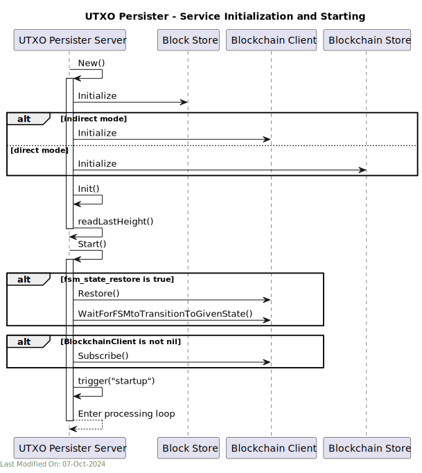
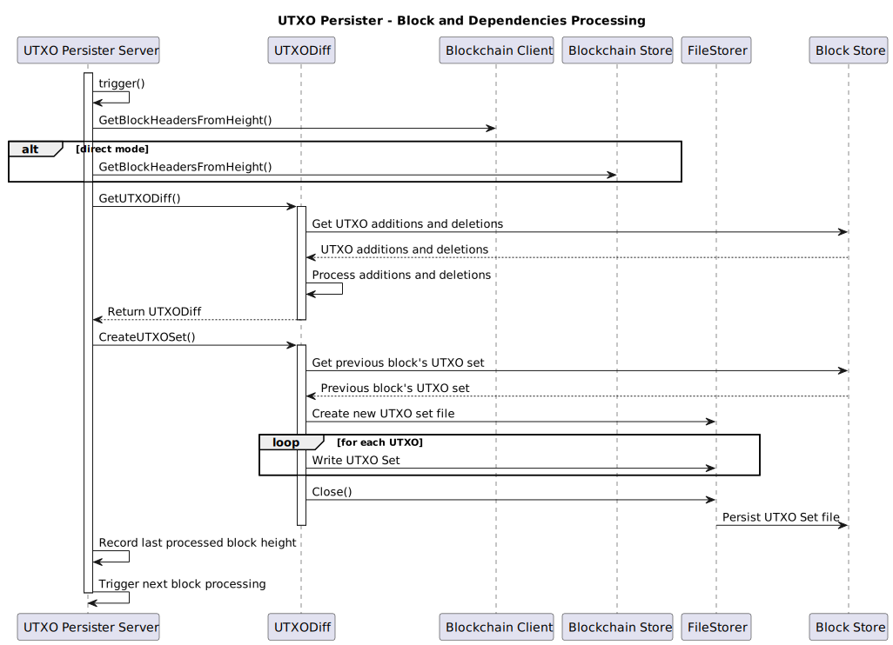

# 🔍 UTXO Persister Service

## Index

1. [Description](#1-description)
2. [Functionality](#2-functionality)
- [2.1 Service Initialization](#21-service-initialization)
- [2.2 Receiving and Processing a new Block Notification](#22-receiving-and-processing-a-new-block-notification)
3. [Data Model](#3-data-model)
4. [Technology](#4-technology)
5. [Directory Structure and Main Files](#5-directory-structure-and-main-files)
6. [How to run](#6-how-to-run)
7. [Configuration options (settings flags)](#7-configuration-options-settings-flags)

## 1. Description

The UTXO Persister primary function is to create and maintain an up-to-date Unspent Transaction Output (UTXO) file set for each block in the blockchain.

To achieve its target, the UTXO Persister uses the output of the Block Persister service, and outputs an updated UTXO set file.

The UTXO set file can be exported and used as an input for initializing the UTXO store in a new Teranode instance.

1. Input Processing:
    - The UTXO Persister works with the output of the Block Persister, which includes:
        - `utxo-additions`: New UTXOs created in a block,
        - `utxo-deletions`: UTXOs spent in a block,
        - `.block`: The block data,
        - `.subtree`: Subtree information for the block.

2. UTXO Set Generation:
    - For each new block fileset detected, the UTXO Persister creates a 'utxo-set' file.
    - This file represents the complete set of unspent transaction outputs up to and including the current block.

3. File Monitoring and Processing:
    - The service continuously monitors the shared storage for new .block files and additional related files.
    - When new files are detected, it triggers the UTXO set creation process.

4. Progress Tracking:
    - The service maintains a `lastProcessed.dat` file to keep track of the last block height processed.
    - This ensures continuity and allows the service to resume from the correct point after restarts or interruptions.

5. Efficient Data Handling:
    - The service uses optimized data structures and file formats to handle large volumes of UTXO data efficiently.
    - It implements binary encoding for UTXOs and UTXO deletions to minimize storage requirements and improve processing speed.

6. File Management:
    - The service interacts with the storage system to read and write necessary files.


The service interacts with the storage system to read and write necessary files (shared with the Block Persister service), and requests block information from the Blockchain service (or, optionally, directly from the Blockchain store)


## 2. Functionality

### 2.1 Service Initialization




1. The service starts by creating connections to:

   - A blob store (shared with the block persister) for file storage
   - Either the Blockchain service or the Blockchain store for block information


2. It reads the last processed height from `lastProcessed.dat`.

3. The service then enters a loop, waiting for new blocks to process.


### 2.2 Receiving and Processing a new UTXO Set



### 2.2 Processing Blocks and Creating UTXO Sets

The UTXO Persister processes blocks and creates UTXO sets as follows:

1) **Trigger and Block Height Check**:
   - The service is triggered to process the next block (via notification, timer, or startup).
   - It checks if the next block to process is at least 100 blocks behind the current best block height.

2) **Block Headers Retrieval**:
   - If processing is needed, the service retrieves block headers from either the Blockchain Store or Blockchain Client.
   - It verifies the chain continuity using these headers.

3) **Last Set Verification**:
   - The service verifies the last UTXO set using `verifyLastSet()` to ensure data integrity.

4) **Block Range Consolidation**:
   - A new Consolidator is created to process a range of blocks efficiently.
   - The `ConsolidateBlockRange()` method is called to handle multiple blocks at once if needed.

5) **UTXO Set Preparation**:
   - The service calls `GetUTXOSetWithDeletionsMap()` to prepare the UTXO set for the new block.
   - This retrieves the UTXO deletions from the Block Store and creates a deletions map.

6) **UTXO Set Creation**:
   - The `CreateUTXOSet()` method is called on the UTXOSet object.
   - This method:
      - Retrieves the previous block's UTXO set from the Block Store.
      - Applies the deletions from the deletions map.
      - Incorporates new UTXOs from the block's transactions.
      - Writes the new UTXO set to the Block Store.

7) **Cleanup**:
   - If not skipped (based on configuration), the service deletes the previous block's UTXO set to save space.

8) **Update Last Processed Height**:
   - The service calls `writeLastHeight()` to update its record of the last processed block height.

9) **Trigger Next Block Processing**:
   - The service initiates the processing of the next block, continuing the cycle.

If the current height is less than 100 blocks behind the best block height, the service waits for more confirmations before processing.


## 3. Data Model


1. **Basic Structure:**
   The UTXO set is essentially a collection of all unspent transaction outputs in the blockchain up to a specific block height. Each UTXO represents a piece of cryptocurrency that can be spent in future transactions.


2. **UTXO Components:**
   The UTXOs are stored in a hierarchical structure, with the following components:

**UTXOWrapper**:
   ```go
   type UTXOWrapper struct {
       TxID     chainhash.Hash
       Height   uint32
       Coinbase bool
       UTXOs    []*UTXO
   }
   ```
**UTXO**:
   ```go
   type UTXO struct {
       Index  uint32
       Value  uint64
       Script []byte
   }
   ```


- **TxID**: The transaction ID where this UTXO was created (32 bytes)
- **Index**: The output index in the transaction (4 bytes)
- **Value**: The amount of cryptocurrency in this UTXO (8 bytes)
- **Height**: The block height where this UTXO was created (4 bytes)
- **Script**: The locking script that must be satisfied to spend this UTXO (variable length)
- **Coinbase**: A flag indicating whether this UTXO is from a coinbase transaction (1 bit, packed with Height)


3. **Binary Encoding:**
   The UTXO is encoded into a binary format for efficient storage and retrieval:
   - 32 bytes: TxID
   - 4 bytes: Index (little-endian)
   - 8 bytes: Value (little-endian)
   - 4 bytes: Height and Coinbase flag (Height << 1 | CoinbaseFlag)
   - 4 bytes: Script length (little-endian)
   - Variable bytes: Script


4. **UTXO Set File**:
   The UTXO set for each block is stored in a file with the extension `utxo-set`. This file contains a series of encoded UTXOs representing all unspent outputs up to that block.


5. **UTXO Diff**:
   The UTXO Persister uses a diff-based approach to update the UTXO set:
   - `utxo-additions`: New UTXOs created in a block
   - `utxo-deletions`: UTXOs spent in a block


6. **UTXO Deletion Model**:
   When a UTXO is spent, it's recorded in the `utxo-deletions` file. The deletion record contains:
   - TxID (32 bytes)
   - Index (4 bytes)


7. **Set Operations**:
   - Creating a new UTXO set involves:
      1. Starting with the previous block's UTXO set
      2. Removing UTXOs listed in the current block's `utxo-deletions`
      3. Adding UTXOs listed in the current block's `utxo-additions`


8. **Persistence:**
   The UTXO set is persisted using a _FileStorer_, which writes the data to a blob store.


## 4. Technology


1. **Programming Language:**
   - Go (Golang): The entire service is written in Go.


2. **Blockchain-specific Libraries:**
   - github.com/libsv/go-bt/v2: A Bitcoin SV library for Go, used for handling Bitcoin transactions and blocks.
   - github.com/bitcoin-sv/ubsv: Custom package for Bitcoin SV operations (likely an internal library).


3. **Storage:**
   - Blob Store: Used for reading block data, subtrees, and UTXO diff files, and for writing UTXO Set files.


4. **Configuration Management:**
   - github.com/ordishs/gocore: Used for configuration management (e.g., reading config values).


## 5. Directory Structure and Main Files

The Block Persister service is located in the `services/utxopersister` directory.

```
./services/utxopersister/
│
├── Server.go
│   Main implementation of the UTXO Persister server. It contains the core logic for
│   initializing the service, handling requests, and coordinating UTXO set updates.
│
├── UTXO.go
│   Defines the UTXO (Unspent Transaction Output) data structure and related methods.
│
├── UTXOSet.go
│   Implements the UTXOSet structure and related methods.
│
├── UTXODeletion.go
│   Implements the logic for UTXO deletions, which occur when UTXOs are spent in a transaction.
|
└── filestorer/
    │
    └── FileStorer.go
        Implements a custom file storage mechanism, optimized for the specific
        needs of storing and retrieving UTXO data efficiently.
```

## 6. How to run

To run the UTXO Persister Service locally, you can execute the following command:

```shell
SETTINGS_CONTEXT=dev.[YOUR_USERNAME] go run -UTXOPersister=1
```

Please refer to the [Locally Running Services Documentation](../locallyRunningServices.md) document for more information on running the UTXO Persister Service locally.


## 7. Configuration options (settings flags)

The `utxopersister` service utilizes specific `gocore` settings for configuration, each serving a distinct purpose in the service's operation:

- `network`: Specifies the blockchain network (e.g., "mainnet").
- `fsm_state_restore`: Boolean flag to indicate if the service should restore from a specific state.
- `skip_delete`: Boolean flag to control whether previous block's UTXOSet should be deleted.
- `utxoPersister_buffer_size`: Specifies the buffer size for readers (default "4KB").
