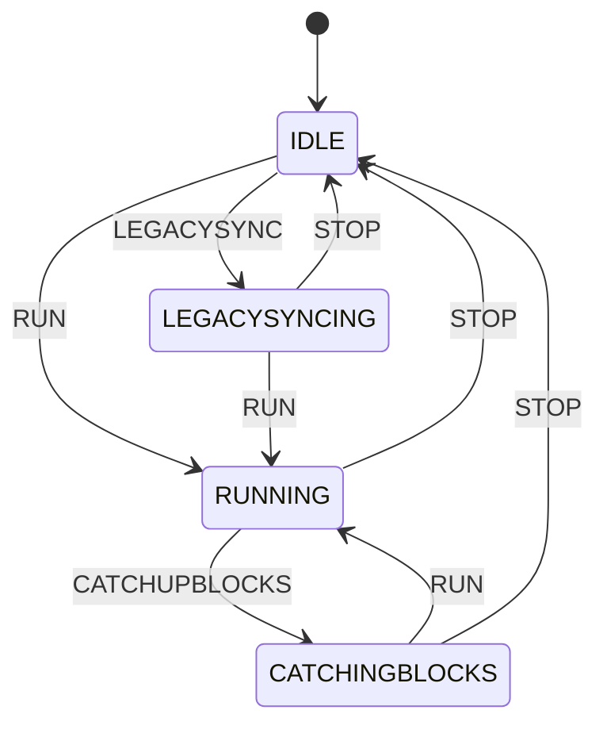

# State Machine

The mermaid diagram outlined below represents the various states and events that dictate the functionality of the node. To create and visualize the state machine diagram, you can use https://mermaid.live/. This tool allows you to generate the diagram visualization interactively.

