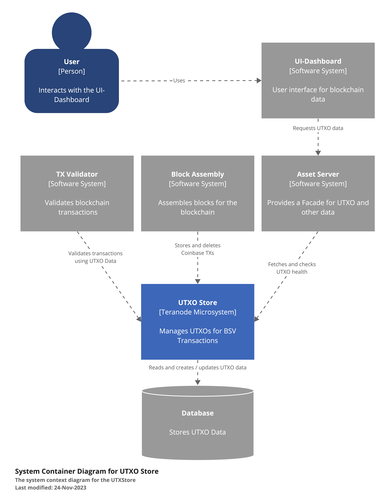
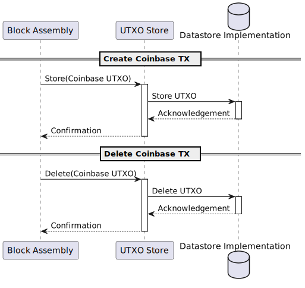
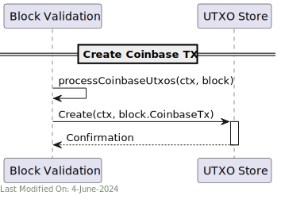
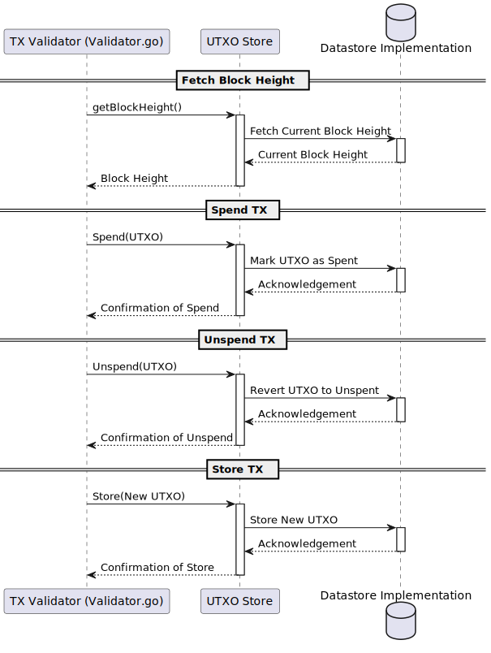
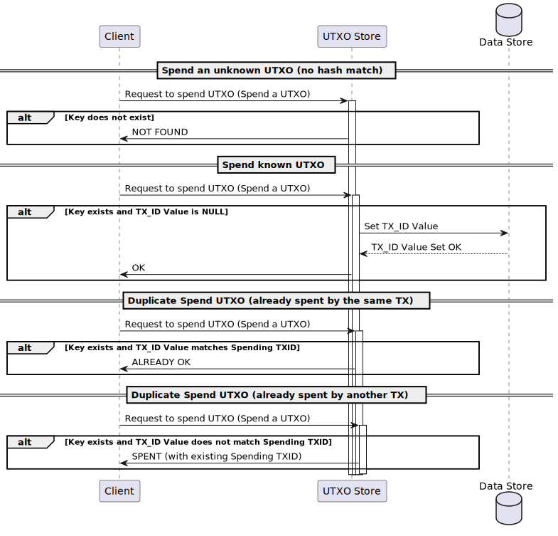
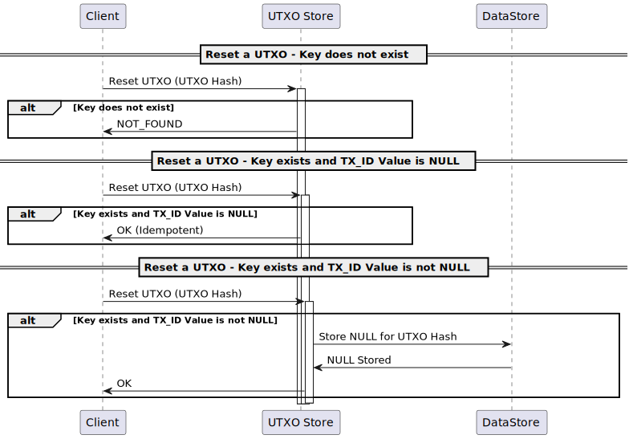

# 🗃️ UTXO Store

## Index

1. [Description](#1-description)
2. [Architecture](#2-architecture)
3. [UTXO - Data Model](#3-utxo---data-model)
- [2.1. What is an UTXO?](#21-what-is-an-utxo)
   - [3.2. How are UTXOs stored?](#32-how-are-utxos-stored)
   - [3.3. UTXO Meta Data](#33-utxo-meta-data)
4. [Use Cases](#4-use-cases)
- [4.1. Asset Server:](#41-asset-server)
- [4.2. Block Persister ](#42-block-persister-)
- [4.3. Block Assembly](#43-block-assembly)
- [4.4. Block Validation ](#44-block-validation-)
- [4.5. Subtree Validation](#45-subtree-validation)
- [4.6. Transaction Validator](#46-transaction-validator)
5. [Technology](#5-technology)
- [5.1. Language and Libraries](#51-language-and-libraries)
- [5.2. Data Stores](#52-data-stores)
- [5.3. Data Purging](#53-data-purging)
- [ 6. Directory Structure and Main Files](#-6-directory-structure-and-main-files)
7. [Running the Store Locally](#7-running-the-store-locally)
- [    How to run](#----how-to-run)
- [    Settings](#----settings)


## 1. Description

The UTXO Store is responsible for tracking spendable UTXOs. These are UTXOs that can be used as inputs in new transactions. The UTXO Store is an internal datastore used by some of the services, such as the Asset Server, the TX Validator and the Block Assembly. The main purpose of this store is to maintain the UTXO data on behalf of other micro-services.

It handles the core functionalities of the UTXO Store:

* **Health**: Check the health status of the UTXO store service.
* **Get**: Retrieve a specific UTXO.
* **GetMeta**: Retrieve a specific UTXO meta data.
* **Create**: Add new UTXOs to the store.
* **Spend/UnSpend**: Mark UTXOs as spent or reverse such markings, respectively.
* **Delete**: Remove UTXOs from the store.
* **Block Height Management**: Set and retrieve the current blockchain height, which can be crucial for determining the spendability of certain UTXOs based on locktime conditions.

**Principles**:

- All operations are atomic.
- All data is shared across servers with standard sharing algorithms.
- In production, the data is stored in a Master and Replica configuration.
- No centralised broker - all clients know where each hash is stored.
- No cross-transaction state is stored.

## 2. Architecture

The UTXO Store is a micro-service that is used by other micro-services to retrieve or store / modify UTXOs.





The UTXO Store uses a number of different datastores, either in-memory or persistent, to store the UTXOs.


The UTXO store implementation is consistent within a Teranode node (every service connects to the same specific implementation), and it is defined via settings (`utxostore`), as it can be seen in the following code fragment (`main.go`):

```go

func getUtxoStore(ctx context.Context, logger ulogger.Logger) utxostore.Interface {
	if utxoStore != nil {
		return utxoStore
	}

	utxoStoreURL, err, found := gocore.Config().GetURL("utxostore")
	if err != nil {
		panic(err)
	}
	if !found {
		panic("no utxostore setting found")
	}
	utxoStore, err = utxo_factory.NewStore(ctx, logger, utxoStoreURL, "main")
	if err != nil {
		panic(err)
	}

	return utxoStore
}
```

The following datastores are supported (either in development / experimental or production mode):

1. **Aerospike**.

2. **Memory (In-Memory Store)**.

3. **Nullstore**.

Notice how one of the databases is in-memory, while another one (Aerospike) is persistent (and shared with other services).

More details about the specific stores can be found in the [Technology](#5-technology) section.


## 3. UTXO - Data Model

## 2.1. What is an UTXO?

The Teranode UTXO is no different from Bitcoin UTXO. The following is a description of the Bitcoin UTXO model, focusing on the BSV implementation:

- **Transaction Outputs**: When a transaction occurs on the blockchain, it creates "transaction outputs," which are essentially chunks of cryptocurrency value. Each output specifies an amount and a condition under which it can be spent (a cryptographic script key that the receiver owns).

Under the external library `github.com/ordishs/go-bt/output.go`, we can see the structure of a transaction output.

```go
type Output struct {
	Satoshis      uint64          `json:"satoshis"`
	LockingScript *bscript.Script `json:"locking_script"`
}
```

Components of the `Output` struct:

1. **Satoshis (`uint64`)**:
    - The amount of BSV cryptocurrency associated with this output.
    - The unit "Satoshis" refers to the smallest unit of Bitcoin (1 Bitcoin = 100 million Satoshis).

2. **LockingScript (`*bscript.Script`)**:
    - This field represents the conditions that must be met to spend the Satoshis in this output.
    - The `LockingScript`, often referred to as the "scriptPubKey" in Bitcoin's technical documentation, is a script written in Bitcoin's scripting language.
    - This script contains cryptographic conditions to unlock the funds.


Equally, we can see how a list of outputs is part of a transaction (`github.com/ordishs/go-bt/tx.go`):
```go
type Tx struct {
	Inputs   []*Input  `json:"inputs"`
	Outputs  []*Output `json:"outputs"`
	Version  uint32    `json:"version"`
	LockTime uint32    `json:"locktime"`
}
```

- **Unspent Transaction Outputs (UTXOs)**: A UTXO is a transaction output that hasn't been used as an input in a new transaction.

When a transaction occurs, it consumes one or more UTXOs as inputs and creates new UTXOs as outputs. The sum of the input UTXOs represents the total amount of Bitcoin being transferred, and the outputs represent the distribution of this amount after the transaction.

To "own" bitcoins means to control UTXOs on the blockchain that can be spent by the user (i.e., the user has the private key to unlock these UTXOs).

When a user creates a new transaction, the transaction references these UTXOs as inputs, proving his ownership by fulfilling the spending conditions set in these UTXOs (signing the transaction with the user's private key).

Independent UTXOs can be processed in parallel, potentially improving the efficiency of transaction validation.

To know more about UTXOs, please check https://bitcoin-association.gitbook.io/bitcoin-protocol-documentation/cJw8Rc8JxwBTZVOoBFC6/transaction-lifecycle/transaction-inputs-and-outputs.

### 3.2. How are UTXOs stored?

When storing the UTXOs (Unspent Transaction Outputs) associated to a given Tx in Aerospike (see `stores/utxo/aerospike/aerospike.go`, our primary persisted datastore, the following information is kept:

1. **Inputs**: The transaction inputs, represented as a slice of byte arrays (`inputs` bin). Each input includes the previous transaction output it spends from, as well as additional data such as the script and satoshis amount.

2. **Outputs**: The transaction outputs, represented as a slice of byte arrays (`outputs` bin). Each output contains the value in satoshis and the locking script.

3. **Version**: The version number of the transaction (`version` bin).

4. **Fee**: The fee associated with the transaction (`fee` bin).

5. **Size in Bytes**: The size of the transaction in bytes (`sizeInBytes` bin).

6. **UTXOs**: A map representing the UTXOs associated with this transaction (`utxos` bin). The keys are the UTXO hashes, and the values are empty strings initially. The values will be populated, once the UTXO is spent, with the spending Tx Id.

7. **Number of UTXOs**: The number of UTXOs in the `utxos` map (`nrUtxos` bin).

8. **Spent UTXOs**: A counter for the number of UTXOs that have been spent (`spentUtxos` bin).

9. **Block IDs**: The IDs of the blocks that include this transaction (`blockIDs` bin).

10. **Coinbase Flag**: A boolean indicating whether this transaction is a coinbase transaction (`isCoinbase` bin).

These bins collectively store the necessary data to track the transaction's inputs, outputs, and its state within the blockchain.


Once the UTXO is spent, the spending tx_id will be saved.

- To compute the hash of the key, the caller must know the complete data and calculate the hash before calling the API.


- The hashing logic can be found in `UTXOHash.go`:

```go
func UTXOHash(previousTxid *chainhash.Hash, index uint32, lockingScript []byte, satoshis uint64) (*chainhash.Hash, error) {
	if len(lockingScript) == 0 {
		return nil, fmt.Errorf("locking script is nil")
	}

	if satoshis == 0 {
		return nil, fmt.Errorf("satoshis is 0")
	}

	utxoHash := make([]byte, 0, 256)
	utxoHash = append(utxoHash, previousTxid.CloneBytes()...)
	utxoHash = append(utxoHash, bt.VarInt(index).Bytes()...)
	utxoHash = append(utxoHash, lockingScript...)
	utxoHash = append(utxoHash, bt.VarInt(satoshis).Bytes()...)

	hash := crypto.Sha256(utxoHash)
	chHash, err := chainhash.NewHash(hash)
	if err != nil {
		return nil, err
	}

	return chHash, nil
}
```

- The existence of the key confirms the details of the UTXO are the same as what the caller has.

### 3.3. UTXO Meta Data

The `Data` struct (`stores/utxo/meta/data.go`), referred moving forward as `UTXO Meta Data`, provides a convenience structure to retrieve meta data associated to a transaction out of the UTXO Store.

```go
type Data struct {
	Tx             *bt.Tx           `json:"tx"`
	ParentTxHashes []chainhash.Hash `json:"parentTxHashes"`
	BlockIDs       []uint32         `json:"blockIDs"`
	Fee            uint64           `json:"fee"`
	SizeInBytes    uint64           `json:"sizeInBytes"`
	IsCoinbase     bool             `json:"isCoinbase"`
	LockTime       uint32           `json:"lockTime"` // lock time can be different from the transaction lock time, for instance in coinbase transactions
}
```

This is widely used by all services, given it is a comprehensive set of data going well beyond the extended Tx data set.

## 4. Use Cases

## 4.1. Asset Server:


1. The **UI Dashboard** sends a request to the AssetService for UTXO data.
2. The **AssetService** forwards this request to the **UTXO Store**.
3. The **UTXO Store** interacts with the underlying **Datastore** implementation to fetch the requested UTXO data and check the health status of the store.
4. The **Datastore** implementation returns the UTXO data and health status to the UTXO Store.
5. The UTXO Store sends this information back to the AssetService.
6. Finally, the AssetService responds back to the UI Dashboard.

To know more about the AssetService, please check its specific service documentation.

## 4.2. Block Persister


1. The Block Persister service persists the block data to disk. As part of this job, it retrieves the utxo meta data for each Tx in each subtree in each block, and dumps it to the storage.

2. Depending on the settings Block Persister operates under, the persister will request the utxo meta data in batches or one by one. In general, and depending on the specific UTXO store implementation, the batched processing is more efficient.


## 4.3. Block Assembly




Coinbase Transaction creation (UTXO step):

1. The **Block Assembly** service (see `SubtreeProcessor.go`, `processCoinbaseUtxos` method) creates a new Coinbase transaction.
2. The **Block Assembly** service sends a request to the **UTXO Store** to store the Coinbase UTXO.
3. The **UTXO Store** interacts with the underlying **Datastore** implementation to store the Coinbase UTXO.

Coinbase Transaction deletion (UTXO step):

1. The **Block Assembly** service (see `SubtreeProcessor.go`, `` method)  deletes the Coinbase transaction. This is done when blocks are reorganised and previously tracked coinbase transactions lose validity.
2. The **Block Assembly** service sends a request to the **UTXO Store** to delete the Coinbase UTXO.
3. The **UTXO Store** interacts with the underlying **Datastore** implementation to delete the Coinbase UTXO.

To know more about the Block Assembly, please check its specific service documentation.

## 4.4. Block Validation



1. The **Block Validator** service validates the block by checking the integrity of the transactions and UTXOs.
2. Once a block is validated, the **Block Validator** service stores the coinbase tx and their associated UTXO data in the **UTXO Store**.
3. The **UTXO Store** interacts with the underlying **Datastore** implementation to store the coinbase tx and UTXO data.

## 4.5. Subtree Validation


In order to validate subtrees, the Subtree Validation service will retrieve the UTXO meta data for each tx in the subtree. This is done by sending a request to the UTXO Store, either in batches or one by one, depending on the settings.


## 4.6. Transaction Validator



The Transaction Validator uses the UTXO Store to perform a number of UTXO related operations:

1. Obtain the current block height from the **UTXO Store**.
2. Mark a UTXO as spent. If needed, it can also request to unspend (revert) a UTXO.
3. Store and delete new UTXOs.
4. Retrieve previous outputs UTXO data.

When marking a UTXO as spent, the store will check if the UTXO is known (by its hash), and whether it is spent or not. If it is spent, we will return one response message or another depending on whether the spending tx_id matches. See here:



On the other hand, we can see the process for unspending an UTXO here:



To know more about the Transaction Validator, please check its specific service documentation.


## 5. Technology

### 5.1. Language and Libraries

1. **Go Programming Language (Golang)**:

A statically typed, compiled language known for its simplicity and efficiency, especially in concurrent operations and networked services.
The primary language used for implementing the service's logic.

2. **Bitcoin Transaction (BT) GoLang library**: `github.com/ordishs/go-bt/` - a full featured Bitcoin transactions and transaction manipulation/functionality Go Library.

### 5.2. Data Stores

The following datastores are supported (either in development / experimental or production mode):

1. **Aerospike**:
    - A high-performance, NoSQL distributed database.
    - Suitable for environments requiring high throughput and low latency.
    - Handles large volumes of UTXO data with fast read/write capabilities.
    - https://aerospike.com.

2. **Memory (In-Memory Store)**:
    - Stores UTXOs directly in the application's memory.
    - Offers the fastest access times but lacks persistence; data is lost if the service restarts.
    - Useful for development or testing purposes.

3. **Nullstore**:
    - A dummy or placeholder implementation, used for testing (when no actual storage is needed).
    - Can be used to mock UTXO store functionality in a development or test environment.

- The choice of implementation depends on the specific requirements of the BSV node, such as speed, data volume, persistence, and the operational environment.
- Memory-based stores are typically faster but may require additional persistence mechanisms.
- Databases like Aerospike provide a balance of speed and persistence, suitable for larger, more complex systems.
- Nullstore is more appropriate for testing, development, or lightweight applications.

### 5.3. Data Purging

Stored data is automatically purged a certain TTL (Time To Live) period after it is spent. This is done to prevent the datastore from growing indefinitely and to ensure that only relevant data (i.e. data that is spendable or recently spent) is kept in the store.

##  6. Directory Structure and Main Files

```
UTXO Store Package Structure (stores/utxo)
├── Interface.go                    # Defines the interface for the UTXO Store
├── _factory                        # Contains different store implementations
│   ├── aerospike.go                # Factory setup for Aerospike UTXO Store
│   ├── memory.go                   # Factory setup for in-memory UTXO Store
│   └── utxo.go                     # Common UTXO store setup
├── aerospike                       # Aerospike-specific UTXO Store implementation
│   ├── aerospike.go                # Main Aerospike UTXO store implementation
│   │   └── Store                   # Struct representing the Aerospike UTXO store
│   │       ├── url                 # The Aerospike URL
│   │       ├── client              # The Aerospike client instance
│   │       ├── namespace           # The Aerospike namespace used
│   │       ├── setName             # The set name for storing UTXOs
│   │       ├── expiration          # The expiration time for UTXO records
│   │       ├── blockHeight         # The current blockchain height
│   │       ├── logger              # The logger instance
│   │       ├── storeBatcher        # Batcher for store operations
│   │       ├── getBatcher          # Batcher for get operations
│   │       ├── spendBatcher        # Batcher for spend operations
│   │       └── lastSpendBatcher    # Batcher for last spend operations
│   │       ├── New                 # Initializes a new Aerospike UTXO Store
│   │       ├── sendStoreBatch      # Processes and stores a batch of transactions
│   │       ├── sendGetBatch        # Retrieves a batch of UTXO data
│   │       ├── sendSpendBatchLua   # Processes a batch of UTXO spend operations using Lua script
│   │       ├── SetBlockHeight      # Sets the current block height
│   │       ├── GetBlockHeight      # Retrieves the current block height
│   │       ├── Health              # Checks the health of the Aerospike UTXO store service
│   │       ├── GetSpend            # Retrieves the spend status of a UTXO
│   │       ├── GetMeta             # Retrieves metadata for a specific UTXO
│   │       ├── Get                 # Retrieves specific UTXO data
│   │       ├── Create              # Adds new UTXOs to the store
│   │       ├── Spend               # Marks UTXOs as spent
│   │       ├── UnSpend             # Reverses the spent status of UTXOs
│   │       ├── SetMinedMulti       # Sets multiple transactions as mined
│   │       ├── SetMined            # Sets a transaction as mined
│   │       └── Delete              # Removes UTXOs from the store
│   ├── aerospike_server_test.go    # Tests for the Aerospike UTXO store
│   ├── container_test.go           # Containerized tests for Aerospike
│   ├── metrics.go                  # Metrics collection for Aerospike operations
│   └── spend.lua                   # Lua script for batch spend operations
├── memory                          # In-memory UTXO Store implementation
│   └── memory.go                   # Main in-memory UTXO store implementation
├── meta                            # Metadata handling for UTXOs
│   ├── data.go                     # Defines metadata structures for UTXOs
│   └── data_test.go                # Tests for UTXO metadata
├── nullstore                       # Null UTXO Store implementation for testing
│   └── nullstore.go                # Main nullstore implementation
├── status.pb.go                    # Generated protocol buffer code for UTXO status
├── status.proto                    # Protocol buffer definition for UTXO status
├── utils.go                        # Utility functions for the UTXO Store
└── utils_test.go                   # Tests for utility functions

```


## 7. Running the Store Locally


###     How to run

To run the UTXO Store locally, you can execute the following command:

```shell
SETTINGS_CONTEXT=dev.[YOUR_USERNAME] go run -UtxoStore=1
```

Please refer to the [Locally Running Services Documentation](../locallyRunningServices.md) document for more information on running the Bootstrap Service locally.

###     Settings

The `utxostore` setting must be set to pick a specific datastore implementation. The following values are supported:

- **aerospike**: Aerospike UTXO store implementation.

`utxostore.dev.[YOUR_USERNAME]=aerospike://xxxx.ubsv.dev:3000/ubsv-store?ConnectionQueueSize=5&LimitConnectionsToQueueSize=false`

- **memory**: Basic in-memory UTXO store.

`utxostore.dev.[YOUR_USERNAME]=memory://localhost:${UTXO_STORE_GRPC_PORT}/splitbyhash`

- **nullstore**: Implementation of a null or dummy UTXO store.

`utxostore.dev.[YOUR_USERNAME]=null:///`


Additionally, the following Aerospike-related settings allow to further configure the application.

1. **Aerospike Debug Mode**
   ```go
   if gocore.Config().GetBool("aerospike_debug", true) {
   ```
   - **Description**: Enables or disables debug mode for Aerospike client.
   - **Default Value**: `true`
   - **Purpose**: Provides detailed logging for debugging purposes.

2. **Store Batcher Enabled**
   ```go
   storeBatcherEnabled := gocore.Config().GetBool("txmeta_store_storeBatcherEnabled", true)
   ```
   - **Description**: Enables or disables batching for store operations.
   - **Default Value**: `true`
   - **Purpose**: Controls whether store operations should be batched to improve performance.

3. **Store Batcher Size**
   ```go
   batchSize, _ := gocore.Config().GetInt("txmeta_store_storeBatcherSize", 256)
   ```
   - **Description**: Sets the batch size for store operations.
   - **Default Value**: `256`
   - **Purpose**: Defines the number of transactions to batch before processing.

4. **Store Batcher Duration**
   ```go
   batchDuration, _ := gocore.Config().GetInt("txmeta_store_storeBatcherDurationMillis", 10)
   ```
   - **Description**: Sets the duration in milliseconds for batching store operations.
   - **Default Value**: `10`
   - **Purpose**: Defines the maximum time to wait before processing a batch of transactions.

5. **Get Batcher Enabled**
   ```go
   getBatcherEnabled := gocore.Config().GetBool("txmeta_store_getBatcherEnabled", true)
   ```
   - **Description**: Enables or disables batching for get operations.
   - **Default Value**: `true`
   - **Purpose**: Controls whether get operations should be batched to improve performance.

6. **Get Batcher Size**
   ```go
   batchSize, _ := gocore.Config().GetInt("txmeta_store_getBatcherSize", 1024)
   ```
   - **Description**: Sets the batch size for get operations.
   - **Default Value**: `1024`
   - **Purpose**: Defines the number of UTXO get requests to batch before processing.

7. **Get Batcher Duration**
   ```go
   batchDuration, _ := gocore.Config().GetInt("txmeta_store_getBatcherDurationMillis", 10)
   ```
   - **Description**: Sets the duration in milliseconds for batching get operations.
   - **Default Value**: `10`
   - **Purpose**: Defines the maximum time to wait before processing a batch of get requests.

8. **Spend Batcher Enabled**
   ```go
   spendBatcherEnabled := gocore.Config().GetBool("utxostore_spendBatcherEnabled", true)
   ```
   - **Description**: Enables or disables batching for spend operations.
   - **Default Value**: `true`
   - **Purpose**: Controls whether spend operations should be batched to improve performance.

9. **Spend Batcher Size**
   ```go
   batchSize, _ := gocore.Config().GetInt("utxostore_spendBatcherSize", 256)
   ```
   - **Description**: Sets the batch size for spend operations.
   - **Default Value**: `256`
   - **Purpose**: Defines the number of UTXO spend requests to batch before processing.

10. **Spend Batcher Duration**
    ```go
    batchDuration, _ := gocore.Config().GetInt("utxostore_spendBatcherDurationMillis", 10)
    ```
   - **Description**: Sets the duration in milliseconds for batching spend operations.
   - **Default Value**: `10`
   - **Purpose**: Defines the maximum time to wait before processing a batch of spend requests.
