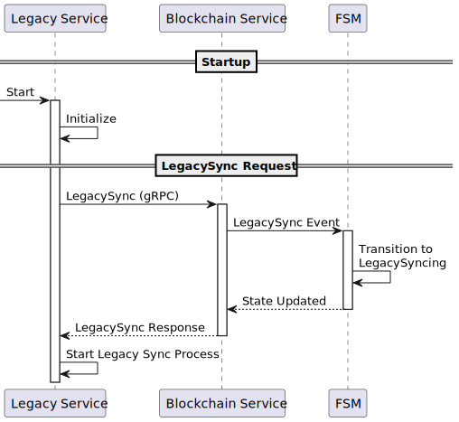
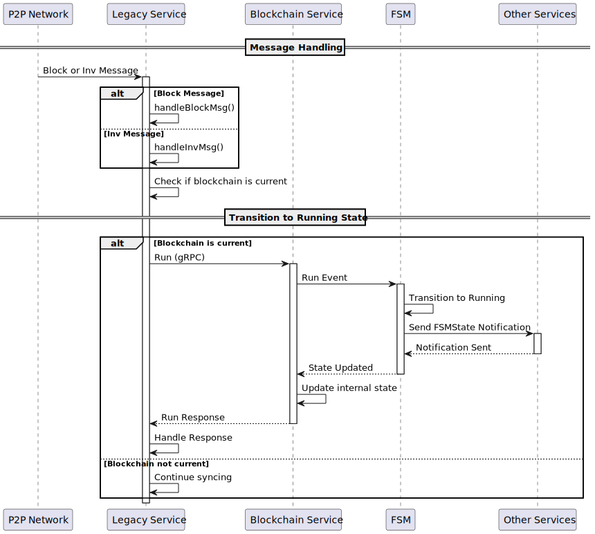
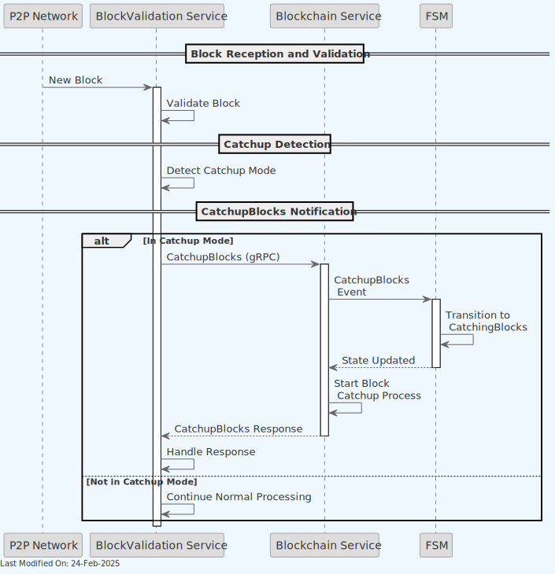

# 🗂️️ State Management in Teranode

1. [Introduction](#1-introduction)
2. [State Machine in Teranode](#2-state-machine-in-teranode)
3. [Functionality](#3-functionality)
    - [3.1. State Machine Initialization](#31-state-machine-initialization)
    - [3.2. Accessing the State Machine](#32-accessing-the-state-machine)
    - [3.2.1. Access via Command-Line Interface](#321-access-via-command-line-interface-recommended)
    - [3.2.2. Access via HTTP](#322-access-via-http-asset-server)
    - [3.2.3. Access via gRPC](#323-access-via-grpc)
    - [3.3. State Machine States](#33-state-machine-states)
    - [3.3.1. FSM: Idle State](#331-fsm-idle-state)
    - [3.3.2. FSM: Legacy Syncing State](#332-fsm-legacy-syncing-state)
    - [3.3.3. FSM: Running State](#333-fsm-running-state)
    - [3.3.4. FSM: Catching Blocks State](#334-fsm-catching-blocks-state)
    - [3.4. State Machine Events](#34-state-machine-events)
    - [3.4.1. FSM Event: Legacy Sync](#341-fsm-event-legacy-sync)
    - [3.4.2. FSM Event: Run](#342-fsm-event-run)
    - [3.4.3. FSM Event: Catch up Blocks](#343-fsm-event-catch-up-blocks)
    - [3.4.4. FSM Event: Stop](#344-fsm-event-stop)
    - [3.5. Waiting on State Machine Transitions](#35-waiting-on-state-machine-transitions)
4. [Other Resources](#4-other-resources)

## 1. Introduction

A Finite State Machine is a model used in computer science that describes a system which can be in one of a finite number of states at any given time. The machine can transition between these predefined states based on inputs or conditions (an "event").

Finite State Machines:

- have a finite set of states.
- can only be in one state at a time.
- transition between states based on inputs or events.
- have a defined initial state.
- may have one or more final states.

## 2. State Machine in Teranode

The Teranode blockchain service uses a Finite State Machine (FSM) to manage the various states and transitions of the node. The FSM is responsible for controlling the node's behavior based on the current state and incoming events.

The FSM has the following **states**:

- **Idle**
- **LegacySyncing**
- **Running**
- **CatchingBlocks**

The FSM responds to the following **events**:

- **LegacySync**
- **Run**
- **CatchupBlocks**
- **Stop**

The diagram below represents the relationships between the states and events in the FSM (as defined in `services/blockchain/fsm.go`):

The FSM handles the following state **transitions**:

- **LegacySync**: Transitions to _LegacySyncing_ from _Idle_
- **Run**: Transitions to _Running_ from _Idle_, _LegacySyncing_ or _CatchingBlocks_
- **CatchupBlocks**: Transitions to _CatchingBlocks_ from _Running_
- **Stop**: Transitions to _Idle_ from _LegacySyncing_, _Running_, or _CatchingBlocks_

Teranode provides a visualizer tool to generate and visualize the state machine diagram. To run the visualizer, use the command `go run services/blockchain/fsm_visualizer/main.go`. The generated `docs/state-machine.diagram.md` can be visualized using <https://mermaid.live/>.

## 3. Functionality

### 3.1. State Machine Initialization

As part of its own initialization, the Blockchain service initializes the FSM in the **Idle** state, before it transitions to a LegacySyncing or Running state.

### 3.2. Accessing the State Machine

#### 3.2.1. Access via Command-Line Interface (Recommended)

The Teranode Command-Line Interface (teranode-cli) provides the most direct and recommended approach for interacting with the State Machine. The CLI abstracts the underlying API calls and offers a straightforward interface for both operators and developers.

The CLI provides two primary commands for FSM interaction:

- **getfsmstate** - Queries and displays the current state of the FSM
- **setfsmstate** - Changes the FSM state by sending the appropriate event

These commands interface with the same underlying mechanisms as the gRPC methods, but provide a more user-friendly experience with appropriate validation and feedback.

#### 3.2.2. Access via HTTP (Asset Server)

The Asset Server provides a RESTful HTTP interface to the State Machine, offering a web-friendly approach to FSM interaction. This interface is particularly useful for web applications and administrative dashboards that need to monitor or control node state.

The Asset Server exposes the following endpoints for FSM interaction:

- **GET /api/v1/fsm/state** - Retrieves the current FSM state
- **POST /api/v1/fsm/state** - Sends a custom event to the FSM
- **GET /api/v1/fsm/events** - Lists all available FSM events
- **GET /api/v1/fsm/states** - Lists all possible FSM states

These HTTP endpoints provide the same functionality as the CLI and gRPC methods but with a RESTful interface that can be accessed using standard HTTP clients.

#### 3.2.3. Access via gRPC

The Blockchain service also exposes the following gRPC methods to interact with the FSM programmatically:

- **GetFSMCurrentState** - Returns the current state of the FSM
- **SendFSMEvent** - Sends an event to the FSM to trigger a state transition
- **LegacySync** - Transitions the FSM to the LegacySyncing state (delegates on the SendFSMEvent method)
- **Run** - Transitions the FSM to the Running state (delegates on the SendFSMEvent method)
- **CatchUpBlocks** - Transitions the FSM to the CatchingBlocks state (delegates on the SendFSMEvent method)

### 3.3. State Machine States

#### 3.3.1. FSM: Idle State

The Blockchain service always starts in an `Idle` state. In this state:

- No operations are permitted
- All services are inactive
- The node is not participating in the network in any way
- Must be manually triggered to transition to another state

Allowed Operations in Idle State:

- ❌ Process external transactions
- ❌ Legacy relay transactions
- ❌ Queue subtrees
- ❌ Process subtrees
- ❌ Queue blocks
- ❌ Process blocks
- ❌ Relay blocks
- ❌ Speedy process blocks
- ❌ Create subtrees (or propagate them)
- ❌ Create blocks (mine candidates)

All services will wait for the FSM to transition to the `Running` state (either directly or after going through a `Legacy Sync` step) before starting their operations. As such, the node should see no activity until the FSM transitions to the `Running` state.

The node can also return back to the `Idle` state from any other state, however this can only be triggered by a manual / external request.

#### 3.3.2. FSM: Legacy Syncing State

When a node is starting up, it may need to perform a legacy sync. This is a full block sync performed against legacy BSV nodes. In this state:

Allowed Operations in Legacy Syncing State:

- ❌ Process external transactions
- ❌ Legacy relay transactions
- ❌ Queue subtrees
- ❌ Process subtrees
- ❌ Queue blocks
- ❌ Process blocks
- ❌ Relay blocks
- ✅ Speedy process blocks
- ❌ Create subtrees (or propagate them)
- ❌ Create blocks (mine candidates)

#### 3.3.3. FSM: Running State

The `Running` state represents the node actively participating in the network. In this state:

Allowed Operations in Running State:

- ✅ Process external transactions
- ✅ Legacy relay transactions
- ✅ Queue subtrees
- ✅ Process subtrees
- ✅ Queue blocks
- ✅ Process blocks
- ✅ Relay blocks
- ❌ Speedy process blocks
- ✅ Create subtrees (or propagate them)
- ✅ Create blocks (mine candidates)

If `fsm_state_restore` setting is enabled, and if the node was previously in the `Idle` state, all services will start their operations once the FSM transitions to the `Running` state.

If the node was previously in any other state, the Block Assembler would now start mining blocks. The Block Assembler will never mine blocks under any other node state.

#### 3.3.4. FSM: Catching Blocks State

The `CatchingBlocks` state represents the node catching up on blocks. This state is triggered by BlockValidation when the node needs to catch up with the network. In this state:

Allowed Operations in Catching Blocks State:

- ✅ Process external transactions
- ✅ Legacy relay transactions
- ✅ Queue subtrees
- ✅ Process subtrees
- ✅ Queue blocks
- ✅ Process blocks
- ✅ Relay blocks
- ❌ Speedy process blocks
- ❌ Create subtrees (or propagate them)
- ❌ Create blocks (mine candidates)

##### Error Handling in Catching Blocks State

When an error occurs during the catchup process, the FSM behavior has been updated to maintain state consistency:

Key points about error handling:

- **State Persistence**: When an error occurs during catchup (e.g., validation failure, network error), the FSM **remains** in the `CatchingBlocks` state
- **No Automatic Reversion**: The FSM does **not** automatically revert to the `Running` state on error
- **Explicit Recovery Required**: Recovery from errors requires either:
    - Manual retry of the catchup process
    - Automatic retry mechanism (if configured)
    - Explicit state reset via operator intervention
- **Consistency**: This behavior prevents inconsistent state transitions and ensures the node doesn't incorrectly resume normal operations while catchup is incomplete

### 3.4. State Machine Events

#### 3.4.1. FSM Event: Legacy Sync

The gRPC `LegacySync` method triggers the FSM to transition to the `LegacySyncing` state. This event is used to indicate that the node is syncing from legacy BSV nodes.

The Legacy service triggers this event when the node is starting up and needs to perform a legacy sync.

#### 3.4.2. FSM Event: Run

The gRPC `Run` method triggers the FSM to transition to the `Running` state. This event is used to indicate that the node is ready to start participating in the network and processing transactions and blocks.

#### 3.4.3. FSM Event: Catch up Blocks

The gRPC `CatchUpBlocks` method triggers the FSM to transition to the `CatchingBlocks` state. This event is used to indicate that the node is catching up on blocks and needs to process the latest blocks before resuming full operations.

#### 3.4.4. FSM Event: Stop

The gRPC `Idle` method sends a `Stop` event to the FSM, which triggers a transition to the `Idle` state. This event is used to stop the node from participating in the network and halt all operations.

This method is not currently used.

### 3.5. Waiting on State Machine Transitions

Through internal helper methods, services can wait for the FSM to transition to a specific state before proceeding with their operations. This method is used by various services to ensure that the node is in the correct state before starting their activities.

The method blocks until the FSM transitions to the specified state or until a timeout occurs. This ensures that services are synchronized with the node's state changes and can respond accordingly.

This method is widely used by all Teranode services to await for the blockchain to signal a transition to the `Running` state, after which all services can resume normal operations.

Specifically, and subject to the `fsm_state_restore` setting being enabled, the following services wait for the FSM to transition to the `Running` state before starting their operations:

- Asset Server
- Block Assembly Service
- Block Persister
- Block Validation
- Coinbase
- Legacy P2P Gateway
- P2P
- Propagation
- Subtree Validation
- UTXO Persister
- Validator

---

## 4. Other Resources

### How-to Guides

- [How to Interact with the FSM](../../howto/miners/minersHowToInteractWithFSM.md) - Practical guide for managing FSM states in test and production environments (Docker and Kubernetes)

### API References

- [Blockchain API Reference](../../references/services/blockchain_reference.md) - Complete reference for the Blockchain service API, including FSM methods
- [Asset Server API Reference](../../references/services/asset_reference.md) - Reference for the Asset Server REST API, including FSM endpoints
