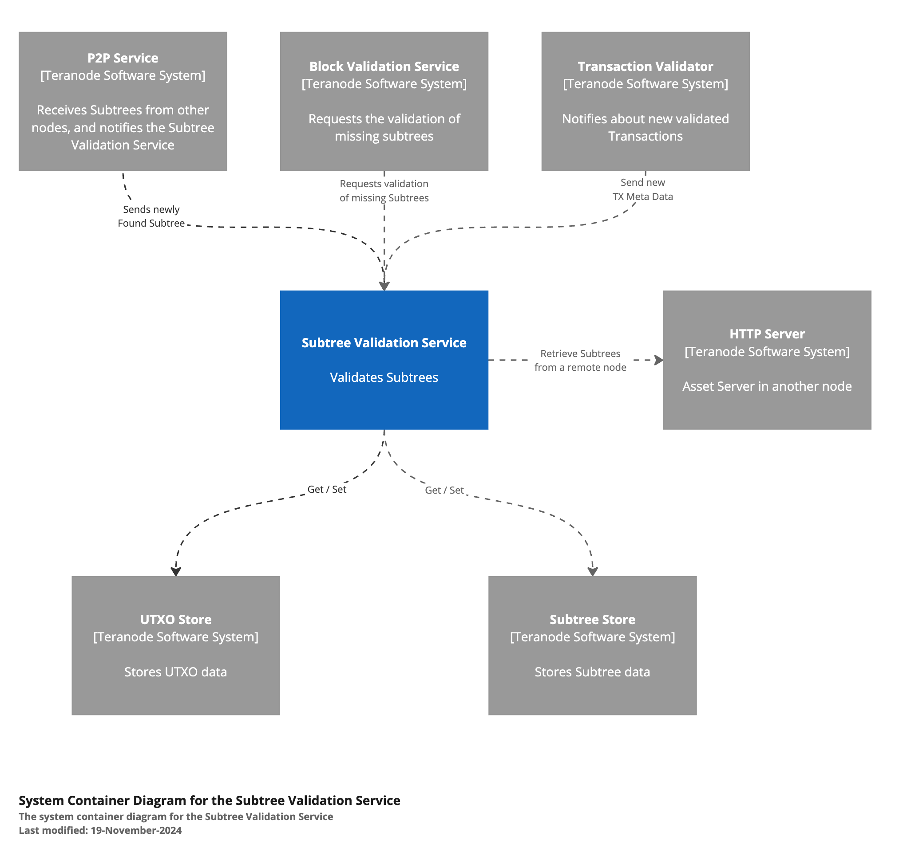
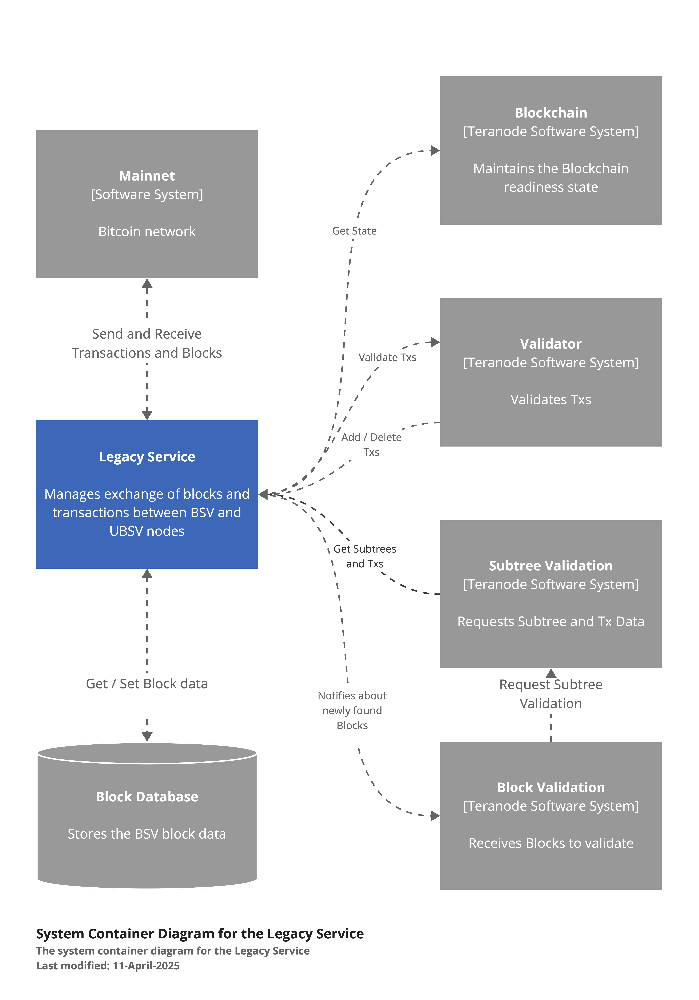

# Teranode Microservices Overview

## Index

- [Teranode Microservices Overview](#teranode-microservices-overview)
    - [Index](#index)
    - [1. Introduction](#1-introduction)
    - [2. Core Services](#2-core-services)
        - [2.1 Asset Server](#21-asset-server)
        - [2.2 Propagation Service](#22-propagation-service)
        - [2.3 Validator Service](#23-validator-service)
        - [2.4 Subtree Validation Service](#24-subtree-validation-service)
        - [2.5 Block Validation Service](#25-block-validation-service)
        - [2.6 Block Assembly Service](#26-block-assembly-service)
        - [2.7 Blockchain Service](#27-blockchain-service)
        - [2.8 Alert Service](#28-alert-service)
    - [3. Overlay Services](#3-overlay-services)
        - [3.1 Block Persister Service](#31-block-persister-service)
        - [3.2 UTXO Persister Service](#32-utxo-persister-service)
        - [3.3 P2P Service](#33-p2p-service)
        - [3.4 Legacy Service](#34-legacy-service)
        - [3.5 RPC Service](#35-rpc-service)
    - [4. Stores](#4-stores)
        - [4.1 TX and Subtree Store (Blob Server)](#41-tx-and-subtree-store-blob-server)
        - [4.2 UTXO Store](#42-utxo-store)
    - [5. Other Components](#5-other-components)
        - [5.1 Kafka Message Broker](#51-kafka-message-broker)
        - [5.2 Miners](#52-miners)
    - [6. Interaction Patterns](#6-interaction-patterns)
    - [7. Related Resources](#7-related-resources)

## 1. Introduction

Teranode is designed as a collection of microservices that work together to provide a horizontally scalable and highly efficient blockchain network. The microservices architecture enables Teranode to achieve exceptional throughput exceeding 1 million transactions per second by distributing processing across multiple machines and allowing individual services to scale independently based on demand.

This architectural approach provides several key advantages:

- **Horizontal Scalability**: Services can be deployed across multiple machines, enabling the system to handle increasing transaction volumes by adding more compute resources
- **Independent Scaling**: Each service can be scaled independently based on its specific resource requirements and bottlenecks
- **Distributed Processing**: Work is distributed across specialized services that communicate asynchronously through Kafka and synchronously via gRPC
- **Fault Isolation**: Issues in one service are contained and don't cascade to affect the entire system
- **Technology Flexibility**: Each service can use the most appropriate technology stack and storage backend for its specific requirements

This document provides an overview of each microservice, its responsibilities, and how it interacts with other components in the system.

## 2. Core Services

### 2.1 Asset Server

The Asset Server acts as an interface to various data stores, handling transactions, subtrees, blocks, and UTXOs. It uses the HTTP protocol for communication.

**Key Responsibilities:**

- Provide access to blockchain data
- Handle data retrieval requests from other services and external clients
- Serve as a facade for various data stores

**Data Models:**

- Blocks
- Block Headers
- Subtrees
- Extended Transactions
- UTXOs

**Key Interactions:**

- Interacts with UTXO Store, Blob Store (Subtree and TX Store), and Blockchain Server
- Provides data to other Teranode components and external clients over HTTP/WebSockets

**HTTP Endpoints:**

- getTransaction() and getTransactions()
- GetTransactionMeta()
- GetSubtree()
- GetBlockHeaders(), GetBlockHeader() and GetBestBlockHeader()
- GetBlock() and GetLastNBlocks()
- GetUTXO() and GetUTXOsByTXID()

You can read more about this service in the [Asset Server documentation](../services/assetServer.md).

### 2.2 Propagation Service

The Propagation Service is responsible for receiving and forwarding transactions across the network.

**Key Responsibilities:**

- Receive transactions from the network through multiple communication channels (gRPC and HTTP)
- Perform initial sanity checks on transactions
- Forward valid transactions to the Validator Service

**Key Interactions:**

- Receives transactions from other nodes via gRPC or HTTP
- Forwards transactions to the Validator Service

**Technology Stack:**

- Go programming language
- HTTP for network communication
- gRPC and Protocol Buffers for service communication

You can read more about this service in the [Propagation Service documentation](../services/propagation.md).

### 2.3 Validator Service

The Validator Service checks transactions against network rules and updates their status in the UTXO store.

**Key Responsibilities:**

- Validate transactions against network rules and Bitcoin consensus rules
- Update transaction status in the UTXO store
- Forward validated transaction IDs to the Block Assembly Service
- Notify P2P subscribers about rejected transactions

**Key Processes:**

- Receiving transaction validation requests
- Validating transactions (including checks for double-spending)
- Updating UTXO store with new transaction data
- Propagating validated transactions to Block Assembly and Subtree Validation services

**Data Model:**

- Extended Transaction format

**Technology Stack:**

- Go programming language
- gRPC for service communication
- Kafka for message queuing (optional)
- BSV libraries for transaction validation

You can read more about this service in the [Validator Service documentation](../services/validator.md).

### 2.4 Subtree Validation Service

This service validates newly received subtrees, adds metadata, and persists them in the Subtree Store.

**Key Responsibilities:**

- Validate subtrees received from other nodes
- Add metadata to subtrees for block validation
- Store validated subtrees in the Subtree Store

**Key Processes:**

- Real-time validation of subtrees
- UTXO validation for transactions within subtrees
- Handling unvalidated transactions within subtrees

You can read more about this service in the [Subtree Validation Service documentation](../services/subtreeValidation.md).

### 2.5 Block Validation Service

The Block Validation Service processes new blocks, checking their validity before they are added to the blockchain.

**Key Responsibilities:**

- Validate new blocks
- Coordinate with Subtree Validation Service for missing subtrees
- Update the blockchain with validated blocks

**Key Processes:**

- Receiving blocks for validation
- Validating block structure, Merkle root, and block header
- Catching up after a parent block is not found
- Marking transactions as mined

**Data Models:**

- Blocks
- Subtrees
- Extended Transactions
- UTXOs

You can read more about this service in the [Block Validation Service documentation](../services/blockValidation.md).

### 2.6 Block Assembly Service

This service is responsible for creating subtrees and assembling block templates for miners.

**Key Responsibilities:**

- Organize transactions into subtrees
- Create block templates from subtrees
- Broadcast new subtrees and blocks to the network
- Handle blockchain reorganizations and forks

**Key Processes:**

- Receiving transactions from the Validator Service
- Grouping transactions into subtrees
- Creating mining candidates
- Processing subtrees and blocks from other nodes
- Handling forks and conflicts

**Data Models:**

- Blocks
- Subtrees
- UTXOs

You can read more about this service in the [Block Assembly Service documentation](../services/blockAssembly.md).

### 2.7 Blockchain Service

The Blockchain Service manages block updates and maintains the node's copy of the blockchain through a Finite State Machine (FSM) that coordinates blockchain state transitions.

**Key Responsibilities:**

- Add new blocks to the blockchain
- Manage block headers and subtree lists
- Provide blockchain state information to other services
- Handle block invalidation and chain reorganization

**Key Processes:**

- Adding new blocks to the blockchain
- Retrieving blocks and block headers
- Invalidating blocks
- Managing subscriptions for blockchain events

**Data Model:**

- Blocks (including block header, coinbase TX, and block merkle root)

You can read more about this service in the [Blockchain Service documentation](../services/blockchain.md).

### 2.8 Alert Service

The Alert Service handles system-wide alerts and notifications, including UTXO freezing and block invalidation.

**Key Responsibilities:**

- Distribute important network alerts
- Manage alert prioritization and dissemination
- Handle UTXO freezing, unfreezing, and reassignment
- Manage peer banning and unbanning
- Handle block invalidation requests

**Key Processes:**

- UTXO freezing and unfreezing
- UTXO reassignment
- Block invalidation
- Peer management

You can read more about this service in the [Alert Service documentation](../services/alert.md).

## 3. Overlay Services

### 3.1 Block Persister Service

This service post-processes blocks, adding transaction metadata and storing them as files.

**Key Responsibilities:**

- Decorate transactions in blocks with metadata
- Store processed blocks in a block data storage system
- Create and store UTXO addition and deletion files

**Key Processes:**

- Receiving and processing new block notifications
- Decorating transactions with UTXO metadata
- Creating and storing block, subtree, and UTXO files

**Data Models:**

- Blocks
- Subtrees
- UTXOs (additions and deletions)

You can read more about this service in the [Block Persister Service documentation](../services/blockPersister.md).

### 3.2 UTXO Persister Service

The UTXO Persister maintains an up-to-date record of all unspent transaction outputs.

**Key Responsibilities:**

- Process new blocks to update the UTXO set
- Maintain UTXO set files for each block
- Create and maintain an up-to-date UTXO file set for each block in the blockchain

**Key Processes:**

- Monitoring for new block files
- Processing UTXO additions and deletions
- Generating UTXO set files
- Tracking progress of processed blocks

**Data Model:**

- UTXO set (collection of unspent transaction outputs)
- UTXO components: TxID, Index, Value, Height, Script, Coinbase flag

**Technology Stack:**

- Go programming language
- Blob store for file storage
- Bitcoin SV libraries for blockchain operations

You can read more about this service in the [UTXO Persister Service documentation](../services/utxoPersister.md).

### 3.3 P2P Service

The P2P Service manages peer-to-peer communications within the network.

**Key Responsibilities:**

- Handle peer discovery and connection management
- Facilitate message passing between nodes
- Manage subscriptions for blockchain events
- Handle WebSocket connections for real-time notifications

**Key Processes:**

- Peer discovery and connection
- Managing best block messages
- Handling blockchain messages (blocks, subtrees, mining)
- Processing TX validator messages
- Managing WebSocket notifications

You can read more about this service in the [P2P Service documentation](../services/p2p.md).

### 3.4 Legacy Service

The Legacy Service facilitates communication between Teranode and traditional Bitcoin SV nodes.

**Key Responsibilities:**

- Receive blocks and transactions from legacy nodes
- Disseminate new blocks to legacy nodes
- Transform data between BSV and Teranode formats

**Key Processes:**

- Receiving inventory notifications from BSV nodes
- Processing new blocks and converting them to Teranode format
- Handling requests from Teranode components for legacy data

You can read more about this service in the [Legacy Service documentation](../services/legacy.md).

### 3.5 RPC Service

The RPC Service provides compatibility with the Bitcoin RPC interface, allowing clients to interact with the Teranode node using standard Bitcoin RPC commands.

**Key Responsibilities:**

- Handle incoming RPC requests
- Process and validate RPC commands
- Interact with core Teranode services to fulfill requests
- Provide responses in Bitcoin-compatible format

**Supported RPC Commands:**

- createrawtransaction, generate, getbestblockhash, getblock, sendrawtransaction, stop, version, getminingcandidate, submitminingsolution, getblockchaininfo, getinfo, getpeerinfo

**Key Processes:**

- Authenticating RPC requests
- Routing requests to appropriate handlers
- Executing commands and interacting with other Teranode services
- Formatting and returning responses

**Technology Stack:**

- Go programming language
- HTTP/HTTPS for RPC communication
- JSON for request/response formatting

You can read more about this service in the [RPC Service documentation](../services/rpc.md).

## 4. Stores

### 4.1 TX and Subtree Store (Blob Server)

The Blob Server is a generic datastore used for storing transactions (extended tx) and subtrees.

**Key Responsibilities:**

- Store and retrieve transaction data
- Store and retrieve subtree data
- Provide a common interface for various storage backends

**Supported Storage Backends:**

- File System
- Google Cloud Storage (GCS)
- Amazon S3
- MinIO
- SeaweedFS
- SQL (PostgreSQL)
- In-memory storage

**Key Interactions:**

- Used by Asset Server for retrieving transaction and subtree data
- Utilized by Block Assembly for storing and retrieving subtrees
- Accessed by Block Validation for transaction and subtree verification

**Data Models:**

- Extended Transaction Data Model
- Subtree Data Model

You can read more about this store in the [Blob Store documentation](../stores/blob.md).

### 4.2 UTXO Store

The UTXO Store is responsible for tracking spendable UTXOs based on the longest honest chain-tip in the network.

**Key Responsibilities:**

- Maintain the current UTXO set
- Handle UTXO creation, spending, and deletion
- Manage block height for determining UTXO spendability
- Support freezing, unfreezing, and reassigning UTXOs

**Supported Storage Backends:**

- Aerospike (primary production datastore)
- In-memory store
- SQL (PostgreSQL and SQLite)
- Nullstore (for testing)

**Key Interactions:**

- Used by Asset Server for UTXO data retrieval
- Accessed by Block Persister for UTXO metadata
- Utilized by Block Assembly for coinbase UTXO management
- Interacts with Block Validation for UTXO verification
- Supports Transaction Validator for UTXO operations

**Data Model:**

- UTXO Meta Data, including transaction details, parent transaction hashes, block IDs, fees, and other metadata

You can read more about this store in the [UTXO Store documentation](../stores/utxo.md).

## 5. Other Components

### 5.1 Kafka Message Broker

Kafka serves as the messaging middleware for inter-service communication in Teranode.

**Key Responsibilities:**

- Facilitate asynchronous communication between services
- Ensure reliable message delivery
- Support high-throughput data streaming

**Key Topics and Use Cases:**

- `kafka_validatortxsConfig`: Used for transmitting new transaction notifications from Propagation to Validator
- `kafka_txsConfig`: Used for forwarding valid transactions from Validator to Block Assembly
- `kafka_txmetaConfig`: Used for sending new UTXO metadata from Validator to Subtree Validation
- `kafka_rejectedTxConfig`: Used for notifying P2P about rejected transactions
- `kafka_blocksConfig`: Used for propagating new blocks from P2P to Block Validation
- `kafka_subtreesConfig`: Used for sending new subtrees from P2P to Subtree Validation
- `kafka_blocksFinalConfig`: Used for sending finalized blocks from Blockchain to Block Persister

**Key Features:**

- Supports high-throughput data streaming
- Provides fault-tolerance and durability
- Allows for scalable message consumption

You can read more about how Kafka is used in the [Kafka usage documentation](../kafka/kafka.md).

### 5.2 Miners

Miners are responsible for the computational work of finding valid blocks.

**Key Responsibilities:**

- Perform proof-of-work calculations
- Broadcast newly found blocks

## 6. Interaction Patterns

The Teranode microservices communicate through a combination of synchronous gRPC calls and asynchronous Kafka message streams, creating an event-driven architecture that enables high throughput and loose coupling between components.

**Transaction Processing Flow:**

- Propagation Service receives incoming transactions from the network through multiple channels (gRPC, HTTP) and publishes them to Kafka for processing
- Validator Service consumes transaction messages from Kafka, validates them against Bitcoin consensus rules and network policies, updates the UTXO Store with transaction metadata, and publishes validated transaction IDs to Kafka
- Block Assembly Service consumes validated transaction IDs from Kafka and organizes them into subtrees for efficient block construction and mining
- Subtree Validation Service validates newly received subtrees and coordinates with the Validator Service for any missing transaction data

**Block Processing Flow:**

- P2P Service receives new blocks and subtrees from peer nodes and propagates them via Kafka to the Block Validation and Subtree Validation services
- Block Validation Service coordinates with the Subtree Validation Service to verify all subtrees within a block, ensuring data integrity before acceptance
- Blockchain Service maintains the blockchain state machine, managing block additions, chain reorganizations, and finality determinations
- When a block is finalized, Blockchain Service publishes it via Kafka to the Block Persister Service for long-term storage

**Data Access Patterns:**

- Asset Server provides a unified HTTP/WebSocket interface for querying blockchain data, acting as a facade over the UTXO Store, Blob Store, and Blockchain Store
- UTXO Store serves as a central state management component, interacting with multiple services (Validator, Block Assembly, Block Validation) for UTXO operations and double-spend prevention
- Blob Store provides persistent storage for transactions and subtrees, accessed by Asset Server, Block Assembly, and Block Validation services

## 7. Related Resources

- [Teranode Architecture Overview](teranode-overall-system-design.md)
- Core Services:

    - [Asset Server](../services/assetServer.md)
    - [Propagation Service](../services/propagation.md)
    - [Validator Service](../services/validator.md)
    - [Subtree Validation Service](../services/subtreeValidation.md)
    - [Block Validation Service](../services/blockValidation.md)
    - [Block Assembly Service](../services/blockAssembly.md)
    - [Blockchain Service](../services/blockchain.md)
    - [Alert Service](../services/alert.md)
- Overlay Services:

    - [Block Persister Service](../services/blockPersister.md)
    - [UTXO Persister Service](../services/utxoPersister.md)
    - [P2P Service](../services/p2p.md)
    - [Legacy Service](../services/legacy.md)
    - [RPC Server](../services/rpc.md)
- Stores:

    - [Blob Server](../stores/blob.md)
    - [UTXO Store](../stores/utxo.md)
- Messaging:

    - [Kafka](../kafka/kafka.md)
