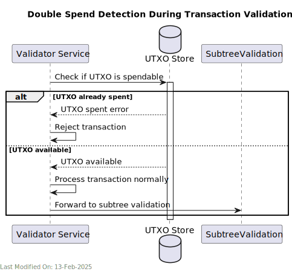
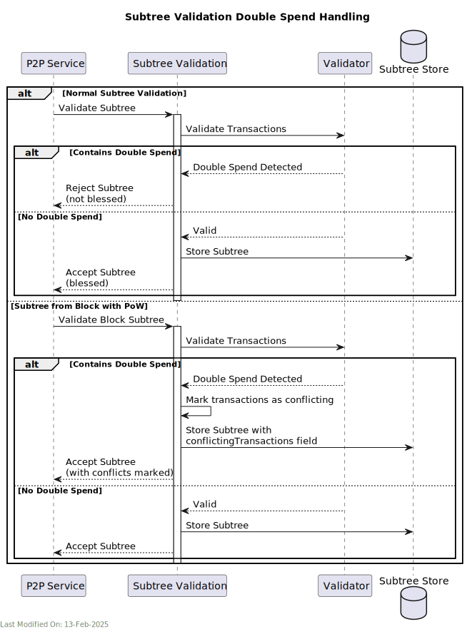
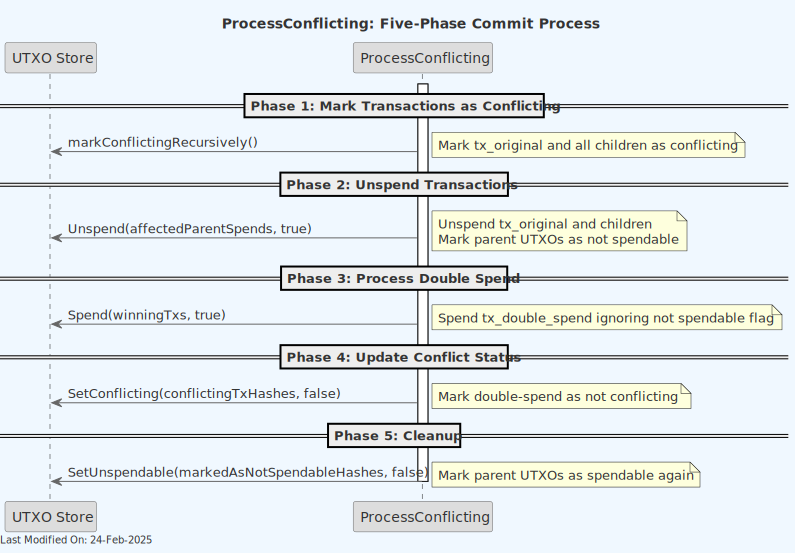

# Understanding Double Spend Handling and Conflict Resolution in Teranode

## Index

1. [Introduction](#1-introduction)
    - [1.1 The Double Spend Problem](#11-the-double-spend-problem)
    - [1.2 Teranode's Approach to Double Spend Prevention](#12-teranodes-approach-to-double-spend-prevention)
    - [1.3 Key Concepts in Teranode's Implementation](#13-key-concepts-in-teranodes-implementation)
2. [Core Concepts](#2-core-concepts)
    - [2.1 Double Spend Detection](#21-double-spend-detection)
    - [2.1.1 First-Seen Rule Implementation](#211-first-seen-rule-implementation)
    - [2.1.2 Detection During Transaction Validation](#212-detection-during-transaction-validation)
    - [2.1.3 Detection During Block Validation](#213-detection-during-block-validation)
    - [2.1.4 Subtree Validation Handling](#214-subtree-validation-handling)
    - [2.1.5 Detection Outcomes](#215-detection-outcomes)
    - [2.2 Transaction States](#22-transaction-states)
    - [2.2.1 Non-conflicting Transactions](#221-non-conflicting-transactions)
    - [2.2.2 Conflicting Transactions](#222-conflicting-transactions)
    - [2.2.3 Child Transactions](#223-child-transactions)
    - [2.3 Conflict Storage and Tracking](#23-conflict-storage-and-tracking)
    - [2.3.1 UTXO Store](#231-utxo-store)
    - [2.3.2 Subtree Storage](#232-subtree-storage)
    - [2.3.3 Parent-Child Relationship](#233-parent-child-relationship)
3. [Chain Reorganization Handling](#3-chain-reorganization-handling)
    - [3.1 Phase 1: Mark Original as Conflicting](#phase-1-mark-original-as-conflicting)
    - [3.2 Phase 2: Unspend Original](#phase-2-unspend-original)
    - [3.3 Phase 3: Process Double Spend](#phase-3-process-double-spend)
    - [3.4 Phase 4: Update Double Spend Status](#phase-4-update-double-spend-status)
    - [3.5 Phase 5: Cleanup](#phase-5-cleanup)
4. [Other Resources](#4-other-resources)

---

## 1. Introduction

A double spend occurs when someone attempts to spend the same Bitcoin UTXO (Unspent Transaction Output) more than once. This is one of the fundamental problems that Bitcoin was designed to solve, as preventing double spending is crucial for maintaining the integrity of a digital currency system.

### 1.1 The Double Spend Problem

Consider a simple scenario:

1. "User A" has 1 BSV in a UTXO
2. "User A" creates transaction A sending that 1 BSV to "User B"
3. "User A" also creates transaction B sending the same 1 BSV to "User D"
4. Both transactions attempt to spend the same UTXO



This is a double spend attempt - the same UTXO cannot be validly spent twice. The network must have a consistent way to determine which transaction is valid and which should be rejected.

### 1.2 Teranode's Approach to Double Spend Prevention

Teranode implements a double spend prevention mechanism based on several key principles:

1. **First-Seen Rule**: The _first valid transaction_ seen by the network that spends a particular UTXO is considered the "original" transaction. Any subsequent transaction attempting to spend the same UTXO is marked as a "conflicting" transaction.

2. **Proof of Work Override**: While double spends are outright rejected during normal transaction validation, if a double spend appears in a block with valid proof of work, it receives special handling. In this scenario, the "conflicting" transaction is saved, but marked as "conflicting" in the UTXO storage. This is necessary because:

    - The block represents network consensus
    - The block's chain might become the longest chain of work
    - The network must be able to handle reorganizations consistently
    - To be able to reorganize, we want to track all transactions in blocks with valid proof of work

3. **Conflict Propagation**: When conflicts are detected, the information is:

    - Stored in the UTXO store (conflict status is tracked for the specific UTXO)
    - Marked in the subtree stored on disk (subtrees track conflicting transactions within it)
    - Propagated to child transactions (see next point)

4. **Child Transaction Handling**: Any transaction that depends on (spends from) a conflicting transaction is also marked as conflicting. This "poison pill" effect ensures that entire chains of invalid transactions are properly tracked.

### 1.3 Key Concepts in Teranode's Implementation

Teranode's double spend handling involves several important concepts:

1. **Transaction States**:

    - Non-conflicting: Normal transactions following the first-seen rule
    - Conflicting: Transactions attempting to double spend UTXOs
    - Child conflicts: Transactions spending outputs from conflicting transactions

2. **Storage Mechanisms**:

    - UTXO store maintains conflict status and relationships
    - Subtrees track conflicts for block validation
    - All conflicting states have associated TTL (Time To Live) - conflicting transactions are eventually removed (once clear a reorganization is not possible)

3. **Processing Phases**:

    - Detection during transaction validation (double spends outright rejected)
    - Special handling during block processing (blocks from other nodes with conflicting transactions are processed, and the conflicting transactions stored and marked as such)
    - Chain reorganization handling - should a reorganization occur, conflicting transactions are reprocessed, with the original ones now marked as "conflicting"
    - Five-phase commit process for resolving conflicts:

      - Mark original transaction and children as conflicting
      - Unspend original transaction and children, temporarily marking its parent txs as not spendable (to prevent re-spending)
      - Mark double-spend as non-conflicting
      - Mark parents as spendable again (remove temporary marking)

The following services are key to Teranode's double spend handling:

- **Propagation / TX Validator**: Detects and rejects double spends during transaction validation
- **Subtree Validation**: Rejects subtrees with double spends during block validation
- **Block Validation**: Handles double spends in blocks with proof of work, storing the transaction in the UTXO store and marking it as "conflicting"
- **UTXO Store**: Stores conflict status and relationships
- **Block Assembly**: Handles chain reorganizations

## 2. Core Concepts

### 2.1 Double Spend Detection

Teranode implements different handling mechanisms depending on where the double spend is detected. There are two primary scenarios: detection during transaction validation and detection during block validation.

#### 2.1.1 First-Seen Rule Implementation

The first-seen rule is Teranode's primary mechanism for handling double spends during normal transaction processing. Under this rule:

- The first valid transaction that spends a particular UTXO is considered the "original" transaction
- Any subsequent transaction from other nodes attempting to spend the same UTXO is considered a "conflicting" transaction.

#### 2.1.2 Detection During Transaction Validation

When transactions arrive through the Validator component (Propagation Service):

1. **UTXO Check**:

    - The validator checks if the UTXOs being spent are available
    - If a UTXO is already spent, the transaction is identified as a potential double spend

2. **Immediate Rejection**:

    - Double spends detected at this stage are **rejected**
    - They are NOT propagated further in the network
    - They are NOT added to subtrees or blocks being assembled in the node



#### 2.1.3 Detection During Block Validation

Double spend detection behaves differently when the transactions are detected as part of the validation of a block with proof of work.
In this scenario, Teranode understands that the conflicting transaction has been treated as valid by the network and included in a block. A remote node has invested work in creating the block, and it can become part of the longest honest chain. The conflicting transaction can no longer be ignored, and it must be processed - but flagged as "conflicting".

1. **Block-Level Processing**:

    - Double spends in valid blocks must be processed.
    - They are stored in the UTXO store and marked as "conflicting" (`conflicting`)
    - The tx parent is modified to include a `conflictingChildren` field, which lists both the original and the conflicting "child" transactions
    - The transactions are also marked as conflicting in the subtree store (`ConflictingNodes` field)

2. **Parent-Child Relationships**:

    - All transactions that spend outputs from a conflicting transaction are also marked as conflicting
    - This creates a chain of conflicts that must be tracked
    - The conflict status is stored in the first non-conflicting parent transaction using the `conflictingChildren` field

3. **Conflict Tracking**:

    - For conflicting transactions, a UTXO Store TTL is set - conflicting transactions are removed from the store once the TTL expires (indicating that a reorganization is no longer possible and the data is no longer needed)


#### 2.1.4 Subtree Validation Handling

The SubtreeValidation service provides an additional layer of double spend detection:

1. **Subtree Checks**:

    - Subtrees containing double spends are rejected during normal validation
    - They are NOT "blessed" (approved) for inclusion in blocks
    - Exception: When the subtree is part of a block with proof of work

2. **Block Context**:

    - When validating subtrees that are part of a block with proof of work:

        - Double spends are allowed, but relevant txs are marked as "conflicting"
        - The subtree includes a `ConflictingNodes` field, indicating the txs under contention



#### 2.1.5 Detection Outcomes

The outcome of double spend detection varies based on the context:

1. **Transaction Validation**:

    - Double spends are rejected
    - Original transaction remains valid

2. **Block-Included Transactions**:

    - Double spends are processed
    - Conflicts are marked and tracked
    - Chain reorganization logic determines final validity

3. **Child Transactions**:

    - Automatically inherit conflict status
    - Cannot be processed by validator or subtree validation
    - Are tracked for potential chain reorganization

### 2.2 Transaction States

#### 2.2.1 Non-conflicting Transactions

- These are transactions that follow the first-seen rule (first valid transaction that spends a particular UTXO). They are considered the "original" transactions in case of double spends.
- Processed normally through validation and block assembly

#### 2.2.2 Conflicting Transactions

- Transactions attempting to spend UTXOs that are already spent by another transaction
- Only processed if seen in a block with valid proof of work
- Marked as conflicting in:

    - The UTXO store
    - The subtree store
- Have an associated TTL (Time To Live), after which they are removed from the store

#### 2.2.3 Child Transactions

- Transactions that spend outputs from other transactions
- Inherit conflict status from their parents
- If a parent transaction is marked as conflicting:

    - All child transactions are automatically marked as conflicting

### 2.3 Conflict Storage and Tracking

#### 2.3.1 UTXO Store

- Primary storage for conflict information
- Stores conflict status in two ways:

    - `conflicting` flag on transactions
    - `conflictingChildren` list for parent transactions

#### 2.3.2 Subtree Storage

- Subtrees maintain a `ConflictingNodes` array
- Contains hashes of transactions marked as conflicting
- Used during chain reorganization
- Only transactions present in the subtree can be marked as conflicting

#### 2.3.3 Parent-Child Relationship

- Parent transactions track their conflicting children
- When marking a transaction as conflicting:
   1. Parent transactions are updated first
   2. Parent's `conflictingChildren` list is updated

## 3. Chain Reorganization Handling

During chain reorganization, when a block containing a double spend becomes part of the longest chain, Teranode must transition the UTXO set from the original transaction to the double spend (the "conflicting" transaction).

This is handled through a **five-phase commit process**:



### Phase 1: Mark Original as Conflicting

- The original transaction and all its children are marked as conflicting. This is done recursively through the transaction chain, ensuring all dependent transactions are properly marked.

```text
Technical changes:

- UTXO Store:

    - Sets `conflicting = true` on tx_original
    - Sets TTL for cleanup
    - Updates `conflictingChildren[]` array in parent transactions
    - Recursively marks all child transactions
- Subtree Store:

    - Adds transaction hashes to `ConflictingNodes[]` array
    - Persists updated subtree
```

### Phase 2: Unspend Original

- The original transaction is unspent, releasing its parent UTXOs
- All child transactions are also unspent
- Parent UTXOs are marked as "not spendable" to prevent other transactions from spending them during the reorganization process (this is a temporary measure, removed in the last step of the process)

```text
Technical changes:

- UTXO Store:

    - Clears `spendingTxID` from parent UTXOs
    - Sets `locked = true` on parent UTXOs
    - Removes spend markers from tx_original's outputs
    - Maintains conflict flags and TTLs
```

### Phase 3: Process Double Spend

- The double spend transaction is processed, spending its inputs even though some UTXOs are marked as not spendable. This is allowed specifically for this phase of the reorg process.

```text
Technical changes:

- UTXO Store:

    - Sets `spendingTxID` to double spend transaction
    - Creates new UTXOs for double spend outputs
    - Ignores `locked` flag during spend
    - No TTL set on double spend transaction
```

### Phase 4: Update Double Spend Status

- The double spend transaction is marked as non-conflicting, establishing it as the valid transaction in the new chain.

```text
Technical changes:

- UTXO Store:

    - Sets `conflicting = false` on double spend
    - Removes any TTL
- Subtree Store:

    - Removes hash from `ConflictingNodes[]` if present
```

### Phase 5: Cleanup

- Parent UTXOs are made "spendable" again, removing the temporary restriction.

```text
Technical changes:

- UTXO Store:

    - Sets `locked = false` on parent UTXOs
```

At the end of the process, the original transaction is now marked as conflicting, and the double spend transaction is considered valid. The UTXO set has been successfully transitioned to the new chain.


Note how the reorganization process does not unspend regular transactions, provided they are present in both chains. Only double spent transactions are affected by the reorganization handling described above.

## 4. Other Resources

- [UTXO Store](../stores/utxo.md)
- [Tx Validator](../services/validator.md)
- [Subtree Validation Service](../services/subtreeValidation.md)
- [Block Validation Service](../services/blockValidation.md)
- [Block Assembly Service](../services/blockAssembly.md)
