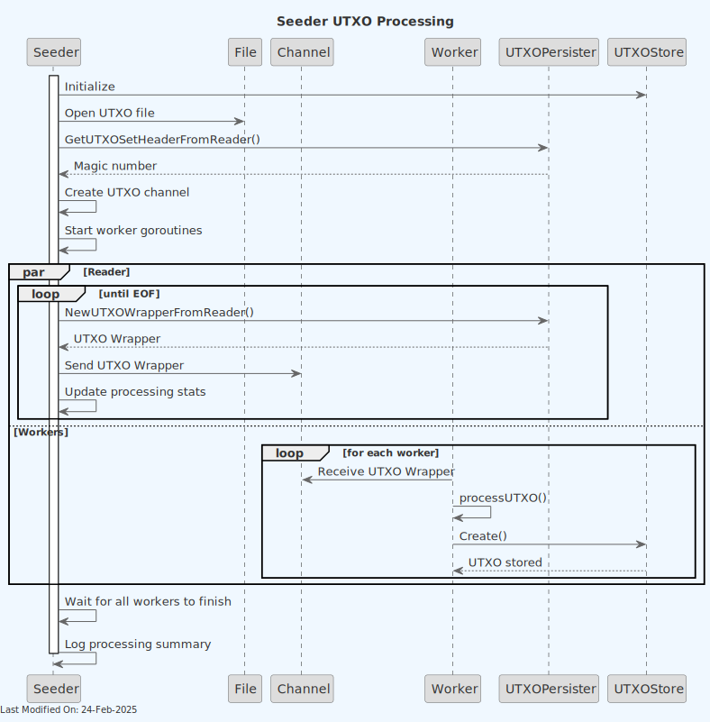

# 🌱 Seeder Command

## Index

1. [Description](#1-description)
2. [Functionality](#2-functionality)
    - [2.1 Command Initialization](#21-command-initialization)
    - [2.2 Processing Headers](#22-processing-headers)
    - [2.3 Processing UTXOs](#23-processing-utxos)
3. [Data Model](#3-data-model)
4. [Technology](#4-technology)
5. [Directory Structure and Main Files](#5-directory-structure-and-main-files)
6. [How to Run](#6-how-to-run)
7. [Configuration Options](#7-configuration-options)

## 1. Description

The Seeder is a command-line tool designed to populate the UTXO store with data up to and including a specific block. It reads a UTXO set (as produced by the `UTXO Persister` service) and writes all the necessary records to the configured UTXO and Blockchain storage system (e.g., Aerospike and Postgres). This tool is crucial for initializing or updating the UTXO state of a Bitcoin node.

Key features:

1. Processes block headers and stores them in the blockchain store.
2. Reads and processes UTXO data from a file.
3. Populates the UTXO store with processed data.
4. Supports parallel processing of UTXOs for improved performance.
5. Provides options to skip header or UTXO processing if needed.


## 2. Functionality

### 2.1 Command Initialization


1. The command starts by parsing command-line flags to determine the input directory, target hash, and processing options.
2. It verifies the existence of required input files (headers and UTXO set).
3. The command sets up signal handling for graceful shutdown.
4. An HTTP server is started for profiling purposes.

### 2.2 Processing Headers


If header processing is not skipped:

1. The command opens the headers file and verifies its magic number.
2. It reads headers sequentially from the file.
3. For each header:

    - A `model.Block` object is created.
    - The block is stored in the blockchain store.
4. The command keeps track of the number of headers processed and total transaction count.

### 2.3 Processing UTXOs



If UTXO processing is not skipped:

1. The service initializes a connection to the UTXO store.
2. It sets up a channel for UTXO processing and spawns multiple worker goroutines.
3. The UTXO file is opened and its header is verified.
4. UTXOs are read from the file and sent to the processing channel.
5. Worker goroutines process UTXOs in parallel:

    - Each UTXO is converted to a Bitcoin transaction format.
    - The transaction is stored in the UTXO store.
6. The service tracks the number of transactions and UTXOs processed.

## 3. Data Model

The Seeder works with the following key data structures:

1. **Block Header**:
   Represented by `utxopersister.UTXOHeader`, containing:

    - Block header information
    - Transaction count
    - Block height

2. **UTXO Wrapper**:
   Represented by `utxopersister.UTXOWrapper`, containing:

    - Transaction ID
    - Block height
    - Coinbase flag
    - List of UTXOs

3. **UTXO**:
   Represented within the UTXO Wrapper, containing:

    - Output index
    - Value (in satoshis)
    - Locking script

The service reads these structures from input files and converts them to the format required by the blockchain and UTXO stores.

## 4. Technology

1. **Go (Golang)**: The primary programming language.

2. **Bitcoin SV Libraries**:

    - `github.com/bsv-blockchain/go-bt/v2`: For handling Bitcoin transactions and scripts.
3. **Custom TERANODE Libraries**:

    - `github.com/bsv-blockchain/teranode`: For blockchain and UTXO store operations, error handling, and logging.

4. **Concurrent Processing**:

    - `golang.org/x/sync/errgroup`: For managing concurrent UTXO processing.

5. **Configuration Management**:

    - `github.com/ordishs/gocore`: For reading configuration values.

## 5. Directory Structure and Main Files

```text
./cmd/seeder/
│
├── main.go
│   Entry point for the Seeder command-line tool.
│
├── seeder/
│   ├── start.go
│   │   Main implementation of the Seeder service, including
│   │   command-line parsing, header processing, and UTXO processing.
│   │
│   └── README.md
│       Documentation for the Seeder service.
```

## 6. How to Run

To run the Seeder command, use the following command:

```shell
seeder -inputDir <folder> -hash <hash> [-skipHeaders] [-skipUTXOs]
```

Options:

- `-inputDir`: Specifies the input directory containing UTXO set and headers files.
- `-hash`: Hash of the UTXO set / headers to process.
- `-skipHeaders`: (Optional) Skip processing of headers.
- `-skipUTXOs`: (Optional) Skip processing of UTXOs.

## 7. Configuration Options

The Seeder uses various configuration options, which can be set through a configuration system:

- `blockchain_store`: URL for the blockchain store.
- `utxostore`: URL for the UTXO store.
- `channelSize`: Size of the channel for UTXO processing (default: 1000).
- `workerCount`: Number of worker goroutines for UTXO processing (default: 500).
- `skipStore`: Boolean flag to skip storing UTXOs (for testing purposes).
