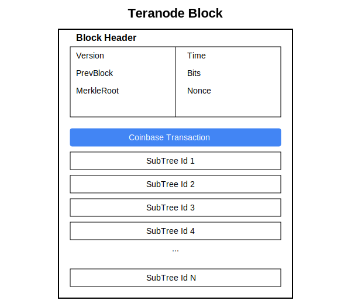

# Teranode Data Model - Blocks

The Teranode BSV model introduces a novel approach to block propagation, optimizing the network for high transaction throughput.

Teranode Blocks contain lists of subtree identifiers, not transactions. This is practical for nodes because they have been processing subtrees continuously, this allows for quick validation of blocks.

Each block is an abstraction which is a container of a group of subtrees. A block contains a variable number of subtrees (all of equal size), a coinbase transaction, and a header, called a block header, which includes the block ID of the previous block, effectively creating a chain.

Source: `model/Block.go` (Block struct definition)

| Field            | Type                  | Description                                                                          |
|------------------|-----------------------|--------------------------------------------------------------------------------------|
| Header           | *BlockHeader          | The Block Header (see [Block Header Data Model](./block_header_data_model.md))      |
| CoinbaseTx       | *bt.Tx                | The coinbase transaction                                                             |
| TransactionCount | uint64                | Total number of transactions in the block                                            |
| SizeInBytes      | uint64                | Total size of the block in bytes                                                     |
| Subtrees         | []*chainhash.Hash     | Array of subtree root hashes representing batches of transactions in the block       |
| SubtreeSlices    | []*subtreepkg.Subtree | The actual subtree data structures (populated on demand via blob store)              |
| Height           | uint32                | Block height in the blockchain (0 for genesis)                                       |
| ID               | uint32                | Unique identifier for the block in storage (assigned by blockchain service)          |

This table provides an overview of the primary fields in the `Block` struct. Note that all subtrees in a block must be the same size, except the last subtree which may be smaller (validated in `Block.GetAndValidateSubtrees()` in `model/Block.go`).

## Block Header Metadata (BlockHeaderMeta)

In addition to the core block data, Teranode maintains additional metadata for block management in the `BlockHeaderMeta` struct. This metadata is stored alongside the block header in the blockchain store and tracks the block's state through various processing stages.

Source: `model/BlockHeaderMeta.go` (BlockHeaderMeta struct)

| Field       | Type                  | Description                                             |
|-------------|-----------------------|---------------------------------------------------------|
| ID          | uint32                | Unique identifier for the block in storage              |
| Invalid     | bool                  | Flag indicating if the block has been marked as invalid |
| MinedSet    | bool                  | Flag indicating if the block has been marked as mined   |
| SubtreesSet | bool                  | Flag indicating if subtrees have been processed         |

### Block ID Pre-allocation

Teranode supports pre-allocation of block IDs through the blockchain service's `GetNextBlockID()` method (in `services/blockchain/Interface.go`). This feature enables:

- **Parallel block processing** with guaranteed unique IDs across distributed services
- **Quick validation scenarios** where blocks need IDs before full processing (e.g., during catchup operations in `services/blockvalidation/quick_validate.go`)
- **Recovery scenarios** requiring coordinated ID assignment across services

The method returns a uint64 value that increments atomically, ensuring no ID collisions even in high-concurrency environments. Block IDs are stored as uint32 in the Block struct, supporting approximately 4.3 billion blocks.

### Invalid Block Tracking

Blocks can be marked as invalid during validation, particularly during catchup operations. Invalid blocks:

- Are tracked in the blockchain store to prevent reprocessing
- Inherit their invalid status to child blocks (invalid parent = invalid children)
- Help identify problematic peers providing bad blocks
- Can be tracked for potential revalidation in recovery scenarios

For details about the block header, see the [Block Header Data Model](./block_header_data_model.md) or the Additional Resources section below.

Please note that the use of subtrees within blocks represents a data abstraction for a more optimal propagation of transactions. The data model is still the same as Bitcoin, with blocks containing transactions. The subtrees are used to optimize the propagation of transactions and blocks.

## Advantages of the Teranode BSV Model

- **Faster Validation**: Since nodes process subtrees continuously, validating a block is quicker because it involves validating the presence and correctness of subtree identifiers rather than individual transactions.

- **Scalability**: The model supports a much higher transaction throughput (> 1M transactions per second).

## Network Behavior

Teranode's block processing involves multiple specialized services working together:

- **Transactions**: Broadcast network-wide by the Propagation service (`services/propagation/`), which receives transactions via gRPC/UDP/HTTP and forwards them to other nodes. Each node further propagates transactions and validates them through the Validator service (`services/validator/`).

- **Subtrees**: The Block Assembly service (`services/blockassembly/`) creates subtrees from validated transactions and broadcasts them via Kafka events. Nodes broadcast subtrees to indicate prepared batches of transactions for block inclusion, allowing other nodes to perform preliminary validations. Subtrees are stored in the Blob Store (`stores/blob/`) for retrieval during block validation.

- **Block Propagation**: When a block is found, the Block Validation service (`services/blockvalidation/`) validates it. Validation is expedited due to the continuous processing of subtrees. If a node encounters a subtree within a new block that it is unaware of, it can request the details from the Blob Store. The Blockchain service (`services/blockchain/`) manages the blockchain state machine and coordinates block acceptance.

This proactive approach with subtrees enables the network to handle a significantly higher volume of transactions while maintaining quick validation times. It also allows nodes to utilize their processing power more evenly over time, rather than experiencing idle times between blocks. This model ensures that Teranode BSV can scale effectively to meet high transaction demands without the bottlenecks experienced by the BTC network.

## Historical Bitcoin Block Model

Historically, Bitcoin blocks have contained transactions, with each block linked to the previous one by a cryptographic hash.

Note how the Bitcoin block contains all transactions (including ALL transaction data) for each transaction it contains, not just the transaction Id. This means that the block size will be very large if many transactions were included. At scale, this is not practical, as the block size would be too large to propagate across the network in a timely manner.

The Teranode BSV model optimizes this by using subtrees to represent transactions in a block, allowing for more efficient propagation and validation of blocks.

## Additional Resources

- [Overall System Design](../architecture/teranode-overall-system-design.md)
- [Block Header](./block_header_data_model.md)
- [Subtree](./subtree_data_model.md)
