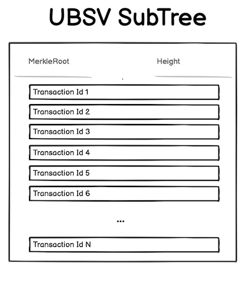

# Teranode Data Model - Subtrees

The Subtrees are an innovation aimed at improving the scalability and real-time processing capabilities of the blockchain system.

### Structure

The concept of subtrees is a distinct feature not found in the BTC design.

1. A subtree acts as an intermediate data structure to hold batches of transaction IDs (including metadata) and their corresponding Merkle root.
    - The size of a subtree can be any number of transactions, as long as it is a power of 2 (16, 32, 64, etc.). The only requirement is that all subtrees in a block must be the same size. At peak throughput, subtrees will contain millions of transaction IDs.

2. Each subtree computes its own Merkle root, which is a single hash representing the entire set of transactions within that subtree.


Here's a table documenting the structure of the `Subtree` type:

| Field            | Type                  | Description                                                                              |
|------------------|-----------------------|------------------------------------------------------------------------------------------|
| Height           | int                   | The height of the subtree within the blockchain.                                         |
| Fees             | uint64                | Total fees associated with the transactions in the subtree.                              |
| SizeInBytes      | uint64                | The size of the subtree in bytes.                                                        |
| FeeHash          | chainhash.Hash        | Hash representing the combined fees of the subtree.                                      |
| Nodes            | []SubtreeNode         | An array of `SubtreeNode` objects, representing individual "nodes" within the subtree.   |
| ConflictingNodes | []chainhash.Hash      | List of hashes representing nodes that conflict, requiring checks during block assembly. |

Here, a `SubtreeNode is a data structure representing a transaction hash, a fee, and the size in bytes of said TX.

Note - For subtree files in the `subtree-store` S3 buckets, each subtree has a size of 48MB.

##### Subtree Composition

Each subtree consists of:
- root hash: 32 bytes
- fees: 8 bytes (uint64)
- sizeInBytes: 8 bytes (uint64)
- numberOfNodes: 8 bytes (uint64)
- nodes: 48 bytes per node (hash:32 + fee:8 + size:8)
- numberOfConflictingNodes: 8 bytes (uint64)
- conflictingNodes: 32 bytes per conflicting node

##### Calculation:
```

Fixed header: 32 + 8 + 8 + 8 + 8 = 64 bytes

Additional - Per transaction node: 48 bytes
```


##### Data Transfer Between Nodes

However - only 32MB is transferred between the nodes. Each subtree transfer includes:

- hash: 32 bytes
```
1024 * 1024 * (32) = 32MB
```


### Efficiency

Subtrees are broadcast every second (assuming a baseline throughput of 1M transactions per second), making data propagation more continuous rather than batched every 10 minutes. Although blocks are still created every 10 minutes, subtrees are broadcast every second.

1. Broadcasting subtrees at this high frequency allows receiving nodes to validate batches quickly and continuously, essentially "pre-approving" them for inclusion in a block.

2. This contrasts with the BTC design, where a new block and its transactions are broadcast approximately every 10 minutes after being confirmed by miners.

### Lightweight

Subtrees only include transaction IDs, not full transaction data, since all nodes already possess the transactions, reducing the size of the propagated data.

1. All network nodes are assumed to already have the full transaction data (which they receive and store as transactions are created and spread through the network). Therefore, it's unnecessary to rebroadcast full details with each subtree.

2. Subtrees allow nodes to confirm they have all relevant transactions and update their state accordingly without having to process large amounts of data repeatedly.



## Additional Resources

- [Overall System Design](../architecture/teranode-overall-system-design.md)
- [Block](./block_data_model.md)
- [Transaction](./transaction_data_model.md)
