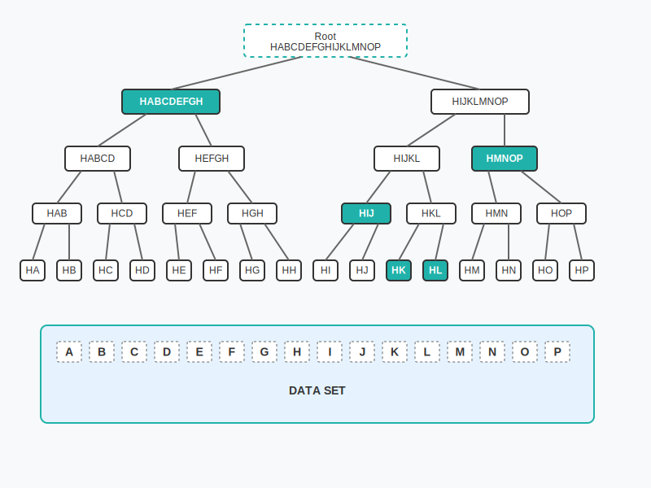

# Teranode Data Model - Subtrees

The Subtrees are an innovation aimed at improving the scalability and real-time processing capabilities of the blockchain system.

## Structure

The concept of subtrees is a distinct feature not found in the BTC design.

1. A subtree acts as an intermediate data structure to hold batches of transaction IDs (including metadata) and their corresponding Merkle root.
    - The size of a subtree can be any number of transactions, as long as it is a power of 2 (16, 32, 64, etc.). The only requirement is that all subtrees in a block must be the same size. At peak throughput, subtrees will contain millions of transaction IDs.

2. Each subtree computes its own Merkle root, which is a single hash representing the entire set of transactions within that subtree.



Here's a table documenting the structure of the `Subtree` type:

| Field            | Type                  | Description                                                                              |
|------------------|-----------------------|------------------------------------------------------------------------------------------|
| Height           | int                   | The height of the Merkle tree (number of levels). Calculated as ceil(log2(number of nodes)). For 1,048,576 nodes, height = 20. |
| Fees             | uint64                | Total fees associated with the transactions in the subtree.                              |
| SizeInBytes      | uint64                | The size of the subtree in bytes.                                                        |
| FeeHash          | chainhash.Hash        | Hash representing the combined fees of the subtree. **Note:** This field is currently unused. |
| Nodes            | []SubtreeNode         | An array of `SubtreeNode` objects, representing individual "nodes" within the subtree.   |
| ConflictingNodes | []chainhash.Hash      | List of transaction hashes that have UTXO conflicts (double-spend attempts). These transactions are flagged during validation and require special handling during block assembly to ensure only one conflicting transaction is included. |

Here, a `SubtreeNode` is a data structure representing a transaction hash, a fee, and the size in bytes of said TX.

### Subtree Storage and Transfer

#### Storage Format (48 MB per subtree)

Each subtree file stored in the `subtree-store` buckets contains full node data. The structure consists of:

- root hash: 32 bytes
- fees: 8 bytes (uint64)
- sizeInBytes: 8 bytes (uint64)
- numberOfNodes: 8 bytes (uint64)
- nodes: 48 bytes per node (hash:32 + fee:8 + size:8)
- numberOfConflictingNodes: 8 bytes (uint64)
- conflictingNodes: 32 bytes per conflicting node

**Size Calculation:**

```text
Fixed header: 32 + 8 + 8 + 8 + 8 = 64 bytes
Per transaction node: 48 bytes (hash:32 + fee:8 + size:8)

For 1,048,576 transactions:
  Header: 64 bytes
  Nodes: 1,048,576 × 48 = 50,331,648 bytes
  Total: ≈ 48 MB
```

#### Network Transfer Format (32 MB per subtree)

When nodes request subtrees during catchup operations via the `/subtree/{hash}` endpoint, only transaction hashes are transferred to minimize bandwidth usage:

- Transaction hash only: 32 bytes per node

**Transfer Size Calculation:**

```text
For 1,048,576 transactions:
  1,048,576 × 32 bytes = 33,554,432 bytes = 32 MB exactly
```

This optimization reduces network transfer by 33% compared to sending full node data. The receiving node reconstructs the full subtree structure by setting fees and sizes to zero initially, which are later populated during validation.

### Efficiency

Subtrees are created and broadcast when they reach their configured size (default: 1,048,576 transactions via the `InitialMerkleItemsPerSubtree` setting in `settings/settings.go`). The size dynamically adjusts based on transaction volume and utilization patterns. At a baseline throughput of 1 million transactions per second, this results in approximately one subtree per second, though actual timing varies with network load.

This approach makes data propagation more continuous rather than batched every 10 minutes. Although blocks are still created every 10 minutes, subtrees are created and broadcast as soon as they are full.

1. Creating subtrees at this high frequency allows receiving nodes to validate batches quickly and continuously, essentially "pre-approving" them for inclusion in a block.

2. This contrasts with the BTC design, where a new block and its transactions are broadcast approximately every 10 minutes after being confirmed by miners.

### Lightweight

Subtrees only include transaction IDs, not full transaction data, since all nodes already possess the transactions, reducing the size of the propagated data.

1. All network nodes are assumed to already have the full transaction data (which they receive and store as transactions are created and spread through the network). Therefore, it's unnecessary to rebroadcast full details with each subtree.

2. Subtrees allow nodes to confirm they have all relevant transactions and update their state accordingly without having to process large amounts of data repeatedly.


## Additional Resources

- [Overall System Design](../architecture/teranode-overall-system-design.md)
- [Block](./block_data_model.md)
- [Transaction](./transaction_data_model.md)
