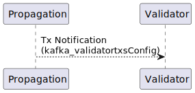
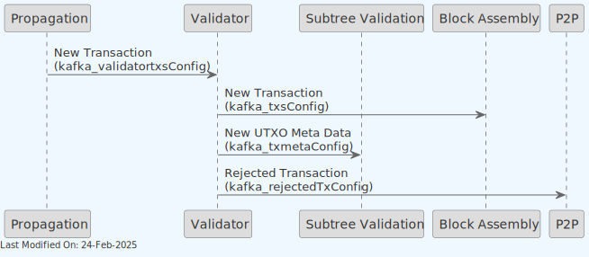
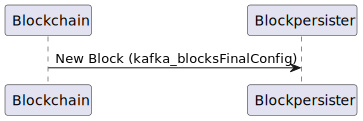

# 🐘️ Kafka in Teranode

## Table of Contents

1. [Description](#1-description)
2. [Use Cases](#2-use-cases)
    - [Propagation Service](#propagation-service)
    - [Validator Component](#validator-component)
    - [P2P Service](#p2p-service)
    - [Blockchain](#blockchain)
3. [Reliability and Recoverability](#3-reliability-and-recoverability)
4. [Configuration](#4-configuration)
    - [Kafka URL Format](#kafka-url-format)
    - [URL Parameters](#url-parameters)
    - [General Kafka Settings](#general-kafka-settings)
    - [Service-Specific Settings](#service-specific-settings)
    - [Block Assembly](#block-assembly)
    - [Block Validation](#block-validation)
    - [Subtree Validation](#subtree-validation)
    - [Validator](#validator)
    - [Consumer Group Configuration](#consumer-group-configuration)
    - [Configuration Interactions](#configuration-interactions)
5. [Operational Guidelines](#5-operational-guidelines)
    - [Performance Tuning](#performance-tuning)
    - [Reliability Considerations](#reliability-considerations)
    - [Monitoring](#monitoring)
6. [Kafka URL Configuration Parameters](#6-kafka-url-configuration-parameters)
    - [Consumer Configuration Parameters](#consumer-configuration-parameters)
    - [Producer Configuration Parameters](#producer-configuration-parameters)
7. [Service-Specific Kafka Settings](#7-service-specific-kafka-settings)
    - [Auto-Commit Behavior by Service Criticality](#auto-commit-behavior-by-service-criticality)
    - [Service-Specific Performance Settings](#service-specific-performance-settings)
    - [Configuration Examples by Service](#configuration-examples-by-service)
8. [Other Resources](#8-other-resources)

## 1. Description

Kafka is a high-throughput, distributed messaging system designed to store and process large volumes of data. Its key features include scalability, fault-tolerance, and high availability, making it an ideal choice for real-time data processing and analytics in complex systems like Teranode.

In the Teranode ecosystem, Kafka plays a crucial role in facilitating communication between various components, such as the Validator, BlockValidation, and Blockchain. It enables these components to exchange messages, notifications, and data reliably and efficiently, ensuring smooth operation of the entire system.

It's important to note that Kafka is a third-party dependency in Teranode. As such, there is no specific installation or configuration process provided within the Teranode framework. Users are expected to have a properly configured Kafka setup running before initiating the Teranode services. This approach allows for flexibility in Kafka configuration based on specific deployment needs and existing infrastructure.

## 2. Use Cases

### Propagation Service

After initial sanity check tests, the propagation service endorses transactions to the validator. This is done by sending transaction notifications to the validator via the `kafka_validatortxsConfig` topic.



- **kafka_validatortxsConfig**: This Kafka topic is used to transmit new transaction notifications from the Propagation component to the Validator.


### Validator Component



This diagram illustrates the central role of the Validator in processing new transactions, and how it uses Kafka:

1. The Validator receives new transactions from the Propagation component via the `kafka_validatortxsConfig` topic.


2. Valid transactions are forwarded to the Block Assembly component using **direct gRPC calls** (not Kafka). The Validator uses the `blockAssembler.Store()` method for synchronous transaction processing required for mining candidate generation.


3. The Validator sends new UTXO (Unspent Transaction Output) metadata to the Subtree Validation component through the `kafka_txmetaConfig` topic for inclusion in new subtrees. Should a reversal be required, the same topic is  used to notify a deletion ("delete" command).


4. If a transaction is rejected, the Validator notifies the P2P component via the `kafka_rejectedTxConfig` topic, allowing the network (other peers) to be informed about invalid transactions.


### P2P Service


The P2P (Peer-to-Peer) service is responsible from peer-to-peer communication, receiving and sending data to other nodes in the network. Here's how it interacts with other components using Kafka:

1. It receives notifications about rejected transactions from the Validator through the `kafka_rejectedTxConfig` topic, allowing it to inform other nodes in the network.


2. The P2P component propagates new blocks (as received from other peers in the network) to the Block Validation component via the `kafka_blocksConfig` topic, initiating the block validation process.


3. New subtrees (as received from other peers in the network) are sent from the P2P component to the Subtree Validation component using the `kafka_subtreesConfig` topic, enabling efficient validation of large transaction sets.


### Blockchain



This diagram shows the final stage of block processing:

- The Blockchain component sends newly finalized blocks to the Blockpersister component using the `kafka_blocksFinalConfig` topic. This ensures that validated and accepted blocks are permanently stored in the blockchain.

## 3. Reliability and Recoverability

Kafka's role as a critical component in the Teranode system cannot be overstated. Its central position in facilitating the communication of new transactions, remote subtrees, and blocks makes it indispensable for the node's operation.

To maintain system integrity, Teranode is designed to pause operations when Kafka is in an unreliable state. This means:

1. The system will not process new transactions, blocks, or subtrees until Kafka is available and functioning correctly.
2. During Kafka downtime or unreliability, the node enters a safe state, preventing potential data inconsistencies or processing errors.
3. Once Kafka is reported as healthy again, the node automatically resumes normal operation without manual intervention.

## 4. Configuration

### Kafka URL Format

Kafka configuration in Teranode is primarily specified through URLs. Each Kafka topic has its own URL with parameters that control its behavior. The URL format is:

```
kafka://host1,host2,.../topic?param1=value1&param2=value2&...
```

Components of the URL:

- **Scheme**: Always `kafka://`
- **Hosts**: Comma-separated list of Kafka brokers (e.g., `localhost:9092,kafka2:9092`)
- **Topic**: The Kafka topic name (specified as the path component)
- **Parameters**: Query parameters that configure specific behavior

Example:
```
kafka://localhost:9092/blocks?partitions=4&replication=3&flush_frequency=5s
```

### URL Parameters

The following parameters can be specified in Kafka URLs:

1. **`partitions`**
    - **Type**: Integer
    - **Default**: 1
    - **Description**: Number of partitions for the Kafka topic
    - **Impact**: Higher values increase parallelism but require more resources

2. **`replication`**
    - **Type**: Integer
    - **Default**: 1
    - **Description**: Replication factor for the topic
    - **Impact**: Higher values improve fault tolerance but increase storage requirements

3. **`retention`**
    - **Type**: String (milliseconds)
    - **Default**: "600000" (10 minutes)
    - **Description**: How long messages are retained
    - **Impact**: Longer retention increases storage requirements

4. **`segment_bytes`**
    - **Type**: String
    - **Default**: "1073741824" (1GB)
    - **Description**: Maximum size of a single log segment file
    - **Impact**: Smaller values create more files but allow more granular cleanup

5. **`flush_bytes`**
    - **Type**: Integer
    - **Default**: 1048576 (1MB)
    - **Description**: Number of bytes to accumulate before forcing a flush
    - **Impact**: Larger values improve throughput but increase risk of data loss

6. **`flush_messages`**
    - **Type**: Integer
    - **Default**: 50000
    - **Description**: Number of messages to accumulate before forcing a flush
    - **Impact**: Larger values improve throughput but increase risk of data loss

7. **`flush_frequency`**
    - **Type**: Duration (e.g., "5s")
    - **Default**: "10s" (10 seconds)
    - **Description**: Maximum time between flushes
    - **Impact**: Longer durations improve throughput but increase risk of data loss

8. **`consumer_ratio`**
    - **Type**: Integer
    - **Default**: 1
    - **Description**: Ratio of partitions to consumers
    - **Impact**: Determines how many consumer instances process messages

9. **`replay`**
    - **Type**: Integer (boolean: 0 or 1)
    - **Default**: 1 (true)
    - **Description**: Whether to replay messages from the beginning for new consumer groups
    - **Impact**: Controls initial behavior of new consumers

### General Kafka Settings

These settings define the Kafka endpoints used across the Teranode system:

- **`kafka_txsConfig`**: Kafka URL - Used in Block Assembly and Validator services
    - **Critical Impact**: Handles valid transaction flow to Block Assembly
    - **Required**: Yes

- **`kafka_validatortxsConfig`**: Kafka URL - Used in Propagation and Validator services
    - **Critical Impact**: Manages new transaction flow from Propagation to Validator
    - **Required**: Yes

- **`kafka_txmetaConfig`**: Kafka URL - Used in Subtree Validation and Validator services
    - **Critical Impact**: Carries transaction metadata for subtree construction
    - **Required**: Yes

- **`kafka_rejectedTxConfig`**: Kafka URL - Used in P2P and Validator services
    - **Critical Impact**: Notifies network about invalid transactions
    - **Required**: Yes

- **`kafka_blocksConfig`**: Kafka URL - Used in Block Validation and P2P services
    - **Critical Impact**: Distributes new blocks for validation
    - **Required**: Yes

- **`kafka_subtreesConfig`**: Kafka URL - Used in Subtree Validation and P2P services
    - **Critical Impact**: Distributes subtrees for validation
    - **Required**: Yes

- **`kafka_blocksFinalConfig`**: Kafka URL - Used in Blockchain and Blockpersister services
    - **Critical Impact**: Finalizes validated blocks for permanent storage
    - **Required**: Yes

- **`kafka_hosts`**: String - Kafka broker hosts configuration
    - **Critical Impact**: Defines the Kafka broker endpoints for connection
    - **Required**: Yes
    - **Format**: Comma-separated list of host:port pairs (e.g., "localhost:9092,broker2:9092")

- **`kafka_unitTest`**: String - Unit test topic configuration
    - **Critical Impact**: Defines Kafka topic used during unit testing
    - **Required**: No (testing only)
    - **Usage**: Used by test suites to isolate test messages from production topics
    - **Environment**: Test environments only

### Service-Specific Settings

#### Block Assembly
- **`blockassembly_kafkaWorkers`**
    - **Type**: Integer
    - **Default**: 100
    - **Description**: Number of worker goroutines processing Kafka messages
    - **Impact**: Higher values increase throughput but consume more resources

#### Block Validation
- **`blockvalidation_kafkaBlockConcurrency`**
    - **Type**: Integer
    - **Default**: max(4, runtime.NumCPU()-16)
    - **Description**: Number of concurrent block validations
    - **Impact**: Higher values increase throughput but may cause resource contention

#### Subtree Validation
- **`subtreevalidation_kafkaSubtreeConcurrency`**
    - **Type**: Integer
    - **Default**: max(4, runtime.NumCPU()-16)
    - **Description**: Number of concurrent subtree validations
    - **Impact**: Higher values increase throughput but may cause resource contention

#### Validator
- **`validator_kafkaWorkers`**: Number of concurrent Kafka processing workers
    - **Purpose**: Controls parallel transaction processing capacity
    - **Tuning**: Should match CPU cores and expected transaction volume
    - **Integration**: Works with Block Assembly via direct gRPC (not Kafka)
- **`validator_kafka_maxMessageBytes`**
    - **Type**: Integer
    - **Default**: 1048576 (1MB)
    - **Description**: Size threshold for routing decisions
    - **Purpose**: Determines when to use HTTP fallback vs Kafka
    - **Usage**: Large transactions routed via HTTP to avoid Kafka message size limits

### Consumer Group Configuration

Kafka consumers in Teranode are organized into consumer groups, which determine how messages are distributed and processed.

- **Consumer Group ID**: Each service uses a unique consumer group ID to ensure proper message distribution. This is typically passed as a parameter when creating a consumer group.

- **Auto-Commit**:
    - **Type**: Boolean
    - **Description**: Controls whether Kafka offsets are automatically committed
    - **Default**: Varies by service
    - **Impact**: Critical for message processing guarantees
    - **Service-Specific Settings**:
        - **TxMeta Cache**: true (can tolerate missed messages)
        - **Rejected Transactions**: true (can tolerate missed messages)
        - **Subtree Validation**: false (requires exactly-once processing)
        - **Block Persister**: false (requires exactly-once processing)
        - **Block Validation**: false (requires exactly-once processing)

### Configuration Interactions

Many Kafka settings interact with each other and with system resources. Here are the most important interactions:

1. **Partitioning and Concurrency**
    - **Primary Settings**: `partitions`, service-specific concurrency settings
    - **Interaction**: The number of partitions should align with concurrency settings for optimal performance
    - **Recommendation**: Set partitions ≈ concurrency for balanced load

2. **Durability vs. Performance**
    - **Primary Settings**: `flush_frequency`, `flush_bytes`, `flush_messages`
    - **Interaction**: Lower values increase durability but reduce throughput
    - **Recommendation**: Tune based on importance of data and performance requirements

3. **Resource Scaling**
    - **Primary Settings**: service worker counts, partition counts
    - **Interaction**: Must be balanced with available system resources
    - **Recommendation**: Scale based on CPU cores and available memory

4. **Message Processing Guarantees**
    - **Primary Settings**: `autoCommit`, consumer logic
    - **Interaction**: False requires manual commit after successful processing
    - **Recommendation**: Use false for critical data paths


## 5. Operational Guidelines

### Performance Tuning

1. **Partition Optimization**
    - Each partition can only be consumed by one consumer in a consumer group
    - Increase partitions to increase parallelism, but avoid over-partitioning
    - General guideline: Start with partitions = number of consumers * 2

2. **Resource Allocation**
    - Kafka is memory-intensive; ensure sufficient RAM
    - Disk I/O is critical; use fast storage (SSDs recommended)
    - Network bandwidth should be sufficient for peak message volumes

3. **Producer Tuning**
    - Batch messages when possible by adjusting `flush_*` parameters
    - Monitor producer queue size and adjust if messages are being dropped

### Reliability Considerations

1. **Replication Factor**
    - Minimum recommended for production: 3
    - Ensures data survives broker failures

2. **Consumer Group Design**
    - Critical services should use dedicated consumer groups
    - Monitor consumer lag to detect processing issues

3. **Error Handling**
    - Services have different retry policies based on criticality
    - Block and subtree validation use manual commits to ensure exactly-once processing

### Monitoring

Key metrics to monitor:

1. **Broker Metrics**
    - CPU, memory, disk usage
    - Network throughput

2. **Topic Metrics**
    - Message rate
    - Byte throughput
    - Partition count

3. **Consumer Metrics**
    - Consumer lag
    - Processing time
    - Error rate

4. **Producer Metrics**
    - Send success rate
    - Retry rate
    - Queue size


## 6. Kafka URL Configuration Parameters

### Consumer Configuration Parameters

When configuring Kafka consumers via URL, the following query parameters are supported:

| Parameter | Type | Default | Description |
|-----------|------|---------|-------------|
| `partitions` | int | 1 | Number of topic partitions to consume from |
| `consumer_ratio` | int | 1 | Ratio for scaling consumer count (partitions/consumer_ratio) |
| `replay` | int | 1 | Whether to replay messages from beginning (1=true, 0=false) |
| `group_id` | string | - | Consumer group identifier for coordination |

**Example Consumer URL:**
```
kafka://localhost:9092/transactions?partitions=4&consumer_ratio=2&replay=0&group_id=validator-group
```

### Producer Configuration Parameters

When configuring Kafka producers via URL, the following query parameters are supported:

| Parameter | Type | Default | Description |
|-----------|------|---------|-------------|
| `partitions` | int | 1 | Number of topic partitions to create |
| `replication` | int | 1 | Replication factor for topic |
| `retention` | string | "600000" | Message retention period (ms) |
| `segment_bytes` | string | "1073741824" | Segment size in bytes (1GB) |
| `flush_bytes` | int | varies | Flush threshold in bytes (1MB async, 1KB sync) |
| `flush_messages` | int | 50000 | Number of messages before flush |
| `flush_frequency` | string | "10s" | Time-based flush frequency |

**Example Producer URL:**
```
kafka://localhost:9092/blocks?partitions=2&replication=3&retention=3600000&flush_frequency=5s
```

## 7. Service-Specific Kafka Settings

### Auto-Commit Behavior by Service Criticality

Auto-commit in Kafka is a consumer configuration that determines when and how message offsets are committed (marked as processed) back to Kafka. When auto-commit is enabled, Kafka automatically commits message offsets at regular intervals (default is every 5 seconds). When auto-commit is disabled, it is the responsibility of the application to manually commit offsets after successfully processing messages.

Kafka consumer auto-commit behavior varies by service based on processing criticality:

#### Auto-Commit Enabled Services
These services can tolerate potential message loss for performance:

- **TxMeta Cache (Subtree Validation)**: `autoCommit=true`
    - Rationale: Metadata can be regenerated if lost
    - Performance priority over strict delivery guarantees

- **Rejected Transactions (P2P)**: `autoCommit=true`
    - Rationale: Rejection notifications are not critical for consistency
    - Network efficiency prioritized

#### Auto-Commit Disabled Services
These services require exactly-once processing guarantees:

- **Subtree Validation**: `autoCommit=false`
    - Rationale: Transaction processing must be atomic
    - Manual commit after successful processing

- **Block Persister**: `autoCommit=false`
    - Rationale: Block finalization is critical for blockchain integrity
    - Manual commit ensures durability

- **Block Validation**: `autoCommit=false`
    - Rationale: Block processing affects consensus
    - Manual commit prevents duplicate processing

### Service-Specific Performance Settings

#### Propagation Service Settings

- **`validator_kafka_maxMessageBytes`**: Size threshold for routing decisions
    - **Purpose**: Determines when to use HTTP fallback vs Kafka
    - **Default**: 1048576 (1MB)
    - **Usage**: Large transactions routed via HTTP to avoid Kafka message size limits

#### Validator Service Settings

- **`validator_kafkaWorkers`**: Number of concurrent Kafka processing workers
    - **Purpose**: Controls parallel transaction processing capacity
    - **Tuning**: Should match CPU cores and expected transaction volume
    - **Integration**: Works with Block Assembly via direct gRPC (not Kafka)

#### Block Validation Service Settings

- **`blockvalidation_kafkaWorkers`**: Number of concurrent block processing workers
    - **Purpose**: Controls parallel block validation capacity
    - **Tuning**: Balance with system resources and block arrival rate

### Configuration Examples by Service

#### High-Throughput Service (Propagation)
```
kafka_validatortxsConfig=kafka://localhost:9092/validator-txs?partitions=8&consumer_ratio=2&flush_frequency=1s
validator_kafka_maxMessageBytes=1048576  # 1MB threshold
```

#### Critical Processing Service (Block Validation)
```
kafka_blocksConfig=kafka://localhost:9092/blocks?partitions=4&consumer_ratio=1&replay=0
blockvalidation_kafkaWorkers=4
autoCommit=false  # Manual commit for reliability
```

#### Metadata Service (Subtree Validation)
```
kafka_txmetaConfig=kafka://localhost:9092/txmeta?partitions=2&consumer_ratio=1&replay=1
autoCommit=true   # Performance over strict guarantees
```

## 8. Other Resources

- [Kafka Message Format](../../references/kafkaMessageFormat.md)
- [Block Data Model](../datamodel/block_data_model.md): Contain lists of subtree identifiers.
- [Subtree Data Model](../datamodel/subtree_data_model.md): Contain lists of transaction IDs and their Merkle root.
- [Extended Transaction Data Model](../datamodel/transaction_data_model.md): Includes additional metadata to facilitate processing.
