# 🗂️ Asset Server

## Index

1. [Description](#1-description)
2. [Architecture](#2-architecture)
3. [Data Model](#3-data-model)
4. [Use Cases](#4-use-cases)
    - [4.1. HTTP](#41-http)
        - [4.1.1. getTransaction() and getTransactions()](#411-gettransaction-and-gettransactions)
        - [4.1.2. GetTransactionMeta()](#412-gettransactionmeta)
        - [4.1.3. GetSubtree()](#413-getsubtree)
        - [4.1.4. GetBlockHeaders(), GetBlockHeader() and GetBestBlockHeader()](#414-getblockheaders-getblockheader-and-getbestblockheader)
        - [4.1.5. GetBlockByHash(), GetBlocks and GetLastNBlocks()](#415-getblockbyhash-getblocks-and-getlastnblocks)
        - [4.1.6. GetUTXO() and GetUTXOsByTXID()](#416-getutxo-and-getutxosbytxid)
        - [4.1.7. Search()](#417-search)
        - [4.1.8. GetBlockStats()](#418-getblockstats)
        - [4.1.9. GetBlockGraphData()](#419-getblockgraphdata)
        - [4.1.10. GetBlockForks()](#4110-getblockforks)
        - [4.1.11. GetBlockSubtrees()](#4111-getblocksubtrees)
        - [4.1.12. GetLegacyBlock()](#4112-getlegacyblock)
        - [4.1.13. GetBlockHeadersToCommonAncestor()](#4113-getblockheaderstocommonancestor)
        - [4.1.14. FSM State Management](#4114-fsm-state-management)
        - [4.1.15. Block Validation Management](#4115-block-validation-management)
5. [Technology](#5-technology)
6. [Directory Structure and Main Files](#6-directory-structure-and-main-files)
7. [How to run](#7-how-to-run)
    - [7.1 How to run](#71-how-to-run)
    - [7.2 Configuration Options (Settings Flags)](#72-configuration-options-settings-flags)
    - [7.3 Configuration Examples](#73-configuration-examples)
    - [7.4 FSM Configuration](#74-fsm-configuration)
    - [7.5 Coinbase Configuration](#75-coinbase-configuration)
    - [7.6 Dashboard Configuration](#76-dashboard-configuration)
    - [7.7 Block Validation](#77-block-validation)
8. [Other Resources](#8-other-resources)

## 1. Description

The Asset Service acts as an interface ("Front" or "Facade") to various data stores. It deals with several key data elements:

- **Transactions (TX)**.

- **SubTrees**.

- **Blocks and Block Headers**.

- **Unspent Transaction Outputs (UTXO)**.

The server uses HTTP as communication protocol:

- **HTTP**: A ubiquitous protocol that allows the server to be accessible from the web, enabling other nodes or clients to interact with the server using standard web requests.

The server being externally accessible implies that it is designed to communicate with other nodes and external clients across the network, to share blockchain data or synchronize states.

The various micro-services typically write directly to the data stores, but the asset service fronts them as a common interface.

Finally, the Asset Service also offers a WebSocket interface, allowing clients to receive real-time notifications when new subtrees and blocks are added to the blockchain.

## 2. Architecture


Using HTTP, the Asset Server provides data both to other Teranode components, and to remote Teranodes. It also provides data to external clients over HTTP / Websockets, such as the Teranode UI Dashboard.

All data is retrieved from other Teranode services / stores.

Here we can see the Asset Server's relationship with other Teranode components in more detail:


The Asset Server is composed of the following components:


The detailed internal component architecture of the Asset Server shows how the various handlers, clients, and data access layers interact:


- **UTXO Store**: Provides UTXO data to the Asset Server.
- **Blob Store**: Provides Subtree and Extended TX data to the Asset Server, referred here as Subtree Store and TX Store.
- **Blockchain Server**: Provides blockchain data (blocks and block headers) to the Asset Server.

Finally, note that the Asset Server benefits of the use of Lustre Fs (filesystem). Lustre is a type of parallel distributed file system, primarily used for large-scale cluster computing. This filesystem is designed to support high-performance, large-scale data storage and workloads.
Specifically for Teranode, these volumes are meant to be temporary holding locations for short-lived file-based data that needs to be shared quickly between various services
Teranode microservices make use of the Lustre file system in order to share subtree and tx data, eliminating the need for redundant propagation of subtrees over grpc or message queues. The services sharing Subtree data through this system can be seen here:


## 3. Data Model

The following data types are provided by the Asset Server:

- [Block Data Model](../datamodel/block_data_model.md): Contain lists of subtree identifiers.
- [Block Header Data Model](../datamodel/block_header_data_model.md): a block header includes the block ID of the previous block.
- [Subtree Data Model](../datamodel/subtree_data_model.md): Contain lists of transaction IDs and their Merkle root.
- [Extended Transaction Data Model](../datamodel/transaction_data_model.md): Include additional metadata to facilitate processing.
- [UTXO Data Model](../datamodel/utxo_data_model.md): Include additional metadata to facilitate processing.

## 4. Use Cases

### 4.1. HTTP

The Asset Service exposes the following HTTP methods:

### 4.1.1. getTransaction() and getTransactions()

- **URL**: `/tx/:hash` (single transaction), `/txs` (multiple transactions via POST)
- **Method**: GET (single), POST (multiple)
- **Response Format**: JSON
- **Content**: Transaction data with extended metadata

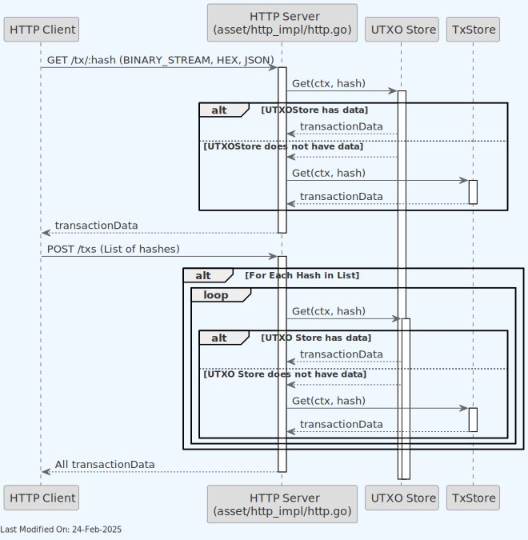

### 4.1.2. GetTransactionMeta()

- **URL**: `/tx/:hash/meta`
- **Method**: GET
- **Response Format**: JSON
- **Content**: Transaction metadata including UTXO information

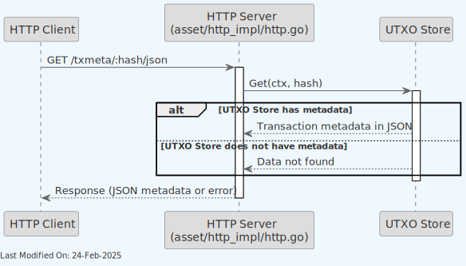

### 4.1.3. GetSubtree()

- **URL**: `/subtree/:hash`
- **Method**: GET
- **Response Format**: JSON
- **Content**: Subtree data with transaction IDs and Merkle root

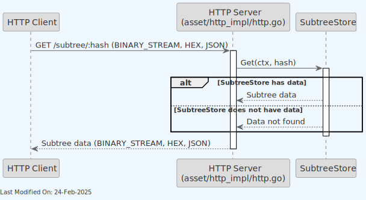

### 4.1.4. GetBlockHeaders(), GetBlockHeader() and GetBestBlockHeader()

- **URL**: `/block/:hash/header` (single), `/blocks/headers` (multiple), `/block/best/header` (best)
- **Method**: GET
- **Response Format**: JSON
- **Content**: Block header data including previous block ID and metadata

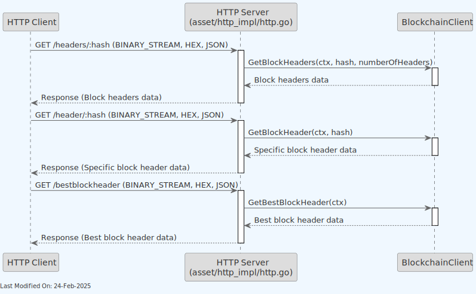

### 4.1.5. GetBlockByHash(), GetBlocks and GetLastNBlocks()

**GetBlockByHash** - Get a single block by hash:

- **URL**: `/api/v1/block/:hash` (also available: `/api/v1/block/:hash/hex`, `/api/v1/block/:hash/json`)
- **Method**: GET
- **URL Parameters**: `hash` - Block hash (64-character hex string)
- **Response Format**: Binary (default), Hex, or JSON
- **Content**: Complete block data with subtree identifiers

**GetBlocks** - Get paginated list of blocks:

- **URL**: `/api/v1/blocks`
- **Method**: GET
- **Query Parameters**:

    - `offset` (integer, optional, default: 0) - Number of blocks to skip from tip
    - `limit` (integer, optional, default: 20, max: 100) - Maximum blocks to return
    - `includeOrphans` (boolean, optional, default: false) - Include orphaned blocks
- **Response Format**: JSON with pagination metadata
- **Content**: Block list with pagination information

**GetLastNBlocks** - Get most recent N blocks:

- **URL**: `/api/v1/lastblocks`
- **Method**: GET
- **Query Parameters**:

    - `n` (integer, optional, default: 10) - Number of blocks to retrieve
    - `fromHeight` (unsigned integer, optional, default: 0) - Starting block height
    - `includeOrphans` (boolean, optional, default: false) - Include orphaned blocks
- **Response Format**: JSON
- **Content**: Array of recent blocks in descending order (newest first)

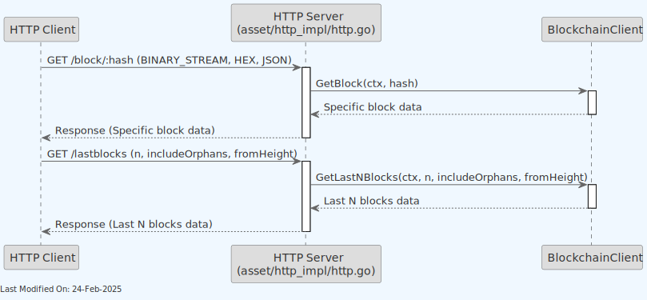

### 4.1.6. GetUTXO() and GetUTXOsByTXID()

- **URL**: `/utxo/:hash` (single UTXO), `/utxos/:hash/json` (UTXOs by transaction ID)
- **Method**: GET
- **Response Format**: JSON
- **Content**: UTXO data with additional metadata for processing

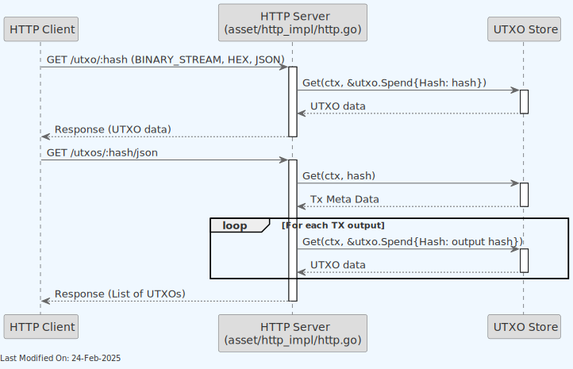

- For specific UTXO by hash requests (/utxo/:hash), the HTTP Server requests UTXO data from the UtxoStore using a hash.

- For getting UTXOs by a transaction ID (/utxos/:hash/json), the HTTP Server requests transaction meta data from the UTXO Store using a transaction hash. Then for each output in the transaction, it queries the UtxoStore to get UTXO data for the corresponding output hash.

### 4.1.7. Search()

Generic hash search. The server searches for a hash in the Blockchain, the UTXO store and the subtree store.

- **URL**: `/search/:hash`
- **Method**: GET
- **Response Format**: JSON
- **Content**: Search results from blockchain, UTXO store, and subtree store

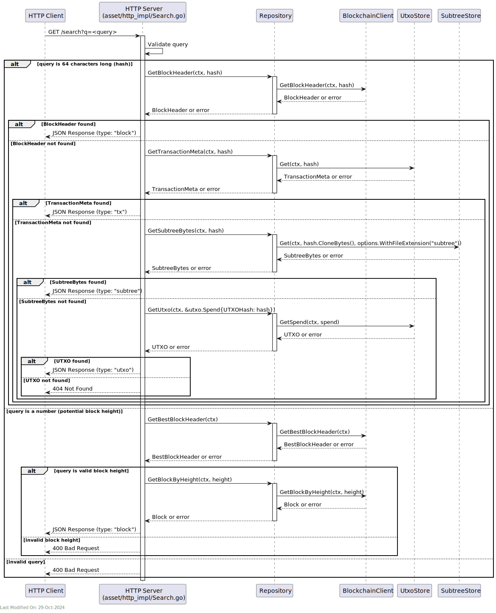

### 4.1.8. GetBlockStats()

Retrieves block statistics.

- **URL**: `/block/:hash/stats`
- **Method**: GET
- **Response Format**: JSON
- **Content**: Block statistics and performance metrics

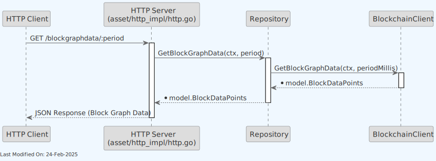

### 4.1.9. GetBlockGraphData()

Retrieves block graph data for a given period

- **URL**: `/blocks/graph/:period`
- **Method**: GET
- **Response Format**: JSON
- **Content**: Block graph data and visualization metrics for specified time period


### 4.1.10. GetBlockForks()

Retrieves information about block forks

- **URL**: `/blocks/forks`
- **Method**: GET
- **Response Format**: JSON
- **Content**: Information about blockchain forks and alternative chains

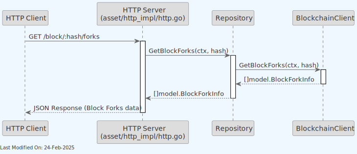

### 4.1.11. GetBlockSubtrees()

Retrieves subtrees for a block in JSON format

- **URL**: `/block/:hash/subtrees`
- **Method**: GET
- **Response Format**: JSON
- **Content**: Subtrees data for a specific block with transaction IDs and Merkle roots

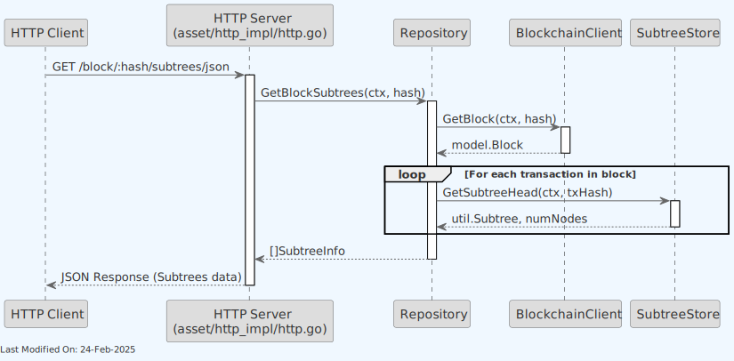

### 4.1.12. GetLegacyBlock()

Retrieves a block in legacy format, and as a binary stream.

- **URL**: `/block_legacy/:hash`
- **Method**: GET
- **Response Format**: Binary stream (application/octet-stream)
- **Content**: Block in legacy Bitcoin protocol format

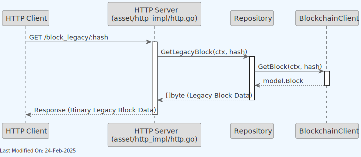

### 4.1.13. GetBlockHeadersToCommonAncestor()

Retrieves block headers up to a common ancestor point between two chains. This is useful for chain reorganization and fork resolution.

- **URL**: `/blocks/headers/ancestor/:hash1/:hash2`
- **Method**: GET
- **Response Format**: JSON
- **Content**: Block headers from two chains up to their common ancestor point

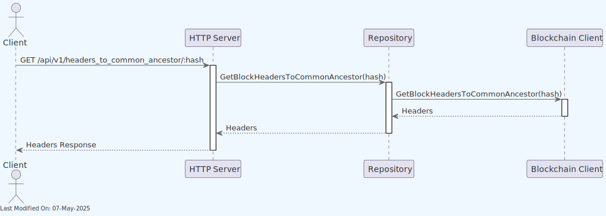

### 4.1.14. FSM State Management

The Asset Server provides an interface to the Finite State Machine (FSM) of the blockchain service. These endpoints allow for monitoring and controlling the blockchain state:

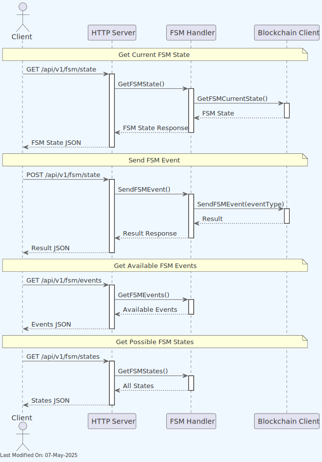

- **GET /api/v1/fsm/state**: Retrieves the current FSM state
- **POST /api/v1/fsm/state**: Sends a custom event to the FSM
- **GET /api/v1/fsm/events**: Lists all available FSM events
- **GET /api/v1/fsm/states**: Lists all possible FSM states

### 4.1.15. Block Validation Management

The Asset Server offers endpoints for block validation control:


- **POST /api/v1/block/invalidate**: Invalidates a specified block
- **POST /api/v1/block/revalidate**: Revalidates a previously invalidated block
- **GET /api/v1/blocks/invalid**: Retrieves a list of invalid blocks

## 5. Technology

Key technologies involved:

1. **Go Programming Language (Golang)**:

    - A statically typed, compiled language known for its simplicity and efficiency, especially in concurrent operations and networked services.
    - The primary language used for implementing the service's logic.

2. **HTTP/HTTPS Protocols**:

    - HTTP for transferring data over the web. HTTPS adds a layer of security with SSL/TLS encryption.
    - Used for communication between clients and the server, and for serving web pages or APIs.

3. **Echo Web Framework**:

    - A high-performance, extensible, minimalist Go web framework.
    - Used for handling HTTP requests and routing, including upgrading HTTP connections to WebSocket connections.
    - Library: github.com/labstack/echo

4. **JSON (JavaScript Object Notation)**:

    - A lightweight data-interchange format, easy for humans to read and write, and easy for machines to parse and generate.
    - Used for structuring data sent to and from clients, especially in contexts where HTTP is used.

## 6. Directory Structure and Main Files

```text
./services/asset
├── Server.go                  # Server logic for the Asset Service.
├── Server_test.go             # Tests for the server functionality.
├── asset_api
│   ├── asset_api.pb.go        # Generated protobuf code for the asset API.
│   └── asset_api.proto        # Protobuf definitions for the asset API.
├── centrifuge_impl            # Implementation using Centrifuge for real-time updates.
│   ├── centrifuge.go          # Core Centrifuge implementation.
│   ├── client
│   │   ├── client.go          # Client-side implementation for Centrifuge.
│   │   └── index.html         # HTML template for client-side rendering.
│   └── websocket.go           # WebSocket implementation for real-time communication.
├── httpimpl                   # HTTP implementation of the asset service.
│   ├── GetBestBlockHeader.go  # Logic to retrieve the best block header.
│   ├── GetBlock.go            # Logic to retrieve a specific block.
│   ├── GetBlockForks.go       # Logic to retrieve information about block forks.
│   ├── GetBlockGraphData.go   # Logic to retrieve block graph data.
│   ├── GetBlockHeader.go      # Logic to retrieve a block header.
│   ├── GetBlockHeaders.go     # Logic to retrieve multiple block headers.
│   ├── GetBlockHeadersToCommonAncestor.go # Logic to retrieve headers to common ancestor.
│   ├── GetBlockStats.go       # Logic to retrieve block statistics.
│   ├── GetBlockSubtrees.go    # Logic to retrieve block subtrees.
│   ├── GetBlocks.go           # Logic to retrieve multiple blocks.
│   ├── GetLastNBlocks.go      # Logic to retrieve the last N blocks.
│   ├── GetLegacyBlock.go      # Logic to retrieve legacy block format.
│   ├── GetNBlocks.go          # Logic to retrieve N blocks from a specific point.
│   ├── GetSubtree.go          # Logic to retrieve a subtree.
│   ├── GetSubtreeTxs.go       # Logic to retrieve transactions in a subtree.
│   ├── GetTransaction.go      # Logic to retrieve a specific transaction.
│   ├── GetTransactionMeta.go  # Logic to retrieve transaction metadata.
│   ├── GetTransactions.go     # Logic to retrieve multiple transactions.
│   ├── GetTxMetaByTXID.go     # Logic to retrieve transaction metadata by TXID.
│   ├── GetUTXO.go             # Logic to retrieve UTXO data.
│   ├── GetUTXOsByTXID.go      # Logic to retrieve UTXOs by a transaction ID.
│   ├── Readmode.go            # Manages read-only mode settings.
│   ├── Search.go              # Implements search functionality.
│   ├── block_handler.go       # Handles block validation operations.
│   ├── blockHeaderResponse.go # Formats block header responses.
│   ├── fsm_handler.go         # Handles FSM state and event operations.
│   ├── helpers.go             # Helper functions for HTTP implementation.
│   ├── http.go                # Core HTTP implementation.
│   ├── metrics.go             # HTTP-specific metrics.
│   ├── sendError.go           # Utility for sending error responses.
│   └── *_test.go files        # Various test files for each component.
└── repository                 # Repository layer managing data interactions.
    ├── GetLegacyBlock.go      # Repository logic for retrieving legacy blocks.
    ├── GetLegacyBlock_test.go # Tests for GetLegacyBlock functionality.
    ├── repository.go          # Core repository implementation.
    └── repository_test.go     # Tests for the repository implementation.
```

## 7. How to run

### 7.1 How to run

To run the Asset Server locally, you can execute the following command:

```shell
SETTINGS_CONTEXT=dev.[YOUR_CONTEXT] go run -Asset=1
```

Please refer to the [Locally Running Services Documentation](../../howto/locallyRunningServices.md) document for more information on running the Asset Server locally.

### 7.2 Configuration Options (Settings Flags)

The Asset Server can be configured using various settings that control its behavior, network connectivity, security features, and performance characteristics. This section provides a comprehensive reference of all configuration options and their interactions.

#### 7.2.1 Core Asset Server Configuration

**HTTP Server Settings:**

- **Asset HTTP Listen Address (`asset_httpListenAddress`)**: Address for the Asset Service HTTP server to listen for requests.
    - Type: `string`
    - Default: `":8090"`
    - Environment Variable: `TERANODE_ASSET_HTTPLISTENADDRESS`
    - Impact: **Critical** - Service will not start without this setting (`"no asset_httpListenAddress setting found"`)
    - Code Usage: Required for HTTP server initialization (Server.go line 184-187)

- **Asset HTTP Address (`asset_httpAddress`)**: Base URL of the Asset Service HTTP server.
    - Type: `string`
    - Default: `"http://localhost:8090/api/v1"`
    - Environment Variable: `TERANODE_ASSET_HTTPADDRESS`
    - Impact: **Critical for Centrifuge** - Required when Centrifuge is enabled; URL validation performed
    - Code Usage: Used for Centrifuge server initialization; validates URL format

- **Asset HTTP Public Address (`asset_httpPublicAddress`)**: Public-facing URL configuration.
    - Type: `string`
    - Default: `""` (empty string)
    - Environment Variable: `TERANODE_ASSET_HTTPPUBLICADDRESS`
    - Impact: Configuration placeholder - not actively used in traced Asset Server code paths

- **Asset API Prefix (`asset_apiPrefix`)**: URL prefix for API routes.
    - Type: `string`
    - Default: `"/api/v1"`
    - Environment Variable: `TERANODE_ASSET_APIPREFIX`
    - Impact: Determines URL structure for all API endpoints
    - Code Usage: Applied to API route groups in HTTP server initialization

- **Asset HTTP Port (`ASSET_HTTP_PORT`)**: HTTP port configuration.
    - Type: `int`
    - Default: `8090`
    - Environment Variable: `ASSET_HTTP_PORT`
    - Impact: Configuration placeholder - not actively used in traced Asset Server code paths

**Response Signing Settings:**

- **Asset Sign HTTP Responses (`asset_sign_http_responses`)**: Enables cryptographic signing of HTTP responses.
    - Type: `bool`
    - Default: `false`
    - Environment Variable: `TERANODE_ASSET_SIGN_HTTP_RESPONSES`
    - Impact: When enabled, requires valid P2P private key; logs errors if key is invalid
    - Code Usage: Controls response signing initialization using P2P private key

**Debug Settings:**

- **Echo Debug (`ECHO_DEBUG`)**: Enables Echo framework debug mode.
    - Type: `bool`
    - Default: `false`
    - Environment Variable: `ECHO_DEBUG`
    - Impact: Enables debug logging and custom logging middleware for HTTP requests
    - Code Usage: Controls Echo debug mode and custom request logging

#### 7.2.2 Centrifuge Real-time Updates Configuration

- **Asset Centrifuge Disable (`asset_centrifuge_disable`)**: Controls Centrifuge server initialization.
    - Type: `bool`
    - Default: `false`
    - Environment Variable: `TERANODE_ASSET_CENTRIFUGE_DISABLE`
    - Impact: When `true`, disables real-time WebSocket functionality entirely
    - Code Usage: Controls conditional Centrifuge server creation (Server.go line 204)

- **Asset Centrifuge Listen Address (`asset_centrifugeListenAddress`)**: WebSocket server listen address.
    - Type: `string`
    - Default: `":8892"`
    - Environment Variable: `TERANODE_ASSET_CENTRIFUGELISTENADDRESS`
    - Impact: Determines Centrifuge WebSocket server listening address when enabled
    - Code Usage: Used for Centrifuge server address configuration

**Centrifuge Subscription Channels:**

Centrifuge supports the following subscription channels:

- `ping`: For connection health checks
- `block`: For new block notifications
- `subtree`: For Merkle tree updates
- `mining_on`: For mining status updates

#### 7.2.3 Security Configuration (Global Settings)

**HTTPS Settings:**

- **Security Level HTTP (`securityLevelHTTP`)**: Determines HTTP vs HTTPS mode.
    - Type: `int`
    - Default: `0`
    - Environment Variable: `TERANODE_SECURITYLEVELHTTP`
    - Impact: `0` = HTTP mode, non-zero = HTTPS mode
    - Code Usage: Controls server startup mode selection (HTTP vs HTTPS)

- **Server Certificate File (`server_certFile`)**: TLS certificate file path.
    - Type: `string`
    - Default: `""` (empty string)
    - Environment Variable: `TERANODE_SERVER_CERTFILE`
    - Impact: **Required for HTTPS** - Service returns configuration error if missing when HTTPS enabled
    - Code Usage: Used for HTTPS server startup; validated when securityLevelHTTP is non-zero

- **Server Key File (`server_keyFile`)**: TLS private key file path.
    - Type: `string`
    - Default: `""` (empty string)
    - Environment Variable: `TERANODE_SERVER_KEYFILE`
    - Impact: **Required for HTTPS** - Service returns configuration error if missing when HTTPS enabled
    - Code Usage: Used for HTTPS server startup; validated when securityLevelHTTP is non-zero

**P2P Settings for Response Signing:**

- **P2P HTTP Address (`p2p_httpAddress`)**: P2P server HTTP address for WebSocket connection.
    - Type: `string`
    - Default: `""` (empty string)
    - Environment Variable: `TERANODE_P2P_HTTPADDRESS`
    - Impact: **Required for Centrifuge** - Centrifuge server cannot start without valid P2P connection
    - Code Usage: Used for P2P WebSocket listener initialization

- **P2P Private Key (`p2p_private_key`)**: Private key for HTTP response signing.
    - Type: `string`
    - Default: `""` (empty string)
    - Environment Variable: `TERANODE_P2P_PRIVATE_KEY`
    - Impact: Used for HTTP response signing when `asset_sign_http_responses` is enabled
    - Code Usage: Decoded and used for cryptographic signing; errors logged if invalid

#### 7.2.4 Configuration Dependencies and Interactions

**HTTP Server Operation:**

- **Primary Setting**: `asset_httpListenAddress` (required)
- **HTTPS Dependencies**: `securityLevelHTTP`, `server_certFile`, `server_keyFile`
- **Interaction**: HTTPS mode requires both certificate and key files; missing files cause configuration errors

**Centrifuge Real-time Updates:**

- **Primary Setting**: `asset_centrifuge_disable` (controls feature)
- **Dependencies**: `asset_centrifugeListenAddress`, `asset_httpAddress`
- **Interaction**: When enabled, requires valid HTTP address and listen address; URL validation performed

Centrifuge supports the following subscription channels:

- `ping`: For connection health checks
- `block`: For new block notifications
- `subtree`: For Merkle tree updates
- `mining_on`: For mining status updates

**HTTP Response Signing:**

- **Primary Setting**: `asset_sign_http_responses` (enables feature)
- **Dependency**: `p2p_private_key`
- **Interaction**: Requires valid P2P private key; invalid keys logged as errors but don't prevent startup

#### 7.2.5 Error Conditions and Validation

**Configuration Errors from Code:**

```text
Error: "no asset_httpListenAddress setting found"
Cause: Missing or empty asset_httpListenAddress setting
```

```text
Error: "asset_httpAddress not found in config"
Cause: Missing asset_httpAddress when Centrifuge is enabled
```

```text
Error: "asset_httpAddress is not a valid URL"
Cause: Invalid URL format in asset_httpAddress setting
```

```text
Error: "server_certFile is required for HTTPS"
Cause: Missing server_certFile when securityLevelHTTP is non-zero
```

```text
Error: "server_keyFile is required for HTTPS"
Cause: Missing server_keyFile when securityLevelHTTP is non-zero
```

#### 7.2.6 Environment Variables

**Standard Environment Variables:**

- `TERANODE_ASSET_HTTPLISTENADDRESS` - HTTP server listen address
- `TERANODE_ASSET_HTTPADDRESS` - Base HTTP server URL
- `TERANODE_ASSET_HTTPPUBLICADDRESS` - Public-facing URL
- `TERANODE_ASSET_APIPREFIX` - API URL prefix
- `TERANODE_ASSET_CENTRIFUGE_DISABLE` - Disable Centrifuge service
- `TERANODE_ASSET_CENTRIFUGELISTENADDRESS` - Centrifuge listen address
- `TERANODE_ASSET_SIGN_HTTP_RESPONSES` - Enable response signing
- `TERANODE_SECURITYLEVELHTTP` - HTTP security level
- `TERANODE_SERVER_CERTFILE` - TLS certificate file
- `TERANODE_SERVER_KEYFILE` - TLS private key file
- `TERANODE_P2P_HTTPADDRESS` - P2P server HTTP address
- `TERANODE_P2P_PRIVATE_KEY` - P2P private key for signing

**Special Environment Variables:**

- `ECHO_DEBUG` - Echo framework debug mode
- `ASSET_HTTP_PORT` - HTTP port (configuration placeholder)

#### 7.2.7 Dependency Configuration

The Asset Server depends on several services for data access. These must be properly configured for the Asset Server to function:

| Service | Setting | Description | Required |
|---------|---------|-------------|----------|
| UTXO Store | `utxostore` | Connection URL for UTXO data | Yes |
| Transaction Store | `txstore` | Connection URL for transaction data | Yes |
| Subtree Store | `subtreestore` | Connection URL for Merkle subtree data | Yes |
| Block Persister Store | `block_persisterStore` | Connection URL for persisted block data | Yes |
| Blockchain Client | `blockchain_grpcAddress` | gRPC connection for blockchain service | Yes |

**Example Dependency Configuration:**

```bash
utxostore=aerospike://localhost:3000/test?set=utxo
txstore=blob://localhost:8080/tx
subtreestore=blob://localhost:8080/subtree
block_persisterStore=blob://localhost:8080/blocks
blockchain_grpcAddress=localhost:8082
```

#### 7.2.8 Environment Variable Examples

All configuration options can be set using environment variables with the prefix `TERANODE_`. For example:

```bash
export TERANODE_ASSET_HTTPLISTENADDRESS=:8090
export TERANODE_SECURITYLEVELHTTP=1
export TERANODE_SERVER_CERTFILE=/path/to/cert.pem
```

### 7.3 Configuration Examples

For comprehensive configuration documentation including all settings, defaults, and interactions, see the [asset Server Settings Reference](../../references/settings/services/asset_settings.md).

### 7.4 FSM Configuration

- **fsm_state_restore**: Enables or disables the restore state for the Finite State Machine.
    - Example: `fsm_state_restore=false`
- **FSM Functionality**: The FSM provides state management for the blockchain system with endpoints for querying and manipulating states.

### 7.5 Coinbase Configuration

- **coinbase_grpcAddress**: gRPC address for coinbase-related operations.
    - Example: `coinbase_grpcAddress=localhost:50051`

### 7.6 Dashboard Configuration

- **dashboard_enabled**: Enables or disables the Teranode dashboard UI.
    - Example: `dashboard_enabled=true`
- **Dashboard Features**: Dashboard-related settings control authentication and user interface features.

### 7.7 Block Validation

- **Block Management**: The Asset Server provides endpoints to invalidate and revalidate blocks, which is useful for managing forks and recovering from errors.

## 8. Other Resources

[Asset Reference](../../references/services/asset_reference.md)
