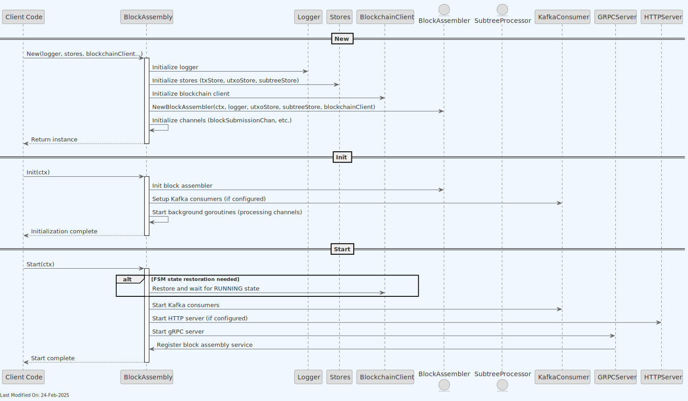
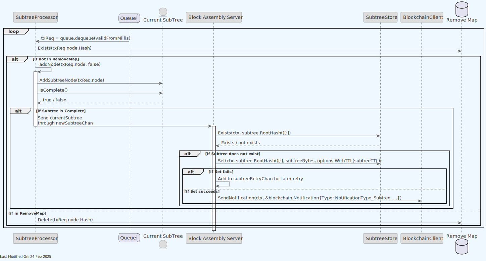
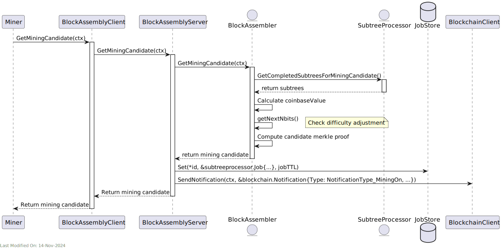
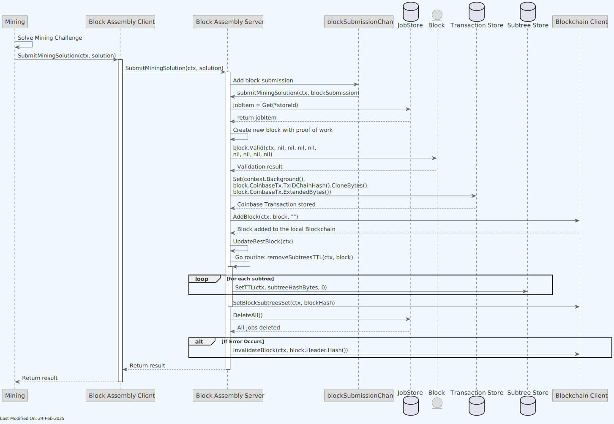
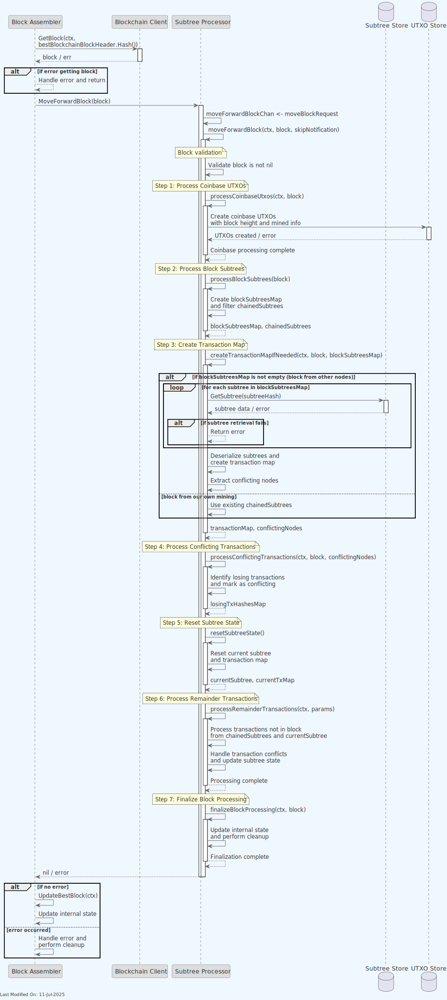
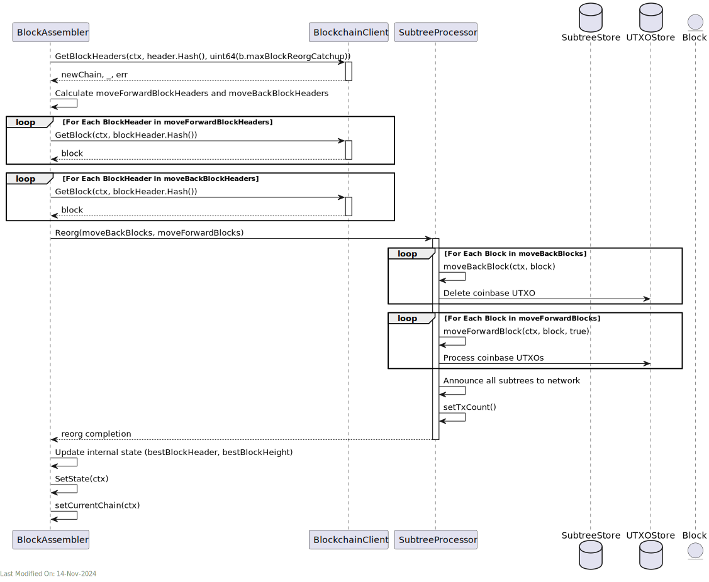
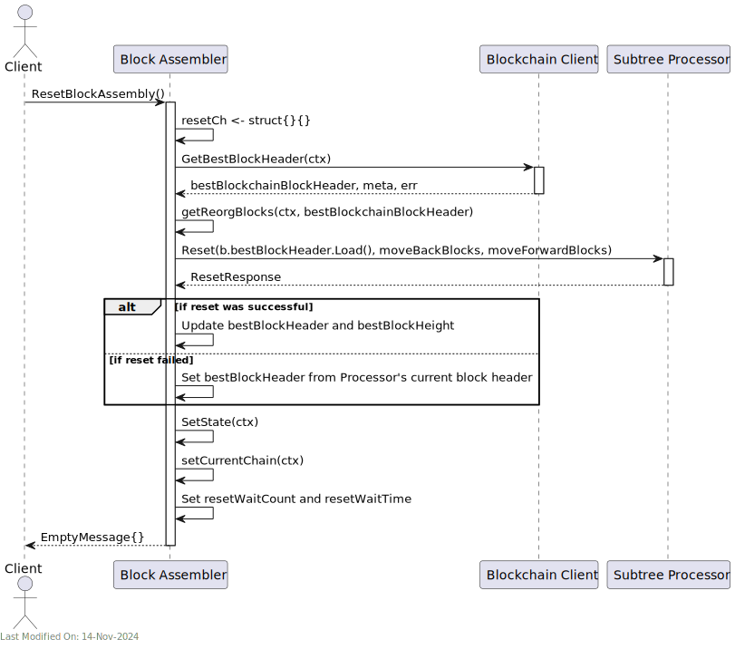

# 📦 Block Assembly Service

## Index

1. [Description](#1-description)
2. [Functionality](#2-functionality)
    - [2.1. Starting the Block Assembly Service](#21-starting-the-block-assembly-service)
    - [2.2. Receiving Transactions from the TX Validator Service](#22-receiving-transactions-from-the-tx-validator-service)
    - [2.3. Grouping Transactions into Subtrees](#23-grouping-transactions-into-subtrees)
    - [2.3.1 Dynamic Subtree Size Adjustment](#231-dynamic-subtree-size-adjustment)
    - [2.4. Creating Mining Candidates](#24-creating-mining-candidates)
    - [2.5. Submit Mining Solution](#25-submit-mining-solution)
    - [2.6. Processing Subtrees and Blocks from other Nodes and Handling Forks and Conflicts](#26-processing-subtrees-and-blocks-from-other-nodes-and-handling-forks-and-conflicts)
    - [2.6.1. The block received is the same as the current chaintip (i.e. the block we have already seen).](#261-the-block-received-is-the-same-as-the-current-chaintip-ie-the-block-we-have-already-seen)
    - [2.6.2. The block received is a new block, and it is the new chaintip.](#262-the-block-received-is-a-new-block-and-it-is-the-new-chaintip)
    - [2.6.3. The block received is a new block, but it represents a fork.](#263-the-block-received-is-a-new-block-but-it-represents-a-fork)
    - [Fork Detection and Assessment](#fork-detection-and-assessment)
    - [Chain Selection and Reorganization Process](#chain-selection-and-reorganization-process)
    - [2.8. Resetting the Block Assembly](#28-resetting-the-block-assembly)
3. [Data Model](#3-data-model)
4. [gRPC Protobuf Definitions](#4-grpc-protobuf-definitions)
5. [Technology](#5-technology)
6. [Error Handling](#6-error-handling)
    - [6.1. Error Handling Patterns](#61-error-handling-patterns)
    - [6.2. Performance Monitoring](#62-performance-monitoring)
7. [Directory Structure and Main Files](#7-directory-structure-and-main-files)
8. [How to run](#8-how-to-run)
9. [Configuration options (settings flags)](#9-configuration-options-settings-flags)
10. [Other Resources](#10-other-resources)

## 1. Description

The Block Assembly Service is responsible for assembling new blocks and adding them to the blockchain.  The block assembly process involves the following steps:

1. **Receiving Transactions from the TX Validator Service**:

    - The block assembly module receives new transactions from the transaction validator service.

2. **Grouping Transactions into Subtrees**:

    - The received transactions are grouped into subtrees.
    - Subtrees represent a hierarchical structure that organizes transactions for more efficient processing and inclusion in a block.

3. **Broadcasting Subtrees to Other Nodes**:

    - Once subtrees are formed, they are broadcasted to other nodes in the network. This is initiated by the block assembly service, which sends a notification to the P2P service (via the Blockchain Service).
    - This step is crucial for maintaining network synchronization and ensuring all nodes have the latest set of subtrees, prior to receiving a block with those subtrees in them. The nodes can validate the subtrees and ensure that they are valid before they are included in a block.

4. **Creating Mining Candidates**:

    - The block assembly continuously creates mining candidates.
    - A mining candidate is essentially a potential block that includes all the subtrees known up to that time, built on top of the longest honest chain.
    - This candidate block is then submitted to the mining module of the node.

5. **Mining Process**:

    - The mining module attempts to find a solution to the cryptographic challenge (proof of work) associated with the mining candidate.
    - If the miner successfully solves the puzzle before other nodes in the network, the block is considered valid and ready to be added to the blockchain.

6. **Adding the Block to the Blockchain**:

    - Once a mining solution is found, the new block is added to the blockchain.

7. **Notifying Other Nodes of the New Block**:

    - After successfully adding the block, other nodes in the network are notified of the new block.

8. **Handling Forks and Conflicts**:

    - The node also handles the resolution of forks in the blockchain and conflicting subtrees or blocks mined by other nodes.
    - This involves choosing between different versions of the blockchain (in case of forks) and resolving conflicts in transactions and subtrees included in other nodes' blocks.

> **Note**: For information about how the Block Assembly service is initialized during daemon startup and how it interacts with other services, see the [Teranode Daemon Reference](../../references/teranodeDaemonReference.md#service-initialization-flow).

A high level diagram:


Based on its settings, the Block Assembly receives TX notifications from the validator service via direct gRPC calls.

The Block Assembly service also subscribes to the Blockchain service, and receives notifications when a new subtree or block is received from another node.


### Detailed Component Diagram

The detailed component diagram below shows the internal architecture of the Block Assembly Service with code-verified connections:


Finally, note that the Block Assembly benefits of the use of Lustre Fs (filesystem). Lustre is a type of parallel distributed file system, primarily used for large-scale cluster computing. This filesystem is designed to support high-performance, large-scale data storage and workloads.

Specifically for Teranode, these volumes are meant to be temporary holding locations for short-lived file-based data that needs to be shared quickly between various services.

Teranode microservices make use of the Lustre file system in order to share subtree and tx data, eliminating the need for redundant propagation of subtrees over grpc or message queues. The services sharing Subtree data through this system can be seen here:


## 2. Functionality

### 2.1. Starting the Block Assembly Service



The Block Assembly service initialisation involves setting up internal communication channels and external communication channels, and instantiating the Subtree Processor and Job Store.

The SubTree Processor is the component that groups transactions into subtrees.

The Job Store is a temporary in-memory map that tracks information about the candidate blocks that the miners are attempting to find a solution for.

#### 2.1.1. Loading Unmined Transactions on Startup

When the Block Assembly service starts, it automatically recovers unmined transactions from the UTXO store to ensure continuity across service restarts. This functionality is crucial for maintaining transaction processing reliability.


**Process Overview:**

1. **Wait for Pending Blocks**: The service first ensures all pending blocks are processed to avoid conflicts
2. **Load Unmined Transactions**: Uses the `UnminedTxIterator` to retrieve all transactions marked with the `unminedSince` flag
3. **Order by Creation Time**: Transactions are sorted topologically by their `createdAt` timestamp to maintain proper dependencies
4. **Re-add to Processing**: Each unmined transaction is added back to the subtree processor using `AddDirectly()`
5. **Unlock Transactions**: Previously locked transactions are unlocked to allow processing

This recovery mechanism ensures that:

- Transactions accepted but not yet mined persist across restarts
- Network participants don't need to resubmit transactions after node restarts
- The transaction processing pipeline maintains continuity

### 2.2. Receiving Transactions from the TX Validator Service


- The TX Validator interacts with the Block Assembly Client. Based on configuration, we send either transactions in batches or individually. This communication is performed over gRPC.
- The Block Assembly client then delegates to the Server, which adds the transactions to the Subtree Processor.
- At a later stage, the Subtree Processor will group the transactions into subtrees, which will be used to create mining candidates.

### 2.3. Grouping Transactions into Subtrees



- The Subtree Processor dequeues any transaction request (txReq) received in the previous section, and adds it to the latest (current) subtree.
- If the current subtree is complete (i.e. if it has reached the target length, say 1M transactions), it sends the subtree to the server through an internal Go channel (newSubtreeChan).
- The server then checks if the subtree already exists in the Subtree Store. Otherwise, the server persists the new subtree in the store with a specified (and settings-driven) TTL (Time-To-Live).
- Finally, the server sends a notification to the BlockchainClient to announce the new subtree. This will be propagated to other nodes via the P2P service.

### 2.3.1 Dynamic Subtree Size Adjustment

The Block Assembly service can dynamically adjust the subtree size based on real-time performance metrics when enabled via configuration:

- The system targets a rate of approximately one subtree per second under high throughput conditions
- If subtrees are being created too quickly, the size is automatically increased
- If subtrees are being created too slowly, the size is decreased
- Adjustments are always made to a power of 2 and constrained by minimum and maximum bounds
- Size increases are capped at 2x per block to prevent wild oscillations

Importantly, the system maintains a minimum subtree size threshold, configured via `minimum_merkle_items_per_subtree`. In low transaction volume scenarios, subtrees will only be created once enough transactions have accumulated to meet this minimum size requirement. This means that during periods of low network usage, the target rate of one subtree per second may not be achieved, as the system prioritizes reaching the minimum subtree size before sending.


This self-tuning mechanism helps maintain consistent processing rates and optimal resource utilization during block assembly, automatically adapting to the node's current processing capabilities and transaction volumes.

### 2.4. Creating Mining Candidates



- The "Miner" initiates the process by requesting a mining candidate (a block to mine) from the Block Assembly.
- The "Block Assembler" sub-component interacts with the Subtree Processor to obtain completed subtrees that can be included in the mining candidate. It must be noted that there is no subtree limit, Teranode has no restrictions on the maximum block size (hence, neither on the number of subtrees).
- The Block Assembler then calculates the coinbase value and merkle proof for the candidate block.
- The mining candidate, inclusive of the list of subtrees, a coinbase TX, a merkle proof, and associated fees, is returned back to the miner.
- The Block Assembly Server makes status announcements, using the Status Client, about the mining candidate's height and previous hash.
- Finally, the Server tracks the current candidate in the JobStore within a new "job" and its TTL. This information will be retrieved at a later stage, if and when the miner submits a solution to the mining challenge for this specific mining candidate.

### 2.5. Submit Mining Solution

Once a miner solves the mining challenge, it submits a solution to the Block Assembly Service. The solution includes the nonce required to solve the mining challenge.



- The "Mining" service submits a mining solution (based on a previously provided "mining candidate") to the Block Assembly Service.
- The Block Assembly server adds the submission to a channel (blockSubmissionCh) and processes the submission (submitMiningSolution).
- The job item details are retrieved from the JobStore, and a new block is created with the miner's proof of work.
- The block is validated, and if valid, the coinbase transaction is persisted in the Tx Store.

- The block is added to the blockchain via the Blockchain Client. This will be propagated to other nodes via the P2P service.

- Subtree TTLs are removed, effectively setting the subtrees for removal from the Subtree Store.
- All jobs in the Job Store are deleted.
- In case of an error at any point in the process, the block is invalidated through the Blockchain Client.

### 2.6. Processing Subtrees and Blocks from other Nodes and Handling Forks and Conflicts

The block assembly service subscribes to the Blockchain service, and receives notifications (`model.NotificationType_Block`) when a new block is received from another node. The logic for processing these blocks can be found in the `BlockAssembler.go` file, `startChannelListeners` function.

Once a new block has been received from another node, there are 4 scenarios to consider:

### 2.6.1. The block received is the same as the current chaintip (i.e. the block we have already seen)

In this case, the block notification is redundant, and refers to a block that the service already considers the current chaintip. The service does nothing.

### 2.6.2. The block received is a new block, and it is the new chaintip

In this scenario, another node has mined a new block that is now the new chaintip.

The service needs to "move up" the block. By this, we mean the process to identify transactions included in the new block (so we do not include them in future blocks) and to process the coinbase UTXOs (so we can include them in future blocks).



1. **Checking for the Best Block Header**:

    - The `BlockAssembler` logs information indicating that the best block header (the header of the most recent block in the chain) is the same as the previous one. It then attempts to "move up" to this new block.

2. **Getting the Block from Blockchain Client**:

    - `b.blockchainClient.GetBlock(ctx, bestBlockchainBlockHeader.Hash())` fetches the block corresponding to the best blockchain block header.

3. **Processing the Block in SubtreeProcessor**:

    - `b.subtreeProcessor.MoveForwardBlock(block)` is called, which initiates the process of updating the subtree processor with the new block.

4. **SubtreeProcessor Handling**:

    - In `MoveForwardBlock`, a channel for error handling is set up and a `moveBlockRequest` is sent to `moveForwardBlockChan`.
    - This triggers the `case moveForwardReq := <-stp.moveForwardBlockChan` in `SubtreeProcessor`, which handles the request to move up a block.
    - `stp.moveForwardBlock(ctx, moveForwardReq.block, false)` is called, which is where the main logic of handling the new block is executed.

5. **MoveForwardBlock Functionality**:

    The `moveForwardBlock` function is a comprehensive process that handles the integration of a new block into the Block Assembly service. This function performs seven distinct processing steps to ensure proper blockchain state management and transaction processing.

    **Initial Validation and Setup**:

    - When `moveForwardBlock` is invoked, it receives a `block` object as a parameter and performs validation checks to ensure the block is not nil and is valid for processing.
    - Error handling is implemented throughout the process, with proper error propagation and cleanup mechanisms.

    **Step 1: Process Coinbase UTXOs** (`processCoinbaseUtxos`):

    - Handles the coinbase transaction (the first transaction in a block, used to reward miners)
    - Creates and stores coinbase UTXOs in the UTXO store with proper block height and mined block information
    - Implements duplicate coinbase transaction handling for the two known duplicate coinbase transactions on the network
    - Includes comprehensive error handling for UTXO creation failures

    **Step 2: Process Block Subtrees** (`processBlockSubtrees`):

    - Creates a reverse lookup map (`blockSubtreesMap`) of all subtrees contained in the received block
    - Filters and separates chained subtrees that were not included in the block
    - This separation is crucial for distinguishing between blocks from other nodes vs. blocks from own mining

    **Step 3: Create Transaction Map** (`createTransactionMapIfNeeded`):

    - **For blocks from other nodes**: Retrieves subtree data from the Subtree Store for each subtree in the block
        - Deserializes subtree data and creates a comprehensive transaction map
        - Extracts conflicting nodes that may cause transaction conflicts
    - **For blocks from own mining**: Uses existing chained subtrees without store retrieval
        - Implements error handling for subtree retrieval failures

    **Step 4: Process Conflicting Transactions** (`processConflictingTransactions`):

    - Identifies transactions that conflict with those in the received block
    - Creates a map of losing transaction hashes that need to be marked as conflicting
    - Ensures proper conflict resolution to maintain blockchain integrity

    **Step 5: Reset Subtree State** (`resetSubtreeState`):

    - Resets the current subtree and transaction map to prepare for new transaction processing
    - Clears previous state to ensure clean processing of remaining transactions
    - Returns the reset current subtree and transaction map for further processing

    **Step 6: Process Remainder Transactions** (`processRemainderTransactions`):

    - Processes transactions that were not included in the received block
    - Handles transactions from both chained subtrees and the current subtree
    - Manages transaction conflicts and updates subtree state accordingly
    - Ensures that pending transactions are properly carried over for inclusion in future blocks

    **Step 7: Finalize Block Processing** (`finalizeBlockProcessing`):

    - Updates internal state variables and performs necessary cleanup operations
    - Ensures the Block Assembly service is ready for the next block processing cycle
    - Completes the integration of the new block into the service's state

    **Error Handling and Recovery**:

    - Each step includes comprehensive error handling with proper error propagation
    - Failed operations result in appropriate error messages and cleanup procedures
    - The function ensures that partial processing failures don't leave the service in an inconsistent state

    **Performance Considerations**:

    - The function uses concurrent processing where appropriate to optimize performance
    - Subtree retrieval and processing are optimized to handle large blocks efficiently
    - Memory management is carefully handled to prevent resource leaks during processing

### 2.6.3. The block received is a new block, but it represents a fork

In this scenario, the function needs to handle a reorganization. A blockchain reorganization occurs when a node discovers a longer or more difficult chain different from the current local chain. This can happen due to network delays or forks in the blockchain network.

It is the responsibility of the block assembly to always build on top of the longest chain of work. For clarity, it is not the Block Validation or Blockchain services's responsibility to resolve forks. The Block Assembly is notified of the ongoing chains of work, and it makes sure to build on the longest one. If the longest chain of work is different from the current local chain the block assembly was working on, a reorganization will take place.

#### Fork Detection and Assessment

The Block Assembly service implements real-time fork detection through the following mechanisms:

- **Real-time Block Monitoring**: Implemented via `blockchainSubscriptionCh` in the Block Assembler, which continuously monitors for new blocks and chain updates.

**Fork Detection Criteria**: The Block Assembly service uses three main criteria to detect and handle forks:

1. **Chain Height Tracking**:

    - Maintains current blockchain height through `bestBlockHeight`
    - Compares incoming block heights with current chain tip
    - Used to determine if incoming blocks represent a longer chain

2. **Block Hash Verification**:

    - Uses `HashPrevBlock` to verify block connectivity
    - Ensures each block properly references its predecessor
    - Helps identify where chains diverge

3. **Reorganization Size Protection**:

    - Monitors the size of potential chain reorganizations
    - If a reorganization would require moving more than 5 blocks either backwards or forwards
    - AND the current chain height is greater than 1000 blocks
    - Triggers a full reset of the block assembler as a safety measure against deep reorganizations

The `BlockAssembler` keeps the node synchronized with the network by identifying and switching to the strongest chain (the one with the most accumulated proof of work), ensuring all nodes in the network converge on the same transaction history.

#### Chain Selection and Reorganization Process

During a reorganization, the `BlockAssembler` performs two key operations:

1. Removes (rolls back) transactions from blocks in the current chain, starting from where the fork occurred
2. Applies transactions from the new chain's blocks, ensuring the node switches to the stronger chain

The service automatically manages chain selection through:

1. **Best Chain Detection**:

    - Continuously monitors for new best block headers
    - Compares incoming blocks against current chain tip
    - Automatically triggers reorganization when a better chain is detected

2. **Chain Selection Process**:

    - Accepts the chain with the most accumulated proof of work
    - Performs a safety check on reorganization depth:

        - If the reorganization involves more than 5 blocks in either direction
        - And the current chain height is greater than 1000
        - The block assembler will reset rather than attempt the reorganization

    - Block validation and transaction verification are handled by other services, not the Block Assembly

3. **Chain Switching Process**:

    - Identifies common ancestor between competing chains
    - Rolls back the current chain to a common point with the competing (and stronger) chain
    - Applies new blocks from the competing chain
    - Updates UTXO set and transaction pools accordingly



The following diagram illustrates how the Block Assembly service handles a chain reorganization:

- `err = b.handleReorg(ctx, bestBlockchainBlockHeader)`:

  - Calls the `handleReorg` method, passing the current context (`ctx`) and the new best block header from the blockchain network.
  - The reorg process involves rolling back to the last common ancestor block and then adding the new blocks from the network to align the `BlockAssembler`'s blockchain state with the network's state.

- **Getting Reorg Blocks**:

  - `moveBackBlocks, moveForwardBlocks, err := b.getReorgBlocks(ctx, header)`:

    - Calls `getReorgBlocks` to determine the blocks to move down (to revert) and move up (to apply) for aligning with the network's consensus chain.
    - `header` is the new block header that triggered the reorg.
    - This step involves finding the common ancestor and getting the blocks from the current chain (move down) and the new chain (move up).

  - **Performing Reorg in Subtree Processor**:

    - `b.subtreeProcessor.Reorg(moveBackBlocks, moveForwardBlocks)`:

      - Executes the actual reorg process in the `SubtreeProcessor`, responsible for managing the blockchain's data structure and state.
      - The function reverts the coinbase Txs associated to invalidated blocks (deleting their UTXOs).
        - This step involves reconciling the status of transactions from reverted and new blocks, and coming to a curated new current subtree(s) to include in the next block to mine.

Note: If other nodes propose blocks containing a transaction that Teranode has identified as a double-spend (based on the First-Seen rule), Teranode will only build on top of such blocks when the network has reached consensus on which transaction to accept, even if it differs from Teranode's initial first-seen assessment. For more information, please review the [Double Spend Detection documentation](../architecture/understandingDoubleSpends.md).

### 2.7. Unmined Transaction Cleanup

The Block Assembly service periodically cleans up old unmined transactions to prevent unbounded growth of the UTXO store. This cleanup process is essential for maintaining system performance and preventing resource exhaustion.


**Cleanup Process:**

1. **Periodic Trigger**: A background ticker (`unminedCleanupTicker`) runs at configured intervals
2. **Age-Based Selection**: Identifies unmined transactions older than the retention period using `QueryOldUnminedTransactions`
3. **Parent Preservation**: Protects parent transactions of younger unmined transactions from deletion
4. **Batch Deletion**: Removes eligible transactions in batches to minimize performance impact

**Configuration:**

- **Retention Period**: Configured via `UnminedTxRetention` settings
- **Cleanup Interval**: Controlled by the cleanup ticker configuration
- **Parent Protection**: Uses `PreserveTransactions` to mark parents that should be retained

This cleanup mechanism ensures the UTXO store remains performant while preserving transaction dependencies.

### 2.8. Resetting the Block Assembly

The Block Assembly service can be reset to the best block by calling the `ResetBlockAssembly` gRPC method.

1. **State Storage and Retrieval**:

    - `bestBlockchainBlockHeader, meta, err = b.blockchainClient.GetBestBlockHeader(ctx)`: Retrieves the best block header from the blockchain along with its metadata.

2. **Resetting Block Assembly**:

    - The block assembler resets to the new best block header with its height and details.
    - It then calculates which blocks need to be moved down or up to align with the new best block header (`getReorgBlocks`).

3. **Processing the Reorganization**:

    - It attempts to reset the `subtreeProcessor` with the new block headers. If there's an error during this reset, it logs the error, and the block header is re-set to match the `subtreeProcessor`'s current block header.

4. **Updating Assembly State**:

    - Updates internal state with the new best block header and adjusts the height of the best block based on how many blocks were moved up and down.
    - Attempts to set the new state and current blockchain chain.



## 3. Data Model

- [Block Data Model](../datamodel/block_data_model.md): Contain lists of subtree identifiers.
- [Subtree Data Model](../datamodel/subtree_data_model.md): Contain lists of transaction IDs and their Merkle root.
- [UTXO Data Model](../datamodel/utxo_data_model.md): Include additional metadata to facilitate processing.

## 4. gRPC Protobuf Definitions

The Block Assembly Service uses gRPC for communication between nodes. The protobuf definitions used for defining the service methods and message formats can be seen in the [Block Assembly Protobuf Reference](../../references/protobuf_docs/blockassemblyProto.md).

## 5. Technology

- **Go (Golang)**: The service is written in Go.

- **gRPC**: For communication between different services, gRPC is commonly used.

- **Kafka**: Used for tx message queuing and streaming, Kafka can efficiently handle the high throughput of transaction data in a distributed manner.

- **Configuration Management (gocore)**: Uses `gocore` for configuration management, allowing dynamic configuration of service parameters.

- **Networking and Protocol Buffers**: Handles network communications and serializes structured data using Protocol Buffers, a language-neutral, platform-neutral, extensible mechanism for serializing structured data.

## 6. Error Handling

### 6.1. Error Handling Patterns

The Block Assembly service implements robust error handling across multiple layers:

#### Block Validation Errors

- **Mining Solution Validation**: When `SubmitMiningSolution` is called, the service performs comprehensive block validation including difficulty target verification
- **Invalid Block Handling**: Failed validations are logged with detailed error messages and the mining solution is rejected
- **Recovery**: The service continues processing other mining candidates without interruption

#### Subtree Storage Failures

- **Retry Mechanism**: Failed subtree storage operations are automatically retried using `subtreeRetryChan`
- **Error Propagation**: Storage errors are communicated back through error channels to prevent data loss
- **Graceful Degradation**: The service can continue operating with reduced functionality if storage issues persist

#### Reorganization Conflicts

- **Conflicting Transaction Detection**: During reorgs, the service identifies and marks conflicting transactions in affected subtrees
- **Transaction Recovery**: Non-conflicting transactions are automatically re-added to new subtrees
- **Deep Reorg Protection**: Reorganizations affecting more than 5 blocks trigger a full service reset for safety

#### UTXO Store Unavailability

- **Connection Monitoring**: The service monitors UTXO store connectivity and handles temporary unavailability
- **Operation Queuing**: Transactions are queued when UTXO operations fail temporarily
- **State Consistency**: The service ensures consistent state even during UTXO store recovery

### 6.2. Performance Monitoring

The service integrates comprehensive Prometheus metrics for operational monitoring:

#### Subtree Processing Metrics

- `teranode_subtreeprocessor_add_tx`: Counter for transaction additions
- `teranode_subtreeprocessor_dynamic_subtree_size`: Current dynamic subtree size
- `teranode_subtreeprocessor_move_forward_block`: Block processing operations
- `teranode_subtreeprocessor_move_back_block`: Block rollback operations

#### Block Assembly Metrics

- `teranode_blockassembly_get_mining_candidate`: Mining candidate requests
- `teranode_blockassembly_submit_mining_solution`: Mining solution submissions
- Duration histograms for critical operations with microsecond precision

#### State Monitoring

- Current service state (starting, running, resetting, etc.)
- Transaction queue lengths and processing rates
- Subtree counts and completion rates

## 7. Directory Structure and Main Files

```text
/services/blockassembly
├── BlockAssembler.go              - Main logic for assembling blocks.
├── BlockAssembler_test.go         - Tests for BlockAssembler.go.
├── Client.go                      - Client-side logic for block assembly.
├── Interface.go                   - Interface definitions for block assembly.
├── Server.go                      - Server-side logic for block assembly.
├── Server_test.go                 - Tests for Server.go.
├── blockassembly_api              - Directory for block assembly API.
│   ├── blockassembly_api.pb.go    - Generated protobuf code.
│   ├── blockassembly_api.proto    - Protobuf definitions.
│   ├── blockassembly_api_grpc.pb.go - gRPC generated code.
├── blockassembly_system_test.go   - System-level integration tests.
├── data.go                        - Data structures used in block assembly.
├── data_test.go                   - Tests for data.go.
├── metrics.go                     - Metrics collection for block assembly.
├── mining                         - Directory for mining-related functionality.
├── remotettl.go                   - Management of remote TTL (Time To Live) values.
└── subtreeprocessor               - Directory for subtree processing.
    ├── SubtreeProcessor.go        - Main logic for processing subtrees.
    ├── SubtreeProcessor_test.go   - Tests for SubtreeProcessor.go.
    ├── metrics.go                 - Metrics specific to subtree processing.
    ├── options.go                 - Configuration options for subtree processing.
    ├── queue.go                   - Queue implementation for subtree processing.
    ├── queue_test.go              - Tests for queue.go.
    ├── testdata                   - Test data for subtree processor tests.
    └── txIDAndFee.go              - Handling transaction IDs and fees.
```

## 8. How to run

To run the Block Assembly Service locally, you can execute the following command:

```shell
SETTINGS_CONTEXT=dev.[YOUR_CONTEXT] go run -BlockAssembly=1
```

Please refer to the [Locally Running Services Documentation](../../howto/locallyRunningServices.md) document for more information on running the Block Assembly Service locally.

## 9. Configuration options (settings flags)

For comprehensive configuration documentation including all settings, defaults, and interactions, see the [block Assembly Settings Reference](../../references/settings/services/blockassembly_settings.md).

## 10. Other Resources

- [Block Assembly Reference](../../references/services/blockassembly_reference.md)
- [Handling Double Spends](../architecture/understandingDoubleSpends.md)
