# 🌐 Blockchain Service

## Index

1. [Description](#1-description)
2. [Functionality](#2-functionality)
    - [2.1. Service initialization](#21-service-initialization)
    - [2.2. Adding a new block to the blockchain](#22-adding-a-new-block-to-the-blockchain)
    - [2.3. Sending new block notifications to the Block Persister](#23-sending-new-block-notifications-to-the-block-persister)
    - [2.4. Getting a block from the blockchain](#24-getting-a-block-from-the-blockchain)
    - [2.5. Getting the last N blocks from the blockchain](#25-getting-the-last-n-blocks-from-the-blockchain)
    - [2.6. Checking if a Block Exists in the Blockchain](#26-checking-if-a-block-exists-in-the-blockchain)
    - [2.7. Getting the Best Block Header](#27-getting-the-best-block-header)
    - [2.8. Getting the Block Headers](#28-getting-the-block-headers)
    - [2.9. Invalidating a Block](#29-invalidating-a-block)
    - [2.10. Subscribing to Blockchain Events](#210-subscribing-to-blockchain-events)
    - [2.11. Triggering a Subscription Notification](#211-triggering-a-subscription-notification)
3. [gRPC Protobuf Definitions](#3-grpc-protobuf-definitions)
4. [Data Model](#4-data-model)
5. [Technology](#5-technology)
6. [Directory Structure and Main Files](#6-directory-structure-and-main-files)
7. [How to run](#7-how-to-run)
8. [Configuration](#8-configuration)
9. [Additional Technical Details](#9-additional-technical-details)
    - [9.1. Complete gRPC Method Coverage](#91-complete-grpc-method-coverage)
    - [9.2. Finite State Machine Implementation](#92-finite-state-machine-implementation)
    - [9.3. Kafka Integration Details](#93-kafka-integration-details)
    - [9.4. Error Handling Strategies](#94-error-handling-strategies)
10. [Other Resources](#10-other-resources)

## 1. Description

This service implements a local Bitcoin SV (BSV) Blockchain service, maintaining the blockchain as understood by the node.

The service exposes various RPC methods such as `AddBlock`, `GetBlock`, `InvalidateBlock` and `Subscribe`.

The main features of the service are:

1. **Subscription Management**: The service can handle live subscriptions. Clients can subscribe to blockchain events, and the service will send them notifications. It manages new and dead subscriptions and sends out notifications accordingly.

2. **Adding a new Block to the Blockchain**: Allows adding a new block to the blockchain. It accepts a block request, processes it, and stores it in the blockchain store. Notifications are sent out about this new block.

3. **Block Retrieval**: Provides various methods to retrieve block information (`GetBlock`, `GetLastNBlocks`, `GetBlockExists` functions).

4. **Block Invalidation**: It allows to invalidate blocks (`InvalidateBlock` function), as part of a rollback process.

> **Note**: For information about how the Blockchain service is initialized during daemon startup and how it interacts with other services, see the [Teranode Daemon Reference](../../references/teranodeDaemonReference.md#service-initialization-flow).


To fulfill its purpose, the service interfaces with a blockchain store for data persistence and retrieval.


## 2. Functionality

### 2.1. Service initialization

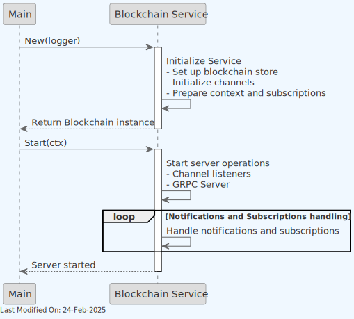

Explanation of the sequence:

1. **New Method:**
    - The `Main` requests a new instance of the `Blockchain` service by calling the `New` function with a logger.
    - Inside the `New` method, the `Blockchain Service` performs initialization tasks including setting up the blockchain store, initializing various channels, and preparing the context and subscriptions.

2. **Start Method:**
    - The `Main` calls the `Start` method on the `Blockchain` service instance.
    - The `Blockchain Service` starts server operations, including channel listeners and the GRPC server.
    - The service enters a loop handling notifications and subscriptions.

### 2.2. Adding a new block to the blockchain

There are 2 clients invoking this endpoint:

1. **The `Block Assembly` service:**
    - The `Block Assembly` service calls the `AddBlock` method on the `Blockchain Service` to add a new mined block to the blockchain.

The sequence diagram for the Block Assembly to add a new block to the blockchain is as follows:

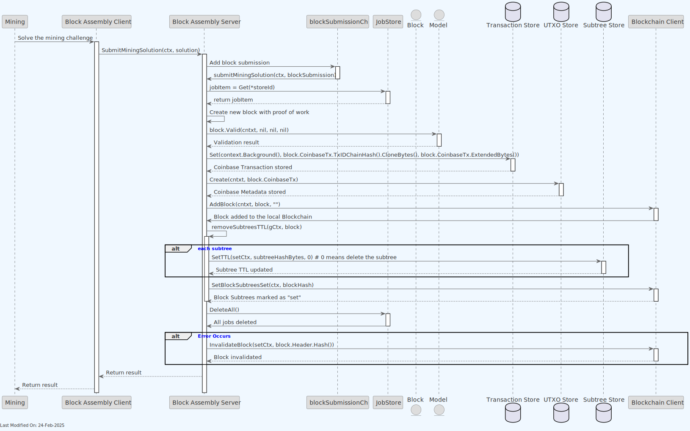
2. **The `Block Validation` service:**
    - The `Block Validation` service calls the `AddBlock` method on the `Blockchain Service` to add a new block (received from another node) to the blockchain.

The sequence diagram for the Block Validation to add a new block to the blockchain is as follows:


Explanation of the sequences:

1. **Client Request:**
    - The `Client` calls the `AddBlock` method on the `Blockchain Service`, passing the block request.

2. **Parse Block Header:**
    - The `Blockchain Service` parses the block header from the request. If there's an error, it returns the error to the client and the process stops.

3. **Parse Coinbase Transaction:**
    - If the header parsing is successful, the service then parses the coinbase transaction. Again, if there's an error, it returns the error to the client.

4. **Parse Subtree Hashes:**
    - If the coinbase transaction parsing is successful, the service then parses the subtree hashes. If there's an error in parsing, it returns the error to the client.

5. **Store Block:**
    - If all parsing steps are successful, the `Blockchain Service` stores the block using the `Block Store`.

6. **Handle Storage Response:**
    - If there's an error in storing the block, the `Blockchain Service` returns the error to the client.
    - If the block is stored successfully, the `Blockchain Service` proceeds to send notifications.

7. **Send Notifications:**
    - The service sends notifications for the block.

### 2.3. Sending new block notifications to the Block Persister

The Blockchain service, after adding a new block, emits a Kafka notification which is received by the Block Persister service. The Block Persister service is responsible for post-processing the block and storing it in a file format, in a persistent data store (such as S3).

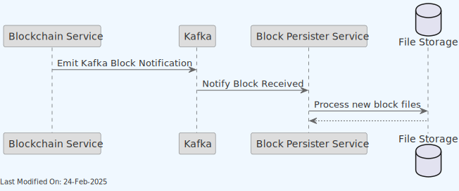

The Blockchain service, based on standard practices, will retry sending the message until Kafka receives it. In case of Kafka downtime, the service will keep retrying for as long as the message is not sent.

### 2.4. Getting a block from the blockchain

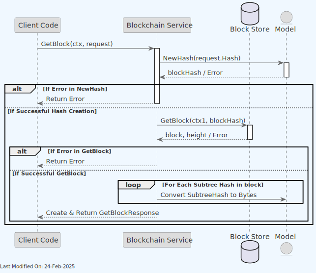

Explanation of the sequence:

1. **Client Request:**
    - The `Client` calls the `GetBlock` method on the `Blockchain Service`, passing the context and the request.

2. **Parse Block Hash:**
    - The `Blockchain Service` uses the `Model` to parse the block hash from the request. If there's an error, it returns the error to the client.

3. **Retrieve Block from Store:**
    - If the hash parsing is successful, the service then retrieves the block from the `Store` using the parsed hash.

4. **Handle Store Response:**
    - If there's an error in retrieving the block, the service returns the error to the client.
    - If the block is successfully retrieved, the service proceeds to prepare the response.

5. **Prepare Response:**
    - The service loops through each subtree hash in the block, converting them to bytes.
    - The service creates a `GetBlockResponse` with the block's header, height, coinbase transaction, subtree hashes, transaction count, and size in bytes.

6. **Return Response:**
    - The `Blockchain Service` returns the prepared `GetBlockResponse` to the `Client Code`.

There are 2 clients invoking this endpoint:

1. **The `Asset Server` service:**
    - The `Asset Server` service calls the `GetBlock` method on the `Blockchain Service` to retrieve a block from the blockchain.

- **The `Block Assembly` service:**
  - The `Block Assembly` service calls the `GetBlock` method on the `Blockchain Service` to retrieve a block from the blockchain.

### 2.5. Getting the last N blocks from the blockchain

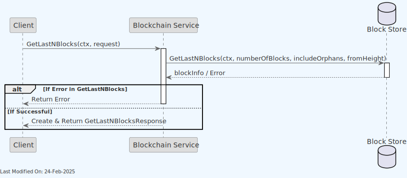

Explanation of the sequence:

1. **Client Request:**
    - The `Client` initiates a call to the `GetLastNBlocks` method on the `Blockchain Service`, passing the context and the request.

2. **Retrieve Blocks from Store:**
    - The `Blockchain Service` then calls the `GetLastNBlocks` method on the `Store`, passing the number of blocks, orphan inclusion flag, and the starting height from the request.

3. **Handle Store Response:**
    - If there's an error in retrieving the last N blocks, the service returns the error to the client.
    - If the blocks are successfully retrieved, the service prepares the response.

4. **Prepare and Return Response:**
    - The `Blockchain Service` creates a `GetLastNBlocksResponse` containing the retrieved `blockInfo`.
    - It then returns this response to the `Client`.

The `Asset Server` service is the only client invoking this endpoint. It calls the `GetLastNBlocks` method on the `Blockchain Service` to retrieve the last N blocks from the blockchain.

### 2.6. Checking if a Block Exists in the Blockchain

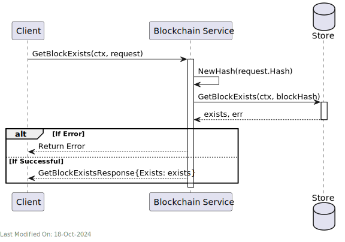

Explanation of the sequence:

1. **Client Request:**
    - The `Client` initiates a call to the `GetBlockExists` method on the `Blockchain Service`, providing the context and request (which includes the block hash).

2. **Retrieve Block Existence from Store:**
    - The `Blockchain Service` processes the request by first converting the provided hash in the request to a `chainhash.Hash` object.
    - It then queries the `Store` to check if the block exists, using the adjusted context (`ctx1`) and the block hash.

3. **Handle Store Response:**
    - If there's an error in checking the existence of the block, the service returns the error to the client.
    - If the existence check is successful, the service prepares the response.

4. **Prepare and Return Response:**
    - The `Blockchain Service` creates a `GetBlockExistsResponse`, indicating whether the block exists or not.
    - It then returns this response to the `Client`.

The `Block Validation` service is the only client invoking this endpoint. It calls the `GetBlockExists` method on the `Blockchain Service` to check if a block exists in the blockchain.

### 2.7. Getting the Best Block Header

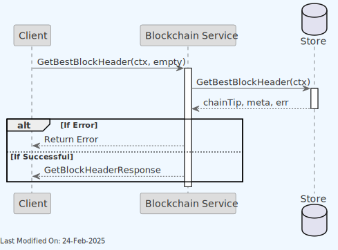

Explanation of the sequence:

1. **Client Request:**
    - The `Client` initiates a call to the `GetBestBlockHeader` method on the `Blockchain Service`, providing the context and an empty message.

2. **Retrieve Best Block Header from Store:**
    - The `Blockchain Service` processes the request by querying the `Store` for the best block header, using the adjusted context (`ctx1`).

3. **Handle Store Response:**
    - If there's an error in retrieving the best block header, the service returns the error to the client.
    - If the retrieval is successful, the service prepares the response.

4. **Prepare and Return Response:**
    - The `Blockchain Service` creates a `GetBlockHeaderResponse` with the block header, height, transaction count, size in bytes, and miner information.
    - It then returns this response to the `Client`.

Multiple services make use of this endpoint, including the `Block Assembly`, `P2P Server`, and `Asset Server` services, as well as the `UTXO Store`.

### 2.8. Getting the Block Headers

The methods `GetBlockHeader`, `GetBlockHeaders`, and `GetBlockHeaderIDs` in the `Blockchain` service provide different ways to retrieve information about blocks in the blockchain.

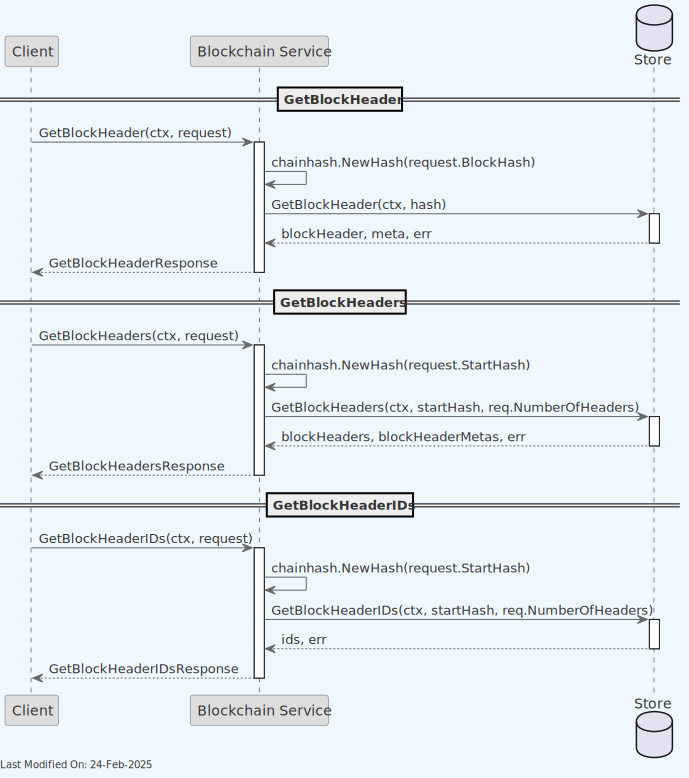

1. **GetBlockHeader:**
    - **Purpose:** Retrieves a single block header.
    - **Process:**
        - It takes a `GetBlockHeaderRequest` containing the hash of the desired block.
        - Converts the hash into a `chainhash.Hash` object.
        - Calls `GetBlockHeader` on the store, providing the context and the hash, to fetch the block header and associated metadata.
        - If successful, it creates and returns a `GetBlockHeaderResponse` containing the block header's byte representation and metadata like height, transaction count, size, and miner.

2. **GetBlockHeaders:**
    - **Purpose:** Fetches multiple block headers starting from a given hash.
    - **Process:**
        - Accepts a `GetBlockHeadersRequest` with the starting block hash and the number of headers to retrieve.
        - Converts the starting hash into a `chainhash.Hash` object.
        - Calls `GetBlockHeaders` on the store to obtain a list of block headers and their heights.
        - Assembles the headers into a byte array and returns them in a `GetBlockHeadersResponse`.

3. **GetBlockHeaderIDs:**
    - **Purpose:** Retrieves the IDs (hashes) of a range of block headers.
    - **Process:**
        - Receives a `GetBlockHeadersRequest` similar to `GetBlockHeaders`.
        - Converts the start hash to a `chainhash.Hash` object.
        - Uses the store's `GetBlockHeaderIDs` method to fetch the IDs of the requested block headers.
        - Returns the IDs in a `GetBlockHeaderIDsResponse`.

Each of these methods serves a specific need:

- `GetBlockHeader` is for fetching detailed information about a single block.
- `GetBlockHeaders` is useful for getting information about a sequence of blocks.
- `GetBlockHeaderIDs` provides a lighter way to retrieve just the IDs of a range of block headers without the additional metadata.

Multiple services make use of these endpoints, including the `Block Assembly`, `Block Validation`, and `Asset Server` services.

### 2.9. Invalidating a Block

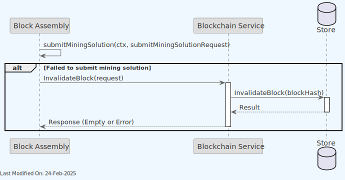

1. The `Block Assembly` sends an `InvalidateBlock` request to the `Blockchain Service`.
2. The `Blockchain Service` processes the request and calls the `InvalidateBlock` method on the `Store`, passing the block hash.
3. The `Store` performs the invalidation operation and returns the result (success or error) back to the `Blockchain Service`.
4. Finally, the `Blockchain Service` returns a response to the `Client`, which is either an empty response (indicating success) or an error message.

### 2.10. Subscribing to Blockchain Events

The Blockchain service provides a subscription mechanism for clients to receive notifications about blockchain events.

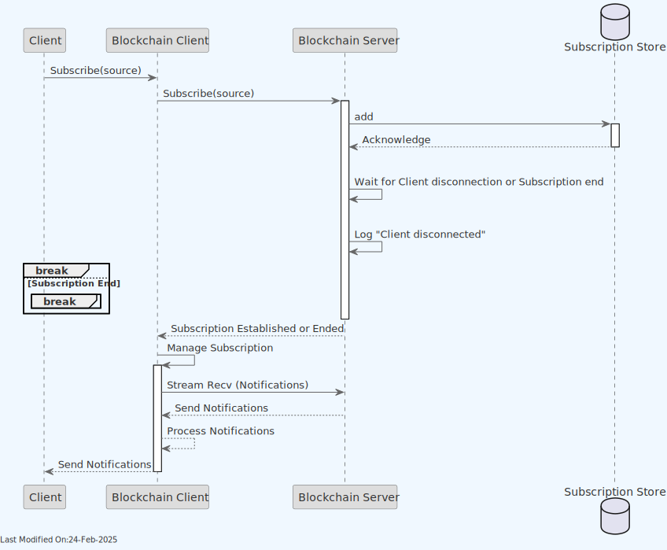

In this diagram, the sequence of operations is as follows:

1. The `Client` sends a `Subscribe` request to the `Blockchain Client`.
2. The `Blockchain Server` receives the subscription request and adds it to the `Subscription Store` (a map of subscriber channels).
3. The server then enters a loop where it waits for either the client's context to be done (indicating disconnection) or the subscription to end.
4. If the client's context is done, the server logs the disconnection and breaks out of the loop. If the subscription ends, the loop is also exited.
5. The server then sends back a response to the client, indicating that the subscription has been established or ended.
6. On the client side, after establishing the subscription, it manages the subscription by continuously receiving stream notifications from the server and processing them as they arrive.

Multiple services make use of the subscription service, including the `Block Assembly`, `Block Validation`, `P2P`, and `Asset Server` services, and `UTXO` store. To know more, check the documentation of those services.

### 2.11. Triggering a Subscription Notification

There are two distinct paths for sending notifications, notifications originating from the `Blockchain Server` and notifications originating from a `Blockchain Client` gRPC client.

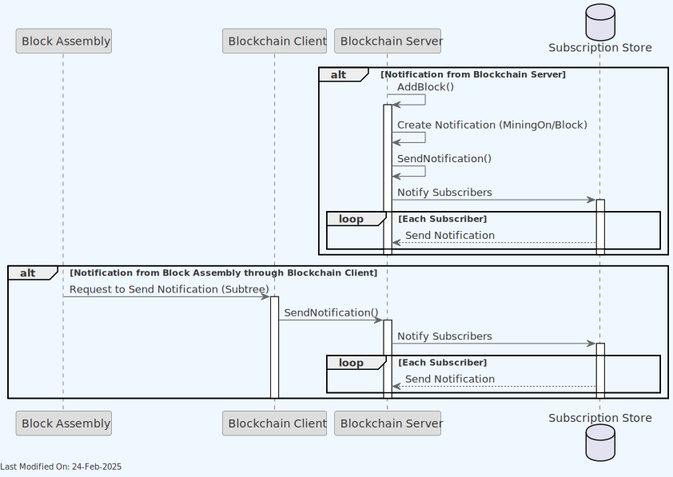

1. **Path 1: Notification Originating from Blockchain Server**
    - The `Blockchain Server` processes an `AddBlock` or a `SetBlockSubtreesSet` call. The `AddBlock` sequence can be seen in the diagram above.
    - Inside this method, it creates a notification of type `MiningOn` or `Block`.
    - The server then calls its own `SendNotification` method to disseminate this notification.
    - The `Subscription Store` is queried to send the notification to all relevant subscribers.

2. **Path 2: Notification from Block Assembly Through Blockchain Client**
    - The `Block Assembly` component requests the `Blockchain Client` to send a notification, of type `model.NotificationType_Subtree`.
    - The `Blockchain Client` then communicates with the `Blockchain Server` to invoke the `SendNotification` method.
    - Similar to Path 1, the server uses the `Subscription Store` to distribute the notification to all subscribers.

In both scenarios, the mechanism for reaching the subscribers through the `Subscription Store` remains consistent.

For further detail, we show here the sequence for the `SetBlockSubtreesSet` call, not detailed in the diagram above.


## 3. gRPC Protobuf Definitions

The Blockchain Service uses gRPC for communication between nodes. The protobuf definitions used for defining the service methods and message formats can be seen [here](../../references/protobuf_docs/blockchainProto.md).

## 4. Data Model

The Blockchain works with the [Block Data Model](../datamodel/block_data_model.md).

The blockchain database stores the block header, coinbase TX, and block merkle root. The following is the structure of the `blocks` data:

| Field          | Type              | Constraints                           | Description                                          |
|----------------|-------------------|---------------------------------------|------------------------------------------------------|
| id             | BIGSERIAL         | PRIMARY KEY                           | Unique identifier for each block.                    |
| parent_id      | BIGSERIAL         | REFERENCES blocks(id)                 | Identifier of the parent block.                      |
| version        | INTEGER           | NOT NULL                              | Version of the block.                                |
| hash           | BYTEA             | NOT NULL                              | Hash of the block.                                   |
| previous_hash  | BYTEA             | NOT NULL                              | Hash of the previous block.                          |
| merkle_root    | BYTEA             | NOT NULL                              | Merkle root of the block.                            |
| block_time     | BIGINT            | NOT NULL                              | Timestamp of when the block was created.             |
| n_bits         | BYTEA             | NOT NULL                              | Compact form of the block's target difficulty.       |
| nonce          | BIGINT            | NOT NULL                              | Nonce used during the mining process.                |
| height         | BIGINT            | NOT NULL                              | Height of the block in the blockchain.               |
| chain_work     | BYTEA             | NOT NULL                              | Cumulative proof of work of the blockchain up to this block. |
| tx_count       | BIGINT            | NOT NULL                              | Number of transactions in the block.                 |
| size_in_bytes  | BIGINT            | NOT NULL                              | Size of the block in bytes.                          |
| subtree_count  | BIGINT            | NOT NULL                              | Number of subtrees in the block.                     |
| subtrees       | BYTEA             | NOT NULL                              | Serialized data of the subtrees.                     |
| coinbase_tx    | BYTEA             | NOT NULL                              | Serialized data of the coinbase transaction.         |
| invalid        | BOOLEAN           | NOT NULL DEFAULT FALSE                | Flag to mark the block as valid or invalid.          |
| peer_id        | VARCHAR(64)       | NOT NULL                              | Identifier of the peer that provided the block.      |
| inserted_at    | TIMESTAMPTZ       | NOT NULL DEFAULT CURRENT_TIMESTAMP   | Timestamp of when the block was inserted in the database. |

The table structure is designed to store comprehensive information about each block in the blockchain, including its relationships with other blocks, its contents, and metadata.

## 5. Technology

1. **PostgreSQL Database:**
    - The primary store technology for the blockchain service.
    - Used for persisting blockchain data such as blocks, block headers, and state information.
    - SQL scripts and functions (`/stores/blockchain/sql`) facilitate querying and manipulating blockchain data within the PostgreSQL database.

2. **Go Programming Language:**
    - The service is implemented in Go (Golang).

3. **gRPC and Protocol Buffers:**
    - The service uses gRPC for inter-service communication.
    - Protocol Buffers (`.proto` files) are used for defining the service API and data structures, ensuring efficient and strongly-typed data exchange.

4. **gocore Library:**
    - Utilized for managing application configurations and statistics gathering.

5. **Model Layer (in `/model`):**
    - Represents the data structures and business logic related to blockchain operations.
    - Contains definitions for blocks and other blockchain components.

6. **Prometheus for Metrics:**
    - Client in `metrics.go`.
    - Used for monitoring the performance and health of the service.

## 6. Directory Structure and Main Files

The Blockchain service is located in the `./services/blockchain` directory. The following is the directory structure of the service:

```text
services/blockchain
├── Client.go - Implements the client-side logic for interacting with the Blockchain service.
├── Difficulty.go - Manages difficulty adjustment logic for the blockchain.
├── Interface.go - Defines the interface for the Blockchain store, outlining required methods for implementation.
├── LocalClient.go - Provides a local client implementation for the Blockchain service, for internal or in-process use.
├── Server.go - Contains server-side logic for the Blockchain service, handling requests and processing blockchain operations.
├── blockchain_api
│   ├── blockchain_api.pb.go - Auto-generated Go bindings from the `.proto` file, used for implementing the Blockchain service API.
│   ├── blockchain_api.proto - The Protocol Buffers definition file for the Blockchain service API.
│   ├── blockchain_api_extra.go - Supplemental code extending or enhancing the auto-generated API code.
│   ├── blockchain_api_grpc.pb.go - Auto-generated gRPC bindings from the `.proto` file, specifically for gRPC communication.
│   └── fsm_extra.go - Additional logic related to the Finite State Machine (FSM) functionality.
├── data
|
├── fsm.go
│   - Implements the Finite State Machine logic for managing blockchain states.
│
├── fsm_visualizer
│   └── main.go  - A tool for visualizing the Finite State Machine structure.
│
├── metrics.go
│   - Manages and implements functionality related to operational metrics of the Blockchain service.
│
└── work
    └── work.go
        - Used to compute the cumulative chain work.
```

Further to this, the store part of the service is kept under `stores/blockchain`. The following is the directory structure of the store:

```text
stores/blockchain
├── Interface.go
    - Defines the interface for blockchain storage, outlining the methods for blockchain data manipulation and retrieval.
├── README.md
    - Contains documentation and information about the blockchain store.
├── mock.go
    - Likely contains mock implementations for testing purposes.
├── new.go
    - Contains the constructor or factory methods for creating new instances of the blockchain store.
├── options
│   └── Options.go
    - Defines options or configurations for the blockchain store.
└── sql
    ├── CheckBlockIsInCurrentChain.go
    ├── CheckBlockIsInCurrentChain_test.go
    ├── ExportBlocksDB.go
    ├── GetBestBlockHeader.go
    ├── GetBestBlockHeader_test.go
    ├── GetBlock.go
    ├── GetBlockByHeight.go
    ├── GetBlockByHeight_test.go
    ├── GetBlockExists.go
    ├── GetBlockGraphData.go
    ├── GetBlockHeader.go
    ├── GetBlockHeaderIDs.go
    ├── GetBlockHeaderIDs_test.go
    ├── GetBlockHeaders.go
    ├── GetBlockHeadersByHeight.go
    ├── GetBlockHeadersFromHeight.go
    ├── GetBlockHeaders_test.go
    ├── GetBlockHeight.go
    ├── GetBlockHeight_test.go
    ├── GetBlockStats.go
    ├── GetBlock_test.go
    ├── GetBlocks.go
    ├── GetBlocksByTime.go
    ├── GetBlocksMinedNotSet.go
    ├── GetBlocksSubtreesNotSet.go
    ├── GetForkedBlockHeaders.go
    ├── GetHashOfAncestorBlock.go
    ├── GetHashOfAncestorBlock_test.go
    ├── GetHeader.go
    ├── GetHeader_test.go
    ├── GetLastNBlocks.go
    ├── GetSuitableBlock.go
    ├── GetSuitableBlock_test.go
    ├── InvalidateBlock.go
    ├── InvalidateBlock_test.go
    ├── LocateBlockHeaders.go
    ├── LocateBlockHeaders_test.go
    ├── RevalidateBlock.go
    ├── RevalidateBlock_test.go
    ├── SetBlockMinedSet.go
    ├── SetBlockSubtreesSet.go
    ├── State.go
    ├── State_test.go
    ├── StoreBlock.go
    ├── StoreBlock_test.go
    ├── sql.go
    └── sql_test.go
```

## 7. How to run

To run the Blockchain Service locally, you can execute the following command:

```shell
SETTINGS_CONTEXT=dev.[YOUR_CONTEXT] go run -Blockchain=1
```

Please refer to the [Locally Running Services Documentation](../../howto/locallyRunningServices.md) document for more information on running the Blockchain Service locally.

## 8. Configuration

For comprehensive configuration documentation including all settings, defaults, and interactions, see the [Blockchain Settings Reference](../../references/settings/services/blockchain_settings.md).

## 9. Additional Technical Details

### 9.1. Complete gRPC Method Coverage

In addition to the core methods described in the Functionality section, the Blockchain Service provides the following API endpoints:

#### FSM Management Methods

- **SendFSMEvent**: Sends an event to the blockchain FSM to trigger state transitions.
- **GetFSMCurrentState**: Retrieves the current state of the FSM.
- **WaitFSMToTransitionToGivenState**: Waits for FSM to reach a specific state.
- **WaitUntilFSMTransitionFromIdleState**: Waits for FSM to transition from IDLE state.
- **Run, CatchUpBlocks, LegacySync, Idle**: Transitions the service to specific operational modes.

#### State Management

- **GetState**: Retrieves a value from the blockchain state storage by its key.
- **SetState**: Stores a value in the blockchain state storage with the specified key.

#### Block Mining Status Methods

- **GetBlockIsMined**: Checks if a block has been marked as mined.
- **SetBlockMinedSet**: Marks a block as mined in the blockchain.
- **GetBlocksMinedNotSet**: Retrieves blocks that haven't been marked as mined.
- **SetBlockSubtreesSet**: Marks a block's subtrees as set.
- **GetBlocksSubtreesNotSet**: Retrieves blocks whose subtrees haven't been set.

#### Legacy Synchronization Methods

- **GetBlockLocator**: Creates block locators for chain synchronization.
- **LocateBlockHeaders**: Finds block headers using a locator.
- **GetBestHeightAndTime**: Retrieves the current best height and median time.

### 9.2. Finite State Machine Implementation

The Blockchain Service uses a Finite State Machine (FSM) to manage its operational states. This design allows the service to maintain a clear lifecycle and respond appropriately to different events.

For a comprehensive understanding of the Blockchain Service's FSM implementation, please refer to the dedicated [State Management in Teranode](../architecture/stateManagement.md) documentation, which covers:

- FSM states (Idle, Running, CatchingBlocks, LegacySyncing)
- State transitions and events
- Allowed operations in each state
- FSM initialization and access methods
- Waiting on state transitions

The FSM implementation in the Blockchain Service exposes several gRPC methods for state management:

- **GetFSMCurrentState**: Returns the current state of the FSM
- **WaitFSMToTransitionToGivenState**: Waits for the FSM to reach a specific state
- **SendFSMEvent**: Sends events to trigger state transitions
- **Run, CatchUpBlocks, LegacySync, Idle**: Convenience methods that delegate to SendFSMEvent

The FSM ensures that the service only performs operations appropriate for its current state, providing isolation and predictable behavior.

### 9.3. Kafka Integration Details

The Blockchain Service integrates with Kafka for block notifications and event streaming:

#### Message Formats

Block notifications are serialized using Protocol Buffers and contain:

- Block header
- Block height
- Hash
- Transaction count
- Size in bytes
- Timestamp

#### Topics

- **Blocks-Final**: Used for finalized block notifications, consumed by the Block Persister service.

#### Error Handling

- The service implements exponential backoff retry for Kafka publishing failures.
- Failed messages are logged and retried based on the `blockchain_maxRetries` and `blockchain_retrySleep` settings.
- Persistent failures, after the retries are exhausted, are reported through the health monitoring endpoints (`/health` HTTP endpoint and the `HealthGRPC` gRPC method).

### 9.4. Error Handling Strategies

The Blockchain Service employs several strategies to handle errors and maintain resilience:

#### Network and Communication Errors

- Uses timeouts and context cancellation to handle hanging network operations.
- Implements retry mechanisms for transient failures with configured backoff periods.

#### Validation Errors

- Blocks with invalid headers, merkle roots, or proofs are rejected with appropriate error codes.
- Invalid blocks can be explicitly marked using the InvalidateBlock method.

#### Chain Reorganization and Longest Chain Tracking

The Blockchain Service implements sophisticated chain reorganization handling with optimized longest chain tracking:

##### Automatic Detection

- Detects chain splits and reorganizations automatically through block header validation
- Uses rollback and catch-up operations to handle chain reorganizations
- Limits reorganization depth for security (configurable via `blockchain_maxReorgDepth`)

##### Optimized Longest Chain Selection

The service employs an optimized algorithm for tracking and selecting the longest valid chain:

**Key Features:**

- **Efficient Chain Comparison**: Uses cumulative proof-of-work (chainwork) rather than simple block height for chain selection
- **Fast Fork Detection**: Maintains indexed fork points to quickly identify competing chains
- **Minimal Database Queries**: Caches chain tips and their accumulated work to reduce database load
- **Parallel Validation**: Can validate multiple competing chain tips simultaneously

**Implementation Details:**

1. **Chainwork Tracking**: Each block stores cumulative chainwork from genesis, allowing O(1) chain strength comparison
2. **Fork Point Cache**: Maintains an in-memory cache of recent fork points for rapid reorganization detection
3. **Tip Management**: Tracks multiple competing chain tips with their associated metadata:
    - Total chainwork
    - Block height
    - Last validation timestamp
    - Fork depth from main chain

**Performance Benefits:**

- Reduced latency in chain selection during high fork activity
- Lower database load through intelligent caching
- Faster recovery from network partitions
- Improved resilience to chain split scenarios

**Configuration Options:**

- `blockchain_maxReorgDepth`: Maximum allowed reorganization depth (default: 6 blocks)
- `blockchain_chainTipCacheSize`: Number of competing tips to track (default: 10)
- `blockchain_forkPointCacheSize`: Size of fork point cache (default: 100)

#### Storage Errors

- Implements transaction-based operations with the store to maintain consistency.
- Reports persistent storage errors through health endpoints.

## 10. Other Resources

- [Blockchain Reference](../../references/services/blockchain_reference.md)
- [FSM Documentation](../architecture/stateManagement.md)
