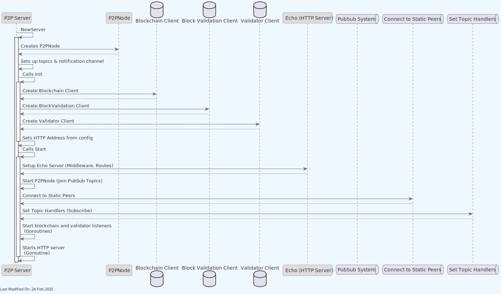
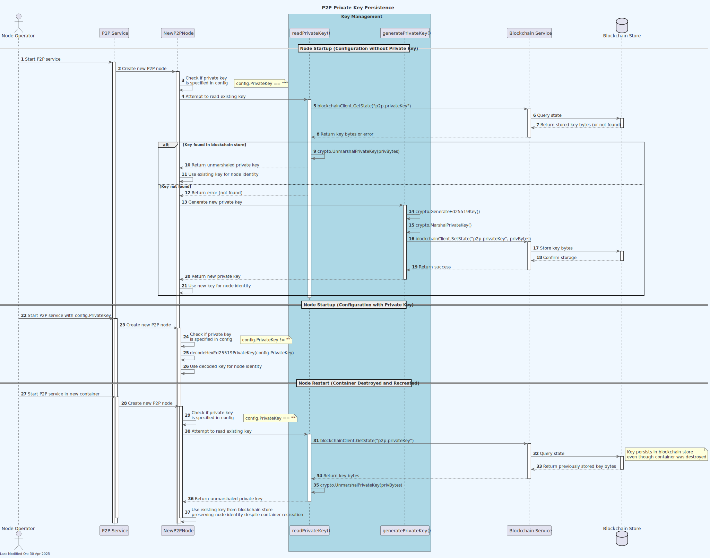
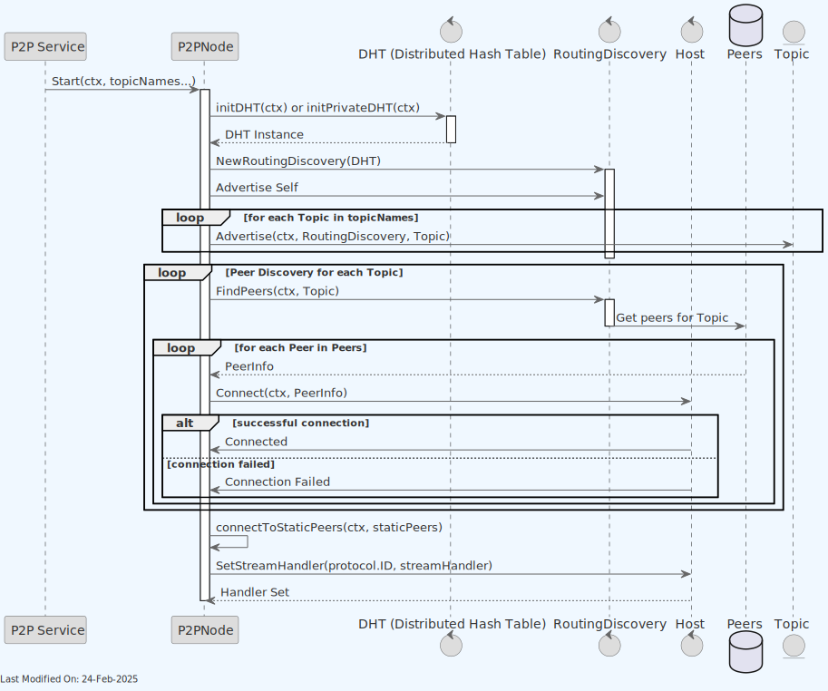
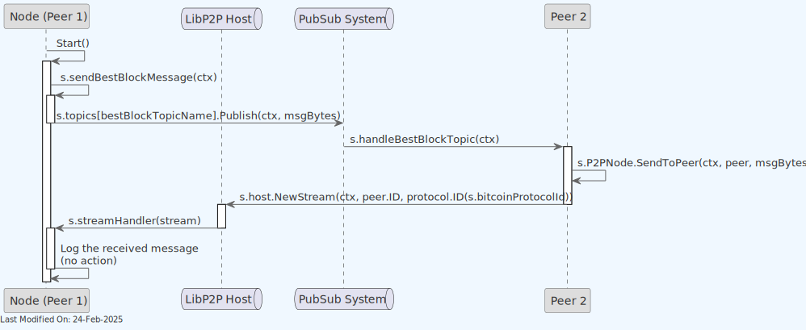
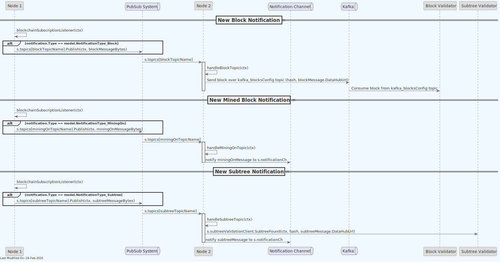
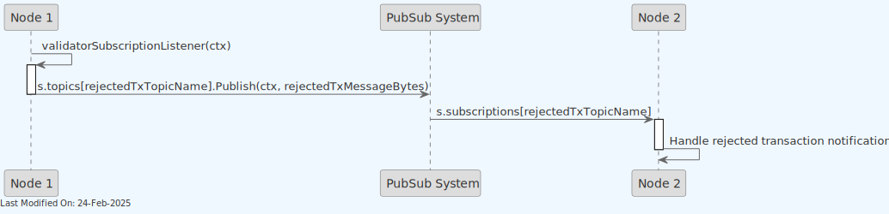
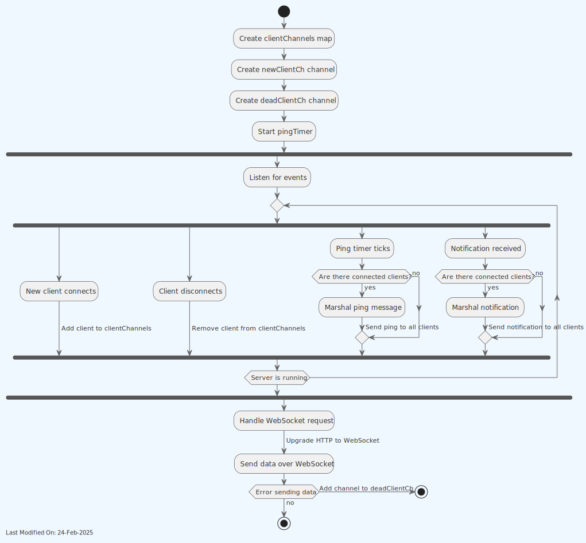
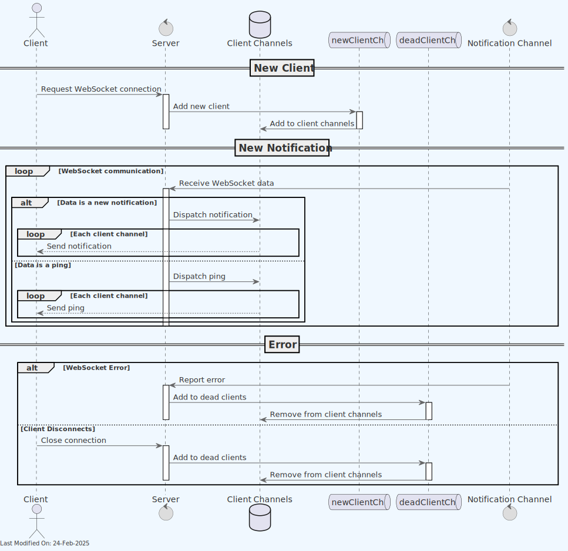
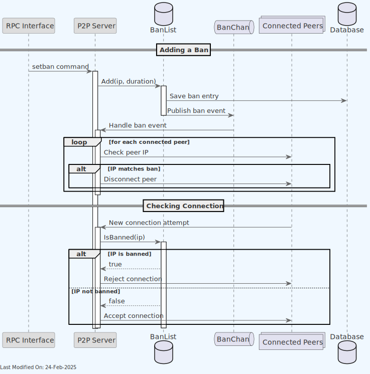

# 🌐 P2P Service

## Index

- [🌐 P2P Service](#-p2p-service)
    - [Index](#index)
  - [1. Description](#1-description)
  - [2. Functionality](#2-functionality)
    - [2.1. Creating, initializing and starting a new P2P Server](#21-creating-initializing-and-starting-a-new-p2p-server)
    - [2.1.1. Creating a New P2P Server](#211-creating-a-new-p2p-server)
    - [2.1.2. Initializing the P2P Server](#212-initializing-the-p2p-server)
    - [2.1.3. Starting the P2P Server](#213-starting-the-p2p-server)
    - [2.2. Peer Discovery and Connection](#22-peer-discovery-and-connection)
    - [2.3. Best Block Messages](#23-best-block-messages)
    - [2.4. Blockchain Messages](#24-blockchain-messages)
    - [2.5. TX Validator Messages](#25-tx-validator-messages)
    - [2.6. Websocket notifications](#26-websocket-notifications)
    - [2.7. Ban Management System](#27-ban-management-system)
      - [2.7.1. Ban List Management](#271-ban-list-management)
      - [2.7.2. Ban Operations](#272-ban-operations)
      - [2.7.3. Ban Event Handling](#273-ban-event-handling)
      - [2.7.4. Configuration](#274-configuration)
  - [3. Technology](#3-technology)
  - [4. Data Model](#4-data-model)
  - [5. Directory Structure and Main Files](#5-directory-structure-and-main-files)
  - [6. How to run](#6-how-to-run)
  - [7. Configuration options (settings flags)](#7-configuration-options-settings-flags)
    - [Network and Discovery Settings](#network-and-discovery-settings)
    - [Service Endpoints](#service-endpoints)
    - [Peer-to-Peer Topics](#peer-to-peer-topics)
    - [Authentication and Security](#authentication-and-security)
    - [Ban Management](#ban-management)
  - [Configuration Validation Rules](#configuration-validation-rules)
    - [Required Configuration](#required-configuration)
    - [Network Address Validation](#network-address-validation)
    - [Private Network Requirements](#private-network-requirements)
    - [Key Management](#key-management)
  - [Configuration Dependencies](#configuration-dependencies)
  - [Configuration Interactions and Dependencies](#configuration-interactions-and-dependencies)
    - [Network Binding and Discovery](#network-binding-and-discovery)
    - [Peer Discovery and Connection](#peer-discovery-and-connection)
    - [Security and Authentication](#security-and-authentication)
  - [8. Other Resources](#8-other-resources)


## 1. Description


The p2p package implements a peer-to-peer (P2P) server using `libp2p` (`github.com/libp2p/go-libp2p`, `https://libp2p.io`), a modular network stack that allows for direct peer-to-peer communication. The implementation follows an interface-based design pattern with `P2PNodeI` abstracting the concrete `P2PNode` implementation to allow for better testability and modularity.

The p2p service allows peers to subscribe and receive blockchain notifications, effectively allowing nodes to receive notifications about new blocks and subtrees in the network.

The p2p peers are part of a private network. This private network is managed by the p2p bootstrap service, which is responsible for bootstrapping the network and managing the network topology.

1. **Initialization and Configuration**:

    - The `Server` struct holds essential information for the P2P server, such as hosts, topics, subscriptions, clients for blockchain and validation, and logger for logging activities.
    - The `NewServer` function creates a new instance of the P2P server, sets up the host with a private key, and defines various topic names for message publishing and subscribing.
    - The `Init` function configures the server with necessary clients and settings.

2. **Message Types**:

    - There are several message types (`BestBlockMessage`, `MiningOnMessage`, `BlockMessage`, `SubtreeMessage`, `RejectedTxMessage`) used for communicating different types of data over the network.

3. **Networking and Communication**:

    - The server uses `libp2p` for network communication. It sets up a host with given IP and port and handles different topics for publishing and subscribing to messages.
    - The server uses Kademlia for peer discovery, implementing both standard and private DHT (Distributed Hash Table) modes based on configuration.
    - The server uses GossipSub for PubSub messaging, with automated topic subscription and management.
    - `handleBlockchainMessage`, `handleBestBlockTopic`, `handleBlockTopic`, `handleSubtreeTopic`, and `handleMiningOnTopic` are functions to handle incoming messages for different topics.
    - `sendBestBlockMessage` and `sendPeerMessage` are used for sending messages to peers in the network.
    - The implementation includes error handling and retry mechanisms for peer connections to enhance network resilience.

4. **Peer Discovery and Connection**:

    - `discoverPeers` function is responsible for discovering peers in the network and attempting to establish connections with them.
    - The system implements an intelligent retry mechanism that tracks failed connection attempts and manages reconnection policies based on error types.
    - A dedicated mechanism for connecting to static peers runs in a separate goroutine, ensuring that mission-critical peers are always connected when available.

5. **HTTP Server and WebSockets**:

    - An HTTP server is started using `echo`, a Go web framework, providing routes for health checks and WebSocket connections.
    - `HandleWebSocket` is used to handle incoming WebSocket connections and manage the communication with connected clients.

6. **Subscription Listeners**:

    - The server listens for notifications from the blockchain and the tx validator services. It subscribes to these services and handles incoming notifications.

7. **Publish-Subscribe Mechanism**:

    - The server uses the publish-subscribe model over `libp2p` pubsub for message dissemination. It joins topics and subscribes to them to receive and broadcast messages related to blockchain events.

8. **Private Key Management**:

    - The server generates or reads a private key for secure communication (peerId and encryption) in the P2P network.
    - The generated private key is persisted.

> **Note**: For information about how the P2P service is initialized during daemon startup and how it interacts with other services, see the [Teranode Daemon Reference](../../references/teranodeDaemonReference.md#service-initialization-flow).


In the diagram above:

* The node P2P service subscribes and listens to Blockchain and Tx Validator service notifications. When blocks, subtrees or rejected transactions are detected, the P2P service publishes these messages to the network.
* When the P2P service receives a message from the network (i.e. a Blockchain message from another node), it forwards it to the node Block Validation Service for processing.

In more detail:


## 2. Functionality


### 2.1. Creating, initializing and starting a new P2P Server




### 2.1.1. Creating a New P2P Server
The startup process of the node involves the `main.go` file calling the `p2p.NewServer` function from the P2P package (`services/p2p/Server.go`). This function is tasked with creating a new P2P server instance.

1. **Private Key Management**:

    - The server tries to read an existing private key from the blockchain store through the `readPrivateKey()` function:

      - `readPrivateKey` calls `blockchainClient.GetState(ctx, "p2p.privateKey")` to retrieve the serialized key data
      - If found, it deserializes the key using `crypto.UnmarshalPrivateKey()`
    - If no key is specified in the configuration and no key exists in the blockchain store, it generates a new one using the `generatePrivateKey()` function:

      - `generatePrivateKey` creates a new Ed25519 key pair using `crypto.GenerateEd25519Key()`
      - It serializes the private key with `crypto.MarshalPrivateKey()`
      - It stores the serialized key in the blockchain store using `blockchainClient.SetState(ctx, "p2p.privateKey", privBytes)`
    - This blockchain store persistence mechanism works through gRPC calls to the blockchain service
    - Using the blockchain store ensures that the P2P private key (and therefore node identity) persists even if the container is destroyed, maintaining consistent peer relationships in the network



2. **Configuration Retrieval and Topic Registration**:

    - Retrieves required configuration settings like `p2p_listen_addresses` and `p2p_port`.
    - It registers specific topic names derived from the configuration, such as `p2p_block_topic`, `p2p_subtree_topic`, `p2p_bestblock_topic`, `p2p_mining_on_topic`, and `p2p_rejected_tx_topic`.

3. **P2P Node Initialization**:

    - Initializes a libp2p node (host) using the specified IP, port, and private key, which manages node communications and connections.

### 2.1.2. Initializing the P2P Server

The P2P server's `Init` function is in charge of server setup:

1. **Blockchain Client Initialization**:

    - Creates a new blockchain client with `blockchain.NewClient(ctx, s.logger, "source")`.

2. **Asset HTTP Address Configuration**:

    - Retrieves the Asset HTTP Address URL from the configuration using `gocore.Config().GetURL("asset_httpAddress")`.

3. **Block Validation Client Initialization**:

    - Sets up a block validation client with `blockvalidation.NewClient(ctx)`.

4. **Validator Client Initialization**:

    - Initializes a transaction validator client with `validator.NewClient(ctx, s.logger)`.

### 2.1.3. Starting the P2P Server

The `Start` function is responsible for commencing the P2P service:

1. **HTTP Server Setup**:

    - Utilizes the Echo framework to set up an HTTP server.

2. **HTTP Endpoints**:

    - Sets up a health check endpoint (`/health`) that responds with "OK".
    - Adds a WebSocket endpoint (`/ws`) for real-time communication via `s.HandleWebSocket`.

3. **Start HTTP Server**:

    - Initiates the HTTP server using a goroutine, which is executed via `s.StartHttp`.

4. **PubSub Topics Setup**:

    - Initializes the GossipSub system for pub-sub messaging.
    - Subscribes to various topics defined in the configuration.

5. **Peer-to-Peer Host Configuration**:

    - Assigns a stream handler to the P2P host to handle blockchain-related messages.

6. **Topic Handlers**:

    - Initiates goroutines for message handling on designated topics.

7. **Subscription Listeners**:

    - Begins subscription listeners for blockchain and validator services to manage incoming notifications about blocks and transactions.

8. **Best Block Message Broadcast**:

    - Sends a best block message to the network to solicit the current best block hash from peers.

Once these steps are completed, the server is ready to accept peer connections, handle messages, and monitor network activity.

### 2.2. Peer Discovery and Connection

In the previous section, the P2P Service created a `P2PNode as part of the initialization phase. This P2PNode is responsible for joining the network. The P2PNode utilizes a libp2p host and a Distributed Hash Table (DHT) for peer discovery and connection based on shared topics. This mechanism enables the node to become part of a decentralized network, facilitating communication and resource sharing among peers.



1. **Initialization of DHT and libp2p Host**:

    - The `P2PNode` struct, upon invocation of its `Start` method, initializes the DHT using either `initDHT` or `initPrivateDHT` methods depending on the configuration. This step sets up the DHT for the libp2p host (`s.host`), which allows for peer discovery and content routing within the P2P network. The DHT is bootstrapped with default or configured peers to integrate the node into the existing network.

2. **Setting Up Routing Discovery**:

    - Once the DHT is initialized, `P2PNode.Start` sets up `routingDiscovery` with the created DHT instance. This discovery service is responsible for locating peers within the network and advertising the node's own presence.
    - The DHT implementation supports two modes:

      - Standard mode (`initDHT`): Uses the public IPFS bootstrap nodes for initial discovery
      - Private mode (`initPrivateDHT`): Creates an isolated private network with custom bootstrap nodes, providing enhanced security for enterprise deployments

3. **Advertising and Searching for Peers**:

    - The node then advertises itself for the configured topics and looks for peers associated with these topics. This is conducted through the `discoverPeers` method, which iterates over the topic names and uses the routing discovery to advertise and find peers interested in the same topics.

4. **Connecting to Discovered and Static Peers**:

    - The `discoverPeers` method includes sophisticated filtering and error handling mechanisms:

      - `shouldSkipPeer`: Determines if connection attempts should be skipped based on various criteria
      - `shouldSkipBasedOnErrors`: Manages retry logic for previously failed connections
      - `shouldSkipNoGoodAddresses`: Special handling for peers with address resolution issues
    - The `connectToStaticPeers` method runs in a dedicated goroutine to periodically attempt connections with a predefined list of peers (static peers), ensuring critical network infrastructure remains connected even after temporary failures.
    - Connection errors are carefully tracked to avoid network congestion from repeated failed connection attempts.

5. **Integration with P2P Network**:

    - The capabilities of the DHT for discovery and topic-based advertising enables the node to seamlessly integrate into the Teranode P2P network.


### 2.3. Best Block Messages



1. **Node (Peer 1) Starts**:

    - The server's `Start()` method is invoked. Within `Start()`, `s.sendBestBlockMessage(ctx)` is called to send the best block message.
    - This message is published to a topic using `s.topics[bestBlockTopicName].Publish(ctx, msgBytes)`.

2. **Peer 2 Receives the Best Block Topic Message**:

    - Peer 2's server handles the best block topic through `s.handleBestBlockTopic(ctx)`.
    - A peer message is sent using `s.sendPeerMessage(ctx, peer, msgBytes)`. A new stream to the Peer 1 LibP2P host is established with `s.host.NewStream(ctx, peer.ID, protocol.ID(s.bitcoinProtocolId))`.

3. **Node (Peer 1) Receives the Stream Response from Peer 2**:

    - The LibP2P host sends the response stream to Node (Peer 1).
    - Node (Peer 1) handles the blockchain message using `s.handleBlockchainMessage(ctx, stream)`.
    - The message received is logged with `s.logger.Debugf("Received block topic message: %s", string(buf))` (at the time of writing, the `handleBlockchainMessage` function simply logs block topic messages).


### 2.4. Blockchain Messages

When a node creates a new subtree, or finds a new block hashing solution, it will broadcast this information to the network. This is done by publishing a message to the relevant topic. The message is then received by all peers subscribed to that topic. Listening peers can then feed relevant messages to their own Block Validation Service.





1. **Blockchain Subscription**:

    - The server subscribes to the blockchain service using `s.blockchainClient.Subscribe(ctx, blockchain.SubscriptionType_Blockchain)`.
    - The server listens for blockchain notifications (`Block`, `Subtree` or `MiningOn` notifications) using `s.blockchainSubscriptionListener(ctx)`.

1. **New Block Notification**:

    - Node 1 listens for blockchain notifications.
    - If a new block notification is detected, it publishes the block message to the PubSub System.
    - The PubSub System then delivers this message to Node 2.
    - Node 2 receives the message on the block topic, **submits the block message to its own Block Validation Service**, and notifies the block message on its notification channel.
     - Note that the Block Validation Service might be configured to either receive gRPC notifications or listen to a Kafka producer. In the diagram above, the gRPC method is described. Please check the [Block Validation Service](blockValidation.md) documentation for more details

2. **New Mined Block Notification**:

    - Node 1 listens for blockchain notifications.
    - If a new mined block notification is detected, it publishes the mining on message to the PubSub System.
    - The PubSub System delivers this message to Node 2.
    - Node 2 receives the mining message on the mining topic and notifies the "mining on" message on its notification channel.

3. **New Subtree Notification**:

    - Node 1 listens for blockchain notifications.
    - If a new subtree notification is detected, it publishes the subtree message to the PubSub System.
    - The PubSub System delivers this message to Node 2.
    - Node 2 receives the subtree message on the subtree topic, **submits the subtree message to its own Subtree Validation Service**, and notifies the subtree message on its notification channel.
      - Note that the Subtree Validation Service might be configured to either receive gRPC notifications or listen to a Kafka producer. In the diagram above, the gRPC method is described. Please check the [Subtree Validation Service](subtreeValidation.md)  documentation for more details

### 2.5. TX Validator Messages

Nodes will broadcast rejected transaction notifications to the network. This is done by publishing a message to the relevant topic. The message is then received by all peers subscribed to that topic.



 - The Node 1 listens for validator subscription events.
 - When a new rejected transaction notification is detected, the Node 1 publishes this message to the PubSub System using the topic name `rejectedTxTopicName`, forwarding it to any subscribers of the `rejectedTxTopicName` topic.

Note that the P2P service can only subscribe to these notifications if and when the TX Validator Service is available in the node. The service uses the `useLocalValidator` setting to determine whether a local validator or a validator service is in scope. If no TX validator runs in the node, the P2P will not attempt to subscribe.

### 2.6. Websocket notifications

All notifications collected from the Block and Validator listeners are sent over to the Websocket clients. The process can be seen below:



* WebSocket Request Handling:

    - An HTTP request is upgraded to a WebSocket connection. A new client channel is associated to this Websocket client.
    - Data is sent over the WebSocket, using its dedicated client channel.
    - If there's an error in sending data, the channel is removed from the `clientChannels`.


- The server listens for various types of events in a concurrent process:
    - The server tracks all active client channels (`clientChannels`).
    - When a new client connects, it is added to the `clientChannels`.
    - If a client disconnects, it is removed from `clientChannels`.
    - Periodically, we ping all connected clients. Any error would have the client removed from the list of clients.
    - When a notification is received (from the block validation or transaction listeners described in the previous sections), it is sent to all connected clients.

As a sequence:



1. A client requests a WebSocket connection to the server. The new client is added to the `newClientCh` queue, which then adds the client to the active client channels.
2. The server enters a loop for WebSocket communication, where it can either receive new notifications or pings.
3. For each new notification or ping, the server dispatches this data to all client channels.
4. If there's a WebSocket error or the client disconnects, the client is added to the `deadClientCh` queue, which leads to its removal from the active client channels.


### 2.7. Ban Management System

The P2P service includes a ban management system that allows nodes to maintain a list of banned peers and handle ban-related events across the network.



#### 2.7.1. Ban List Management

The ban system consists of two main components:
1. **BanList**: A thread-safe data structure that maintains banned IP addresses and subnets
2. **BanChan**: A channel that broadcasts ban-related events to system components

The ban list supports:

- Individual IP addresses
- Entire subnets using CIDR notation
- Temporary bans with expiration times
- Persistent storage of bans in a database

#### 2.7.2. Ban Operations

While the banList is maintained by the P2P service, the ban operations are managed by the RPC Server. The RPC server receives request to add / remove peers, notifying the P2P service to update the ban list.

#### 2.7.3. Ban Event Handling

When a ban event occurs:
1. The ban is added to the persistent storage
2. A ban event is broadcast through the ban channel
3. The P2P service checks current connections against the ban
4. Any matching connections are terminated
5. Future connection attempts from banned IPs are rejected

#### 2.7.4. Configuration

Ban-related settings in the configuration:

- `banlist_db`: Database connection string for ban storage
- `ban_default_duration`: Default duration for bans (24 hours if not specified)
- `ban_max_entries`: Maximum number of banned entries to maintain


## 3. Technology


1. **Go Programming Language**:

    - The entire package is written in Go (Golang).

2. **libp2p**:

    - A modular network framework that allows peers to communicate directly with each other. It's widely used in decentralized systems for handling various network protocols, peer discovery, transport, encryption, and stream multiplexing.

3. **pubsub (go-libp2p-pubsub)**:

    - A library for publish-subscribe functionality in `libp2p`. It's used for messaging between nodes in a decentralized network, supporting various messaging patterns like broadcasting.

4. **crypto (go-libp2p-core/crypto)**:

    - This library provides cryptographic functions for `libp2p`, including key generation, marshaling, and unmarshaling. It's crucial for maintaining secure communication channels in the P2P network.

5. **Echo (labstack/echo/v4)**:

    - A high-performance, extensible web framework for Go.

6. **WebSockets**:

    - A communication protocol providing full-duplex channels over a single TCP connection. Used here for real-time, two-way interaction between the server and clients.

7. **JSON (JavaScript Object Notation)**:

    - A lightweight data-interchange format, used here for serializing and transmitting structured data over the network (like the various message types).

8. **Distributed Hash Table (DHT) for Peer Discovery**:

    - A decentralized method of discovering peers in the network. It allows a node to efficiently find other nodes in the P2P network.

9. **HTTP/HTTPS Protocols**:

    - Used for setting up the web server and handling requests. The server can handle both HTTP and HTTPS requests.

10. **Middleware & Logging (middleware, ulogger)**:

    - Used for handling common tasks across requests (like logging, error handling, CORS settings) in the Echo web framework.

11. **gocore (ordishs/gocore)**:

    - A utility library for configuration management and other core functionalities.

12. **Environmental Configuration**:

    - Configuration management using environment variables, required for setting up network parameters, topic names, etc.


## 4. Data Model

- [Block Data Model](../datamodel/block_data_model.md): Contain lists of subtree identifiers.
- [Subtree Data Model](../datamodel/subtree_data_model.md): Contain lists of transaction IDs and their Merkle root.

Within the P2P service, notifications are sent to the Websocket clients using the following data model:

* Block notifications:

```go
			s.notificationCh <- &notificationMsg{
				Timestamp: time.Now().UTC(),
				Type:      "block",
				Hash:      blockMessage.Hash,
				BaseURL:   blockMessage.DataHubUrl,
				PeerId:    blockMessage.PeerId,
			}

```

* Subtree notifications:

```go
			s.notificationCh <- &notificationMsg{
				Type:    "subtree",
				Hash:    subtreeMessage.Hash,
				BaseURL: subtreeMessage.DataHubUrl,
				PeerId:  subtreeMessage.PeerId,
			}
```

* "MiningOn" notifications:

```go
			s.notificationCh <- &notificationMsg{
				Timestamp:    time.Now().UTC(),
				Type:         "mining_on",
				Hash:         miningOnMessage.Hash,
				BaseURL:      miningOnMessage.DataHubUrl,
				PeerId:       miningOnMessage.PeerId,
				PreviousHash: miningOnMessage.PreviousHash,
				Height:       miningOnMessage.Height,
				Miner:        miningOnMessage.Miner,
				SizeInBytes:  miningOnMessage.SizeInBytes,
				TxCount:      miningOnMessage.TxCount,
			}
```

## 5. Directory Structure and Main Files


```
./services/p2p
│
├── HandleWebsocket.go   - Manages WebSocket connections and communications.
├── Server.go            - Main server logic for the P2P service, including network handling and peer interactions.
├── client.html          - A client-side HTML file for testing or interacting with the WebSocket server.
└── dht.go               - Implements the Distributed Hash Table (DHT) functionality for the P2P network.
```


## 6. How to run

To run the P2P Service locally, you can execute the following command:

```shell
SETTINGS_CONTEXT=dev.[YOUR_USERNAME] go run -P2P=1
```

Please refer to the [Locally Running Services Documentation](../../howto/locallyRunningServices.md) document for more information on running the P2P Service locally.

## 7. Configuration options (settings flags)

The P2P service serves as the communication backbone of the Teranode network, enabling nodes to discover, connect, and exchange data with each other. This section provides a comprehensive overview of all configuration options, organized by functional category.

### Network and Discovery Settings

| Setting | Type | Default | Description | Impact |
|---------|------|---------|-------------|--------|
| `p2p_listen_addresses` | []string | [] | Network addresses for the P2P service to listen on | Controls which interfaces and ports the service binds to for accepting connections |
| `p2p_advertise_addresses` | []string | [] | Addresses to advertise to other peers | Affects how other peers discover and connect to this node. Supports both IP addresses and domain names with optional port specification (e.g., `192.168.1.1`, `example.com:9906`). When port is omitted, the `p2p_port` value is used. |
| `p2p_port` | int | 9906 | Default port for P2P communication | Used as the fallback port when addresses don't specify a port |
| `p2p_bootstrapAddresses` | []string | [] | Initial peer addresses for bootstrapping the DHT | Helps new nodes join the network by providing entry points |
| `p2p_static_peers` | []string | [] | Peer addresses to connect to on startup | Ensures connections to specific peers regardless of discovery |
| `p2p_dht_protocol_id` | string | "" | Protocol identifier for DHT communications | Affects how nodes discover each other in the network |
| `p2p_dht_use_private` | bool | false | Use private DHT mode | Restricts DHT communication to trusted peers when enabled |
| `p2p_optimise_retries` | bool | false | Optimize retry behavior for peer connections | Improves efficiency of connection attempts in certain network conditions |

### Service Endpoints

| Setting | Type | Default | Description | Impact |
|---------|------|---------|-------------|--------|
| `p2p_grpcAddress` | string | "" | Address for other services to connect to this service | Enables service-to-service communication |
| `p2p_grpcListenAddress` | string | :9906 | Interface and port to listen on for gRPC connections | Controls network binding for the gRPC server |
| `p2p_httpAddress` | string | localhost:9906 | Address other services use to connect to HTTP API | Affects how other services discover the P2P HTTP API |
| `p2p_httpListenAddress` | string | "" | Interface and port to listen on for HTTP connections | Controls network binding for the HTTP server |
| `securityLevelHTTP` | int | 0 | HTTP security level (0=HTTP, 1=HTTPS) | Determines whether HTTP or HTTPS is used for web connections |
| `server_certFile` | string | "" | Path to SSL certificate file | Required for HTTPS when security level is 1 |
| `server_keyFile` | string | "" | Path to SSL key file | Required for HTTPS when security level is 1 |

### Peer-to-Peer Topics

| Setting | Type | Default | Description | Impact |
|---------|------|---------|-------------|--------|
| `p2p_block_topic` | string | "" | Topic name for block announcements | Controls subscription and publication to the block channel |
| `p2p_subtree_topic` | string | "" | Topic name for subtree announcements | Controls subscription and publication to the subtree channel |
| `p2p_mining_on_topic` | string | "" | Topic name for mining status announcements | Controls subscription and publication to the mining status channel |
| `p2p_rejected_tx_topic` | string | "" | Topic name for rejected transaction announcements | Controls subscription to rejected transaction notifications |
| `p2p_handshake_topic` | string | "" | **REQUIRED** - Topic name for peer handshake messages | Used for version and verack exchanges between peers. Service will fail to start if not configured. |

### Authentication and Security

| Setting | Type | Default | Description | Impact |
|---------|------|---------|-------------|--------|
| `p2p_peer_id` | string | "" | Unique identifier for the P2P node | Used to identify this node in the P2P network |
| `p2p_private_key` | string | "" | Private key for P2P authentication | Provides cryptographic identity for the node; if not provided, will be auto-generated and stored |
| `p2p_shared_key` | string | "" | **REQUIRED for private networks** - Shared key for private network communication | When provided, ensures only nodes with the same shared key can communicate |

### Ban Management

| Setting | Type | Default | Description | Impact |
|---------|------|---------|-------------|--------|
| `p2p_ban_threshold` | int | 100 | Score threshold at which peers are banned | Controls how aggressively misbehaving peers are banned |
| `p2p_ban_duration` | duration | 24h | Duration for which peers remain banned | Controls how long banned peers are excluded from the network |

## Configuration Validation Rules

The P2P service enforces several validation rules during startup:

### Required Configuration
- `p2p_handshake_topic` - Must be set or service will fail with "p2p_handshake_topic not set in config"

### Network Address Validation
- Listen addresses must be valid multiaddress format
- Port numbers must be within valid range (1-65535)
- Advertise addresses support both IP addresses and domain names
- When advertise addresses omit ports, `p2p_port` value is automatically used

### Private Network Requirements
- When `p2p_shared_key` is provided, all peers must use the same shared key
- Private DHT mode (`p2p_dht_use_private: true`) restricts peer discovery to trusted nodes

### Key Management
- If `p2p_private_key` is not provided, a new key is auto-generated and persisted to blockchain store
- Private key format must be compatible with libp2p cryptographic standards

## Configuration Dependencies

The P2P service requires integration with several other services:

## Configuration Interactions and Dependencies

### Network Binding and Discovery

The P2P service's network presence is controlled by several interrelated settings:

- `p2p_listen_addresses` determines which interfaces/ports the service listens on
- `p2p_advertise_addresses` controls what addresses are advertised to peers
    - Each address can be specified with or without a port (e.g., `192.168.1.1` or `example.com:9906`)
    - For addresses without a port, the system automatically uses the value from `p2p_port`
    - Both IP addresses and domain names are supported with proper multiaddress formatting
- `p2p_port` provides a default when addresses don't specify ports
- If no `p2p_listen_addresses` are specified, the service may not be reachable
- The gRPC and HTTP listen addresses control how other services can interact with the P2P service

These settings should be configured together based on your network architecture and security requirements.

### Peer Discovery and Connection

Peer discovery in the P2P service uses a multi-layered approach:

- `p2p_bootstrapAddresses` provides initial entry points to the network
- `p2p_static_peers` ensures connections to specific peers regardless of DHT discovery
- `p2p_dht_protocol_id` and `p2p_dht_use_private` affect the DHT-based peer discovery mechanism
- `p2p_optimise_retries` impacts connection retry behavior when peers are unreachable

In private network deployments, you should configure static peers and bootstrap addresses carefully to ensure nodes can find each other.

### Security and Authentication

The P2P service uses several security mechanisms:

- `p2p_private_key` establishes the node's identity, which is reflected in its `p2p_peer_id`
- `p2p_shared_key` enables private network functionality, restricting communication to nodes with the same shared key
- If no private key is provided, it will be auto-generated and stored in the blockchain store
- The ban system uses a score-based approach where peers accumulate points for bad behavior

These settings enable secure and authenticated communication between nodes in the network.

## 8. Other Resources

[P2P Reference](../../references/services/p2p_reference.md)
