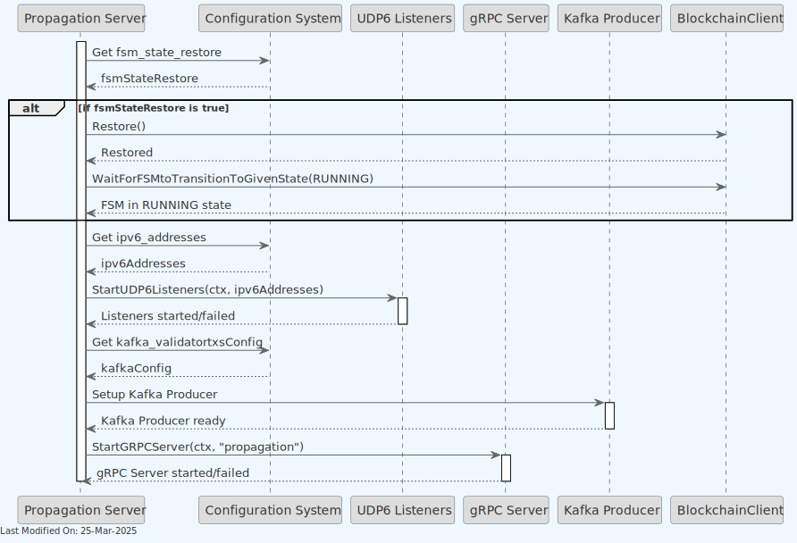
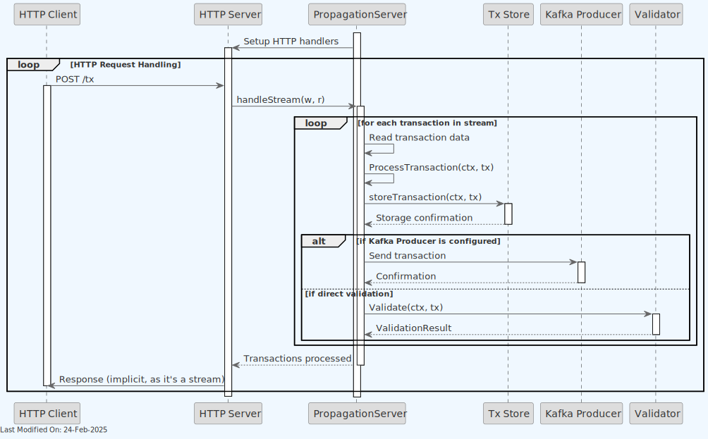
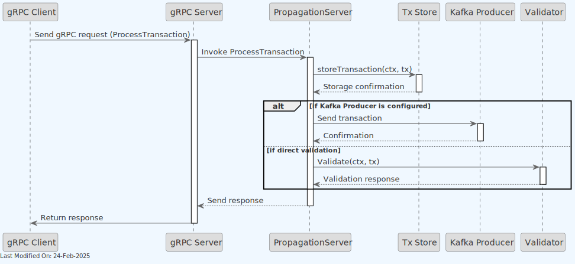

# 🌐 Propagation Service

## Index

1. [Description](#1-description)
2. [Functionality](#2-functionality)
    - [2.1. Starting the Propagation Service](#21-starting-the-propagation-service)
    - [2.1.1 Validator Integration](#211-validator-integration)
    - [2.2. Propagating Transactions](#22-propagating-transactions)
    - [2.3. Transaction Processing Workflow](#23-transaction-processing-workflow)
    - [2.4. Error Handling](#24-error-handling)
3. [gRPC Protobuf Definitions](#3-grpc-protobuf-definitions)
4. [Data Model](#4-data-model)
5. [Technology](#5-technology)
6. [Directory Structure and Main Files](#6-directory-structure-and-main-files)
7. [How to run](#7-how-to-run)
8. [Configuration options (settings flags)](#8-configuration-options-settings-flags)
9. [Other Resources](#9-other-resources)

## 1. Description

The `Propagation Service` is designed to handle the propagation of transactions across a peer-to-peer Teranode network.

At a glance, the Propagation service:

1. Receives new transactions through various communication methods.
2. Stores transactions in the tx store.
3. Sends the transaction to the Validator service for further processing.


The gRPC protocol is the primary communication method, although HTTP is also accepted.

- `StartHTTPServer`: This function is designed to start a network listener for the HTTP protocol. Each function configures and starts a server to listen for incoming connections and requests on specific network addresses and ports. For example, the HTTP endpoints are `/tx`, `/txs`, and `/health`.

A node can start multiple parallel instances of the Propagation service. This translates into multiple pods within a Kubernetes cluster. Each instance will have its own gRPC server, and will be able to receive and propagate transactions independently. GRPC load balancing allows to distribute the load across the multiple instances.


Notice that the Validator, as shown in the diagram above, can be either a local validator or a remote validator service, depending on the Node configuration. To know more, please refer to the Transaction Validator documentation.

Also, note how the Blockchain client is used in order to wait for the node State to change to `RUNNING` state. For more information on this, please refer to the [State Management](../architecture/stateManagement.md)  documentation.

## 2. Functionality

### 2.1. Starting the Propagation Service



Upon startup, the Propagation service starts the relevant communication channels, as configured via settings.

### 2.1.1 Validator Integration

The Propagation service can work with the Validator in two different configurations:

1. **Local Validator**:

    - When `useLocalValidator=true` (recommended for production)
    - The Validator is instantiated directly within the Propagation service
    - Direct method calls are used without network overhead
    - This provides the best performance and lowest latency

2. **Remote Validator Service**:

    - When `useLocalValidator=false`
    - The Propagation service connects to a separate Validator service via gRPC
    - Useful for development, testing, or specialized deployment scenarios
    - Has higher latency due to additional network calls

This configuration is controlled by the settings passed to `GetValidatorClient()` in daemon.go.

> **Note**: For detailed information about how services are initialized and connected during daemon startup, see the [Teranode Daemon Reference](../../references/teranodeDaemonReference.md#service-initialization-flow).

### 2.2. Propagating Transactions

All communication channels receive txs and delegate them to the `ProcessTransaction()` function. The main communication channels are shown below.

**HTTP:**



**gRPC:**



### 2.3. Transaction Processing Workflow

The transaction processing involves several steps to ensure proper validation and propagation:

1. **Initial Validation**: Each transaction is validated for correct format and to ensure it's not a coinbase transaction.
2. **Storage**: Valid transactions are stored in the transaction store using the transaction hash as the key.
3. **Validation Submission**: Transactions are submitted to the validator service through one of two channels:

    - **Kafka**: Normal-sized transactions are sent to the validator through Kafka for asynchronous processing.
    - **HTTP Fallback**: Large transactions exceeding Kafka message size limits are sent directly to the validator's HTTP endpoint.

#### Format Handling

The Propagation Service is format-agnostic and handles transaction formats flexibly:

- **Accepts both formats**: Standard Bitcoin format and Extended Format (BIP-239) transactions
- **No format validation at ingress**: Transactions are not rejected based on their format
- **Storage preserves received format**: Transactions are initially stored as received in the blob store
- **Format handling delegation**: The actual format conversion and extension is handled downstream by the Validator Service

This design ensures:

- **Maximum compatibility** with diverse wallet implementations (from legacy to modern)
- **No format-based rejection** at the network edge
- **Flexible deployment** supporting both traditional Bitcoin clients and BIP-239 aware applications
- **Backward compatibility** with the broader Bitcoin ecosystem

The Propagation Service focuses on efficient transaction ingress and distribution, delegating format-specific processing to the appropriate downstream services.

### 2.4. Error Handling

The Propagation Service implements comprehensive error handling:

1. **Transaction Format Errors**: Malformed transactions are rejected with appropriate error messages.
2. **Storage Failures**: If transaction storage fails, the error is logged and propagated to the client.
3. **Validation Errors**: Errors during validation are captured and returned to the client.
4. **Batch Processing**: When processing transaction batches, each transaction is handled independently, allowing some transactions to succeed even if others fail.
5. **Request Limiting**: Implements limits on transaction size and batch counts to prevent resource exhaustion.

## 3. gRPC Protobuf Definitions

The Propagation Service uses gRPC for communication between nodes. The protobuf definitions used for defining the service methods and message formats can be seen in the [propagationProto.md documentation](../../references/protobuf_docs/propagationProto.md).

## 4. Data Model

The Propagation Service accepts transactions in multiple formats:

- [Transaction Data Model](../datamodel/transaction_data_model.md): Comprehensive guide covering both standard Bitcoin format and Extended Format (BIP-239), including how Teranode handles format conversion and storage.

## 5. Technology

Main technologies involved:

1. **Go Programming Language (Golang)**:

    - The entire service is written in Go.

2. **Peer-to-Peer (P2P) Networking**:

    - The service is designed for a P2P network environment, where nodes (computers) in the network communicate directly with each other without central coordination.
    - `bsv-blockchain/go-p2p/wire` is used for P2P transaction propagation in the Teranode BSV network.

3. **Networking Protocols (HTTP)**

4. **Cryptography**:

    - The use of `crypto` packages for RSA key generation and TLS (Transport Layer Security) configuration for secure communication.

5. **gRPC and Protocol Buffers**:

    - gRPC, indicated by the use of `google.golang.org/grpc`, is a high-performance, open-source universal RPC framework. It uses Protocol Buffers as its interface definition language.

## 6. Directory Structure and Main Files

```text
./services/propagation
│
├── Client.go                            - Contains the client-side logic for interacting with the propagation service.
├── Client_test.go                       - Unit tests for the Client.go functionality.
├── Server.go                            - Contains the main server-side implementation for the propagation service.
├── Server_test.go                       - Unit tests for the Server.go functionality.
├── client_large_tx_fallback_test.go     - Tests the large transaction fallback mechanism in the client.
├── http_handlers_test.go                - Unit tests for HTTP handler functions.
├── large_tx_fallback_test.go            - Tests for the large transaction fallback mechanism.
├── metrics.go                           - Metrics collection and monitoring of the propagation service.
├── propagation_error_test.go            - Unit tests for error handling in the propagation service.
└── propagation_api                      - Directory containing various files related to the API definition and implementation of the propagation service.
    ├── propagation_api.pb.go            - Auto-generated file from protobuf definitions, containing Go bindings for the API.
    ├── propagation_api.proto            - Protocol Buffers definition file for the propagation API.
    └── propagation_api_grpc.pb.go       - gRPC (Google's RPC framework) specific implementation file for the propagation API.
```

## 7. How to run

To run the Propagation Service locally, you can execute the following command:

```shell
SETTINGS_CONTEXT=dev.[YOUR_CONTEXT] go run -Propagation=1
```

Please refer to the [Locally Running Services Documentation](../../howto/locallyRunningServices.md) document for more information on running the Propagation Service locally.

## 8. Configuration options (settings flags)

For comprehensive configuration documentation including all settings, defaults, and interactions, see the [Propagation Settings Reference](../../references/settings/services/propagation_settings.md).

## 9. Other Resources

[Propagation Service Reference](../../references/services/propagation_reference.md)
