# 🌐 RPC Service

## Index

1. [Introduction](#1-introduction)
    - [Supported RPC Commands](#supported-rpc-commands)
    - [Unimplemented RPC Commands](#unimplemented-rpc-commands)
    - [Command help](#command-help)
    - [Authentication](#authentication)
2. [Architecture](#2-architecture)
3. [Functionality](#3-functionality)
    - [3.1. RPC Service Initialization and Configuration](#31-rpc-service-initialization-and-configuration)
    - [3.2. Command: Create Raw Transaction](#32-command-create-raw-transaction)
    - [3.3. Command: Freeze](#33-command-freeze)
    - [3.4. Command: Generate](#34-command-generate)
    - [3.5. Command: Generate to Address](#35-command-generate-to-address)
    - [3.6. Command: Get Best Block Hash](#36-command-get-best-block-hash)
    - [3.7. Command: Get Block](#37-command-get-block)
    - [3.8. Command: Get Block By Height](#38-command-get-block-by-height)
    - [3.9. Command: Get Blockchain Info](#39-command-get-blockchain-info)
    - [3.10. Command: Get Block Hash](#310-command-get-block-hash)
    - [3.11. Command: Get Block Header](#311-command-get-block-header)
    - [3.12. Command: Get Difficulty](#312-command-get-difficulty)
    - [3.13. Command: Get Info](#313-command-get-info)
    - [3.14. Command: Get Mining Info](#314-command-get-mining-info)
    - [3.15. Command: Get Mining Candidate](#315-command-get-mining-candidate)
    - [3.16. Command: Get Peer Info](#316-command-get-peer-info)
    - [3.17. Command: Get Raw Transaction](#317-command-get-raw-transaction)
    - [3.18. Command: Invalidate Block](#318-command-invalidate-block)
    - [3.19. Command: Is Banned](#319-command-is-banned)
    - [3.20. Command: Reassign](#320-command-reassign)
    - [3.21. Command: Reconsider Block](#321-command-reconsider-block)
    - [3.22. Command: Send Raw Transaction](#322-command-send-raw-transaction)
    - [3.23. Command: Set Ban](#323-command-set-ban)
    - [3.24. Command: Stop](#324-command-stop)
    - [3.25. Command: Submit Mining Solution](#325-command-submit-mining-solution)
    - [3.26. Command: Unfreeze](#326-command-unfreeze)
    - [3.27. Command: Version](#327-command-version)
4. [Technology](#4-technology)
5. [Directory Structure and Main Files](#5-directory-structure-and-main-files)
6. [Configuration Settings](#6-configuration-settings)
7. [How to run](#7-how-to-run)
8. [Other Resources](#8-other-resources)

## 1. Introduction

> **Note**: For information about how the RPC service is initialized during daemon startup and how it interacts with other services, see the [Teranode Daemon Reference](../../references/teranodeDaemonReference.md#service-initialization-flow).

The RPC server provides compatibility with the Bitcoin RPC interface, allowing clients to interact with the Teranode node using standard Bitcoin RPC commands. The RPC server listens for incoming requests and processes them, returning the appropriate responses.

Teranode provides partial support, as required for its own services. Additional support for specific commands and features might be added over time.

The below table summarises the services supported in the current version:

### Supported RPC Commands

| RPC Command               | Status     | Description                                                                  |
|---------------------------|------------|------------------------------------------------------------------------------|
| createrawtransaction      | Supported  | Creates a raw transaction without signing it                                 |
| freeze                    | Supported  | Freezes a specific UTXO, preventing it from being spent                      |
| generate                  | Supported  | Generates blocks (for testing)                                               |
| generatetoaddress         | Supported  | Generates blocks to a specified address (for testing)                        |
| getbestblockhash          | Supported  | Returns the hash of the best (tip) block in the longest blockchain           |
| getblock                  | Supported  | Returns information about a block from the block hash                        |
| getblockbyheight          | Supported  | Returns information about a block from the block height                      |
| getblockchaininfo         | Supported  | Returns state information about blockchain processing                        |
| getblockhash              | Supported  | Returns hash of block in best-block-chain at height                          |
| getblockheader            | Supported  | Returns information about block header from hash                             |
| getdifficulty             | Supported  | Returns the proof-of-work difficulty as a multiple of the minimum difficulty |
| getinfo                   | Supported  | Returns general information about the node and blockchain                    |
| getmininginfo             | Supported  | Returns mining-related information                                           |
| getpeerinfo               | Supported  | Returns data about each connected network node                               |
| getrawtransaction         | Supported  | Returns raw transaction data                                                 |
| getminingcandidate        | Supported  | Returns data needed to construct a block to work on                          |
| invalidateblock           | Supported  | Permanently marks a block as invalid                                         |
| isbanned                  | Supported  | Checks if a network address is currently banned                              |
| reassign                  | Supported  | Reassigns ownership of a specific UTXO to a new Bitcoin address              |
| reconsiderblock           | Supported  | Removes invalidity status of a block                                         |
| sendrawtransaction        | Supported  | Submits raw transaction to local node and network                            |
| setban                    | Supported  | Attempts to add or remove an IP/Subnet from the banned list                  |
| stop                      | Supported  | Stops the node                                                               |
| submitminingsolution      | Supported  | Submits a mining solution to the network                                     |
| unfreeze                  | Supported  | Unfreezes a previously frozen UTXO, allowing it to be spent                  |
| version                   | Supported  | Returns version information about the server                                 |

### Unimplemented RPC Commands

| RPC Command              | Status        | Description                                                            |
|--------------------------|---------------|------------------------------------------------------------------------|
| addnode                  | Unimplemented | Attempts to add or remove a node from the addnode list                 |
| debuglevel               | Unimplemented | Changes the debug level of the server                                  |
| decoderawtransaction     | Unimplemented | Returns a JSON object representing the serialized transaction          |
| decodescript             | Unimplemented | Decodes a hex-encoded script                                           |
| estimatefee              | Unimplemented | Estimates the fee per kilobyte for a transaction                       |
| getaddednodeinfo         | Unimplemented | Returns information about added nodes                                  |
| getbestblock             | Unimplemented | Returns the height and hash of the best block                          |
| getblockcount            | Unimplemented | Returns the number of blocks in the longest blockchain                 |
| getblocktemplate         | Unimplemented | Returns data needed to construct a block to work on                    |
| getcfilter               | Unimplemented | Returns a compact filter for a block                                   |
| getcfilterheader         | Unimplemented | Returns the filter header of a block                                   |
| getconnectioncount       | Unimplemented | Returns the number of connections to other nodes                       |
| getcurrentnet            | Unimplemented | Returns the name of the current network                                |
| getgenerate              | Unimplemented | Returns if the server is set to generate coins                         |
| gethashespersec          | Unimplemented | Returns a recent hashes per second performance measurement             |
| getheaders               | Unimplemented | Returns block headers starting from a hash                             |
| getmempoolinfo           | Unimplemented | Returns information about the node's current transaction memory pool   |
| getnettotals             | Unimplemented | Returns information about network traffic                              |
| getnetworkhashps         | Unimplemented | Returns the estimated network hashes per second                        |
| getrawmempool            | Unimplemented | Returns all transaction ids in memory pool                             |
| gettxout                 | Unimplemented | Returns details about an unspent transaction output                    |
| gettxoutproof            | Unimplemented | Returns a hex-encoded proof that a transaction was included in a block |
| help                     | Unimplemented | Lists all available commands, or gets help for a specified command     |
| node                     | Unimplemented | Attempts to add or remove a node from the addnode list                 |
| ping                     | Unimplemented | Queues a ping to be sent to all connected peers                        |
| searchrawtransactions    | Unimplemented | Returns raw transactions matching given criteria                       |
| setgenerate              | Unimplemented | Sets if the server should generate coins                               |
| submitblock              | Unimplemented | Attempts to submit a new block to the network                          |
| uptime                   | Unimplemented | Returns the total uptime of the server                                 |
| validateaddress          | Unimplemented | Returns information about the given bitcoin address                    |
| verifychain              | Unimplemented | Verifies blockchain database                                           |
| verifymessage            | Unimplemented | Verifies a signed message                                              |
| verifytxoutproof         | Unimplemented | Verifies that a proof points to a transaction in a block               |

### Command help

A description of the commands can be found in the `rpcserverhelp.go` file in the `bsvd` repository:

- [rpcserverhelp.go](https://github.com/bitcoinsv/bsvd/blob/master/rpcserverhelp.go)

Teranode RPC server is designed to be compatible with the Bitcoin RPC interface, as implemented in the `bsvd` repository.

### Authentication

All RPC commands require a valid username and password for authentication. The server listens on a specified port for incoming requests and processes them accordingly. The server could be opened up only for local (within the node) access, or it could be exposed to the public internet, depending on the deployment requirements. In either case, authentication is required to access the RPC server.

#### GRPC API Key Authentication

For GRPC services, certain administrative operations require additional API key authentication. The following methods require an API key:

- **Ban/Unban Operations**: `BanPeer` and `UnbanPeer` methods in both P2P and Legacy services require API key authentication for security.

The API key is configured via the `grpc_admin_api_key` setting. If no API key is provided, the system will automatically generate a random 32-byte API key at startup, which will be logged for reference. The API key must be included in GRPC requests as metadata with the key `x-api-key`.

## 2. Architecture


The following diagram provides additional detail showing the RPC Service's internal structure and external service connections:

> **Note**: This diagram shows a simplified component view. The RPC Server handles all JSON-RPC processing, command routing, and service client interactions through the `RPCServer` struct and its handler function map (`rpcHandlers`), rather than having separate handler components for each command category.

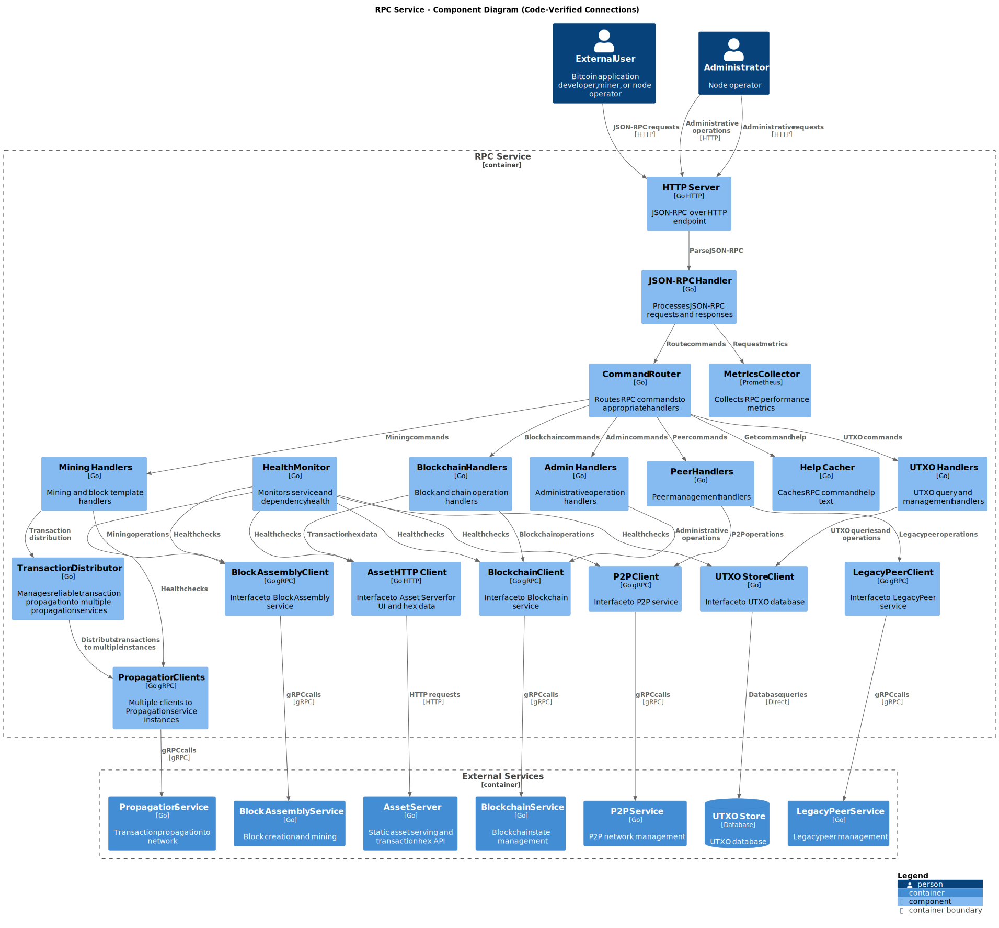

The RPC server is a standalone service that listens for incoming requests and processes them based on the command type. The server starts by initializing the HTTP server and setting up the necessary configurations.

It then listens for incoming requests and routes them to the appropriate handler based on the command type. The handler processes the request, executes the command, and returns the response to the client.

In order to serve some of the requests, the RPC server interacts with the Teranode core services to fetch the required data.

For example, when a `getblock` command is received, the server interacts with the blockchain service to fetch the block data.

Also, when a `generate` command is received, the server interacts with the miner service to generate the requested number of blocks.

## 3. Functionality

### 3.1. RPC Service Initialization and Configuration

### 3.2. Command: Create Raw Transaction

The `createrawtransaction` RPC method is used in Bitcoin to manually create a raw transaction. This transaction is not broadcast to the network but returned as a hex-encoded string. The created transaction could then be further modified, signed, and eventually broadcast using other RPC commands.

The CreateRawTransaction method constructs a transaction that spends a given set of inputs and sends the outputs to specified addresses. It requires specific parameters about the inputs (which UTXOs to spend) and outputs (where to send the coins).

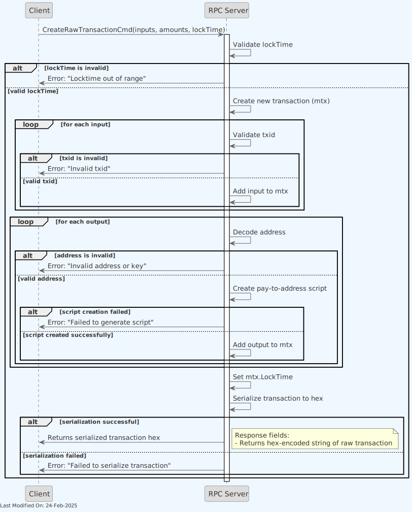

#### Input Parameters

- **Inputs**: A list of transaction inputs including the transaction ID (`txid`), output index (`vout`), and a sequence number if applicable.
- **Amounts**: A dictionary where each key is a Bitcoin address and the value is the amount of bitcoin to send to that address.
- **LockTime** (optional): Specifies the earliest time or block number that this transaction can be included in the blockchain.

#### Steps

1. **Validate LockTime**: Checks if the provided `LockTime` is within the valid range.

2. **Create Transaction**: Initializes a new transaction (`mtx`).

3. **Process Inputs**:

    - For each input, it validates the transaction ID and constructs the transaction input structure.
    - If a `LockTime` is set and not zero, it adjusts the sequence number to allow for the lock time to be effective.

4. **Process Outputs**:

    - Validates the amount for each output to ensure it's within the valid monetary range.
    - Validates each output address, ensuring it's a supported type and appropriate for the network.
    - Creates a payment script for each address and constructs the transaction output.

5. **Set Transaction LockTime**: If provided, sets the transaction's lock time.

6. **Serialize Transaction**: Converts the transaction to a hex-encoded string for output.

#### Outputs

- **Success**: Returns a hex-encoded string representing the raw transaction.
- **Error**: Returns an error if there are issues with the inputs, outputs, lock time, address decoding, or serialization.

### 3.3. Command: Freeze

The `freeze` command allows administrators to freeze a specific UTXO, preventing it from being spent in future transactions.

#### Function Overview

- **Purpose**: To mark a specific transaction output (UTXO) as frozen, making it unavailable for spending

- **Parameters**:

    - `txid` (string, required): The transaction ID of the output to freeze
    - `vout` (numeric, required): The output index to freeze

- **Return Value**:

    - On success: Returns `true` indicating the UTXO was successfully frozen
    - On failure: Returns an error if the UTXO cannot be found or frozen

#### Process Flow


1. **Request Processing**:

    - Receives request with transaction ID and output index
    - Validates input parameters
    - Initializes tracing and metrics

2. **UTXO Validation**:

    - Checks if the specified UTXO exists
    - Validates that the UTXO is not already frozen

3. **Freezing Operation**:

    - Marks the UTXO as frozen in the UTXO state database
    - Records the freezing action for auditing purposes

4. **Response Construction**:

    - Returns `true` on successful freeze operation
    - Returns error if validation fails or database update fails

#### (Success) Response Fields

- Returns boolean `true` on successful freeze operation

#### Important Notes

- Freezing a UTXO is an administrative function that should be used with caution
- This operation is reversible using the `unfreeze` command
- Frozen UTXOs will be rejected if included in transaction inputs

### 3.4. Command: Generate

The `generate` command is used to generate a specified number of blocks on the blockchain. The RPC server processes this command by interacting with the blockchain service to create the requested number of blocks.

This command is commonly used in testing and development environments to artificially advance the blockchain by generating blocks immediately, rather than waiting for them to be mined in the usual way.


The function accepts a `GenerateCmd` which contains the number of blocks to generate, and sends an HTTP GET request to the miner's URL (e.g. `http://localhost:${MINER_HTTP_PORT}/mine?blocks=${numberOfBlocksToGenerate}`) to trigger block generation.

- **Example Use**:

```go
// Sample usage within an RPC server setup
command := &bsvjson.GenerateCmd{NumBlocks: 10}
result, err := handleGenerate(rpcServerInstance, command, closeChannel)
if err != nil {
    log.Fatalf("Failed to generate blocks: %v", err)
}
```

- **Settings**: It requires a valid `MINER_HTTP_PORT` setting.

- **Considerations:**

    - This function should not be exposed in production environments as it allows the generation of blocks outside of the normal consensus rules, which can be exploited or lead to unintended forks if used maliciously.
    - Ensure the miner service is secured and only accessible by the RPC server to prevent unauthorized block generation.

#### (Success) Response Fields

- Returns nil on success

### 3.5. Command: Generate to Address

The `generatetoaddress` command mines blocks immediately to a specified address. This command is primarily used for testing purposes.

#### Function Overview

- **Purpose**: To generate a specified number of blocks with coinbase rewards sent to a designated address

- **Parameters**:

    - `nblocks` (numeric, required): Number of blocks to generate
    - `address` (string, required): The address to send the newly generated bitcoin to
    - `maxtries` (numeric, optional): Maximum number of iterations to try

- **Return Value**:

    - On success: Returns an array of block hashes that were generated
    - On failure: Returns an error describing what went wrong

#### Process Flow


1. **Request Processing**:

    - Receives request with number of blocks, destination address, and optional max tries
    - Validates input parameters
    - Initializes tracing and metrics

2. **Address Validation**:

    - Validates the destination address format and network compatibility
    - Creates a payment script for the address

3. **Block Generation Setup**:

    - Prepares the mining configuration with the specified address
    - Sets up the maximum number of hash attempts (tries)

4. **Block Generation Loop**:

    - For each requested block:

        - Creates a new block template with the address script
        - Performs proof-of-work calculation
        - Processes and validates the new block
        - Adds the block to the blockchain

5. **Response Construction**:

    - Collects the hashes of all successfully generated blocks
    - Returns the array of block hashes

#### (Success) Response Fields

- Returns an array of strings, each containing the hex-encoded hash of a generated block

#### Important Notes

- This command is for testing purposes only and should not be used in production environments
- It bypasses normal mining difficulty by forcing block creation
- Can be used to test blockchain functionality or advance the chain state rapidly for testing
- All generated blocks will send the block reward to the specified address

### 3.6. Command: Get Best Block Hash

The `getbestblockhash` command is used to retrieve the hash of the best (most recent) block on the blockchain. The RPC server processes this command by interacting with the blockchain service to fetch the hash of the best block.

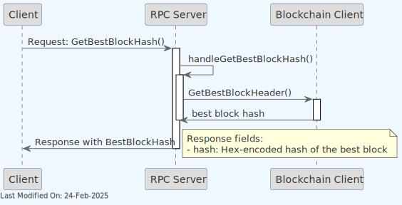

#### (Success) Response Fields

- **hash**: The hex-encoded hash of the best block in the main chain

### 3.7. Command: Get Block

The `getblock` command is used to retrieve information about a specific block on the blockchain. The RPC server processes this command by interacting with the blockchain service to fetch the block data based on the provided block hash.

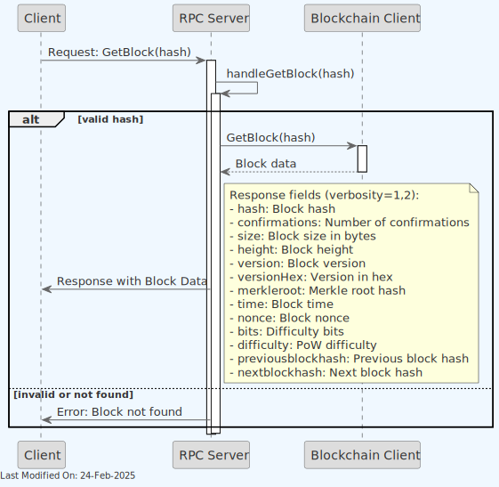

#### (Success) Response Fields

When verbosity=0:

- Returns hex-encoded serialized block data

When verbosity=1 or 2:

- **hash**: The block hash (same as provided)
- **confirmations**: Number of confirmations
- **size**: The block size in bytes
- **height**: The block height
- **version**: The block version
- **versionHex**: The block version in hexadecimal
- **merkleroot**: Root hash of the merkle tree
- **time**: Block time in Unix epoch
- **nonce**: The block nonce
- **bits**: The bits which represent the block difficulty
- **difficulty**: The proof-of-work difficulty
- **previousblockhash**: Hash of the previous block
- **nextblockhash**: Hash of the next block (if available)

### 3.8. Command: Get Block By Height

The `getblockbyheight` command returns information about a block at a specific height in the blockchain. The response format varies based on the verbosity parameter.

#### Function Overview

- **Purpose**: To retrieve block information using block height instead of block hash

- **Parameters**:

    - `height`: The height of the block to retrieve
    - `verbosity`: Determines the format and detail level of the returned data
        - 0: Returns serialized, hex-encoded block data
        - 1: Returns JSON object with block information
        - 2: Returns JSON object with block information including detailed transaction data

- **Return Value**:

    - On success: Returns block data in the format specified by verbosity
    - On failure: Returns an error if the block cannot be found or retrieved

#### Process Flow

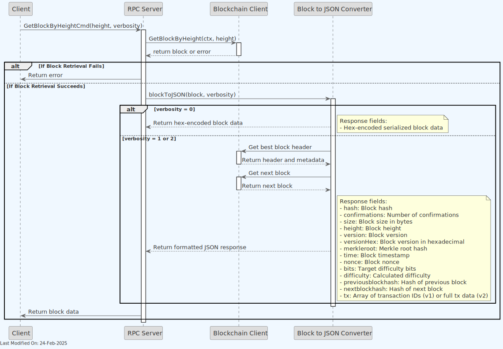

1. **Request Processing**:

    - Receives request with block height and verbosity level
    - Validates input parameters

2. **Block Retrieval**:

    - Queries blockchain service to get block at specified height
    - If block not found, returns appropriate error

3. **Response Construction**:

    - For verbosity=0:

        - Returns hex-encoded serialized block data

    - For verbosity=1:

        - Returns JSON object with block header information and transaction IDs

    - For verbosity=2:

        - Returns JSON object with complete block information including full transaction data

#### (Success) Response Fields

When verbosity=0:

- Returns hex-encoded serialized block data

When verbosity=1 or 2:

- **hash**: The block hash
- **confirmations**: Number of confirmations
- **size**: Block size in bytes
- **height**: Block height
- **version**: Block version
- **versionHex**: Block version in hexadecimal
- **merkleroot**: Merkle root hash
- **time**: Block timestamp
- **nonce**: Block nonce
- **bits**: Target difficulty bits
- **difficulty**: Calculated difficulty
- **previousblockhash**: Hash of previous block
- **nextblockhash**: Hash of next block (if available)
- **tx**: Array of transaction IDs (verbosity=1) or full transaction data (verbosity=2)

### 3.9. Command: Get Blockchain Info

The `getblockchaininfo` command returns information about the current blockchain state, including network name, block count, and other blockchain-related data.

#### Function Overview

- **Purpose**: To retrieve comprehensive information about the current state of the blockchain.

- **Parameters**: None

- **Return Value**:

    - On success: Returns a JSON object containing blockchain state information
    - On failure: Returns an error describing what went wrong

#### Process Flow

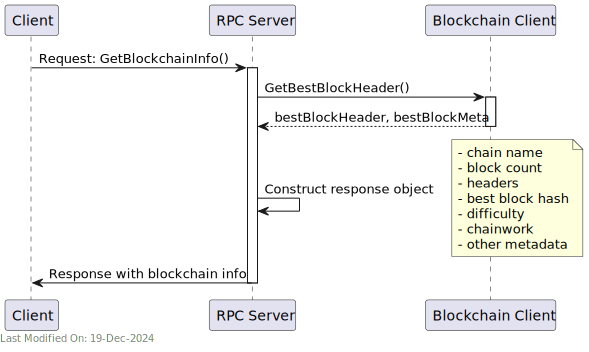

1. **Request Processing**:

    - Receives request for blockchain information
    - No parameters to validate

2. **Blockchain Query**:

    - Retrieves the best block header and metadata from the blockchain service
    - If retrieval fails, returns an error

3. **Response Construction**:

    - Constructs response object containing:

        - Chain name (main, test, regtest)
        - Current block count
        - Header count
        - Best block hash
        - Current difficulty
        - Chain work
        - Additional metadata (pruning status, soft fork information)

#### (Success) Response Fields

- **chain**: The name of the blockchain network (main, test, regtest)
- **blocks**: The current number of blocks in the chain
- **headers**: Number of headers in the chain (currently hardcoded to 863341)
- **bestblockhash**: Hash of the current best block
- **difficulty**: Current mining difficulty
- **mediantime**: Median time of the chain (currently 0)
- **verificationprogress**: Chain verification progress (currently 0)
- **chainwork**: Total accumulated work in the chain
- **pruned**: Whether the node is running in pruned mode (currently false)
- **softforks**: Array of active soft forks (currently empty)

### 3.10. Command: Get Block Hash

The `getblockhash` command returns the hash of a block at a specific height in the blockchain.

#### Function Overview

- **Purpose**: To retrieve the hash of a block at a given block height

- **Parameters**:

    - `index`: The height of the block in the blockchain

- **Return Value**:

    - On success: Returns the block hash as a string
    - On failure: Returns an error if the block cannot be found

#### Process Flow

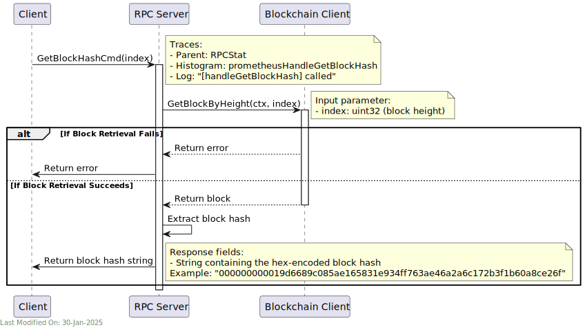

1. **Request Processing**:

    - Receives request with block height (index)
    - Validates input parameter

2. **Block Retrieval**:

    - Queries blockchain service to get block at specified height
    - Extracts hash from retrieved block

3. **Response Construction**:

    - Returns the block hash as a string

#### (Success) Response Fields

- Returns string containing the hex-encoded hash of the block at the specified height

### 3.11. Command: Get Block Header

The `getblockheader` command returns information about a block's header given its hash. The response format varies based on the verbose parameter.

#### Function Overview

- **Purpose**: To retrieve block header information using block hash

- **Parameters**:

    - `hash`: The hash of the block
    - `verbose`: Boolean determining the format of the returned data
        - false: Returns serialized, hex-encoded header data
        - true: Returns JSON object with detailed header information

- **Return Value**:

    - On success: Returns header data in the format specified by verbose parameter
    - On failure: Returns an error if the block cannot be found or hash is invalid

#### Process Flow

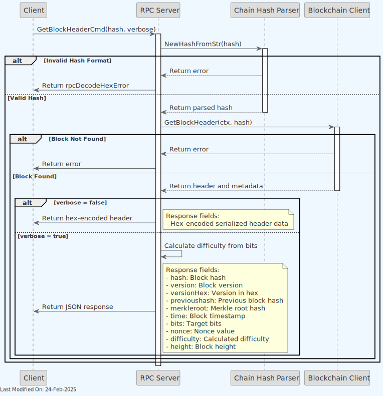

1. **Request Processing**:

    - Receives request with block hash and verbose flag
    - Validates block hash format

2. **Header Retrieval**:

    - Queries blockchain service to get block header and metadata
    - If block not found, returns appropriate error

3. **Response Construction**:

    - For verbose=false:

        - Returns hex-encoded serialized header data

    - For verbose=true:

        - Calculates difficulty from bits
        - Returns JSON object with detailed header information

#### (Success) Response Fields

When verbose=false:

- Returns hex-encoded serialized header data

When verbose=true:

- **hash**: The block hash (same as provided)
- **version**: Block version
- **versionHex**: Block version in hexadecimal
- **previoushash**: Hash of the previous block
- **merkleroot**: Root hash of the merkle tree
- **time**: Block timestamp
- **nonce**: Block nonce value
- **bits**: Target difficulty bits
- **difficulty**: Calculated difficulty
- **height**: Height of the block in the blockchain

### 3.12. Command: Get Difficulty

The `getdifficulty` command returns the proof-of-work difficulty as a multiple of the minimum difficulty.

#### Function Overview

- **Purpose**: To retrieve the current mining difficulty of the network

- **Parameters**: None

- **Return Value**:

    - On success: Returns the current difficulty as a floating-point number
    - On failure: Returns an error if the difficulty cannot be retrieved

#### Process Flow

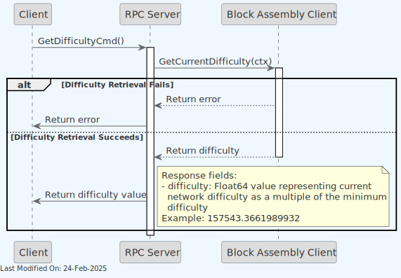

1. **Request Processing**:

    - Receives request for current difficulty
    - Initializes tracing and metrics

2. **Difficulty Retrieval**:

    - Queries block assembly service for current difficulty
    - If retrieval fails, returns appropriate error

3. **Response Construction**:

    - Returns the difficulty value directly to the client

### 3.13. Command: Get Info

The `getinfo` command returns general information about the node's state, including version information, network status, and blockchain details.

#### Function Overview

- **Purpose**: To retrieve general information about the node's current state and configuration.

- **Parameters**: None

- **Return Value**:

    - On success: Returns a JSON object containing node state information
    - On failure: Returns an error if blockchain height cannot be retrieved

#### Process Flow

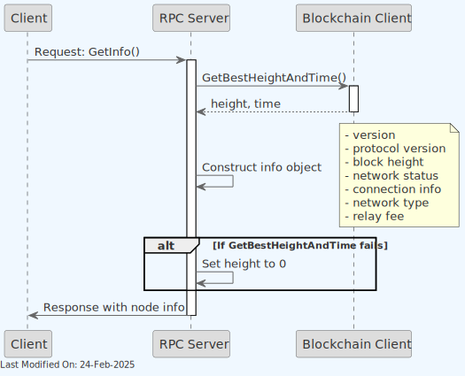

1. **Height Retrieval**:

    - Queries blockchain service for current best height and time
    - If query fails, sets height to 0 and logs error

2. **Response Construction**:

    - Builds response containing:

        - Server version
        - Protocol version
        - Current block height
        - Network time offset
        - Connection count
        - Network type (testnet/mainnet/stn)
        - Minimum relay fee

#### (Success) Response Fields

- **version**: Server version (currently 1)
- **protocolversion**: Protocol version being used
- **blocks**: Current block height
- **timeoffset**: Network time offset (currently 1)
- **connections**: Number of peer connections (currently 1)
- **proxy**: Proxy being used, if any (currently "host:port")
- **difficulty**: Current mining difficulty (currently 1)
- **testnet**: Whether running on testnet
- **stn**: Whether running on the Scaling Test Network
- **relayfee**: Minimum relay fee for transactions (currently 100 sat/KB)

### 3.14. Command: Get Mining Info

The `getmininginfo` command returns various mining-related information including block chain state, current block statistics, and network mining parameters.

#### Function Overview

- **Purpose**: To retrieve comprehensive information about the current mining state

- **Parameters**: None

- **Return Value**:

    - On success: Returns a JSON object containing mining-related information
    - On failure: Returns an error if the mining information cannot be retrieved

#### Process Flow

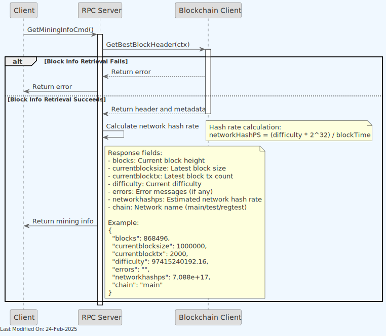

1. **Request Processing**:

    - Receives request for mining information
    - Initializes tracing and metrics

2. **Data Retrieval**:

    - Queries blockchain service for best block header and metadata
    - Calculates network hash rate based on difficulty and target block time
    - If retrieval fails, returns appropriate error

3. **Response Construction**:

    - Compiles mining information into a structured response
    - Returns comprehensive mining state data

#### (Success) Response Fields

- **blocks**: The current block height
- **currentblocksize**: Size of the latest best block in bytes
- **currentblocktx**: Number of transactions in the latest best block
- **difficulty**: Current mining difficulty
- **errors**: Current network error messages (empty string if none)
- **networkhashps**: Estimated network hashes per second
- **chain**: Current network name (main, test, regtest)

### 3.15. Command: Get Mining Candidate

The `getminingcandidate` RPC command in Bitcoin RPC is used to retrieve a candidate block for mining. This command allows miners to obtain the necessary information to attempt mining a new block.

#### Function Overview

- **Purpose**: To request a mining candidate, which represents a potential new block template, from the node.

- **Parameters**:

    - The function doesn't take any specific parameters from the RPC call.
    - `closeChan`: A channel that signals the function to close and stop processing, used for graceful shutdowns and interruption handling (not directly used in this implementation).

- **Return Value**:

    - On success: Returns a mining candidate object (`mc`) containing the necessary information for mining.
    - On failure: Returns an error detailing why the mining candidate could not be retrieved.

#### Process Flow

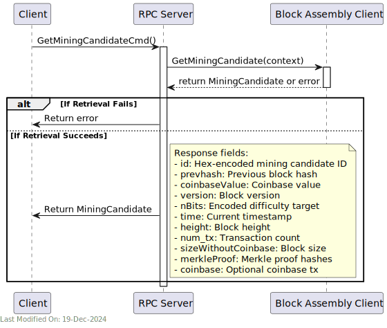

1. **Mining Candidate Retrieval**:

    - Calls the `GetMiningCandidate` method on the `blockAssemblyClient` to retrieve a mining candidate.
    - The Block Assembly generates the latest block template from the blockchain's current state.

2. **Error Handling**:

    - If the retrieval fails, the function returns the error to the caller.

3. **Response**:

    - If successful, the function returns the mining candidate object (`mc`).

#### (Success) Response Fields

- **id**: Hex-encoded mining candidate ID
- **prevhash**: Previous block hash
- **coinbaseValue**: Value for coinbase transaction
- **version**: Block version
- **nBits**: Encoded current difficulty target
- **time**: Current timestamp
- **height**: Block height
- **num_tx**: Number of transactions
- **sizeWithoutCoinbase**: Block size excluding coinbase
- **merkleProof**: Array of merkle proof hashes
- **coinbase**: Hex-encoded coinbase transaction (if requested)

### 3.16. Command: Get Peer Info

The `getpeerinfo` command returns data about each connected network peer as an array of JSON objects.

- **Purpose**: To retrieve detailed information about all connected peers, both legacy and new P2P connections.
- **Parameters**: None
- **Return Value**:

    - On success: Returns an array of peer information objects
    - On failure: Returns partial information if at least one peer service responds

#### Process Flow

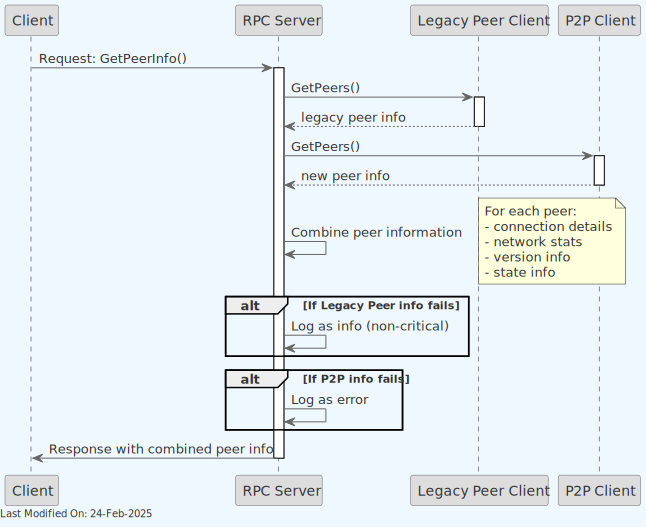

1. **Legacy Peer Information**:

    - Queries legacy peer service for connected peer information
    - If query fails, logs as non-critical error
    - Processes legacy peer data if available

2. **P2P Information**:

    - Queries new P2P service for connected peer information
    - If query fails, logs as error
    - Processes P2P data if available

3. **Information Aggregation**:

    - Combines information from both sources
    - Creates unified peer information objects
    - Includes connection details, network stats, and state information

4. **Response Construction**:

    - Returns array of peer information objects
    - Each object contains available peer details based on connection type

#### (Success) Response Fields

For each peer:

- **id**: Peer ID
- **addr**: The IP address and port of the peer
- **addrlocal**: Local address (legacy peers only)
- **servicesStr**: Services supported by the peer
- **lastsend**: Time of last sent message (legacy peers only)
- **lastrecv**: Time of last received message (legacy peers only)
- **bytessent**: Total bytes sent (legacy peers only)
- **bytesrecv**: Total bytes received (legacy peers only)
- **conntime**: Connection time (legacy peers only)
- **pingtime**: Ping time in seconds (legacy peers only)
- **timeoffset**: Time offset with peer (legacy peers only)
- **version**: Protocol version (legacy peers only)
- **subver**: Peer subversion string (legacy peers only)
- **inbound**: Whether connection is inbound (legacy peers only)
- **startingheight**: Starting height of peer (legacy peers only)
- **currentheight**: Current height of peer (legacy peers only)
- **banscore**: Ban score (legacy peers only)
- **whitelisted**: Whether peer is whitelisted (legacy peers only)
- **feefilter**: Minimum fee rate for transactions to be announced (legacy peers only)

The command aggregates peer information from both the legacy P2P service and the new P2P service, providing a comprehensive view of all connected peers.

### 3.17. Command: Get Raw Transaction

The `getrawtransaction` command retrieves raw transaction data for a specific transaction, either as a serialized hex string or as a detailed JSON object.

#### Function Overview

- **Purpose**: To retrieve transaction data for a specific transaction identified by its transaction ID

- **Parameters**:

    - `txid` (string, required): The transaction ID to look up
    - `verbose` (boolean, optional, default=false): If false, returns a hex-encoded string. If true, returns a JSON object with transaction details

- **Return Value**:

    - If verbose=false: Returns a serialized, hex-encoded string of the transaction
    - If verbose=true: Returns a JSON object with detailed transaction information
    - On failure: Returns an error if the transaction cannot be found

#### Process Flow


1. **Request Processing**:

    - Receives request with transaction ID and verbosity flag
    - Validates transaction ID format
    - Initializes tracing and metrics

2. **Transaction Retrieval**:

    - Queries blockchain service to locate the transaction
    - If transaction not found, returns appropriate error

3. **Response Formatting**:

    - For non-verbose (false) response:

        - Returns hex-encoded serialized transaction data

    - For verbose (true) response:

        - Constructs detailed JSON object with transaction information
        - Includes metadata such as blockhash, confirmation count, and timestamp
        - Processes all inputs and outputs with script details

4. **Response Construction**:

    - Returns the transaction data in the requested format

#### (Success) Response Fields

When verbose=false:

- Returns a string containing the hex-encoded serialized transaction

When verbose=true:

- **hex**: The serialized, hex-encoded transaction data
- **txid**: The transaction ID (same as requested)
- **hash**: The transaction hash (usually same as txid)
- **size**: The transaction size in bytes
- **version**: The transaction version number
- **locktime**: The transaction's locktime
- **vin**: Array of transaction inputs
    - **txid**: Transaction ID of the input
    - **vout**: Output index of the input
    - **scriptSig**: Script signature
        - **asm**: Assembly representation of the script
        - **hex**: Hex-encoded script
    - **sequence**: Input sequence number
- **vout**: Array of transaction outputs
    - **value**: The output value in BTC
    - **n**: The output index number
    - **scriptPubKey**: The output script
        - **asm**: Assembly representation of the script
        - **hex**: Hex-encoded script
        - **reqSigs**: Required signatures
        - **type**: Script type
        - **addresses**: Array of Bitcoin addresses
- **blockhash**: The block hash containing this transaction
- **confirmations**: Number of confirmations
- **time**: Block time
- **blocktime**: Block time in seconds since epoch

### 3.18. Command: Invalidate Block

The `invalidateblock` command permanently marks a block as invalid, as if it violated a consensus rule.

#### Function Overview

- **Purpose**: To manually invalidate a block in the blockchain

- **Parameters**:

    - `blockhash`: The hash of the block to invalidate

- **Return Value**:

    - On success: Returns nil, indicating the block was successfully invalidated
    - On failure: Returns an error if the block cannot be found or hash is invalid

#### Process Flow

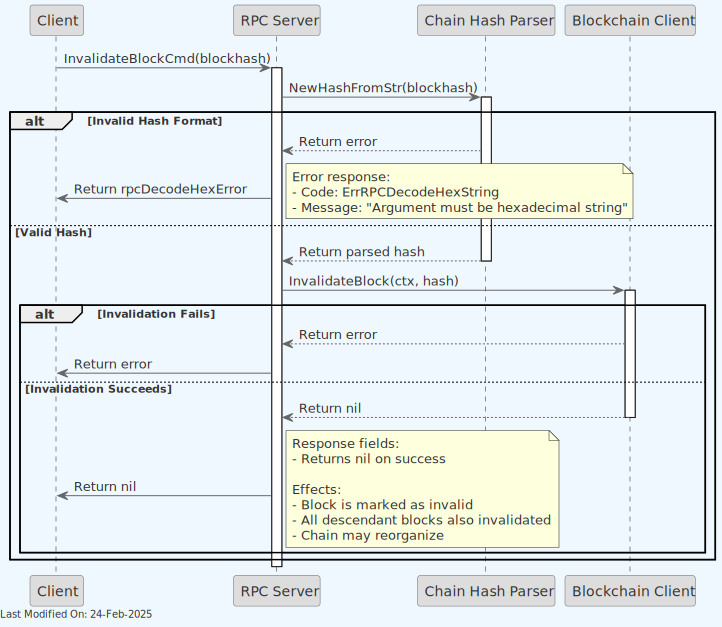

1. **Request Processing**:

    - Receives request with block hash
    - Validates block hash format
    - Initializes tracing and metrics

2. **Block Invalidation**:

    - Sends invalidation request to blockchain service
    - If invalidation fails, returns appropriate error

3. **Response Construction**:

    - Returns nil on successful invalidation
    - Returns error if operation fails

#### Important Notes

- This command should be used with extreme caution as it can cause chain reorganization
- Invalidating a block also invalidates all blocks built on top of it

### 3.19. Command: Is Banned

The `isbanned` command checks if a specific network address is currently banned from connecting to the node.

**Note**: This command accesses the underlying GRPC ban status methods which require API key authentication when accessed directly via GRPC. However, the RPC `isbanned` command handles this authentication internally.

#### Function Overview

- **Purpose**: To determine if a network address is banned from node connections

- **Parameters**:

    - `address` (string, required): The network address to check, e.g. "192.168.0.1" or "192.168.0.0/24"

- **Return Value**:

    - On success: Returns a boolean value - `true` if the address is banned, `false` if not
    - On failure: Returns an error if the address format is invalid

#### Process Flow

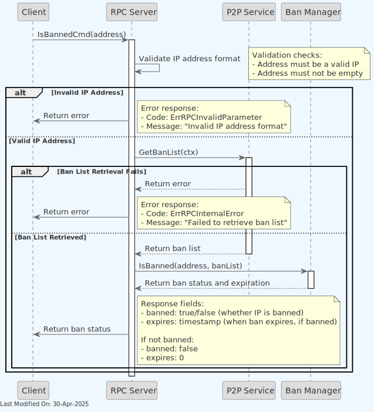

1. **Request Processing**:

    - Receives request with network address
    - Validates address format
    - Initializes tracing and metrics

2. **Ban Status Check**:

    - Queries peer service to check if the address is in the banned list
    - Retrieves current ban status and expiration time if banned

3. **Response Construction**:

    - Returns `true` if the address is currently banned
    - Returns `false` if the address is not banned
    - Returns error if address validation fails

#### (Success) Response Fields

- Returns boolean `true` if the address is banned
- Returns boolean `false` if the address is not banned

#### Important Notes

- Can be used to check both individual IP addresses and subnets
- Address bans may have an expiration time
- Works in conjunction with the `setban` command which is used to add or remove bans

### 3.20. Command: Reassign

The `reassign` command allows administrators to change the ownership of a specific UTXO by reassigning it to a new Bitcoin address.

#### Function Overview

- **Purpose**: To reassign ownership of a specific transaction output (UTXO) to a new Bitcoin address

- **Parameters**:

    - `txid` (string, required): The transaction ID of the output to reassign
    - `vout` (numeric, required): The output index to reassign
    - `destination` (string, required): The Bitcoin address to reassign the UTXO to

- **Return Value**:

    - On success: Returns `true` indicating the UTXO was successfully reassigned
    - On failure: Returns an error if the UTXO cannot be found or reassigned

#### Process Flow

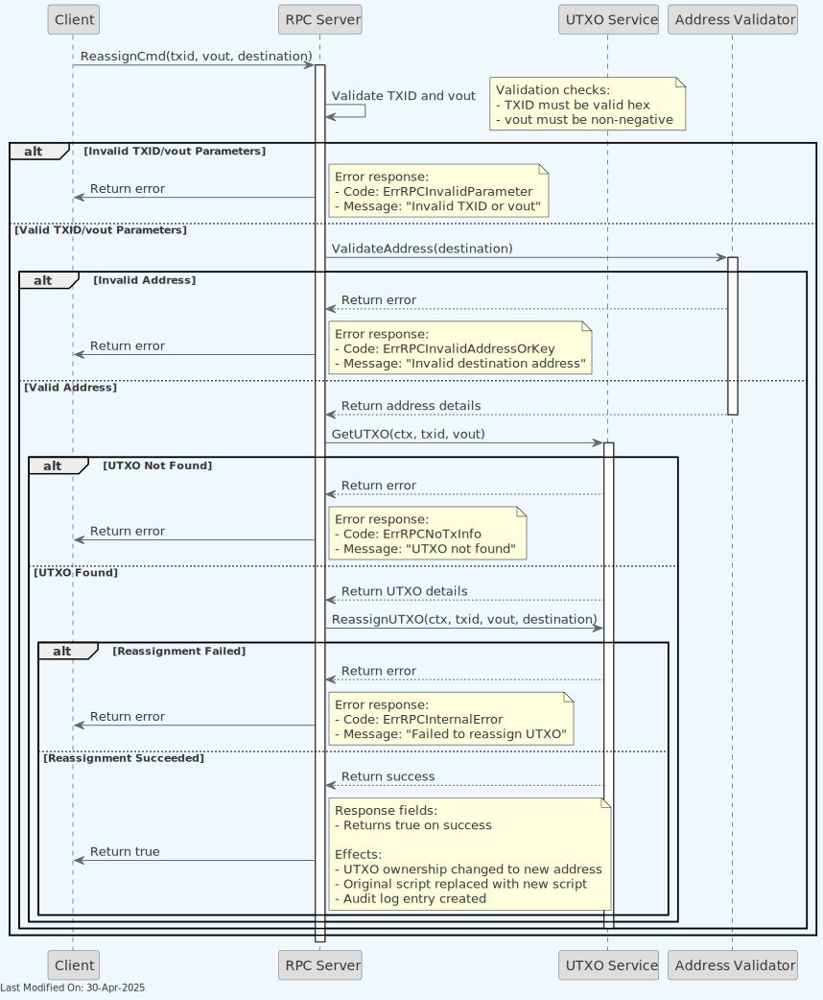

1. **Request Processing**:

    - Receives request with transaction ID, output index, and destination address
    - Validates input parameters
    - Initializes tracing and metrics

2. **UTXO and Address Validation**:

    - Checks if the specified UTXO exists
    - Validates the destination address format and network compatibility

3. **Reassignment Operation**:

    - Creates a new scriptPubKey for the destination address
    - Updates the UTXO record with the new ownership information
    - Records the reassignment action for auditing purposes

4. **Response Construction**:

    - Returns `true` on successful reassignment operation
    - Returns error if validation fails or database update fails

#### (Success) Response Fields

- Returns boolean `true` on successful reassignment operation

#### Important Notes

- Reassigning a UTXO changes its spending conditions without creating a new transaction
- This is an administrative function that bypasses normal Bitcoin transaction rules
- Should only be used in specific regulatory or recovery scenarios
- The operation creates a permanent record in the audit log

### 3.21. Command: Reconsider Block

The `reconsiderblock` command removes the invalid status of a block and its descendants, allowing them to be reconsidered for inclusion in the blockchain. This command is typically used to undo the effects of `invalidateblock`.

#### Function Overview

- **Purpose**: To remove invalid status from a previously invalidated block

- **Parameters**:

    - `blockhash`: The hash of the block to reconsider

- **Return Value**:

    - On success: Returns nil, indicating the block was successfully reconsidered
    - On failure: Returns an error if the block cannot be found or hash is invalid

#### Process Flow

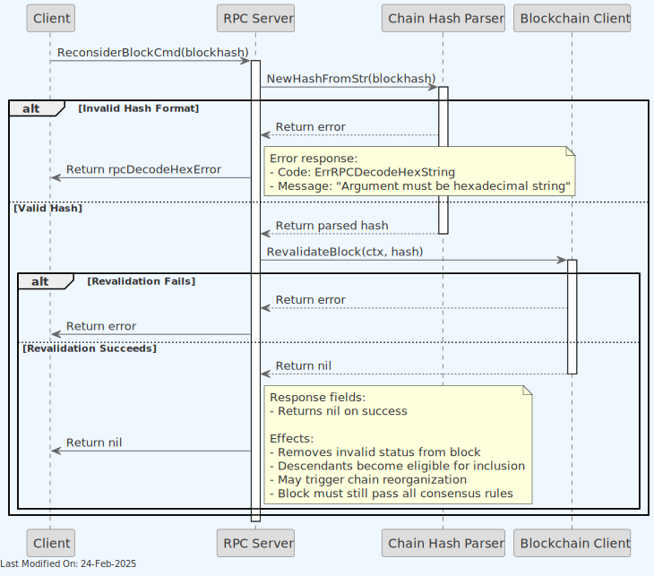

1. **Request Processing**:

    - Receives request with block hash
    - Validates block hash format
    - Initializes tracing and metrics

2. **Block Reconsideration**:

    - Sends revalidation request to blockchain service
    - If revalidation fails, returns appropriate error

3. **Response Construction**:

    - Returns nil on successful reconsideration
    - Returns error if operation fails

#### Important Notes

- This command removes the invalid status set by `invalidateblock`
- The block and its descendants will be reconsidered for inclusion in the best chain
- May trigger chain reorganization if the reconsidered chain has more work

### 3.22. Command: Send Raw Transaction

The `sendrawtransaction` RPC command in Bitcoin RPC is used to submit a pre-signed raw transaction to the network. This command broadcasts the raw transaction hex to the connected nodes in the blockchain network for inclusion in a block.

#### Function Overview

- **Purpose**: To submit a raw, serialized, and hex-encoded transaction to the blockchain network.

- **Parameters**:

    - `cmd`: Contains the raw transaction data and any command-specific parameters.
    - `closeChan`: A channel that signals the function to close and stop processing, used for graceful shutdowns and interruption handling.

- **Return Value**:

    - On success: Returns a result (e.g., transaction ID or confirmation message) indicating that the transaction was successfully broadcast.
    - On failure: Returns an error detailing why the transaction could not be processed or broadcast.

#### Process Flow

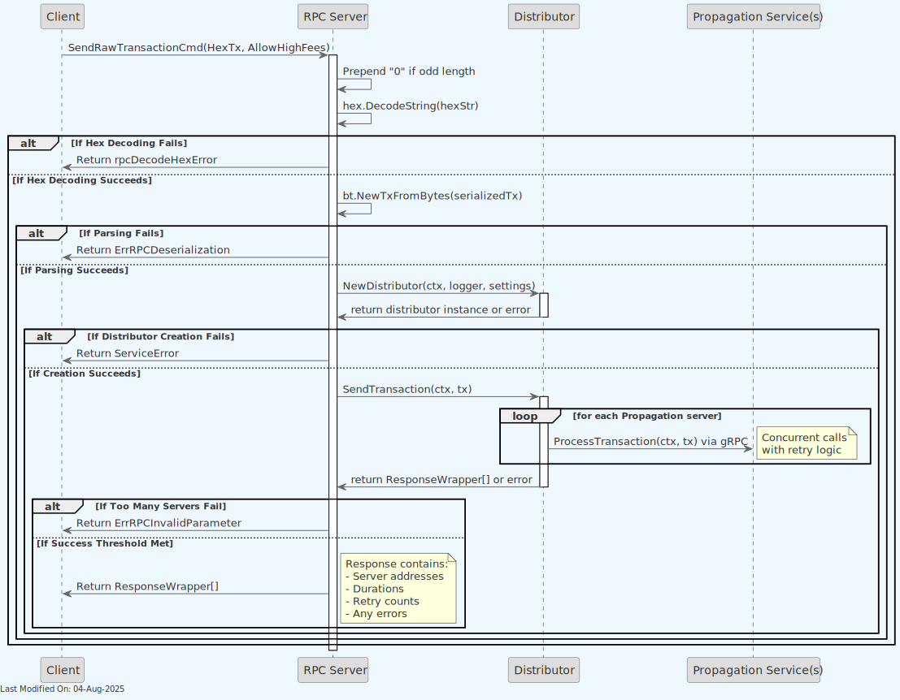

1. **Input Parsing**:

    - The function receives a command (`bsvjson.SendRawTransactionCmd`) which includes the hex-encoded string of the transaction.
    - It checks if the hexadecimal string has an odd length and prepends a "0" if necessary to ensure correct decoding.

2. **Hex Decoding**:

    - Attempts to decode the hexadecimal string into bytes.
    - If decoding fails, it returns an error using `rpcDecodeHexError`, indicating the hex string was malformed.

3. **Transaction Deserialization**:

    - Attempts to construct a transaction object from the decoded bytes using a transaction parsing library (assumed to be `bt.NewTxFromBytes`).
    - If the transaction cannot be parsed, it returns an error stating the transaction is deserializable, indicating structural issues with the transaction data.

4. **Transaction Distribution Setup**:

    - Initializes a `Distributor` object responsible for handling the broadcasting of transactions to the Propagation servers.
    - If the distributor cannot be created (due to configuration errors, connection issues, etc.), it returns an initialization error.

5. **Transaction Broadcasting**:

    - Calls a method (`d.SendTransaction`) on the distributor to send the transaction to the network.
    - If broadcasting fails, it returns an error indicating that the transaction was rejected along with a message detailing the reason (e.g., network errors, validation failures on the network side).

6. **Success Response**:

    - If the transaction is successfully broadcast, the function returns a success response, which includes the transaction ID of the broadcast transaction

### 3.23. Command: Set Ban

The `setban` command adds or removes an IP address or subnet from the banned list. This command is used for network management and peer control.

**Note**: The underlying GRPC ban methods (`BanPeer` and `UnbanPeer`) require API key authentication when accessed directly via GRPC. However, the RPC `setban` command handles this authentication internally.

#### Function Overview

- **Purpose**: To manage banned IP addresses/subnets

- **Parameters**:

    - `ipOrSubnet`: The IP/Subnet to ban/unban (e.g., "192.168.0.6" or "192.168.0.0/24")
    - `command`: "add" to add a ban, "remove" to remove a ban
    - `bantime`: Time in seconds for how long the IP is banned (optional)
    - `absolute`: If true, bantime is interpreted as an absolute timestamp (optional)

- **Return Value**:

    - On success: Returns nil
    - On failure: Returns an error if parameters are invalid or operation fails

#### Process Flow

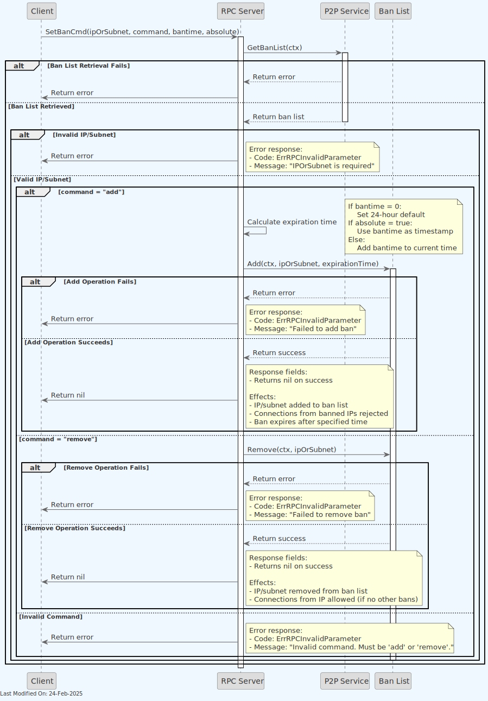

1. **Request Processing**:

    - Receives request with IP/subnet and command
    - Validates input parameters
    - Initializes tracing and metrics

2. **Ban List Management**:

    - Retrieves current ban list
    - Processes add/remove command
    - Updates ban list accordingly

3. **Response Construction**:

    - Returns nil on successful operation
    - Returns error if operation fails

#### Important Notes

- For "add" command:

    - If bantime is 0, defaults to 24 hours
    - If absolute is true, bantime is treated as Unix timestamp

- The IP/subnet format must be valid
- Removing a non-existent ban is considered an error

### 3.24. Command: Stop

The `stop` command initiates a clean shutdown of the node, stopping all services in an orderly fashion.

#### Function Overview

- **Purpose**: To safely shut down the node and all its services

- **Parameters**: None

- **Return Value**:

    - On success: Returns a string message indicating the node is stopping
    - The actual shutdown process happens asynchronously after the response is sent

#### Process Flow


1. **Request Processing**:

    - Receives stop request
    - No parameters to validate
    - Initializes tracing and metrics

2. **Shutdown Initiation**:

    - Logs shutdown request
    - Sets internal shutdown flag
    - Signals main process to initiate shutdown sequence

3. **Response Construction**:

    - Returns confirmation message that shutdown has been initiated
    - Actual shutdown happens in the background after response is sent

4. **Shutdown Sequence** (happens after response):

    - Services are stopped in reverse order of initialization
    - Connections are gracefully closed
    - Data is persisted where necessary
    - Process exits

#### (Success) Response Fields

- Returns string message: "Bitcoin server stopping"

#### Important Notes

- This is an administrative command that should be restricted to authorized users
- The node will complete the shutdown process even after sending the RPC response
- Any pending operations may be completed or aborted depending on their nature
- Clients should expect to lose connection to the node shortly after receiving the response

### 3.25. Command: Submit Mining Solution

The `submitminingsolution` RPC command in Bitcoin RPC is used to submit a mining solution to the network. This command allows miners to propose a potential new block to be added to the blockchain.

#### Function Overview

- **Purpose**: To submit a mining solution, which represents a potential new block, for validation and inclusion in the blockchain.

- **Parameters**:

    - `cmd`: Contains the JSON string of the mining solution and any command-specific parameters.
    - `closeChan`: A channel that signals the function to close and stop processing, used for graceful shutdowns and interruption handling.

- **Return Value**:

    - On success: Returns `nil`, indicating that the mining solution was successfully submitted.
    - On failure: Returns an error detailing why the mining solution could not be processed or submitted.

#### Process Flow

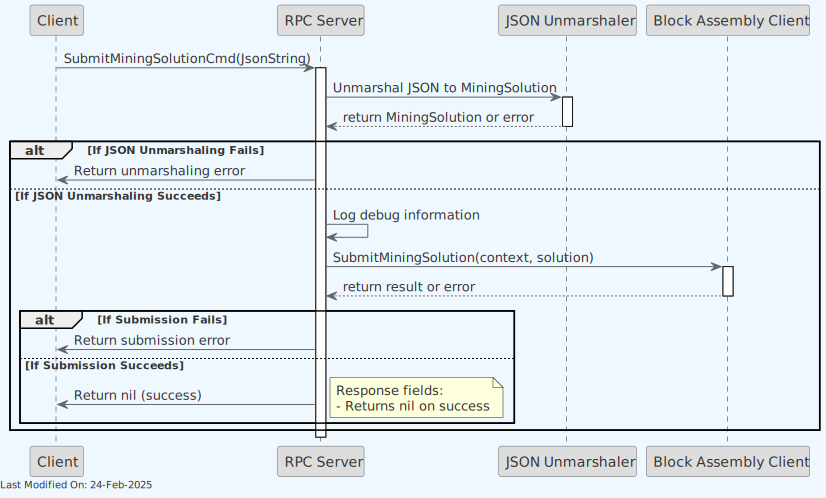

1. **Command Parsing**:

    - The function receives a command (`bsvjson.SubmitMiningSolutionCmd`) which includes a JSON string representing the mining solution.

2. **JSON Unmarshaling**:

    - Attempts to unmarshal the JSON string into a `model.MiningSolution` struct.
    - If unmarshaling fails, it returns an error, indicating that the JSON string was malformed or incompatible with the expected structure.

3. **Solution Submission**:

    - Calls the `SubmitMiningSolution` method on the `blockAssemblyClient` to submit the mining solution to the Block Assembly.
    - The Block Assembly validates the solution and, if successful, propagates it to other nodes in the network.
    - If submission fails, it returns an error indicating why the solution was rejected (e.g., invalid solution, network errors).

#### (Success) Response Fields

- Returns nil on success

### 3.26. Command: Unfreeze

The `unfreeze` command removes the freeze status from a previously frozen UTXO, allowing it to be spent again in transactions.

#### Function Overview

- **Purpose**: To remove the frozen status from a specific transaction output (UTXO)

- **Parameters**:

    - `txid` (string, required): The transaction ID of the frozen output
    - `vout` (numeric, required): The output index to unfreeze

- **Return Value**:

    - On success: Returns `true` indicating the UTXO was successfully unfrozen
    - On failure: Returns an error if the UTXO cannot be found or unfrozen

#### Process Flow

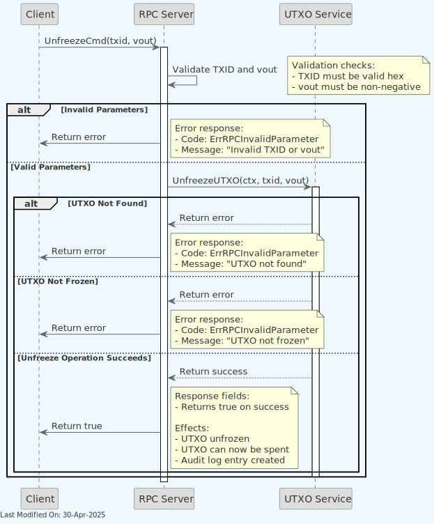

1. **Request Processing**:

    - Receives request with transaction ID and output index
    - Validates input parameters
    - Initializes tracing and metrics

2. **UTXO Validation**:

    - Checks if the specified UTXO exists
    - Validates that the UTXO is currently frozen

3. **Unfreezing Operation**:

    - Removes the frozen status from the UTXO in the state database
    - Records the unfreezing action for auditing purposes

4. **Response Construction**:

    - Returns `true` on successful unfreeze operation
    - Returns error if validation fails or database update fails

#### (Success) Response Fields

- Returns boolean `true` on successful unfreeze operation

#### Important Notes

- Only previously frozen UTXOs can be unfrozen
- After unfreezing, the UTXO becomes available for spending in transactions
- This operation is an administrative function that should be used with appropriate authorization

### 3.27. Command: Version

The `version` command is used to retrieve the version information of the RPC server. The RPC server processes this command by constructing a response with the server version information and returning it to the client.

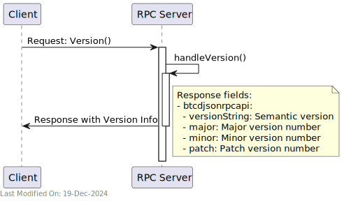

#### (Success) Response Fields

- **btcdjsonrpcapi**: Object containing version information
    - **versionString**: Semantic version string
    - **major**: Major version number
    - **minor**: Minor version number
    - **patch**: Patch version number

## 4. Technology

### **HTTP Server and RESTful API**

- **Usage**: In `Server.go`, an HTTP server is set up to listen for requests and send responses.
- **Functionality**: Handling HTTP requests and responses, as well as routing, middleware support.

### **Authentication and Security**

- **Basic Authentication**: Handling basic HTTP authentication to secure server access.

## 5. Directory Structure and Main Files

The RPC service is located in the `services/rpc` directory. The main files and directories are as follows:

```text
./servers/rpc
├── Server.go          # Main server application file: Initializes and runs the server, sets up configurations, and handles lifecycle events.
└── handlers.go        # Request handlers: Defines functions that process incoming requests based on type and content.
```

## 6. Configuration Settings

For comprehensive configuration documentation including all settings, defaults, and interactions, see the [rpc Settings Reference](../../references/settings/services/rpc_settings.md).

## 7. How to run

To run the RPC Service locally, you can execute the following command:

```shell
SETTINGS_CONTEXT=dev.[YOUR_CONTEXT] go run -RPC=1
```

Please refer to the [Locally Running Services Documentation](../../howto/locallyRunningServices.md) document for more information on running the RPC Service locally.

## 8. Other Resources

[RPC Reference](../../references/services/rpc_reference.md)
