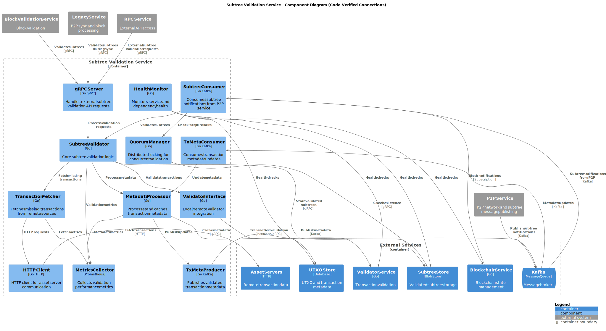
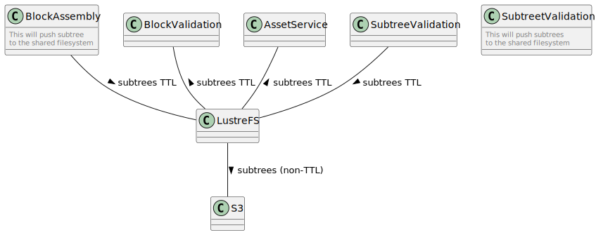
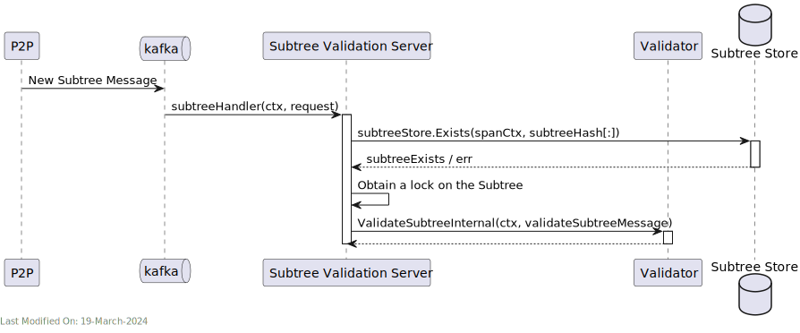
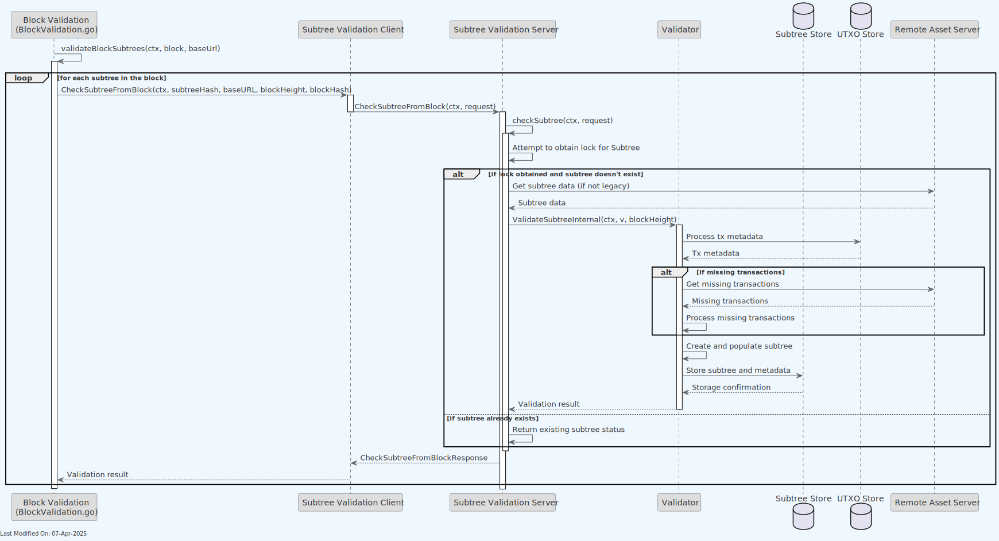
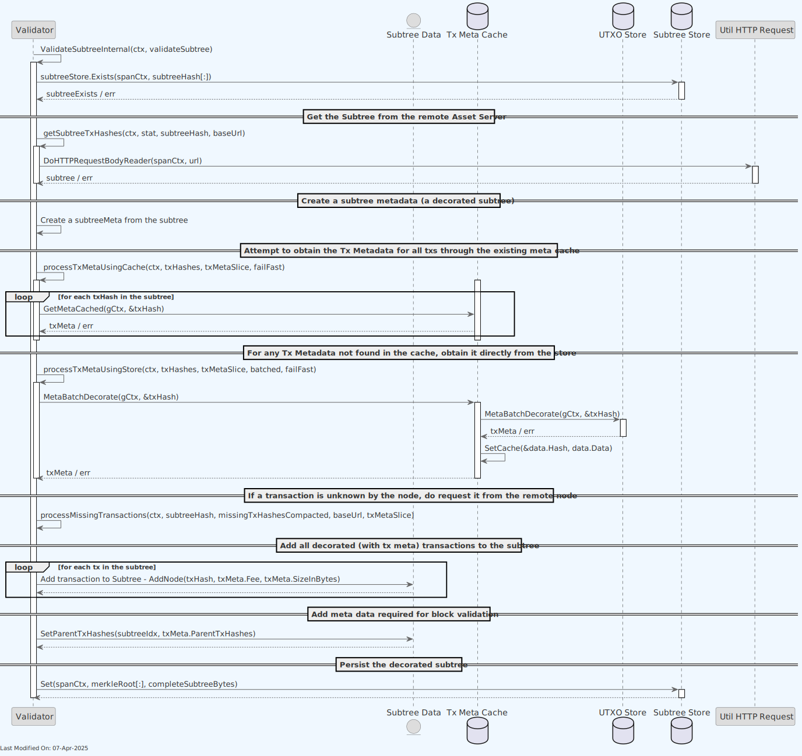
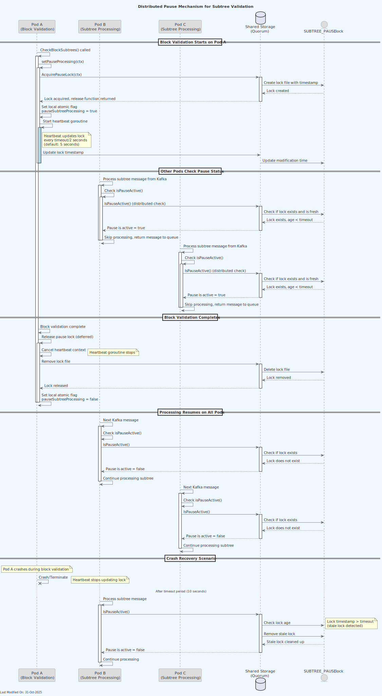

# 🔍 Subtree Validation Service

## Index

1. [Description](#1-description)
2. [Functionality](#2-functionality)
    - [2.1. Receiving UTXOs and warming up the TXMeta Cache](#21-receiving-utxos-and-warming-up-the-txmeta-cache)
    - [2.2. Receiving subtrees for validation](#22-receiving-subtrees-for-validation)
    - [2.3. Validating the Subtrees](#23-validating-the-subtrees)
    - [2.4. Subtree Locking Mechanism](#24-subtree-locking-mechanism)
    - [2.5. Distributed Pause Mechanism](#25-distributed-pause-mechanism)
3. [gRPC Protobuf Definitions](#3-grpc-protobuf-definitions)
4. [Data Model](#4-data-model)
5. [Technology](#5-technology)
6. [Directory Structure and Main Files](#6-directory-structure-and-main-files)

7. [How to Run](#7-how-to-run)
8. [Configuration Settings](#8-configuration-settings)
9. [Other Resources](#9-other-resources)

## 1. Description

The Subtree Validator is responsible for ensuring the integrity and consistency of each received subtree before it is added to the subtree store. It performs several key functions:

1. **Validation of Subtree Structure**: Verifies that each received subtree adheres to the defined structure and format, and that its transactions are known and valid.

2. **Transaction Legitimacy**: Ensures all transactions within subtrees are valid, including checks for double-spending.

3. **Decorates the Subtree with additional metadata**: Adds metadata to the subtree, to facilitate faster block validation at a later stage (by the Block Validation Service).
    - Specifically, the subtree metadata will contain all of the transaction input outpoints ([TxInpoints](../datamodel/utxo_data_model.md#txinpoints-structure)). This decorated subtree can be validated and processed faster by the Block Validation Service, preventing unnecessary round trips to the UTXO Store.

> **Note**: For information about how the Subtree Validation service is initialized during daemon startup and how it interacts with other services, see the [Teranode Daemon Reference](../../references/teranodeDaemonReference.md#service-initialization-flow).


The Subtree Validation Service:

- Receives new subtrees from the P2P Service. The P2P Service has received them from other nodes on the network.
- Validates the subtrees, after fetching them from the remote asset server.
- Decorates the subtrees with additional metadata, and stores them in the Subtree Store.

The P2P Service communicates with the Block Validation over either gRPC protocols.


The detailed component diagram below shows the internal architecture of the Subtree Validation Service:

> **Note**: This diagram represents a simplified component view showing the main architectural elements. The gRPC Server routes requests to handlers (`subtreeHandler.go`, `txmetaHandler.go`) which orchestrate validation logic, file-based locking, transaction fetching via HTTP, and interactions with external services. Kafka consumers process notifications and route them to the appropriate handlers for processing.



### 1.1 Validator Integration

The Subtree Validation service interacts with the Validator service to validate transactions that might be missing during subtree processing. This interaction can happen in two different configurations:

1. **Local Validator**:

    - When `validator.useLocalValidator=true` (recommended for production)
    - The Validator is instantiated directly within the Subtree Validation service
    - Direct method calls are used without network overhead
    - This provides the best performance and lowest latency

2. **Remote Validator Service**:

    - When `validator.useLocalValidator=false`
    - The Subtree Validation service connects to a separate Validator service via gRPC
    - Useful for development, testing, or specialized deployment scenarios
    - Has higher latency due to additional network calls

This configuration is controlled by the settings passed to `GetValidatorClient()` in daemon.go.

To improve performance, the Subtree Validation Service uses a caching mechanism for UTXO meta data (called `TX Meta Cache` for historical reasons). This prevents repeated fetch calls to the store by retaining recently loaded transactions in memory (for a limited time). This can be enabled or disabled via the `subtreevalidation_txMetaCacheEnabled` setting. The caching mechanism is implemented in the `txmetacache` package, and is used by the Subtree Validation Service:

```go
 // create a caching tx meta store
    if gocore.Config().GetBool("subtreevalidation_txMetaCacheEnabled", true) {
        logger.Infof("Using cached version of tx meta store")
        u.utxoStore = txmetacache.NewTxMetaCache(ctx, ulogger.TestLogger{}, utxoStore)
    } else {
        u.utxoStore = utxoStore
    }
```

If this caching mechanism is enabled, the Subtree Validation Service will listen to the `kafka_txmetaConfig` Kafka topic, where the Transaction Validator posts new UTXO meta data. This data is then stored in the cache for quick access during subtree validation.

Finally, note that the Subtree Validation service benefits of the use of Lustre Fs (filesystem). Lustre is a type of parallel distributed file system, primarily used for large-scale cluster computing. This filesystem is designed to support high-performance, large-scale data storage and workloads.
Specifically for Teranode, these volumes are meant to be temporary holding locations for short-lived file-based data that needs to be shared quickly between various services
Teranode microservices make use of the Lustre file system in order to share subtree and tx data, eliminating the need for redundant propagation of subtrees over grpc or message queues. The services sharing Subtree data through this system can be seen here:



## 2. Functionality

The subtree validator is a service that validates subtrees. After validating them, it will update the relevant stores accordingly.

### 2.1. Receiving UTXOs and warming up the TXMeta Cache

- The TX Validator service processes and validates new transactions.
- After validating transactions, The Tx Validator Service sends them (in UTXO Meta format) to the Subtree Validation Service via Kafka.
- The Subtree Validation Service stores these UTXO Meta Data in the Tx Meta Cache.
- At a later stage (next sections), the Subtree Validation Service will receive subtrees, composed of 1 million transactions. By having the Txs preloaded in a warmed up Tx Meta Cache, the Subtree Validation Service can quickly access the data required to validate the subtree.


### 2.2. Receiving subtrees for validation

- The P2P service is responsible for receiving new subtrees from the network. When a new subtree is found, it will notify the subtree validation service via the Kafka `kafka_subtreesConfig` producer.

- The subtree validation service will then check if the subtree is already known. If not, it will start the validation process.
- Before validation, the service will "lock" the subtree, to avoid concurrent (and accidental) changes of the same subtree. To do this, the service will attempt to create a "lock" file in the shared subtree storage. If this succeeds, the subtree validation will then start.
- Once validated, we add it to the Subtree store, from where it will be retrieved later on (when a block using the subtrees gets validated).

Receiving subtrees for validation via Kafka:



In addition to the P2P Service, the Block Validation service can also request for subtrees to be validated and added, together with its metadata, to the subtree store. Should the Block Validation service find, as part of the validation of a specific block, a subtree not known by the node, it can request its validation to the Subtree Validation service.



The detail of how the subtree is validated will be described in the next section.

### 2.3. Validating the Subtrees

In the previous section, the process of validating a subtree was described. Here, we will go into more detail about the validation process.



The validation process is as follows:

1. First, the Validator will check if the subtree already exists in the Subtree Store. If it does, the subtree will not be validated again.
2. If the subtree is not found in the Subtree Store, the Validator will fetch the subtree from the remote asset server.
3. The Validator will create a subtree metadata object.
4. Next, the Validator will decorate all Txs. To do this, it will try the following approaches (in order):

    - First, it will try to fetch the UTXO metadata from the tx metadata cache (in-memory).
    - If the tx metadata is not found, it will try to fetch the tx metadata from the UTXO store.
    - If the tx metadata is not found in the UTXO store, the Validator will fetch the UTXO from the remote asset server.
    - If the tx is not found, the tx will be marked as invalid, and the subtree validation will fail.

### 2.4. Subtree Locking Mechanism

To prevent concurrent validation of the same subtree, the service implements a file-based locking mechanism:

1. Before validation begins, the service attempts to create a "lock" file for the specific subtree.
2. If the lock file creation succeeds, the service proceeds with validation.
3. If the lock file already exists, the service assumes another instance is already validating the subtree.
4. This mechanism ensures efficient resource usage and prevents duplicate validation work.

The locking implementation is designed to be resilient across distributed systems by leveraging the shared filesystem.

### 2.5. Distributed Pause Mechanism

The Subtree Validation service implements a distributed pause mechanism that coordinates pausing across multiple pods in a Kubernetes cluster. This mechanism is essential for preventing UTXO state conflicts during block validation.



**Key Features:**

1. **Distributed Lock**: Uses a special lock file `__SUBTREE_PAUSE__.lock` in shared storage (quorum path)
2. **Heartbeat Updates**: The lock file timestamp is updated every `timeout/2` seconds (default: 5 seconds) to indicate the pause is still active
3. **Automatic Crash Recovery**: Stale locks (older than the configured timeout) are automatically detected and cleaned up
4. **Two-Level Checking**:

    - Fast local atomic boolean check (no I/O)
    - Reliable distributed lock check when local flag is false
5. **Graceful Fallback**: Falls back to local-only pause if quorum is not initialized (for tests)

**How It Works:**

1. When block validation starts on any pod, it calls `setPauseProcessing(ctx)`
2. A distributed lock is created in the shared storage with automatic heartbeat
3. All other pods check `isPauseActive()` before processing subtrees:

   - First checks local atomic flag (fast path)
   - If local flag is false, checks for distributed lock
4. If pause is active, subtree processing is skipped
5. When block validation completes, the lock is released
6. If a pod crashes during validation, the lock becomes stale after the timeout period and is automatically cleaned up by other pods

**Configuration:**

The distributed pause mechanism uses existing subtree validation settings:

- `subtree_quorum_path`: Path to shared storage for lock files
- `subtree_quorum_absolute_timeout`: Timeout for lock staleness (default: 30 seconds)

## 3. gRPC Protobuf Definitions

The Subtree Validation Service uses gRPC for communication between nodes. The protobuf definitions used for defining the service methods and message formats can be seen in the [Subtree Validation Protobuf Reference](../../references/protobuf_docs/subtreevalidationProto.md).

## 4. Data Model

- [Subtree Data Model](../datamodel/subtree_data_model.md): Contain lists of transaction IDs and their Merkle root.
- [Extended Transaction Data Model](../datamodel/transaction_data_model.md): Include additional metadata to facilitate processing.
- [UTXO Data Model](../datamodel/utxo_data_model.md): Include additional metadata to facilitate processing.

## 5. Technology

1. **Go Programming Language (Golang)**.

2. **gRPC (Google Remote Procedure Call)**:

    - Used for implementing server-client communication. gRPC is a high-performance, open-source framework that supports efficient communication between services.

3. **Data Stores**:

    - Integration with various stores: blob store, and UTXO store.

4. **Caching Mechanisms (ttlcache)**:

    - Uses `ttlcache`, a Go library for in-memory caching with time-to-live settings, to avoid redundant processing and improve performance.

5. **Configuration Management (gocore)**:

    - Uses `gocore` for configuration management, allowing dynamic configuration of service parameters.

6. **Networking and Protocol Buffers**:

    - Handles network communications and serializes structured data using Protocol Buffers, a language-neutral, platform-neutral, extensible mechanism for serializing structured data.

7. **Synchronization Primitives (sync)**:

    - Utilizes Go's `sync` package for synchronization primitives like mutexes, aiding in managing concurrent access to shared resources.

## 6. Directory Structure and Main Files

```text
./services/subtreevalidation
├── Client.go                               # Client-side implementation for gRPC subtree validation service interactions.
├── Interface.go                            # Defines interfaces related to subtree validation, facilitating abstraction and testing.
├── README.md                               # Project documentation including setup, usage, and examples.
├── Server.go                               # Server-side logic for the subtree validation service, handling RPC calls.
├── Server_test.go                          # Tests for the server implementation.
├── SubtreeValidation.go                    # Core logic for validating subtrees within a blockchain structure.
├── SubtreeValidation_test.go               # Unit tests for the subtree validation logic.
├── TryLockIfNotExists.go                   # Implementation of locking mechanism to avoid concurrent subtree validation.
├── metrics.go                              # Implementation of metrics collection for monitoring service performance.
├── processTxMetaUsingCache.go              # Logic for processing transaction metadata with a caching layer for efficiency.
├── processTxMetaUsingStore.go              # Handles processing of transaction metadata directly from storage, bypassing cache.
├── subtreeHandler.go                       # Handler for operations related to subtree processing and validation.
├── subtreeHandler_test.go                  # Unit tests for the subtree handler logic.
├── subtreevalidation_api                   # Directory containing Protocol Buffers definitions and generated code for the API.
│   ├── subtreevalidation_api.pb.go         # Generated Go code from .proto definitions, containing structs and methods.
│   ├── subtreevalidation_api.proto         # Protocol Buffers file defining the subtree validation service API.
│   └── subtreevalidation_api_grpc.pb.go    # Generated Go code for gRPC client and server interfaces from the .proto service.
├── txmetaHandler.go                        # Manages operations related to transaction metadata, including validation and caching.
└── txmetaHandler_test.go                   # Unit tests for transaction metadata handling.
```

## 7. How to Run

To run the Subtree Validation Service locally, you can execute the following command:

```shell
SETTINGS_CONTEXT=dev.[YOUR_CONTEXT] go run -SubtreeValidation=1
```

Please refer to the [Locally Running Services Documentation](../../howto/locallyRunningServices.md) document for more information on running the Subtree Validation Service locally.

## 8. Configuration Settings

For comprehensive configuration documentation including all settings, defaults, and interactions, see the [subtree Validation Settings Reference](../../references/settings/services/subtreeValidation_settings.md).

## 9. Other Resources

- [Subtree Validation Reference](../../references/services/subtreevalidation_reference.md)
- [Handling Double Spends](../architecture/understandingDoubleSpends.md)
