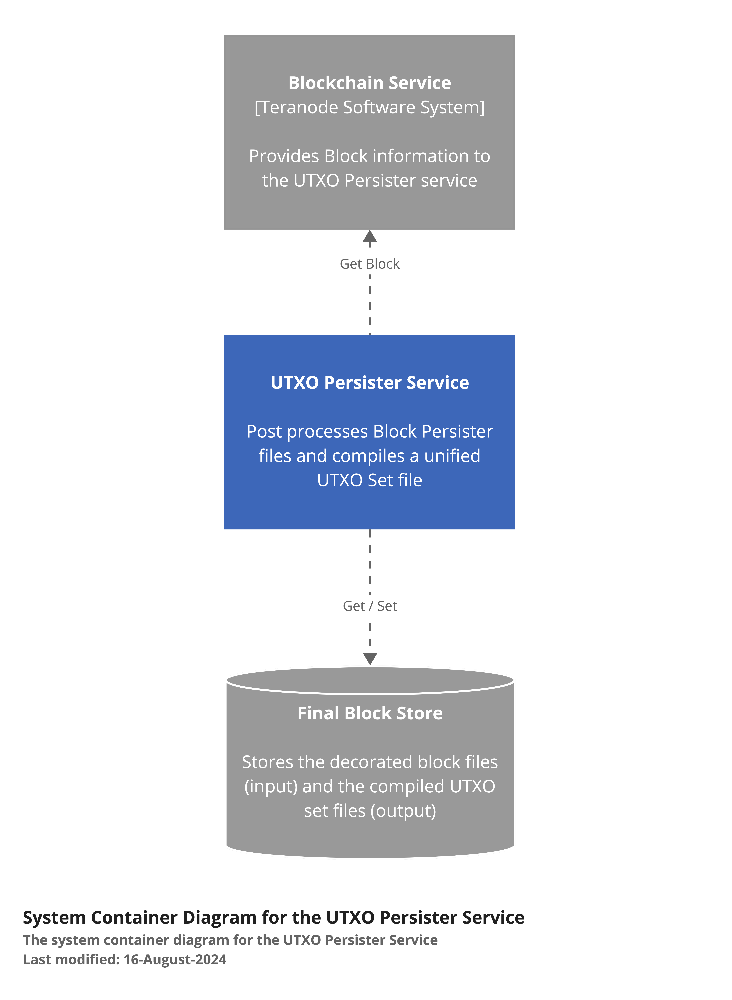
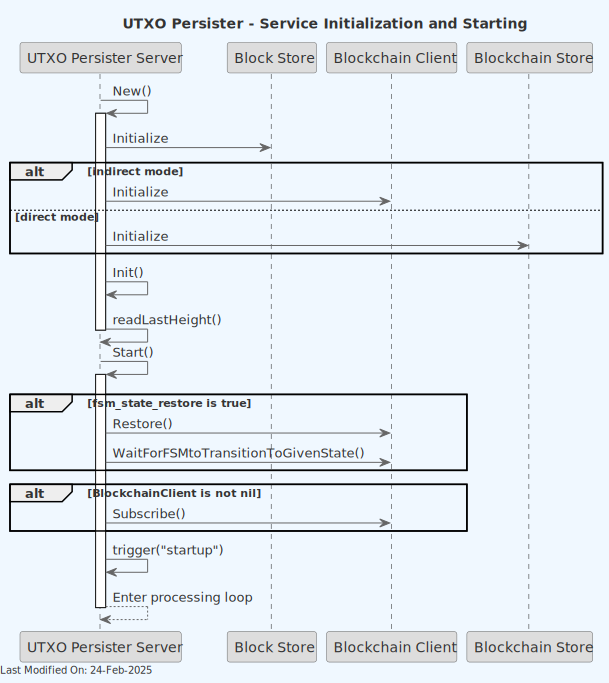

# 🔍 UTXO Persister Service

## Index

1. [Description](#1-description)
2. [Functionality](#2-functionality)
    - [2.1 Service Initialization](#21-service-initialization)
    - [2.2 Receiving and Processing a new UTXO Set](#22-receiving-and-processing-a-new-utxo-set)
    - [2.3 Processing Blocks and Creating UTXO Sets](#23-processing-blocks-and-creating-utxo-sets)
3. [Data Model](#3-data-model)
4. [Technology](#4-technology)
5. [Directory Structure and Main Files](#5-directory-structure-and-main-files)
6. [How to run](#6-how-to-run)
7. [Configuration Settings](#7-configuration-settings)
8. [Other Resources](#8-other-resources)

## 1. Description

The UTXO Persister primary function is to create and maintain an up-to-date Unspent Transaction Output (UTXO) file set for each block in the blockchain.

To achieve its target, the UTXO Persister uses the output of the Block Persister service, and outputs an updated UTXO set file.

The UTXO set file can be exported and used as an input for initializing the UTXO store in a new Teranode instance.

1. Input Processing:

    - The UTXO Persister works with the output of the Block Persister, which includes:

        - `utxo-additions`: New UTXOs created in a block,
        - `utxo-deletions`: UTXOs spent in a block,
        - `.block`: The block data,
        - `.subtree`: Subtree information for the block.

2. UTXO Set Generation:

    - For each new block fileset detected, the UTXO Persister creates a 'utxo-set' file.
    - This file represents the complete set of unspent transaction outputs up to and including the current block.

3. File Monitoring and Processing:

    - The service continuously monitors the shared storage for new .block files and additional related files.
    - When new files are detected, it triggers the UTXO set creation process.

4. Progress Tracking:

    - The service maintains a `lastProcessed.dat` file to keep track of the last block height processed.
    - This ensures continuity and allows the service to resume from the correct point after restarts or interruptions.

5. Efficient Data Handling:

    - The service uses optimized data structures and file formats to handle large volumes of UTXO data efficiently.
    - It implements binary encoding for UTXOs and UTXO deletions to minimize storage requirements and improve processing speed.

6. File Management:

    - The service interacts with the storage system to read and write necessary files.

> **Note**: For information about how the UTXO Persister service is initialized during daemon startup and how it interacts with other services, see the [Teranode Daemon Reference](../../references/teranodeDaemonReference.md#service-initialization-flow).



The service interacts with the storage system to read and write necessary files (shared with the Block Persister service), and requests block information from the Blockchain service (or, optionally, directly from the Blockchain store)


The following diagram provides a deeper level of detail into the UTXO Persister Service's internal components and their interactions:

> **Note**: This diagram represents a simplified component view showing the main architectural elements. The Server component orchestrates notification handling, block monitoring, and UTXO processing through its methods (`Start()`, `trigger()`, `processNextBlock()`), while the Consolidator is a temporary helper struct created during block range processing rather than a persistent service component.


## 2. Functionality

### 2.1 Service Initialization



1. The service starts by creating connections to:

    - A blob store (shared with the block persister) for file storage
    - Either the Blockchain service or the Blockchain store for block information

2. It reads the last processed height from `lastProcessed.dat`.

3. The service then enters a loop, waiting for new blocks to process.

### 2.2 Receiving and Processing a new UTXO Set


### 2.3 Processing Blocks and Creating UTXO Sets

The UTXO Persister processes blocks and creates UTXO sets as follows:

1. **Trigger and Block Height Check**:

    - The service is triggered to process the next block (via notification, timer, or startup).
    - It checks if the next block to process is at least 100 blocks behind the current best block height.

2. **Block Headers Retrieval**:

    - If processing is needed, the service retrieves block headers from either the Blockchain Store or Blockchain Client.
    - It verifies the chain continuity using these headers.

3. **Last Set Verification**:

    - The service verifies the last UTXO set using `verifyLastSet()` to ensure data integrity.

4. **Block Range Consolidation**:

    - A new Consolidator is created to process a range of blocks efficiently.
    - The `ConsolidateBlockRange()` method is called to handle multiple blocks at once if needed.

5. **UTXO Set Preparation**:

    - The service calls `GetUTXOSetWithDeletionsMap()` to prepare the UTXO set for the new block.
    - This retrieves the UTXO deletions from the Block Store and creates a deletions map.

6. **UTXO Set Creation**:

    - The `CreateUTXOSet()` method is called on the UTXOSet object.
    - This method:

        - Retrieves the previous block's UTXO set from the Block Store.
        - Applies the deletions from the deletions map.
        - Incorporates new UTXOs from the block's transactions.
        - Writes the new UTXO set to the Block Store.

7. **Cleanup**:

    - If not skipped (based on configuration), the service deletes the previous block's UTXO set to save space.

8. **Update Last Processed Height**:

    - The service calls `writeLastHeight()` to update its record of the last processed block height.

9. **Trigger Next Block Processing**:

    - The service initiates the processing of the next block, continuing the cycle.

If the current height is less than 100 blocks behind the best block height, the service waits for more confirmations before processing.

## 3. Data Model

### 3.1 Basic Structure

The UTXO set is essentially a collection of all unspent transaction outputs in the blockchain up to a specific block height. Each UTXO represents a piece of cryptocurrency that can be spent in future transactions.

### 3.2 UTXO Components

The UTXOs are stored in a hierarchical structure, with the following components:

**UTXOWrapper:**

```go
type UTXOWrapper struct {
    TxID     chainhash.Hash
    Height   uint32
    Coinbase bool
    UTXOs    []*UTXO
}
```

**UTXO:**

```go
type UTXO struct {
    Index  uint32
    Value  uint64
    Script []byte
}
```

**Field descriptions:**

- **TxID**: The transaction ID where this UTXO was created (32 bytes)
- **Index**: The output index in the transaction (4 bytes)
- **Value**: The amount of cryptocurrency in this UTXO (8 bytes)
- **Height**: The block height where this UTXO was created (4 bytes)
- **Script**: The locking script that must be satisfied to spend this UTXO (variable length)
- **Coinbase**: A flag indicating whether this UTXO is from a coinbase transaction (1 bit, packed with Height)

### 3.3 Binary Encoding

The UTXO is encoded into a binary format for efficient storage and retrieval:

- 32 bytes: TxID
- 4 bytes: Index (little-endian)
- 8 bytes: Value (little-endian)
- 4 bytes: Height and Coinbase flag (Height << 1 | CoinbaseFlag)
- 4 bytes: Script length (little-endian)
- Variable bytes: Script

### 3.4 UTXO Set File

The UTXO set for each block is stored in a file with the extension `utxo-set`. This file contains a series of encoded UTXOs representing all unspent outputs up to that block.

### 3.5 UTXO Diff

The UTXO Persister uses a diff-based approach to update the UTXO set:

- `utxo-additions`: New UTXOs created in a block
- `utxo-deletions`: UTXOs spent in a block

### 3.6 UTXO Deletion Model

When a UTXO is spent, it's recorded in the `utxo-deletions` file. The deletion record contains:

- TxID (32 bytes)
- Index (4 bytes)

### 3.7 Set Operations

Creating a new UTXO set involves:

1. Starting with the previous block's UTXO set
2. Removing UTXOs listed in the current block's `utxo-deletions`
3. Adding UTXOs listed in the current block's `utxo-additions`

### 3.8 Persistence

The UTXO set is persisted using a _FileStorer_, which writes the data to a blob store.

## 4. Technology

1. **Programming Language:**
    - Go (Golang): The entire service is written in Go.

2. **Blockchain-specific Libraries:**
    - github.com/bsv-blockchain/go-bt/v2: A Bitcoin SV library for Go, used for handling Bitcoin transactions and blocks.
    - github.com/bsv-blockchain/teranode: Custom package for Bitcoin SV operations.

3. **Storage:**
    - Blob Store: Used for reading block data, subtrees, and UTXO diff files, and for writing UTXO Set files.

4. **Configuration Management:**
    - github.com/ordishs/gocore: Used for configuration management (e.g., reading config values).

## 5. Directory Structure and Main Files

The Block Persister service is located in the `services/utxopersister` directory.

```text
./services/utxopersister/
│
├── Server.go
│   Main implementation of the UTXO Persister server. It contains the core logic for
│   initializing the service, handling requests, and coordinating UTXO set updates.
│
├── UTXO.go
│   Defines the UTXO (Unspent Transaction Output) data structure and related methods.
│
├── UTXOSet.go
│   Implements the UTXOSet structure and related methods.
│
├── UTXODeletion.go
│   Implements the logic for UTXO deletions, which occur when UTXOs are spent in a transaction.
|
└── filestorer/
    │
    └── FileStorer.go
        Implements a custom file storage mechanism, optimized for the specific
        needs of storing and retrieving UTXO data efficiently.
```

## 6. How to run

To run the UTXO Persister Service locally, you can execute the following command:

```shell
SETTINGS_CONTEXT=dev.[YOUR_CONTEXT] go run -UTXOPersister=1
```

Please refer to the [Locally Running Services Documentation](../../howto/locallyRunningServices.md) document for more information on running the UTXO Persister Service locally.

## 7. Configuration Settings

The UTXO Persister service relies on a set of configuration settings that control its behavior, performance, and resource usage. This section provides a comprehensive overview of these settings, organized by functional category, along with their impacts, dependencies, and recommended configurations for different deployment scenarios.

### 7.1 Configuration Categories

For comprehensive configuration documentation including all settings, defaults, and interactions, see the [utxo Persister Settings Reference](../../references/settings/services/utxopersister_settings.md).

### 7.2 Performance Tuning Settings

These settings control the I/O performance and memory usage patterns of the UTXO Persister service.

| Setting | Type | Default | Description | Impact |
|---------|------|---------|-------------|--------|
| `utxoPersister_buffer_size` | string | `"4KB"` | Controls the buffer size for reading from and writing to UTXO files | Affects I/O performance and memory usage when processing UTXO data |

#### Performance Tuning Interactions and Dependencies

The buffer size setting directly affects how efficiently the service reads and writes UTXO data:

- Larger buffer sizes (e.g., 64KB to 1MB) can significantly improve I/O throughput by reducing the number of system calls needed for file operations
- Smaller buffer sizes reduce memory usage but may increase CPU overhead due to more frequent I/O operations
- The optimal buffer size depends on the hardware characteristics, particularly disk I/O capabilities, available memory, and the size of typical UTXO files

For high-throughput environments with fast storage systems (like SSDs), larger buffer sizes provide better performance. For memory-constrained environments, smaller buffers may be necessary despite the performance impact.

### 7.3 Storage Management Settings

These settings control how UTXO data is stored and retained.

| Setting | Type | Default | Description | Impact |
|---------|------|---------|-------------|--------|
| `blockpersister_skipUTXODelete` | bool | `false` | When true, previous block's UTXO sets aren't deleted after processing | Controls storage usage and retention policy for historical UTXO sets |
| `blockstore` | *url.URL | `"file://./data/blockstore"` | Specifies the URL for the block storage backend | Determines where block data, including UTXO sets, are stored |
| `txstore` | *url.URL | `""` | Specifies the URL for the transaction storage backend | Determines where transaction data is stored for block processing |
| `txmeta_store` | *url.URL | `""` | Specifies the URL for the UTXO metadata storage backend | Determines where UTXO metadata is stored for efficient lookups |

#### Storage Management Interactions and Dependencies

These settings determine the storage footprint and data persistence behavior of the service:

- When `blockpersister_skipUTXODelete` is `false` (default), the service maintains minimal storage by only keeping the UTXO set for the most recent processed block
- When set to `true`, the service preserves all historical UTXO sets, which increases storage requirements but enables historical analysis and validation
- The `blockstore` setting defines where all block-related data is stored, affecting both read and write performance based on the underlying storage system
- The `txstore` and `txmeta_store` settings determine where transaction data and UTXO metadata are stored, respectively, which impacts performance and data availability

Storage requirements grow significantly when keeping historical UTXO sets, as each set contains the complete state of all unspent outputs at a given block height.

### 7.4 Deployment Architecture Settings

These settings control how the UTXO Persister interacts with other components in the system.

| Setting | Type | Default | Description | Impact |
|---------|------|---------|-------------|--------|
| `direct` | bool | `true` | Controls whether the service connects directly to the blockchain store or uses the client interface | Affects performance and deployment architecture |

#### Deployment Architecture Interactions and Dependencies

The deployment architecture settings determine how the service integrates with the broader system:

- When `direct` is `true`, the service bypasses the blockchain client interface and connects directly to the blockchain store, which improves performance but requires the service to be deployed in the same process
- When `direct` is `false`, the service uses the blockchain client interface, allowing for distributed deployment at the cost of additional network overhead

This setting has significant implications for system design and deployment flexibility. Direct access provides better performance but limits deployment options, while client-based access enables more flexible deployment topologies but may impact performance.

### 7.5 Operational Controls Settings

These settings control general operational aspects of the service.

| Setting | Type | Default | Description | Impact |
|---------|------|---------|-------------|--------|
| `network` | string | `"mainnet"` | Specifies the blockchain network (mainnet, testnet, regtest) | Determines genesis hash and chain parameters used for validation |

#### Operational Controls Interactions and Dependencies

- The `network` setting determines the genesis hash and chain parameters via chaincfg.GetChainParams(), which is critical for genesis block detection and UTXO set validation
- Genesis hash validation is used throughout the service to determine when to skip certain operations like UTXO deletion

This setting is fundamental to the service's operation and must match the target blockchain network.

### 7.6 Configuration Best Practices

1. **Performance Monitoring**: Regularly monitor I/O performance metrics when adjusting buffer sizes. Balance memory usage against throughput based on your specific hardware capabilities.

2. **Storage Planning**: When using `blockpersister_skipUTXODelete=true`, implement a storage monitoring and management strategy. UTXO sets grow significantly over time and may require substantial storage capacity.

3. **Deployment Architecture**: Choose direct access (`direct=true`) whenever possible for best performance, unless your system architecture specifically requires distributed deployment.

4. **Network Configuration**: Ensure the `network` setting matches your target blockchain environment. Incorrect network configuration can lead to validation failures and data corruption.

5. **Storage Location**: Use persistent, reliable storage locations for the `blockstore` setting in production environments, ideally on dedicated, high-performance storage systems.

6. **Backup Strategy**: Implement regular backups of your UTXO data, especially the most recent UTXO set, to enable rapid recovery in case of data corruption or storage failures.

7. **Service Coordination**: Ensure that blockchain services and UTXO Persister services are properly coordinated in terms of startup sequence and operational dependencies, particularly when using direct access mode.

## 8. Other Resources

[UTXO Persister Reference](../../references/services/utxopersister_reference.md)
