# 🗃️ UTXO Store

## Index

1. [Description](#1-description)
2. [Architecture](#2-architecture)
3. [UTXO: Data Model](#3-utxo-data-model)
    - [3.1. What is an UTXO?](#31-what-is-an-utxo)
    - [3.2. How are UTXOs stored?](#32-how-are-utxos-stored)
    - [3.3. UTXO Meta Data](#33-utxo-meta-data)
4. [Use Cases](#4-use-cases)
    - [4.1. Asset Server](#41-asset-server)
    - [4.2. Block Persister](#42-block-persister)
    - [4.3. Block Assembly](#43-block-assembly)
    - [4.4. Block Validation](#44-block-validation)
    - [4.5. Subtree Validation](#45-subtree-validation)
    - [4.6. Transaction Validator](#46-transaction-validator)
    - [4.7. UTXO Batch Processing and External Storage mode](#47-utxo-batch-processing-and-external-storage-mode)
    - [4.8. Alert System and UTXO Management](#48-alert-system-and-utxo-management)
    - [4.9. Unmined Transaction Management](#49-unmined-transaction-management)
5. [Technology](#5-technology)
    - [5.1. Language and Libraries](#51-language-and-libraries)
    - [5.2. Data Stores](#52-data-stores)
    - [5.3. Data Purging](#53-data-purging)
6. [Performance Optimizations](#6-performance-optimizations)
    - [6.1. Shared Buffer Optimization](#61-shared-buffer-optimization)
7. [Directory Structure and Main Files](#7-directory-structure-and-main-files)
8. [Running the Store Locally](#8-running-the-store-locally)
    - [How to run](#how-to-run)
9. [Configuration and Settings](#9-configuration-and-settings)
10. [Other Resources](#10-other-resources)

## 1. Description

The UTXO set represents the current state of ownership of all Satoshi tokens in existence. Except for Coinbase transactions, every other valid transaction spends at least one UTXO and creates zero or more new UTXOs, plus zero or more locked outputs. The UTXOs that are being ‘spent’ come from previously successful transactions, and these may be recorded in the current or a previous block. An unspent output may be created and spent in a few milliseconds, or it may remain unspent for decades, meaning that the unspent outputs must persist for as long as they remain unspent.

The UTXO Store is responsible for tracking spendable UTXOs (the UTXO set), based on the longest _honest_ chain-tip in the network. These are UTXOs that can be used as inputs in new transactions. The UTXO Store is an internal datastore used by some of the services, such as the Asset Server, the TX Validator and the Block Assembly. The main purpose of this store is to maintain the UTXO data on behalf of other micro-services.

It handles the core functionalities of the UTXO Store:

- **Health**: Check the health status of the UTXO store service.
- **Get**: Retrieve a specific UTXO.
- **GetMeta**: Retrieve a specific UTXO meta data.
- **Create**: Add new UTXOs to the store.
- **Spend/Unspend**: Mark UTXOs as spent or reverse such markings, respectively.
- **Delete**: Remove UTXOs from the store.
- **Block Height Management**: Set and retrieve the current blockchain height, which can be crucial for determining the spendability of certain UTXOs based on locktime conditions.
- **FreezeUTXOs / UnFreezeUTXOs**: Mark UTXOs as frozen or unfrozen, in scenarios involving alert systems or temporary holds on specific UTXOs.
- **ReAssignUTXO**: Reassign a UTXO to a different owner.

**Principles**:

- All operations are atomic.
- All data is shared across servers with standard sharing algorithms.
- In production, the data is stored in a Master and Replica configuration.
- No centralised broker - all clients know where each hash is stored.
- No cross-transaction state is stored.

The UTXO Store includes functionality to **freeze** and **unfreeze** UTXOs, as well as **re-assign** them.

- BSV is the only blockchain that allows legal recourse for lost asset (token) recovery to legally rightful owners by design. The Alert System can also freeze assets based on court injunctions and legal notices.
- Teranode must be able to re-assign (a set of) UTXO(s) to another (specified) address at a specified block height.

## 2. Architecture

The UTXO Store is a micro-service that is used by other micro-services to retrieve or store / modify UTXOs.


The UTXO Store uses a number of different datastores, either in-memory or persistent, to store the UTXOs.


### UTXO Store Operations Flow

The following diagram illustrates the complete flow of UTXO operations across all services, including transaction validation, conflict resolution, block mining, reorganization handling, alert system operations, and subtree validation:


The UTXO store implementation is consistent within a Teranode node (every service connects to the same specific implementation), and it is defined via settings (`utxostore`), as it can be seen in the following code fragment (`main.go`):

```go

func getUtxoStore(ctx context.Context, logger ulogger.Logger) utxostore.Interface {
 if utxoStore != nil {
  return utxoStore
 }

 utxoStoreURL, err, found := gocore.Config().GetURL("utxostore")
 if err != nil {
  panic(err)
 }
 if !found {
  panic("no utxostore setting found")
 }
 utxoStore, err = utxo_factory.NewStore(ctx, logger, utxoStoreURL, "main")
 if err != nil {
  panic(err)
 }

 return utxoStore
}
```

The following diagram provides a deeper level of detail into the UTXO Store's internal components and their interactions:

> **Note**: This diagram represents a simplified component view showing the main architectural elements. The Store Interface defines the contract, Factory creates implementation instances, and each implementation (Aerospike, SQL, Memory, Null) provides the actual storage backend. Batchers enhance performance for specific operations, and the Cleanup Service manages delete-after-height operations. Alert system operations (Freeze, Reassign) are methods on the Store implementations rather than separate components.

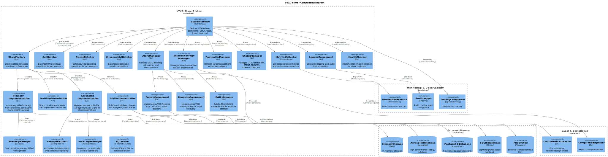

The following datastores are supported (either in development / experimental or production mode):

1. **Aerospike**.

2. **Memory (In-Memory Store)**.

3. **Sql** (Postgres and SQLLite).

4. **Nullstore**.

Notice how SqlLite and the In-Memory store are in-memory, while Aerospike and Postgres are persistent (and shared with other services).

More details about the specific stores can be found in the [Technology](#5-technology) section.

## 3. UTXO: Data Model

### 3.1. What is an UTXO?

The Teranode UTXO is no different from Bitcoin UTXO. The following is a description of the Bitcoin UTXO model, focusing on the BSV implementation:

- **Transaction Outputs**: When a transaction occurs on the blockchain, it creates "transaction outputs," which are essentially chunks of cryptocurrency value. Each output specifies an amount and a condition under which it can be spent (a cryptographic script key that the receiver owns).

Under the external library `github.com/ordishs/go-bt/output.go`, we can see the structure of a transaction output.

```go
type Output struct {
 Satoshis      uint64          `json:"satoshis"`
 LockingScript *bscript.Script `json:"locking_script"`
}
```

Components of the `Output` struct:

1. **Satoshis (`uint64`)**:

    - The amount of BSV cryptocurrency associated with this output.
    - The unit "Satoshis" refers to the smallest unit of Bitcoin (1 Bitcoin = 100 million Satoshis).

2. **LockingScript (`*bscript.Script`)**:

    - This field represents the conditions that must be met to spend the Satoshis in this output.
    - The `LockingScript`, often referred to as the "scriptPubKey" in Bitcoin's technical documentation, is a script written in Bitcoin's scripting language.
    - This script contains cryptographic conditions to unlock the funds.

Equally, we can see how a list of outputs is part of a transaction (`github.com/ordishs/go-bt/tx.go`):

```go
type Tx struct {
 Inputs   []*Input  `json:"inputs"`
 Outputs  []*Output `json:"outputs"`
 Version  uint32    `json:"version"`
 LockTime uint32    `json:"locktime"`
}
```

- **Unspent Transaction Outputs (UTXOs)**: A UTXO is a transaction output that hasn't been used as an input in a new transaction.

When a transaction occurs, it consumes one or more UTXOs as inputs and creates new UTXOs as outputs. The sum of the input UTXOs represents the total amount of Bitcoin being transferred, and the outputs represent the distribution of this amount after the transaction.

To "own" bitcoins means to control UTXOs on the blockchain that can be spent by the user (i.e., the user has the private key to unlock these UTXOs).

When a user creates a new transaction, the transaction references these UTXOs as inputs, proving his ownership by fulfilling the spending conditions set in these UTXOs (signing the transaction with the user's private key).

Independent UTXOs can be processed in parallel, potentially improving the efficiency of transaction validation.

UTXOs now have an additional state: frozen. A frozen UTXO cannot be spent until it is unfrozen.

To know more about UTXOs, please check <https://protocol.bsvblockchain.org/transaction-lifecycle/transaction-inputs-and-outputs>.

### 3.2. How are UTXOs stored?

When storing the UTXOs (Unspent Transaction Outputs) associated to a given Tx in Aerospike (see `stores/utxo/aerospike/aerospike.go`, our primary persisted datastore, the following information is kept:

1. **Inputs**: The transaction inputs, represented as a slice of byte arrays (`inputs` bin). Each input includes the previous transaction output it spends from, as well as additional data such as the script and satoshis amount.

2. **Outputs**: The transaction outputs, represented as a slice of byte arrays (`outputs` bin). Each output contains the value in satoshis and the locking script.

3. **Version**: The version number of the transaction (`version` bin).

4. **Fee**: The fee associated with the transaction (`fee` bin).

5. **Size in Bytes**: The size of the transaction in bytes (`sizeInBytes` bin).

6. **UTXOs**: A map representing the UTXOs associated with this transaction (`utxos` bin). The keys are the UTXO hashes, and the values are empty strings initially. The values will be populated, once the UTXO is spent, with the spending Tx Id.

7. **Number of UTXOs**: The number of UTXOs in the `utxos` map (`recordUtxos` bin).

8. **Spent UTXOs**: A counter for the number of UTXOs that have been spent (`spentUtxos` bin).

9. **Block IDs**: The IDs of the blocks that include this transaction (`blockIDs` bin).

10. **Coinbase Flag**: A boolean indicating whether this transaction is a coinbase transaction (`isCoinbase` bin).

These bins collectively store the necessary data to track the transaction's inputs, outputs, and its state within the blockchain.

Once the UTXO is spent, the spending tx_id will be saved.

- To compute the hash of the key, the caller must know the complete data and calculate the hash before calling the API.

- The hashing logic can be found in `UTXOHash.go`:

```go
func UTXOHash(previousTxid *chainhash.Hash, index uint32, lockingScript []byte, satoshis uint64) (*chainhash.Hash, error) {
 if len(lockingScript) == 0 {
  return nil, fmt.Errorf("locking script is nil")
 }

 if satoshis == 0 {
  return nil, fmt.Errorf("satoshis is 0")
 }

 utxoHash := make([]byte, 0, 256)
 utxoHash = append(utxoHash, previousTxid.CloneBytes()...)
 utxoHash = append(utxoHash, bt.VarInt(index).Bytes()...)
 utxoHash = append(utxoHash, lockingScript...)
 utxoHash = append(utxoHash, bt.VarInt(satoshis).Bytes()...)

 hash := crypto.Sha256(utxoHash)
 chHash, err := chainhash.NewHash(hash)
 if err != nil {
  return nil, err
 }

 return chHash, nil
}
```

- The existence of the key confirms the details of the UTXO are the same as what the caller has.

### 3.3. UTXO Meta Data

The `Data` struct (`stores/utxo/meta/data.go`), referred moving forward as `UTXO Meta Data`, provides a convenience structure to retrieve meta data associated to a transaction out of the UTXO Store.

```go
type Data struct {
 Tx             *bt.Tx           `json:"tx"`
 ParentTxHashes []chainhash.Hash `json:"parentTxHashes"`
 BlockIDs       []uint32         `json:"blockIDs"`
 Fee            uint64           `json:"fee"`
 SizeInBytes    uint64           `json:"sizeInBytes"`
 IsCoinbase     bool             `json:"isCoinbase"`
 LockTime       uint32           `json:"lockTime"` // lock time can be different from the transaction lock time, for instance in coinbase transactions
}
```

This is widely used by all services, given it is a comprehensive set of data going well beyond the extended Tx data set.

To know more about the UTXO data model, please refer to the [UTXO Data Model documentation](../datamodel/utxo_data_model.md).

## 4. Use Cases

### 4.1. Asset Server

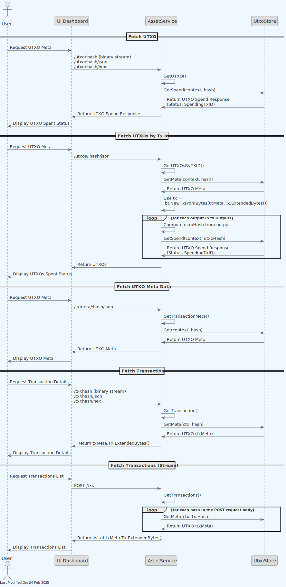

1. The **UI Dashboard** sends a request to the AssetService for UTXO data.
2. The **AssetService** forwards this request to the **UTXO Store**.
3. The **UTXO Store** interacts with the underlying **Datastore** implementation to fetch the requested UTXO data and check the health status of the store.
4. The **Datastore** implementation returns the UTXO data and health status to the UTXO Store.
5. The UTXO Store sends this information back to the AssetService.
6. Finally, the AssetService responds back to the UI Dashboard.

To know more about the AssetService, please check its specific service documentation.

### 4.2. Block Persister

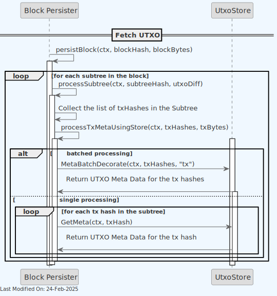

1. The Block Persister service persists the block data to disk. As part of this job, it retrieves the utxo meta data for each Tx in each subtree in each block, and dumps it to the storage.

2. Depending on the settings Block Persister operates under, the persister will request the utxo meta data in batches or one by one. In general, and depending on the specific UTXO store implementation, the batched processing is more efficient.

### 4.3. Block Assembly

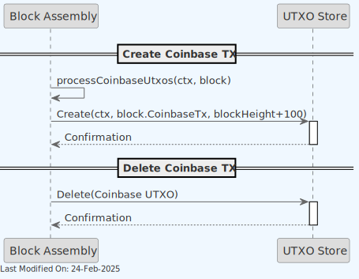

Coinbase Transaction creation (UTXO step):

1. The **Block Assembly** service (see `SubtreeProcessor.go`, `processCoinbaseUtxos` method) creates a new Coinbase transaction.
2. The **Block Assembly** service sends a request to the **UTXO Store** to store the Coinbase UTXO.
3. The **UTXO Store** interacts with the underlying **Datastore** implementation to store the Coinbase UTXO.

Coinbase Transaction deletion (UTXO step):

1. The **Block Assembly** service (see `SubtreeProcessor.go`, `` method)  deletes the Coinbase transaction. This is done when blocks are reorganised and previously tracked coinbase transactions lose validity.
2. The **Block Assembly** service sends a request to the **UTXO Store** to delete the Coinbase UTXO.
3. The **UTXO Store** interacts with the underlying **Datastore** implementation to delete the Coinbase UTXO.

To know more about the Block Assembly, please check its specific service documentation.

### 4.4. Block Validation

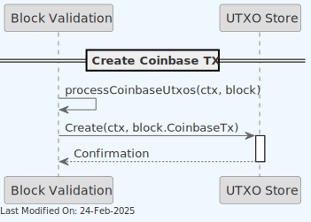

1. The **Block Validator** service validates the block by checking the integrity of the transactions and UTXOs.
2. Once a block is validated, the **Block Validator** service stores the coinbase tx and their associated UTXO data in the **UTXO Store**.
3. The **UTXO Store** interacts with the underlying **Datastore** implementation to store the coinbase tx and UTXO data.

### 4.5. Subtree Validation

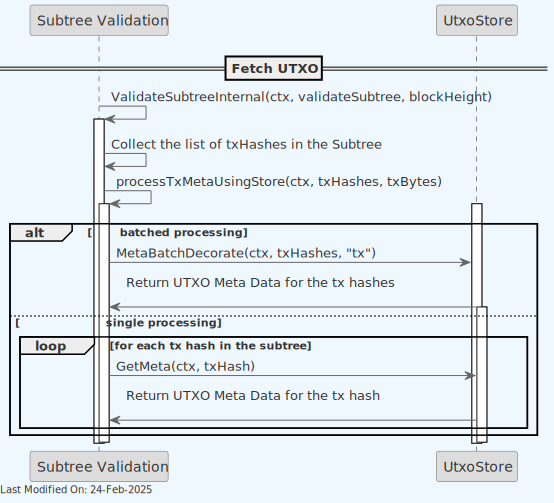

In order to validate subtrees, the Subtree Validation service will retrieve the UTXO meta data for each tx in the subtree. This is done by sending a request to the UTXO Store, either in batches or one by one, depending on the settings.

### 4.6. Transaction Validator

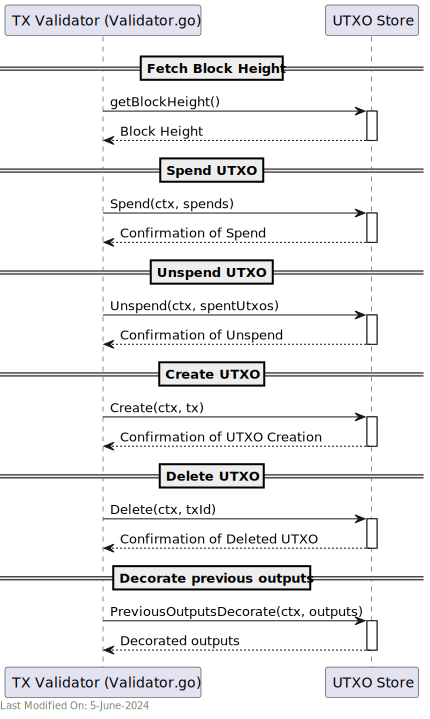

The Transaction Validator uses the UTXO Store to perform a number of UTXO related operations:

1. Obtain the current block height from the **UTXO Store**.
2. Mark a UTXO as spent. If needed, it can also request to unspend (revert) a UTXO.
3. Store and delete new UTXOs.
4. Retrieve previous outputs UTXO data.

When marking a UTXO as spent, the store will check if the UTXO is known (by its hash), and whether it is spent or not. If it is spent, we will return one response message or another depending on whether the spending tx_id matches. See here:

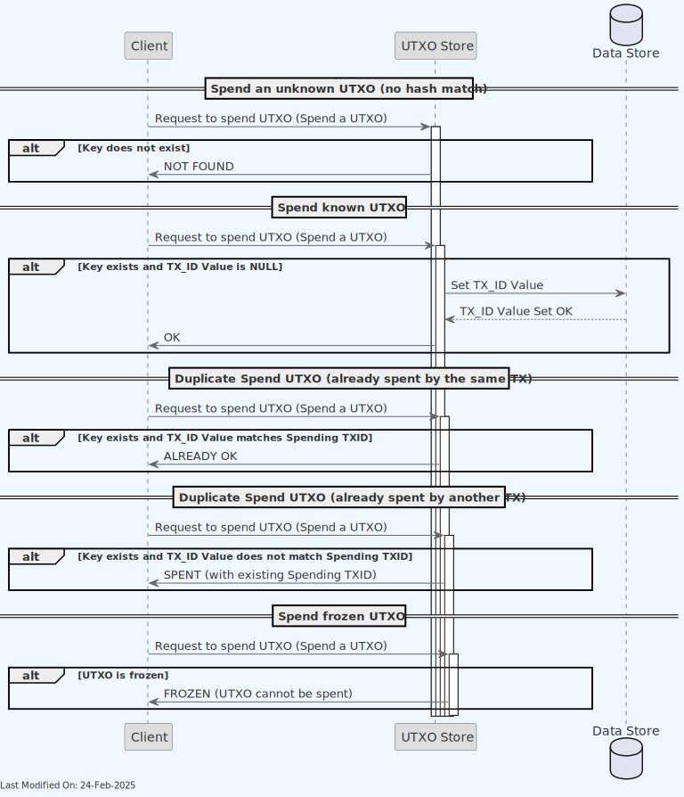

Also notice how no transaction can be spent if frozen.

On the other hand, we can see the process for unspending an UTXO here:

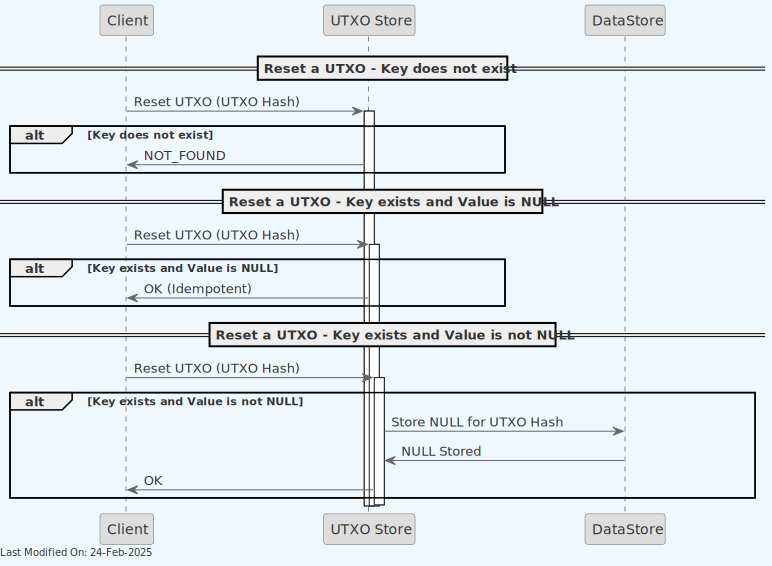

To know more about the Transaction Validator, please check its specific service documentation.

### 4.7. UTXO Batch Processing and External Storage mode

Aerospike is the primary datastore for the UTXO store. However, to overcome Aerospike's record size limitation of 1MB, the system implements an external storage mechanism for large transactions.

If a transaction is too large to fit in a single Aerospike record (indicated by a `RECORD_TOO_BIG` error), or if the system is configured to externalize all transactions, the UTXO store will store the full transaction data in an external storage (typically AWS S3, but any external storage can be used).

In such cases, the full transaction data is stored externally, while metadata and UTXOs are still stored in Aerospike, potentially across multiple records. The Aerospike record will have an `external` flag set to true, indicating that the full transaction data is stored externally.

When the UTXO data is needed, the system will first check the Aerospike record. If the `external` flag is true, it will then retrieve the full transaction data from the external storage using the transaction hash as a key.

#### External Transaction Cache

To optimize performance when reading externally stored transactions, the UTXO store implements an optional external transaction cache (configured via `utxostore_useExternalTxCache`, enabled by default). This short-lived cache (10-second expiration) is particularly beneficial for:

- Transactions with many outputs being spent concurrently
- Scenarios where multiple inputs reference the same large transaction
- Reducing redundant external storage reads during high-throughput validation

The cache handles concurrent reads efficiently, preventing multiple simultaneous fetches of the same external transaction data.

### 4.8. Alert System and UTXO Management

The UTXO Store supports advanced UTXO management features, which can be utilized by an alert system.

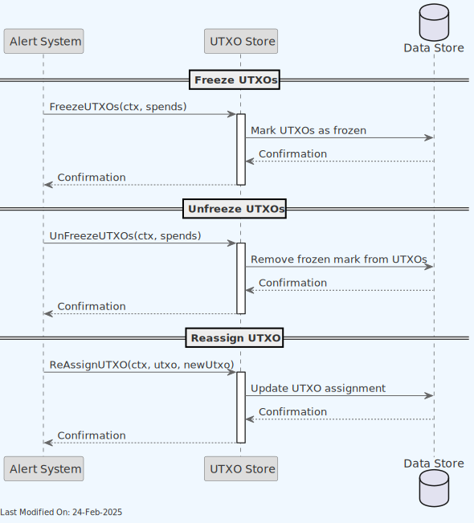

1. **Freezing UTXOs**: The alert system can request to freeze specific UTXOs, preventing them from being spent.
    - Checks if the UTXO exists
    - If the UTXO is already spent, it returns "SPENT"
    - If the UTXO is already frozen, it returns "FROZEN"
    - Otherwise, it marks the UTXO as frozen by setting its spending TxID to 32 'FF' bytes

2. **Unfreezing UTXOs**: Previously frozen UTXOs can be unfrozen, allowing them to be spent again.
    - Checks if the UTXO exists and is frozen
    - If frozen, it removes the freeze mark
    - If not frozen, it returns an error

3. **Reassigning UTXOs**: UTXOs can be reassigned to a new transaction output, but only if they are frozen first.
    - Verifies the UTXO exists and is frozen
    - Updates the UTXO hash to the new value
    - Sets spendable block height to current + 1,000 blocks (defined by `ReAssignedUtxoSpendableAfterBlocks` constant)
    - Logs the reassignment for audit purposes
    - **Important**: Reassigned UTXOs cannot be spent until 1,000 blocks have passed after the reassignment to ensure network consensus and prevent disputes

### 4.9. Unmined Transaction Management

The UTXO Store tracks unmined transactions to support transaction recovery and continuity across service restarts. This functionality is crucial for maintaining a reliable transaction processing pipeline.

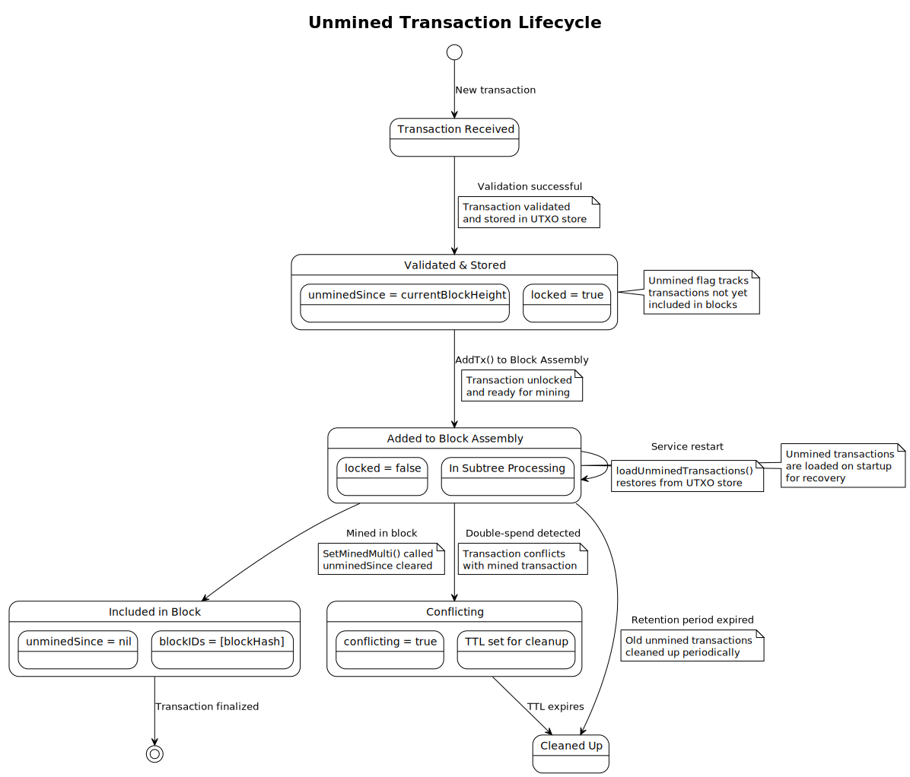

**Key Components:**

- **`unminedSince` Field**: A block height field in the UTXO store that, when set, indicates the transaction is unmined and tracks when it was first stored
- **`createdAt` Field**: Timestamp tracking when the unmined transaction was added, used for ordering during recovery
- **`preserveUntil` Field**: Protects parent transactions from deletion when they have unmined children

**Functionality:**

1. **Transaction Tracking**: When a transaction is validated but not yet mined, it's marked with the `unminedSince` field containing the current block height
2. **Recovery Interface**: The `UnminedTxIterator` provides efficient iteration over all unmined transactions, enabling the Block Assembly service to reload them on startup
3. **Automatic Cleanup**: Old unmined transactions are periodically cleaned up based on retention settings through `QueryOldUnminedTransactions`
4. **Parent Protection**: During cleanup, parent transactions of younger unmined transactions are protected using `PreserveTransactions`

**Benefits:**

- **Service Resilience**: Transactions persist across service restarts without requiring resubmission
- **State Management**: Clear separation between mined and unmined transactions
- **Resource Management**: Automatic cleanup prevents unbounded growth while preserving transaction dependencies
- **Conflict Detection**: Helps identify transactions that conflict with mined blocks

## 5. Technology

### 5.1. Language and Libraries

1. **Go Programming Language (Golang)**:
A statically typed, compiled language known for its simplicity and efficiency, especially in concurrent operations and networked services.
The primary language used for implementing the service's logic.

2. **Bitcoin Transaction (BT) GoLang library**: `github.com/ordishs/go-bt/` - a full featured Bitcoin transactions and transaction manipulation/functionality Go Library.

### 5.2. Data Stores

The following datastores are supported (either in development / experimental or production mode):

1. **Aerospike**:

    - A high-performance, NoSQL distributed database.
    - Suitable for environments requiring high throughput and low latency.
    - Handles large volumes of UTXO data with fast read/write capabilities.
    - Aerospike is the reference datastore. Teranode has been guaranteed to process 1 million tps with Aerospike.
    - Aerospike records can contain up to 1024 bytes.
   
    - For more information, please refer to the official Aerospike documentation: <https://aerospike.com>.

2. **Memory (In-Memory Store)**:

    - Stores UTXOs directly in the application's memory.
    - Offers the fastest access times but lacks persistence; data is lost if the service restarts.
    - Useful for development or testing purposes.

3. **Sql**:

    - A SQL database, currently Postgresql and SqlLite are in scope, can be used to store UTXOs.
    - Provides a balance of performance and persistence, suitable for medium to large-scale applications.
    - Offers the ability to query and analyze UTXO data using SQL.

4. **Nullstore**:

    - A dummy or placeholder implementation, used for testing (when no actual storage is needed).
    - Can be used to mock UTXO store functionality in a development or test environment.

**Implementation Choice Considerations:**

- The choice of implementation depends on the specific requirements of the BSV node, such as speed, data volume, persistence, and the operational environment.
- Memory-based stores are typically faster but may require additional persistence mechanisms.
- Databases like Aerospike provide a balance of speed and persistence, suitable for larger, more complex systems.
- Nullstore is more appropriate for testing, development, or lightweight applications.

### 5.3. Data Purging

Stored data is automatically purged a certain TTL (Time To Live) period after it is spent. This is done to prevent the datastore from growing indefinitely and to ensure that only relevant data (i.e. data that is spendable or recently spent) is kept in the store.

## 6. Performance Optimizations

### 6.1. Shared Buffer Optimization

To improve performance when reading large batches of UTXOs, Teranode implements a shared buffer optimization that significantly reduces memory allocations and garbage collection pressure.

#### How It Works

The shared buffer optimization is implemented in the Aerospike UTXO store's batch operations:

1. **Single Buffer Allocation**: Instead of allocating individual buffers for each UTXO read operation, the system allocates a single large shared buffer
2. **Buffer Reuse**: This buffer is reused across multiple UTXO reads within the same batch operation
3. **Slice References**: Each UTXO's data is referenced as a slice of the shared buffer, avoiding data copying

#### Performance Benefits

- **Reduced Memory Allocations**: Decreases the number of memory allocations from O(n) to O(1) for batch operations
- **Lower GC Pressure**: Fewer allocations mean less work for the garbage collector
- **Improved Throughput**: Particularly beneficial when reading UTXO sets for block validation or subtree processing
- **Better Cache Locality**: Contiguous memory access patterns improve CPU cache utilization

#### Implementation Details

The optimization is automatically applied when:

- Batch reading operations are performed through `GetMetaBatch` or similar methods
- Multiple UTXOs are requested in a single operation
- The Aerospike store implementation is being used

Example of the optimization in action:

- Without optimization: Reading 10,000 UTXOs requires 10,000 separate buffer allocations
- With optimization: Reading 10,000 UTXOs requires 1 shared buffer allocation plus slice operations

This optimization is particularly effective for:

- Block validation (reading all UTXOs referenced in a block)
- Subtree validation (processing millions of transactions)
- UTXO set snapshots and exports
- High-throughput transaction validation

## 7. Directory Structure and Main Files

```text
UTXO Store Package Structure (stores/utxo)
├── Interface.go                    # Defines the interface for the UTXO Store
├── _factory                        # Contains different store implementations
│   ├── aerospike.go                # Factory setup for Aerospike UTXO Store
│   ├── memory.go                   # Factory setup for in-memory UTXO Store
│   └── utxo.go                     # Common UTXO store setup
├── aerospike                       # Aerospike-specific UTXO Store implementation
│   ├── aerospike.go                # Main Aerospike UTXO store implementation
│   │   └── Store                   # Struct representing the Aerospike UTXO store
│   │       ├── url                 # The Aerospike URL
│   │       ├── client              # The Aerospike client instance
│   │       ├── namespace           # The Aerospike namespace used
│   │       ├── setName             # The set name for storing UTXOs
│   │       ├── expiration          # The expiration time for UTXO records
│   │       ├── blockHeight         # The current blockchain height
│   │       ├── logger              # The logger instance
│   │       ├── storeBatcher        # Batcher for store operations
│   │       ├── getBatcher          # Batcher for get operations
│   │       ├── spendBatcher        # Batcher for spend operations
│   │       ├── lastSpendBatcher    # Batcher for last spend operations
│   │       ├── New                 # Initializes a new Aerospike UTXO Store
│   │       ├── sendStoreBatch      # Processes and stores a batch of transactions
│   │       ├── sendGetBatch        # Retrieves a batch of UTXO data
│   │       ├── sendSpendBatchLua   # Processes a batch of UTXO spend operations using Lua script
│   │       ├── SetBlockHeight      # Sets the current block height
│   │       ├── GetBlockHeight      # Retrieves the current block height
│   │       ├── Health              # Checks the health of the Aerospike UTXO store service
│   │       ├── GetSpend            # Retrieves the spend status of a UTXO
│   │       ├── GetMeta             # Retrieves metadata for a specific UTXO
│   │       ├── Get                 # Retrieves specific UTXO data
│   │       ├── Create              # Adds new UTXOs to the store
│   │       ├── Spend               # Marks UTXOs as spent
│   │       ├── Unspend             # Reverses the spent status of UTXOs
│   │       ├── SetMinedMulti       # Sets multiple transactions as mined
│   │       ├── SetMined            # Sets a transaction as mined
│   │       └── Delete              # Removes UTXOs from the store
│   ├── aerospike_server_test.go    # Tests for the Aerospike UTXO store
│   ├── alert_system.go             # Aerospike alert system implementation
│   ├── alert_system_test.go        # Tests for the Aerospike alert system
│   ├── metrics.go                  # Metrics collection for Aerospike operations
│   └── spend.lua                   # Lua script for batch spend operations
├── memory                          # In-memory UTXO Store implementation
│   └── memory.go                   # Main in-memory UTXO store implementation
├── meta                            # Metadata handling for UTXOs
│   ├── data.go                     # Defines metadata structures for UTXOs
│   └── data_test.go                # Tests for UTXO metadata
├── nullstore                       # Null UTXO Store implementation for testing
│   └── nullstore.go                # Main nullstore implementation
├── sql                             # SQL UTXO Store implementation
│   └── sql.go                      # Main sql implementation (provides support for SqlLite and Postgres)
├── status.pb.go                    # Generated protocol buffer code for UTXO status
├── status.proto                    # Protocol buffer definition for UTXO status
├── utils.go                        # Utility functions for the UTXO Store
└── utils_test.go                   # Tests for utility functions
```

## 8. Running the Store Locally

### How to run

To run the UTXO Store locally, you can execute the following command:

```shell
SETTINGS_CONTEXT=dev.[YOUR_CONTEXT] go run -UtxoStore=1
```

Please refer to the [Locally Running Services Documentation](../../howto/locallyRunningServices.md) document for more information on running the Bootstrap Service locally.

## 9. Configuration and Settings

For comprehensive configuration documentation including all settings, defaults, and interactions, see the [UTXO Store Settings Reference](../../references/settings/stores/utxo_settings.md).

## 10. Other Resources

[UTXO Store Reference](../../references/stores/utxo_reference.md)
