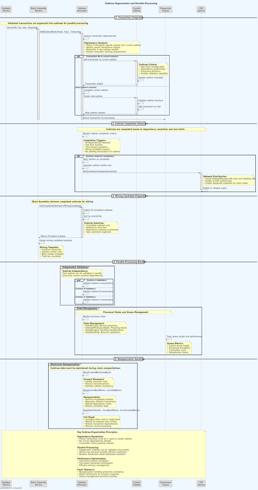

# Transaction Lifecycle in Teranode

Understanding how transactions flow through Teranode is fundamental to comprehending the system's architecture and its approach to achieving massive scalability. Unlike traditional Bitcoin nodes that process transactions sequentially, Teranode employs a microservices architecture that parallelizes transaction processing across multiple specialized services.

## Overview

In Teranode, a transaction goes through several distinct phases from initial submission to final inclusion in a block. Each phase is handled by specialized services that communicate asynchronously through Apache Kafka and gRPC, enabling horizontal scaling and fault tolerance.

## Transaction Lifecycle Phases

### 1. Transaction Ingress (Propagation Service)

The transaction lifecycle begins when a transaction enters the Teranode network through the **Propagation Service**. This service acts as the primary gateway for transaction ingress and supports multiple protocols:

- **gRPC API**: High-performance programmatic access for applications
- **HTTP REST API**: Web-based integrations and REST client access
- **JSON-RPC**: Legacy Bitcoin client compatibility through the RPC service

When a transaction arrives at the Propagation Service:

1. **Initial Format Validation**: The service performs basic format checks to ensure the transaction is well-formed
2. **Transaction Storage**: The raw transaction data is stored in the configured Blob Store (S3, file system, or HTTP endpoint)
3. **Batch Processing**: For efficiency, clients can submit batches of up to 1,024 transactions in a single request (via gRPC `ProcessTransactionBatch` or HTTP POST `/txs`)
4. **Validation Handoff**: After storage, transactions are passed to the Validator for comprehensive validation

### 2. Transaction Validation (Validator)

The **Validator** can run in two modes:

- **As a standalone microservice**: Subscribes to Kafka topics and processes transactions asynchronously
- **As an embedded library**: Instantiated locally within other services (like Propagation Service) for direct validation

The Propagation Service implements flexible validation routing based on configuration:

**Microservice Mode**:

- **Standard transactions**: A `KafkaTxValidationTopicMessage` is published to Kafka for asynchronous processing by the Validator service
- **Large transactions**: When a transaction exceeds Kafka message limits (configurable, typically 1MB), it's sent directly to the Validator's HTTP endpoint as a fallback (no Kafka event)

**Embedded Mode**:

- **All transactions**: Validated synchronously using the embedded Validator instance via direct method calls (`validator.Validate()`)
- No size-based routing needed since there are no message size constraints with direct method calls

The Validator performs comprehensive validation of each transaction:

1. **Script Validation**: Executes input scripts against referenced outputs using configurable script interpreters (Go-BT, Go-SDK, or Go-BDK)
2. **Consensus Rule Enforcement**: Validates against Bitcoin consensus rules including:

    - Transaction size limits
    - Input and output structure verification
    - Non-dust output values
    - Script operation count limits
    - Signature verification
3. **Policy Rule Enforcement**: Applies configurable node policies such as:

    - Minimum fee requirements
    - Script complexity limits
    - Custom validation rules
4. **UTXO Verification**: Checks that all inputs reference valid, unspent outputs
5. **UTXO Management**: Manages UTXO (Unspent Transaction Output) creation and spending

After validation:

- **Valid transactions**: Published to Kafka with metadata for downstream processing
- **Invalid transactions**: Rejected with specific error reasons

The Validator supports parallel validation of multiple transactions, significantly improving throughput compared to sequential processing.

### 3. Block Assembly

The **Block Assembly Service** collects validated transactions and organizes them into candidate blocks:

1. **Transaction Selection**: Chooses transactions based on:

    - Arrival order (first-come-first-served via FIFO queue processing)
    - Transaction dependencies (parent transactions must be included before children)
    - Block size limits

2. **Subtree Processing**: Transactions are grouped into subtrees:

    - Each subtree contains related transactions
    - Subtrees can be validated independently
    - This enables parallel block validation

1. **Subtree Broadcasting**: Newly created subtrees are broadcast via the **P2P Service** to other Teranodes in the network for distributed validation

2. **Mining Candidate Creation**: Prepares block templates for miners including:

    - Selected subtrees
    - Coinbase transaction
    - Block header template

### 4. Block Creation and Mining

When a miner finds a valid proof-of-work solution:

1. **Solution Submission**: The mining solution is submitted to the **RPC Service**
2. **Solution Forwarding**: The RPC Service forwards the solution to the **Block Assembly Service**
3. **Block Finalization**: The Block Assembly Service creates the final block with:

    - Completed block header with valid proof-of-work
    - All subtrees with final coinbase transaction
    - Proper Merkle root calculation

4. **Block Submission**: The finalized block is sent to the **Blockchain Service**

### 5. Subtree and Block Validation

Two separate validation processes run in parallel:

**Subtree Validation Service** (validates subtrees as they are assembled):

1. **P2P Reception**: Receives subtree notifications from other Teranode instances via the P2P Service
2. **Kafka Processing**: Processes `KafkaSubtreeTopicMessage` published by the P2P Service
3. **Subtree Content Validation**: Validates the internal structure and transactions within subtrees
4. **Transaction Discovery**: Routes unknown transactions to the Validator service for validation if needed
5. **Distributed Verification**: Enables network-wide validation of subtree components

**Block Validation Service** (validates complete blocks when available):

1. **Header Validation**: Verifies proof-of-work difficulty target and validates header fields
2. **Merkle Root Validation**: Calculates and verifies that the block's merkle root matches the subtree hashes
3. **Subtree Content Validation**: Calls the Subtree Validation Service to validate subtree contents via `CheckBlockSubtrees`
4. **Block Structure Verification**: Ensures the block is properly formed and all components are valid

### 6. Blockchain Integration

Finally, the **Blockchain Service** (acting as the FSM - Finite State Machine):

1. **Chain Extension**: Adds the validated block to the blockchain
2. **State Updates**: Updates the current chain tip and related metadata
3. **Network Broadcasting**: Notifies the P2P Service to broadcast the new block to other Teranode instances
4. **Reorganization Handling**: Manages chain reorganizations if a longer valid chain is found
5. **Event Broadcasting**: Notifies all services of the new block through Kafka events

## UTXO Management

Central to the Teranode model, the UTXO (Unspent Transaction Output) datastore maintains comprehensive transaction state and metadata:

**Core UTXO Operations:**

1. **UTXO Creation**: New outputs from the transaction are added to the UTXO set
2. **UTXO Spending**: Referenced inputs are marked as spent and removed from the UTXO set
3. **Double-Spend Detection**: The system ensures no UTXO is spent twice, with conflicting transactions marked for resolution

**Detailed Tracking Information:**

- **Block Information**: Block IDs and heights where the transaction was mined (supports fork handling)
- **Subtree Organization**: Subtree indexes within blocks for efficient parallel processing
- **Transaction Metadata**: Fee, size, input outpoints, and raw transaction data
- **State Flags**: Locked status (two-phase commit), conflicting status, frozen status, coinbase designation
- **Spending Details**: Which transactions spent specific UTXOs and when
- **Maturity Tracking**: Block heights for coinbase maturity and locktime validation

The UTXO system uses pluggable storage backends:

- **Aerospike**: High-performance distributed database for production use
- **PostgreSQL**: SQL-based storage for development and smaller deployments

## P2P

The P2P Service implements a peer-to-peer network for distributed validation and block propagation. Among others, it handles:

1. **Subtree Notifications**: Receives subtree notifications from other Teranode instances via the P2P Service
2. **Block Notifications**: Receives block notifications from other Teranode instances via the P2P Service

## Key Differences from Traditional Nodes

Teranode's transaction lifecycle differs significantly from traditional Bitcoin nodes:

1. **Architectural Approach**: Traditional nodes use monolithic processing with limited parallelization; Teranode uses distributed microservices with extensive parallel processing
2. **Microservices vs Monolithic**: Specialized services handle different aspects of transaction processing
3. **Subtree Organization**: Transactions are grouped into independently validatable subtrees
4. **Horizontal Scaling**: Services can be scaled independently based on load
5. **Asynchronous Processing**: Event-driven architecture enables better resource utilization

## Conclusion

The transaction lifecycle in Teranode represents a fundamental reimagining of how Bitcoin transactions are processed. By decomposing the traditional monolithic approach into specialized, scalable microservices, Teranode achieves the throughput necessary for global-scale Bitcoin adoption while maintaining the security and reliability expected from the Bitcoin network.

This architecture enables Teranode to consistently process over 1 million transactions per second, making it suitable for enterprise and global payment use cases that require both high throughput and low latency.

## Other Resources

For deeper understanding of Teranode's transaction processing, explore these related documentation topics:

### Architecture and Design

- [Overall System Design](./architecture/teranode-overall-system-design.md) - Complete system design documentation
- [Microservices Overview](./architecture/teranode-microservices-overview.md) - Detailed microservices architecture

### Service Documentation

- [Propagation Service](./services/propagation.md) - Transaction ingress and routing
- [Validator Service](./services/validator.md) - Transaction validation logic
- [Block Assembly Service](./services/blockAssembly.md) - Block creation and mining
- [Block Validation Service](./services/blockValidation.md) - Block validation processes
- [Subtree Validation Service](./services/subtreeValidation.md) - Subtree validation details
- [Blockchain Service](./services/blockchain.md) - Blockchain state management
- [P2P Service](./services/p2p.md) - Peer-to-peer networking and distributed validation
- [RPC Service](./services/rpc.md) - JSON-RPC interface for miners and clients

### Data Models

- [Transaction Data Model](./datamodel/transaction_data_model.md) - Transaction structure and format
- [UTXO Data Model](./datamodel/utxo_data_model.md) - Unspent Transaction Output management
- [Block Data Model](./datamodel/block_data_model.md) - Block structure and organization
- [Subtree Data Model](./datamodel/subtree_data_model.md) - Subtree organization and merkle trees

### Communication and Storage

- [Kafka Integration](./kafka/kafka.md) - Inter-service messaging patterns
- [Blob Store](./stores/blob.md) - Transaction and block storage
- [UTXO Store](./stores/utxo.md) - UTXO persistence layer

### Features and Advanced Topics

- [Two-Phase Commit](./features/two_phase_commit.md) - UTXO consistency mechanisms
- [Understanding Double Spends](./architecture/understandingDoubleSpends.md) - Double-spend detection and handling
- [State Management](./architecture/stateManagement.md) - Blockchain state handling
