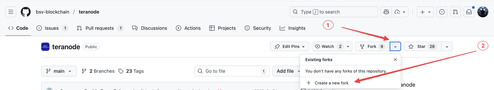
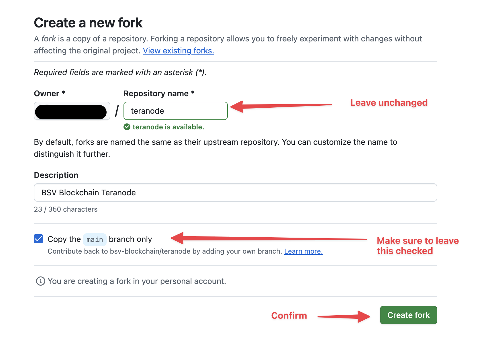
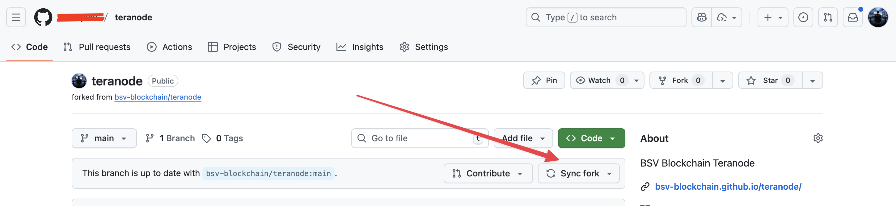

# Teranode Public Repository: Fork and Pull Request Guidelines

## Overview

The Teranode public repository is hosted at [https://github.com/bsv-blockchain/teranode](https://github.com/bsv-blockchain/teranode). Like most public repositories, direct commits to the main repository are not permitted. Instead, contributors must use a **fork-and-pull-request workflow**. This document provides a comprehensive guide to this process.

## Table of Contents

- [Understanding Forks](#understanding-forks)
    - [What is a Fork?](#what-is-a-fork)
    - [Why Fork?](#why-fork)
    - [Best Practices](#best-practices)
- [Step 1: Create Your Fork](#step-1-create-your-fork)
- [Step 2: Clone Your Fork Locally](#step-2-clone-your-fork-locally)
- [Step 3: Protect Your Main Branch (Recommended)](#step-3-protect-your-main-branch-recommended)
- [Step 4: Keep Your Fork Synchronized](#step-4-keep-your-fork-synchronized)
- [Step 5: Working on Features and Creating Pull Requests](#step-5-working-on-features-and-creating-pull-requests)
- [Quick Reference Commands](#quick-reference-commands)
- [Summary Workflow](#summary-workflow)
- [Need Help?](#need-help)

---

## Understanding Forks

### What is a Fork?

A **fork** is a complete copy of a repository that lives under your own GitHub account. When you fork a repository:

- **Original Repository** (`bsv-blockchain/teranode`): This is the authoritative source maintained by the BSV Blockchain organization. You cannot directly push changes here.
- **Your Fork** (`YOUR_USERNAME/teranode`): This is your personal copy where you have full control. You can create branches, commit changes, and experiment freely.

### Why Fork?

Forking allows you to:

- Work independently without affecting the original repository
- Experiment with changes safely
- Propose changes back to the original project via pull requests
- Maintain your own version of the codebase while staying synchronized with updates

### Best Practices

- **Keep your fork synchronized**: Regularly sync with the upstream repository to avoid diverging too far from the main codebase
- **One fork per contributor**: You only need one fork per repository—create multiple branches within your fork for different features
- **Don't commit to your main branch**: Keep your fork's `main` branch clean and aligned with upstream. Always work in feature branches
- **Descriptive branch names**: Use clear, descriptive names like `feature/add-logging` or `bugfix/connection-timeout`

---

## Step 1: Create Your Fork

1. Navigate to [https://github.com/bsv-blockchain/teranode](https://github.com/bsv-blockchain/teranode)

2. Click the **"Fork"** button in the top-right corner of the page

    

3. Configure your fork:

   - **Owner**: Select your GitHub account
   - **Repository name**: Keep it as `teranode` (or customize if needed)
   - **Description**: Optional—you can add a custom description
   - **Copy the main branch only**: ✓ Check this box (recommended for cleaner setup)

    

4. Click **"Create fork"**

Your fork will now be available at `https://github.com/YOUR_USERNAME/teranode`

---

## Step 2: Clone Your Fork Locally

### 1. Get Your Repository URL

Navigate to your forked repository at `https://github.com/YOUR_USERNAME/teranode` and click the green **"Code"** button. Copy the SSH URL (recommended) or HTTPS URL.


### 2. Clone the Repository

Open your terminal and run:

```bash
git clone git@github.com:YOUR_GITHUB_USERNAME/teranode.git
```

Replace `YOUR_GITHUB_USERNAME` with your actual GitHub username.

### 3. Add the Upstream Remote

Navigate into your cloned repository and add a reference to the original repository:

```bash
cd teranode

# Add the original repository as "upstream"
git remote add upstream https://github.com/bsv-blockchain/teranode.git
```

**Why do we need an upstream remote?**

When you clone your fork, Git automatically sets up `origin` to point to your fork. However, you also need a way to pull in changes from the original repository as it evolves. By adding the upstream remote, you create a connection to the source repository, which allows you to:

- **Fetch the latest updates** from the main project as other contributors merge their changes
- **Keep your fork synchronized** with the official codebase
- **Avoid merge conflicts** by regularly incorporating upstream changes before they diverge too far from your work
- **Base your pull requests on the latest code**, ensuring compatibility with recent changes

Think of it this way: `origin` is where you push your work, and `upstream` is where you pull updates from the main project.

### 4. Verify Your Remotes

Confirm your setup by running:

```bash
git remote -v
```

You should see output similar to:

```text
origin    git@github.com:YOUR_GITHUB_USERNAME/teranode.git (fetch)
origin    git@github.com:YOUR_GITHUB_USERNAME/teranode.git (push)
upstream  https://github.com/bsv-blockchain/teranode.git (fetch)
upstream  https://github.com/bsv-blockchain/teranode.git (push)
```

**What this means:**

- **origin**: Your fork (where you push your changes)
- **upstream**: The original repository (where you pull updates from)

---

## Step 3: Protect Your Main Branch (Recommended)

**Important**: To prevent accidental commits to your `main` branch, set up a Git hook that will block direct commits.

### Why Protect Main?

- **Prevents sync issues**: Committing to main causes your fork to diverge from upstream, creating complex merge conflicts
- **Enforces best practices**: Ensures all work happens in feature branches
- **Cleaner pull requests**: PRs from feature branches are easier to review
- **Easier to reset**: A clean main branch can always be safely reset to match upstream

### Set Up the Pre-Commit Hook

Run the following commands in your repository:

```bash
# Create the pre-commit hook
cat > .git/hooks/pre-commit << 'EOF'
#!/bin/bash

branch="$(git rev-parse --abbrev-ref HEAD)"

if [ "$branch" = "main" ]; then
  echo "❌ ERROR: Direct commits to 'main' branch are not allowed!"
  echo "👉 Please create a feature branch instead:"
  echo "   git checkout -b feature/your-feature-name"
  exit 1
fi
EOF

# Make it executable
chmod +x .git/hooks/pre-commit
```

Now, if you accidentally try to commit to main, you'll see:

```text
❌ ERROR: Direct commits to 'main' branch are not allowed!
👉 Please create a feature branch instead:
   git checkout -b feature/your-feature-name
```

### What If I Accidentally Committed to Main?

**If you haven't pushed yet:**

```bash
# Save your work to a new branch
git branch feature/my-work

# Reset main to match upstream
git checkout main
git reset --hard upstream/main

# Continue working on your feature branch
git checkout feature/my-work
```

**If you already pushed:**

```bash
# Create a branch with your work
git branch feature/my-work

# Force reset main to match upstream
git checkout main
git reset --hard upstream/main
git push origin main --force

# Continue working on your feature branch
git checkout feature/my-work
```

---

## Step 4: Keep Your Fork Synchronized

Before starting any new work, always sync your fork with the upstream repository to ensure you have the latest changes.

### Method 1: Using GitHub UI

1. Go to your forked repository on GitHub
2. Click the **"Sync fork"** button near the top of the page
3. Click **"Update branch"** if changes are available

    

This merges all changes from `upstream/main` into your fork's `main` branch.

### Method 2: Using Command Line

```bash
# Ensure you're on your main branch
git checkout main

# Fetch and merge changes from upstream
git fetch upstream
git reset --hard upstream/main

# Push the updates to your fork on GitHub
git push origin main
```

**Important**: Always sync before creating a new feature branch to ensure you're working with the latest code.

---

## Step 5: Working on Features and Creating Pull Requests

### 1. Create a Feature Branch

Always work in a dedicated branch, never directly in `main`:

```bash
# First, make sure you're up to date
git checkout main
git fetch upstream
git reset --hard upstream/main

# Create and switch to a new feature branch
git checkout -b feature/your-feature-name
```

Use descriptive branch names such as:

- `feature/add-transaction-validation`
- `bugfix/fix-memory-leak`
- `docs/update-readme`

### 2. Make Your Changes

Edit files, write code, and commit your changes:

```bash
# Stage your changes
git add .

# Commit with a clear, descriptive message
git commit -m "Add transaction validation logic"
```

### 3. Prepare for Pull Request

Before submitting a PR, ensure your branch is up to date with upstream to avoid merge conflicts:

```bash
# Fetch the latest changes from upstream
git fetch upstream
git reset --hard upstream/main
```

### 4. Resolve Merge Conflicts (if any)

If there are conflicts, Git will notify you. Open the conflicted files, resolve the conflicts manually, then:

```bash
# After resolving conflicts
git add .
git commit -m "Resolve merge conflicts with upstream"
```

### 5. Push Your Branch

Push your feature branch to your fork:

```bash
# First push of a new branch
git push -u origin feature/your-feature-name

# Subsequent pushes
git push
```

### 6. Create a Pull Request

1. Go to your forked repository on GitHub (`https://github.com/YOUR_USERNAME/teranode`)
2. Navigate to the **"Pull requests"** tab or click the **"Compare & pull request"** button that appears after pushing
3. Alternatively, go to **"Branches"** → find your feature branch → click **"New pull request"**
4. Ensure:

   - **Base repository**: `bsv-blockchain/teranode`
   - **Base branch**: `main`
   - **Head repository**: `YOUR_USERNAME/teranode`
   - **Compare branch**: `feature/your-feature-name`
5. Fill in the PR title and description:

   - Clearly explain what changes you made
   - Reference any related issues (e.g., "Fixes #123")
   - Describe testing performed
6. Click **"Create pull request"**

---

## Quick Reference Commands

```bash
# Initial Setup
# =============
# Clone your fork
git clone git@github.com:YOUR_USERNAME/teranode.git
cd teranode

# Add upstream remote
git remote add upstream https://github.com/bsv-blockchain/teranode.git

# Set up pre-commit hook to protect main branch
cat > .git/hooks/pre-commit << 'EOF'
#!/bin/bash
branch="$(git rev-parse --abbrev-ref HEAD)"
if [ "$branch" = "main" ]; then
  echo "❌ ERROR: Direct commits to 'main' branch are not allowed!"
  echo "👉 Please create a feature branch instead:"
  echo "   git checkout -b feature/your-feature-name"
  exit 1
fi
EOF
chmod +x .git/hooks/pre-commit

# Regular Workflow
# ================
# Sync with upstream
git checkout main
git fetch upstream
git reset --hard upstream/main
git push origin main

# Create feature branch
git checkout -b feature/new-feature

# Commit changes
git add .
git commit -m "Descriptive commit message"

# Update feature branch with latest upstream
git fetch upstream
git reset --hard upstream/main

# Push feature branch
git push -u origin feature/new-feature
```

---

## Summary Workflow

1. **Fork** the repository on GitHub
2. **Clone** your fork locally
3. **Add upstream** remote to track the original repository
4. **Set up pre-commit hook** to protect your main branch
5. **Sync** your fork regularly with upstream
6. **Create feature branches** for all new work
7. **Commit** and **push** your changes to your fork
8. **Update** your feature branch with upstream changes before submitting
9. **Create a pull request** from your feature branch to the upstream main branch

---

## Need Help?

If you encounter issues or have questions about this workflow, please reach out to the team or consult the [GitHub documentation on forking](https://docs.github.com/en/get-started/quickstart/fork-a-repo).
