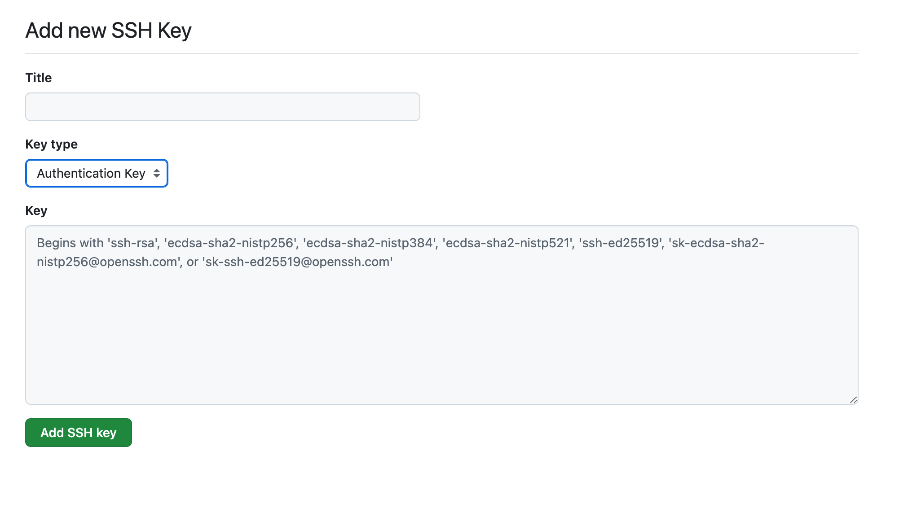

# Git Commit Signing Setup Guide

When setting up commit signing for your project, you have two options: GPG signing or SSH key signing. Both methods provide cryptographic verification of your commits, showing that they genuinely came from you. Choose the method that best fits your workflow:

- GPG signing is the traditional approach and offers more advanced cryptographic features
- SSH signing is simpler if you already use SSH keys for GitHub authentication

## Option 1: GPG Signing with Homebrew

### Prerequisites
- macOS
- Homebrew installed
- GitHub account

### Setup Instructions

1. Install GPG
```bash
brew install gnupg
```

2. Install pinentry-mac for Keychain integration
```bash
brew install pinentry-mac
echo "pinentry-program $(which pinentry-mac)" >> ~/.gnupg/gpg-agent.conf
```

3. Create GPG key (or load existing key into `$HOME/.gnupg`)
```bash
gpg --full-generate-key
```
- Follow prompts to set name and email address
- Choose DSA + ElGamal or ECC with ED 25519 for cipher
- Set a strong passphrase and store it safely

4. Configure repository for signed commits
```bash
git config commit.gpgsign true
```

5. Export GPG public key
```bash
gpg --output $HOME/public-key.pgp --armor --export email@address.tld
```

6. Import GPG key to GitHub
- Navigate to GitHub Profile → Settings → SSH and GPG Keys
- Click "New GPG Key"
- Enter a title (e.g., your email address)
- Paste the contents of `$HOME/public-key.pgp`
- Click "Add GPG key"

7. Sign a commit
```bash
git commit -S -m "Commit message"
```
Note: If `commit.gpgsign = true`, commits will always be signed even without `-S`

8. Sign a tag
```bash
git tag -s 'mytag'
```

9. Push your changes
```bash
git push
```

10. Verify in GitHub UI that your commit shows the green "Verified" badge

## Option 2: SSH Key Signing

### Prerequisites
- macOS
- SSH client installed
- GitHub account

### Setup Instructions

1. Create or use existing SSH key
```bash
ssh-keygen
```

2. Start ssh-agent
```bash
ssh-agent
```

3. Add key to ssh-agent
```bash
ssh-add ~/.ssh/id_ed25519 # or your key name
```

4. Configure Git for SSH signing
```bash
git config commit.gpgsign true
git config gpg.format ssh
git config user.signingkey ~/.ssh/id_ed25519
```

5. Add SSH signing key to GitHub
- Navigate to GitHub Profile → Settings → SSH and GPG Keys
- Click "New SSH Key"
- Enter a title
- Select "Signing Key" for Key Type
-


- Paste contents of `~/.ssh/id_ed25519.pub`
- Click "Add SSH key"

Notice this step is required even if you already had that same SSH key as an Authentication Key.

6. Make a commit (it will be signed automatically)
```bash
git commit -m "Commit message"
```

7. Create a tag (it will be signed)
```bash
git tag -s 'mytag'
```

8. Push your changes
```bash
git push
```

9. Verify in GitHub UI that your commit shows the green "Verified" badge

## Global Configuration

To apply signing settings across all repositories, use the `--global` flag:

```bash
git config --global commit.gpgsign true
```

This will enable commit signing by default for all repositories on your system.
