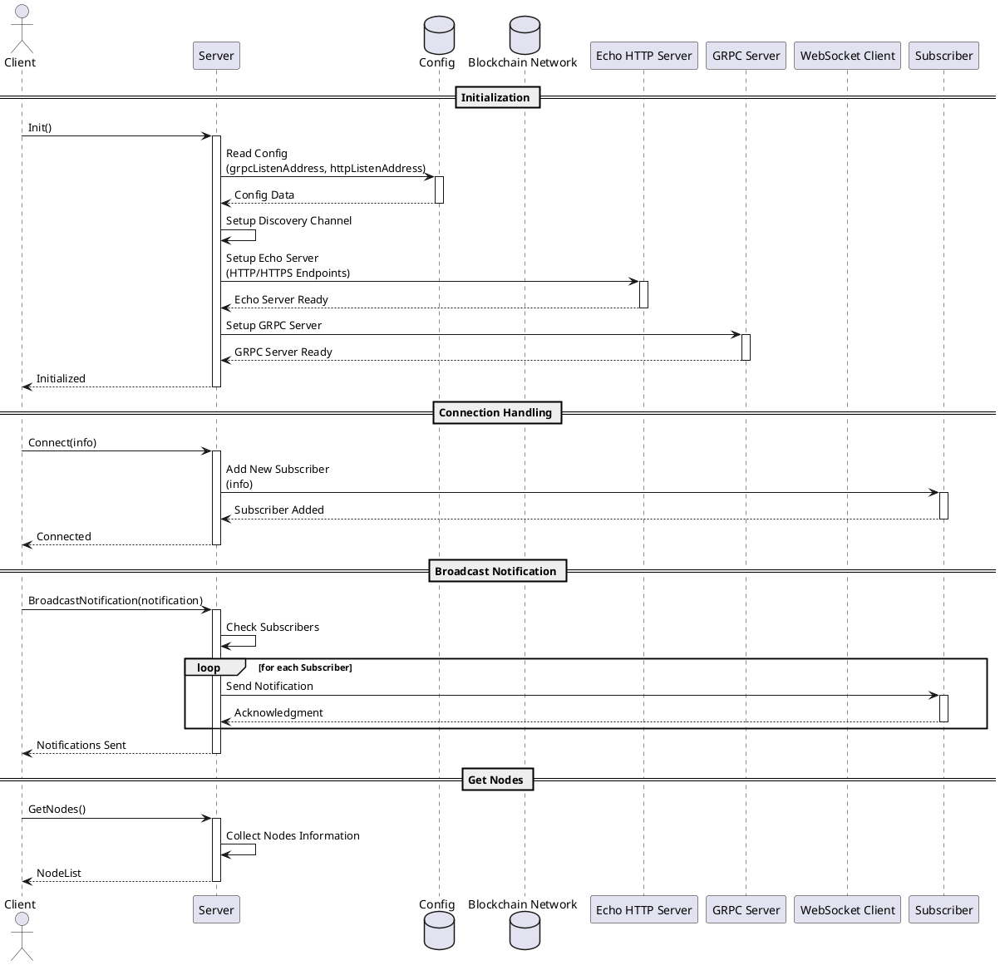

# 🌐 Bootstrap Service

## Index [TODO ]

## Description [TODO ]

The Bootstrap Service, helps new nodes find peers in a UBSV network. It allows nodes to register themselves and be notified about other nodes' presence, serving as a discovery service.

The service manages a set of subscribers and broadcast notifications and keep-alives to them, to keep them updated about network participants.

** TODO ** Miro Diagram of sorts

- Architecture

    -Jake's Code breakdown     - Process flows / diagrams .
        - Sequence diagrams (1 or more)

- input  / output

## Technology and specific Stores

## How to run

###     Preconditions

###     How to run

###     Configuration options (settings flags)

## Troubleshooting

## References (like third party)
