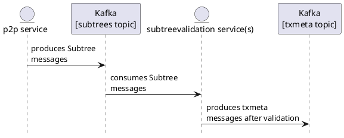

# Subtree validation service

We have 2 topics in our kafka cluster:
1. subtrees
2. txmeta

And 2 services:
1. p2p service which produces Subtree messages on the subtrees topic
2. subtreevalidation service(s) that consume Subtree messages from the subtrees topic, validates each subtree and then produces a number of txmeta messages on the txmeta topic.

